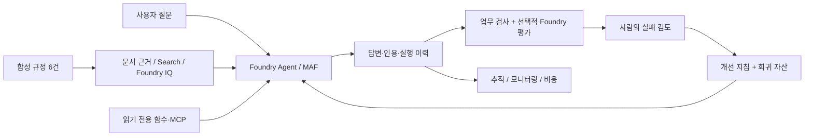

# Microsoft Foundry v2 Hands-on Labs

[English](README.md) | **한국어**

## 여기에서 시작하세요

**1. [준비 카드](docs/ko/setup.md)를 완료합니다. 2. 아래에서 경로 하나를 고릅니다. 3. 그 경로 페이지를 따라 Lab 00부터 진행합니다.**
동봉한 합성 데이터만으로 출장 규정 안내 도우미 하나를 만듭니다.
배경 설명·영상·고급 모듈은 선택입니다.

| 경로 | 이런 분께 | 하는 일 | 끝나면 남는 것 |
|---|---|---|---|
| **[A — 입문](docs/ko/paths/a-beginner.md)** | Azure나 agent가 처음인 분 | 브라우저 조작과 준비된 터미널의 명령 한 번. Python 작성 없음 | 내 agent·6문항 평가표·workflow 검토·정리 인계 |
| **[B — 구현](docs/ko/paths/b-practitioner.md)** | Python·API에 익숙한 분 | SDK 호출·도구·workflow·Search/IQ·통제된 평가·로컬 패키징 | 저장된 실행 기록과 인수 보고서 |

**시간:** 환경 준비 후 A 4시간, B 6시간입니다.
**파일:** A는 준비 카드의 작은 학습자 ZIP을, B는 소스 저장소 ZIP을 사용합니다. ZIP을 추가로 받을 필요는 없습니다.
**A의 Lab 05에는 준비된 터미널이 필요합니다.** 제공받지 않았다면 수업 전에 [Lab 00 B](docs/ko/labs/00-start.md#path-b)와 [Lab 02 B](docs/ko/labs/02-models.md#path-b)를 완료합니다.
**아직 Azure 권한이 없나요?** [오프라인 체험](docs/ko/labs/00-start.md#offline-rehearsal)만 진행하고 cloud 실습은 **미실행**으로 기록합니다.

기본 과정을 마쳤다면 [C. 고급 모듈](docs/ko/paths/c-advanced.md), 수업을 준비한다면 [강사 가이드](docs/ko/instructor.md),
구버전에서 돌아왔다면 [변경 지도](docs/ko/reference/migration.md)를 사용합니다.

<details>
<summary>배경과 이전 녹화 — 선택 참고 자료이며 선행 조건이 아닙니다</summary>

## 이 실습의 배경: Learning loops와 Frontier ecosystems

사티야 나델라는 [2026년 6월 14일 글](https://x.com/satyanadella/status/2066182223213293753)에서
**프런티어 모델 하나를 넘어 프런티어 생태계를 만들어야 한다**고 강조했습니다.
모델을 교체하더라도 조직의 지식과 전문성이 남는 학습 시스템을 구축해야 한다는 관점입니다.
이어 [2026년 7월 29일 Microsoft 실적 발표](https://www.microsoft.com/en-us/Investor/events/FY-2026/earnings-fy-2026-q4)에서도
각 조직이 자체적인 **지속적 학습 루프(continuous learning loop)**를 만들고 핵심 IP를 통제해야 한다고 재차 설명했습니다.
관심의 중심을 가장 뛰어난 모델을 고르는 데서, 조직이 계속 학습하고 가치를 축적할 수 있는 생태계를 만드는 데로 옮기는 것입니다.

이 실습은 그 관점을 **실행 → 관측·평가 → 사람의 검토 → 개선 → 재검증**이라는 엔지니어링 루프로 구체화합니다.
번들 합성 데이터만 사용해 Foundry와 Microsoft Agent Framework(MAF)의 에이전트,
지식·도구·워크플로·Hosted 배포·평가를 하나의 시스템으로 연결합니다.
여기서 학습은 검토를 거친 지침·검색·도구·워크플로의 개선을 뜻하며, 모델 가중치의 자동 재학습이 아닙니다.
Dev 데이터로 반복 개선하고 holdout은 최종 인수에만 사용합니다.

**처음에는 에이전트 하나를 만들고, 마지막에는 지식·평가·운영 기준이 남는 시스템을 만듭니다.**

> **2026-09-15 국문 심화 실행(이전 `gpt-5.6-luna` 판)**
> MAF workflow→Hosted, 네 모델의 24/24/16행, native 평가·calibration·trace 인수를 실제 실행했습니다.
> `gpt-6-sol`로는 다시 실행하지 않았습니다.
> [통합 범위와 인수 기준](docs/ko/reference/consolidation.md) ·
> [Hosted 평가 워크북](docs/ko/reference/evaluation-workbook.md) ·
> [IQ 확장 워크북](docs/ko/reference/iq-workbook.md).

한국어 · 합성 데이터 · **2026-09-24 `gpt-6-sol` 녹화 / Pre-Ignite 2026 Edition**

**[2026-09-24 `gpt-6-sol` 국문 녹화](docs/ko/video-summary.md)** —
통합본 **6분 3초**, CLI **2분 57초**, 포털 **2분 43초**.
Sweden Central 실습 프로젝트에서 Lab 00–09·11의 A(포털)·B(CLI) 주요 단계와 선택 Foundry 평가 단계를 `gpt-6-sol` / `2026-09-22`로 실제 실행했습니다
([모델 선택](docs/ko/reference/model-choice.md)).
[91개 실제 액션·272개 무손실 캡처](docs/ko/action-captures.md)를 제공합니다.
영상은 실제 화면 녹화에서 대기를 덜어낸 것이며 스크린샷 슬라이드쇼가 아닙니다.

[Lab 챕터 이동](docs/ko/video-chapters.md) · [실측 결과와 한계](docs/ko/live-run.md)

로컬 재생·챕터 이동을 확인했으며 GitHub에는 업로드하지 않았습니다.
`python scripts/play_recordings.py --edition ko`로 재생합니다. 이전 녹화는 삭제했습니다.
국문과 영문은 별도 실행·별도 화면·별도 녹화본입니다.

국문과 영문은 **각자 고정된 지침·합성 정책·dev/calibration/holdout 데이터·fixture**를 사용합니다.
국문은 기본값이고 영문만 `--language en`으로 선택합니다. [언어 계약](docs/ko/reference/languages.md)과
[버전별 데이터 묶음](data/README.ko.md)이 언어별 계보를 따로 보존합니다.

각 랩 본문에는 2026-09-24 국문 캡처와 화면 확인 포인트를 배치했습니다.
먼저 [화면 읽는 법](docs/ko/labs/00-start.md#이-가이드의-화면-읽는-법)을 확인하고 자기 경로를 따라가세요.

에이전트·워크플로·지식·평가·운영을 **하나의 환경과 업무 시나리오**로 구성했습니다.
다른 리포를 차례로 방문하는 링크 모음이 아닙니다.
이 폴더에 실습 본문, Python 코드, 정책 문서, 평가 데이터, 강사 가이드가 있습니다.

## 추가 모듈과 실행 근거

**9월 16일 확장 경로:** [A — 입문](docs/ko/paths/a-beginner.md) ·
[B — 구현](docs/ko/paths/b-practitioner.md) · [C — 고급 모듈](docs/ko/paths/c-advanced.md).
[기능·근거 상태](docs/ko/coverage.md)에서 기존 기본 과정과 새 모듈, 실제 Azure 확인 범위를 구분합니다.
확장 모듈은 2026-09-16에 이전 `gpt-5.6-luna` preset으로 실행했으며 `gpt-6-sol`로는 다시 실행·녹화하지 않았고,
해당 녹화는 삭제했습니다.

</details>

## 하나의 시나리오, 점점 확장되는 시스템

가상 기업 **한빛기술의 출장 규정 안내 도우미**를 만듭니다.
현재/과거 숙박 한도, 식비, 사전 승인, 근거 없는 해외 출장 질문을 다룹니다.
실제 회사 문서·개인 정보·Microsoft 365 데이터는 사용하지 않습니다.
에이전트는 안내만 하며 출장 승인·예약·지급을 실행하지 않습니다.



| 모듈 | 내용 |
|---|---|
| [00. 시작과 환경](docs/ko/labs/00-start.md) | 학습 경로, 브라우저/코드 준비, offline/cloud 구분 |
| [01. Foundry와 프로젝트](docs/ko/labs/01-foundry.md) | 플랫폼·SDK 구분, 리소스·프로젝트·권한 |
| [02. 모델](docs/ko/labs/02-models.md) | 배포 이름, 플레이그라운드, SDK, 모델 비교·Router |
| [03. 첫 에이전트](docs/ko/labs/03-prompt-agent.md) | 지침, 합성 문서, 인용, 도구와 권한 경계 |
| [04. MAF와 도구](docs/ko/labs/04-agents-tools.md) | 단일 에이전트, 함수, 로컬 MCP |
| [05. MAF 워크플로](docs/ko/labs/05-workflows.md) | 준비된 예제, 순차·병렬·Group Chat 코드, 사람의 검토 |
| [06. RAG와 Foundry IQ](docs/ko/labs/06-knowledge.md) | Search와 IQ 구분, GA API, 원문 인용 |
| [07. 평가와 학습 루프](docs/ko/labs/07-evaluation.md) | dev, 실패 분석, 지침 개선, holdout |
| [08. Hosted Agent](docs/ko/labs/08-hosted.md) | 안전한 패키징, 로컬 서버, 코드 배포 |
| [09. 관측·운영·정리](docs/ko/labs/09-operations.md) | trace, 운영 게이트, 비용과 소유권 기반 정리 |
| [10. IQ 확장](docs/ko/labs/10-iq-extensions.md) | Fabric·Work IQ·Toolbox·Preview 승인 경계 |
| [11. 캡스톤](docs/ko/labs/11-capstone.md) | 지식·모델·평가·운영을 묶은 최종 인수 |

## 코드 경로의 가장 짧은 시작

모든 명령은 **이 폴더의 루트**에서 실행합니다. Bash 기준이며 Windows 코드는 WSL을
사용합니다. Python 3.13을 권장합니다. 브라우저 경로에서는 아래 명령이 필요 없습니다.

```bash
# 외부 패키지나 Azure 없이 가능한 검사기 체험
python3.13 scripts/workshop.py doctor
python3.13 scripts/workshop.py demo --label first-offline --prompt v2
python3.13 scripts/workshop.py evaluate --label first-offline
```

`offline-fixture` 결과는 **미리 작성한 예제**입니다. 모델 품질·Foundry 성능·Azure 연결을
검증한 결과가 아닙니다. 실제 SDK 설치·인증·호출은 [Lab 00](docs/ko/labs/00-start.md)에서
진행합니다. 반복 실행 시 새 label을 사용합니다. 기존 실행을 덮어쓰지 않습니다.

## 이 버전의 범위

- 현재 Foundry / Projects SDK **2.x**를 사용합니다. classic의 threads/runs 코드를 혼합하지 않습니다.
- 워크플로 작성·오케스트레이션은 **MAF 코드**를 사용합니다. 포털 workflow 생성/게시 단계는 포함하지 않습니다.
- 첫 실습 preset은 **`gpt-6-sol`**, 같은 이름의 배포, 모델 버전 **`2026-09-22`**입니다
  (2026-09-23, [이 모델을 고른 이유](docs/ko/reference/model-choice.md)).
  Search knowledge base가 GPT-6 모델을 받지 않아 선택 IQ Chat 경로는 별도 `gpt-5.6-luna` 배포를 유지합니다.
  다른 모델은 명시적인 비교 실험에서 사용합니다.
- 서비스 GA와 SDK Preview는 따로 표시합니다. Hosted Agent 서비스는 GA지만 이 랩의 Python hosting
  패키지는 prerelease입니다. Foundry IQ도 GA 계약과 richer Preview 계약을 구분합니다.
- 모델 교체, 지침 개선, 평가 데이터 축적을 다룹니다. **자동 가중치 학습·fine-tuning·RL을 수행하지 않습니다.**
- 실제 배포, 유료 평가, 외부 데이터 연결은 학습자가 별도로 실행하는 선택 단계입니다.
  이 저장소를 열거나 `doctor`를 실행한다고 리소스가 생성되지 않습니다.
- Ignite 2026에서 발표될 기능이나 가격·리전·할당량을 미리 보장하지 않습니다.

**기준과 증거:** [버전·기능 상태](docs/ko/reference/versions.md) ·
[이 에디션의 검증 범위](docs/ko/reference/validation.md) ·
[원본 커밋·공식 출처](docs/ko/reference/sources.md) ·
[문제 해결](docs/ko/reference/troubleshooting.md) ·
[리소스 정리](docs/ko/reference/cleanup.md)

처음 보는 용어는 [용어 사전](docs/ko/reference/glossary.md), 실행 옵션은
[명령 참조](docs/ko/reference/commands.md), 환경변수는 [공통 설정](docs/ko/reference/configuration.md)을 확인하세요.

## 저장소 구성

```text
docs/                  기본 영어 실습·학습 경로·강사·참고 문서
docs/ko/               같은 내용의 한국어 가이드
src/foundry_workshop/   공통 설정·검색·에이전트·평가·실행 이력
scripts/               실습 CLI, 패키징, 문서 검사
data/knowledge/        합성 정책 6건
data/evaluation/       dev 6건 / holdout 4건 / judge calibration 2건
data/fixtures/         Azure 없이 검사기만 체험하는 고정 예제
data/learner/          바로 쓰는 국문·영문 브라우저 자료와 ZIP
prompts/               비교할 v1 / v2 지침
examples/              로컬 MCP 서버와 Hosted Agent 진입점
tests/                 Azure 없는 로직·계약 검사
outputs/               개인 실행 결과; Git에서 제외
```

자료의 라이선스는 [MIT](LICENSE)입니다. 원본 리포별 출처·라이선스 경계는
[출처 문서](docs/ko/reference/sources.md)에 구분했습니다.
