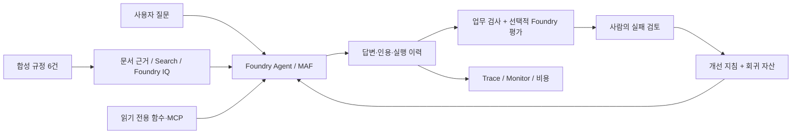

# Microsoft Foundry v2 Hands-on Labs

**처음에는 에이전트 하나를 만들고, 마지막에는 지식·평가·운영 기준이 남는 시스템을 만듭니다.**

한국어 · 합성 데이터 · **2026-09-13 기준 / Pre-Ignite 2026 Edition**

2025년 12월의 `microsoft-foundry-labs`를 바탕으로, 이후 분리해 만든 Foundry Evaluation,
MAF Workshop, Agent Framework, Microsoft IQ 실습을 **하나의 환경과 업무 시나리오**로
다시 구성했습니다. 다른 리포를 차례로 방문하는 링크 모음이 아닙니다.
이 폴더에 실습 본문, Python 코드, 정책 문서, 평가 데이터, 강사 가이드가 있습니다.

## 여기에서 시작하세요

| 지금 내 상태 | 시작점 | 끝나면 남는 것 |
|---|---|---|
| Azure·AI·코딩이 처음 | **[A. 완전초보자 4시간 경로](docs/paths.md)** | 포털 에이전트, 근거 있는 답변, 6문항 평가표, 운영·정리 체크리스트 |
| Python/API/Azure를 사용해 봄 | **[B. 경험자 6시간 경로](docs/paths.md)** | MAF·MCP·워크플로 코드, 검색, 전후 평가·holdout, 배포 패키지 |
| 강사·환경 준비 담당자 | **[강사 사전 준비](docs/instructor.md)** | 조별 환경, 권한·비용 계획, 수업 전 smoke test, 중단·복구 기준 |
| Azure 승인이나 할당량을 기다리는 중 | **[Azure 없이 검사기 체험](docs/labs/00-start.md)** | 오프라인 fixture로 실행·평가 파일 구조 이해. **클라우드 실습 완료와는 다름** |
| 구버전을 이미 진행함 | **[구버전 → v2 변경 지도](docs/reference/migration.md)** | 재사용할 개념, 바꿔야 할 SDK·권한·실행 방식 |

**초보자는 터미널 설치부터 시작하지 않습니다.** 브라우저 경로와 Python 경로를 분리했습니다.
아래 시간은 강사가 계정·리소스·권한·모델을 준비한 뒤의 수업 시간입니다.
구독 개설, 기능 승인, 할당량 증설, 설치·RBAC 전파는 별도입니다.

## 하나의 시나리오, 점점 확장되는 시스템

가상 기업 **한빛기술의 출장 규정 안내 도우미**를 만듭니다.
현재/과거 숙박 한도, 식비, 사전 승인, 근거 없는 해외 출장 질문을 다룹니다.
실제 회사 문서·개인 정보·Microsoft 365 데이터는 사용하지 않습니다.
에이전트는 안내만 하며 출장 승인·예약·지급을 실행하지 않습니다.



| 모듈 | 내용 | 주요 통합 원본 |
|---|---|---|
| [00. 시작과 환경](docs/labs/00-start.md) | 학습 경로, 브라우저/코드 준비, offline/cloud 구분 | MAF Workshop |
| [01. Foundry와 프로젝트](docs/labs/01-foundry.md) | 플랫폼·SDK 구분, 리소스·프로젝트·권한 | 기존 종합 랩 |
| [02. 모델](docs/labs/02-models.md) | 배포 이름, Playground, SDK, 모델 비교·Router | 기존 종합 랩 + MAF Workshop |
| [03. 첫 에이전트](docs/labs/03-prompt-agent.md) | 지침, 합성 문서, 인용, 도구와 권한 경계 | 기존 종합 랩 |
| [04. MAF와 도구](docs/labs/04-agents-tools.md) | 단일 에이전트, 함수, 로컬 MCP | MAF Workshop + Agent Framework Labs |
| [05. 워크플로](docs/labs/05-workflows.md) | 순차·병렬·Group Chat, 사람의 검토 | Agent Framework Labs |
| [06. RAG와 Foundry IQ](docs/labs/06-knowledge.md) | 검색과 IQ의 차이, GA API, 원문 인용 | Microsoft IQ on Foundry |
| [07. 평가와 학습 루프](docs/labs/07-evaluation.md) | dev → 실패 분석 → 지침 개선 → holdout | Foundry Evaluation |
| [08. Hosted Agent](docs/labs/08-hosted.md) | 안전한 패키징, 로컬 서버, code deployment | MAF Workshop + IQ |
| [09. 관측·운영·정리](docs/labs/09-operations.md) | trace, 운영 게이트, 비용과 소유권 기반 정리 | 기존 Control Plane + Evaluation |
| [10. IQ 확장](docs/labs/10-iq-extensions.md) | Fabric·Work IQ·Toolbox·Preview 승인 경계 | Microsoft IQ on Foundry |
| [11. 캡스톤](docs/labs/11-capstone.md) | 지식·모델·평가·운영을 묶은 최종 인수 | 전체 통합 |

## 코드 경로의 가장 짧은 시작

모든 명령은 **이 폴더의 루트**에서 실행합니다. Bash 기준이며 Windows 코드는 WSL을
사용합니다. Python 3.13을 권장합니다. 브라우저 경로에서는 아래 명령이 필요 없습니다.

```bash
# 외부 패키지나 Azure 없이 가능한 검사기 체험
python3.13 scripts/workshop.py doctor
python3.13 scripts/workshop.py demo --label first-offline --prompt v2
python3.13 scripts/workshop.py evaluate --label first-offline
```

`offline-fixture` 결과는 **미리 작성한 예제**입니다. 모델 품질·Foundry 성능·Azure 연결을
검증한 결과가 아닙니다. 실제 SDK 설치·인증·호출은 [Lab 00](docs/labs/00-start.md)에서
진행합니다. 반복 실행 시 새 label을 사용합니다. 기존 실행을 덮어쓰지 않습니다.

## 이 버전의 범위

- 현재 Foundry / Projects SDK **2.x**를 사용합니다. classic의 threads/runs 코드를 혼합하지 않습니다.
- 모델을 `gpt-...` 이름으로 강제하지 않습니다. 강사가 해당 구독에서 확인한 **실제 배포 이름**을 씁니다.
- 서비스 GA와 SDK Preview는 따로 표시합니다. Hosted Agent 서비스는 GA지만 이 랩의 Python hosting
  패키지는 prerelease입니다. Foundry IQ도 GA 계약과 richer Preview 계약을 구분합니다.
- 모델 교체, 지침 개선, 평가 데이터 축적을 다룹니다. **자동 가중치 학습·fine-tuning·RL을 수행하지 않습니다.**
- 실제 배포, 유료 평가, 외부 데이터 연결은 학습자가 별도로 실행하는 선택 단계입니다.
  이 저장소를 열거나 `doctor`를 실행한다고 리소스가 생성되지 않습니다.
- Ignite 2026에서 발표될 기능이나 가격·리전·할당량을 미리 보장하지 않습니다.

**기준과 증거:** [버전·기능 상태](docs/reference/versions.md) ·
[이 에디션의 검증 범위](docs/reference/validation.md) ·
[원본 커밋·공식 출처](docs/reference/sources.md) ·
[문제 해결](docs/reference/troubleshooting.md) ·
[리소스 정리](docs/reference/cleanup.md)

처음 보는 용어는 [용어 사전](docs/reference/glossary.md), 실행 옵션은
[명령 참조](docs/reference/commands.md), 환경변수는 [공통 설정](docs/reference/configuration.md)을 확인하세요.

## 저장소 구성

```text
docs/                  한국어 실습·학습 경로·강사·참고 문서
src/foundry_workshop/   공통 설정·검색·에이전트·평가·실행 이력
scripts/               실습 CLI, 패키징, 문서 검사
data/knowledge/        합성 정책 6건
data/evaluation/       dev 6건 / holdout 4건 / judge calibration 2건
data/fixtures/         Azure 없이 검사기만 체험하는 고정 예제
prompts/               비교할 v1 / v2 지침
examples/              로컬 MCP 서버와 Hosted Agent 진입점
tests/                 Azure 없는 로직·계약 검사
outputs/               개인 실행 결과; Git에서 제외
```

자료의 라이선스는 [MIT](LICENSE)입니다. 원본 리포별 출처·라이선스 경계는
[출처 문서](docs/reference/sources.md)에 구분했습니다.
