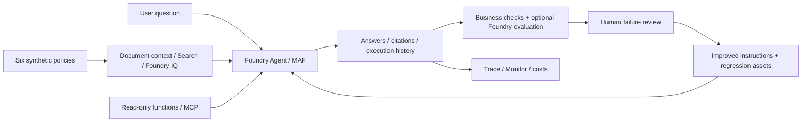

# Microsoft Foundry v2 Hands-on Labs

**English** | [한국어](README.ko.md)

## Start here

**First visit: [complete the setup card](docs/setup.md), then follow [A. Beginner](docs/paths/a-beginner.md).**
Build one travel-policy assistant using only the supplied synthetic data.
You do not need to read the background, watch a video, or choose an advanced module first.

| Choose one route | What to do | Finish with |
|---|---|---|
| **A — first time with Azure or agents** | Browser steps plus one command in a prepared MAF terminal; no Python authoring | Your agent, six-question assessment, workflow review and cleanup handoff |
| **[B — comfortable with Python and APIs](docs/paths/b-practitioner.md)** | SDK, tools, workflows, GA Search/IQ, controlled evaluation and local packaging | Reproducible real run records; remote hosting and cloud judges remain optional |

Setup includes the **small learner ZIP** and ready-to-fill evidence files.
The **source repository ZIP** is a different download, needed for a code terminal.
If no terminal was supplied for A's Lab 05, complete [Lab 00 B](docs/labs/00-start.md#path-b) before class.
Allow **4 hours for A / 6 hours for B after preparation**; account, installation, permissions and quota waits are extra.
Without Azure access, use only the [offline rehearsal](docs/labs/00-start.md#offline-rehearsal) and record cloud work as **not run**.

Already completed the core route: [C. Advanced modules](docs/paths/c-advanced.md).
Preparing a class: [Instructor guide](docs/instructor.md). Returning from the old edition: [Migration map](docs/reference/migration.md).

<details>
<summary>Background and previous recordings — optional context, not prerequisites</summary>

## Background: learning loops and frontier ecosystems

In his [June 14, 2026 essay](https://x.com/satyanadella/status/2066182223213293753),
Satya Nadella argued for a **frontier ecosystem, not just a frontier model**:
organizations should build learning systems that retain their knowledge and expertise even when the underlying model changes.
He reiterated this in Microsoft's [July 29, 2026 earnings call](https://www.microsoft.com/en-us/Investor/events/FY-2026/earnings-fy-2026-q4),
emphasizing each organization's own **continuous learning loop** and control of its core IP.
The focus shifts from simply choosing the strongest model to building an ecosystem in which organizations can keep learning and creating value.

This workshop turns that perspective into a practical engineering loop:
**run → observe and evaluate → human review → improve → verify again**.
Using only bundled synthetic data, you connect Foundry and Microsoft Agent Framework (MAF) agents,
knowledge, tools, workflows, Hosted deployment, and evaluation into one system.
Here, learning means reviewed improvements to instructions, retrieval, tools, and workflows—not automatic model-weight training.
Dev data supports iteration; holdout is reserved for final acceptance.

**Start with one agent. Finish with a system whose knowledge, evaluation criteria, and operational decisions your team can reuse.**

English by default · Korean available · Synthetic data only

**Pre-Ignite 2026 Edition / Current workflow and evaluation curriculum: September 15, 2026**

Follow the **[beginner or practitioner guide](docs/paths.md)**. Each lab places reference
images and a **What to check** explanation beside the relevant action or command.
Read [how to use the screenshots](docs/labs/00-start.md#how-to-read-this-guide) first.

**[Foundational English recordings — September 15](docs/video-summary.md)** ·
[New action/capture index](docs/action-captures.md) · [Actual results and limitations](docs/live-run.md)

The September 15 English set contains **172 actions, 516 lossless captures, and three videos**:
**13:53 combined**, 7:47 CLI, and 5:42 portal.
All six foundational English/Korean videos are hosted on GitHub and verified for playback.
Sign in with an account that can access this private repository.

English uses **separate English instructions, synthetic policies, dev/calibration/holdout datasets, and fixtures**.
Select them explicitly with `--language en`; original Korean files remain unchanged.
The [language contract](docs/reference/languages.md) and [versioned data bundle](data/README.md)
preserve language-specific lineage. [Korean recordings](docs/ko/video-summary.md) are independent.

This self-contained edition brings agents, workflows, knowledge, evaluation, and
operations into **one environment and one business scenario**. It is not a list of
repositories to visit in sequence.
The labs, Python code, synthetic policies, evaluation data, and instructor guide are here.

## Additional modules and their evidence

**September 16 English-first expansion:** [A — Beginner](docs/paths/a-beginner.md) ·
[B — Implementation](docs/paths/b-practitioner.md) · [C — Advanced modules](docs/paths/c-advanced.md).
Use the [capability/evidence record](docs/coverage.md) to distinguish existing labs, new executable modules,
actual Azure verification and recordings. New modules are not considered recorded merely because the earlier videos play.
The [September 16 extension results](docs/edition-results.md) report the new English experiments
separately, including their failures and unverified boundaries.
[New English extension recordings](docs/edition-videos.md) provide a **13:21 module-ordered walkthrough**,
166 actions and 496 lossless captures; publication status is stated on that page.

</details>

## One scenario, an expanding system

Build a travel-policy assistant for the fictional **Hanbit Technology**.
It handles current and historical lodging limits, meals, advance approval, and
unsupported international-travel questions. No real company documents, personal
information, or Microsoft 365 data are used. The assistant provides guidance;
it does not approve, book, or reimburse travel.



| Module | Topics |
|---|---|
| [00. Getting started](docs/labs/00-start.md) | Learning paths, browser/code setup, offline/cloud boundaries |
| [01. Foundry and projects](docs/labs/01-foundry.md) | Platform vs. SDK, resources, projects, roles |
| [02. Models](docs/labs/02-models.md) | Deployment names, Playground, SDK, comparison and Router |
| [03. Your first agent](docs/labs/03-prompt-agent.md) | Instructions, synthetic documents, citations, tool/permission boundaries |
| [04. MAF and tools](docs/labs/04-agents-tools.md) | Single agent, functions, local MCP |
| [05. MAF workflows](docs/labs/05-workflows.md) | Prepared example, sequential/concurrent/Group Chat code, human review |
| [06. RAG and Foundry IQ](docs/labs/06-knowledge.md) | Search vs. IQ, GA API, source citations |
| [07. Evaluation and learning](docs/labs/07-evaluation.md) | Dev, failure analysis, instruction improvements, holdout |
| [08. Hosted Agent](docs/labs/08-hosted.md) | Safe packaging, local server, code deployment |
| [09. Operations and cleanup](docs/labs/09-operations.md) | Traces, release gates, costs, ownership-aware cleanup |
| [10. IQ extensions](docs/labs/10-iq-extensions.md) | Fabric, Work IQ, Toolbox, Preview approval boundaries |
| [11. Capstone](docs/labs/11-capstone.md) | Final handoff across knowledge, models, evaluation, and operations |

## Shortest code-path start

Run every command from **this repository's root**. Examples use Bash; use WSL on
Windows. Python 3.13 is recommended. Browser-path learners do not need these commands.

```bash
# Try the checker without external packages or Azure.
python3.13 scripts/workshop.py --language en doctor
python3.13 scripts/workshop.py --language en demo --label first-offline --prompt v2
python3.13 scripts/workshop.py --language en evaluate --label first-offline
```

`offline-fixture` results are **prewritten examples**, not evidence of model quality,
Foundry performance, or Azure connectivity. Continue with [Lab 00](docs/labs/00-start.md)
for SDK installation, authentication, and real calls. Use a new label for every run;
existing runs are not overwritten.

## Scope of this edition

- Current Foundry and Projects SDK **2.x**; no mixing with classic threads/runs code.
- **MAF code** owns workflow authoring and orchestration. Portal workflow creation/publishing is excluded.
- The first-pass preset is **`gpt-5.6-luna`**, deployed with that exact name, model version **`2026-07-09`**.
  The optional IQ Chat path checks that model and Search managed identity before use; other models belong to explicit comparison experiments.
- Service GA and SDK Preview are separate. The Hosted Agent service is GA, while this
  edition's Python hosting package is prerelease. Foundry IQ GA and richer Preview contracts are distinct.
- Model replacement, instruction improvement, and accumulating evaluation evidence are included.
  **Automatic weight training, fine-tuning, and RL are not.**
- Deployment, paid evaluation, and external connections are optional, separately executed steps.
  Opening the repository or running `doctor` creates no resources.
- Unannounced Ignite 2026 capabilities, future prices, regions, and quotas are not guaranteed.

**Evidence:** [Versions/status](docs/reference/versions.md) ·
[Validation scope](docs/reference/validation.md) · [Sources](docs/reference/sources.md) ·
[Troubleshooting](docs/reference/troubleshooting.md) · [Cleanup](docs/reference/cleanup.md)

New terms: [glossary](docs/reference/glossary.md). Execution options:
[command reference](docs/reference/commands.md). Environment variables:
[configuration](docs/reference/configuration.md).

## Repository layout

```text
docs/                  English labs, learning paths, instructor and reference guides
docs/ko/               Matching Korean guides
src/foundry_workshop/   Shared settings, retrieval, agents, evaluation, and lineage
scripts/               Workshop CLI, packaging, and documentation checks
data/knowledge/        Six canonical synthetic policies (Korean)
data/evaluation/       Six dev / four holdout / two judge-calibration cases
data/fixtures/         Fixed examples for the offline checker
data/learner/          Ready-to-use English/Korean browser materials and ZIPs
prompts/               Canonical v1 / v2 instructions (Korean)
examples/              Local MCP server and Hosted Agent entry point
tests/                 Offline logic and contract checks
outputs/               Personal run outputs; excluded from Git
```

Licensed under [MIT](LICENSE). Source attribution and repository-specific license
boundaries are recorded in [Sources](docs/reference/sources.md).
