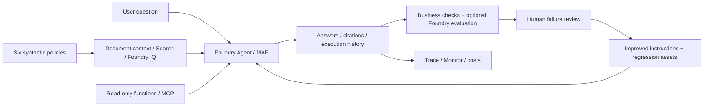

# Microsoft Foundry v2 Hands-on Labs

**English** | [한국어](README.ko.md)

<!-- translation-pending: ko-integrated-20260915 -->

> **Translation pending** — The [Korean-first integration revision](README.ko.md) is current for the new workflow/evaluation curriculum. This English page retains the earlier material. English expansion and new media follow Korean execution, capture, and corrections.

**Start with one agent. Finish with a system whose knowledge, evaluation criteria, and operational decisions your team can reuse.**

English by default · Korean available · Synthetic data only

**Pre-Ignite 2026 Edition / English documentation, new recordings, and Azure checks: September 15, 2026**

Follow the **[beginner or practitioner guide](docs/paths.md)**. Each lab places reference
images and a **What to check** explanation beside the relevant action or command.
Read [how to use the screenshots](docs/labs/00-start.md#how-to-read-this-guide) first.

**[Watch the new English-guide recordings](docs/english-recordings.md)**: **13:09 combined**,
5:15 CLI, or 4:45 portal, with **direct GitHub playback** and no download command.
[234 new actions / 537 screenshots](docs/english-captures.md) ·
[New results and limitations](docs/english-recordings.md#actual-results-and-boundaries)

The new footage has English guide text and UI, while **canonical synthetic policy
questions, prompts, and datasets remain Korean** to preserve evaluation lineage.
No new infrastructure was provisioned or deployed. The [language contract](docs/reference/languages.md)
explains the boundary; the [September 14 Korean source recordings](docs/video-summary.md)
remain available separately.

This self-contained edition brings agents, workflows, knowledge, evaluation, and
operations into **one environment and one business scenario**. It is not a list of
repositories to visit in sequence.
The labs, Python code, synthetic policies, evaluation data, and instructor guide are here.

## Start here

| Your starting point | Recommended path | What you will produce |
|---|---|---|
| New to Azure, AI, and coding | **[A. Four-hour beginner path](docs/paths.md)** | A portal agent, grounded answers, a six-question assessment, and an operations/cleanup checklist |
| Familiar with Python, APIs, or Azure | **[B. Six-hour practitioner path](docs/paths.md)** | MAF/MCP/workflow code, retrieval, before/after evaluation and holdout records, and a deployment package |
| Teaching or preparing the environment | **[Instructor preparation](docs/instructor.md)** | Team environments, permissions and cost planning, smoke checks, and recovery criteria |
| Waiting for Azure approval or quota | **[Try the checker without Azure](docs/labs/00-start.md)** | Understand run/evaluation files with offline fixtures; **not completion of the cloud labs** |
| Returning from the previous edition | **[Migration map](docs/reference/migration.md)** | Concepts to retain and SDK, permission, and execution contracts to change |

**Beginners do not start by installing a terminal.** They primarily use the portal,
then copy commands into an instructor-prepared MAF environment for workflows.
They do not author workflows in the portal Workflow Designer.
The advertised times start **after** accounts, resources, roles, and models are ready.
Subscription creation, access approvals, quota increases, installation, and RBAC propagation are separate.

## One scenario, an expanding system

Build a travel-policy assistant for the fictional **Hanbit Technology**.
It handles current and historical lodging limits, meals, advance approval, and
unsupported international-travel questions. No real company documents, personal
information, or Microsoft 365 data are used. The assistant provides guidance;
it does not approve, book, or reimburse travel.



| Module | Topics |
|---|---|
| [00. Getting started](docs/labs/00-start.md) | Learning paths, browser/code setup, offline/cloud boundaries |
| [01. Foundry and projects](docs/labs/01-foundry.md) | Platform vs. SDK, resources, projects, roles |
| [02. Models](docs/labs/02-models.md) | Deployment names, Playground, SDK, comparison and Router |
| [03. Your first agent](docs/labs/03-prompt-agent.md) | Instructions, synthetic documents, citations, tool/permission boundaries |
| [04. MAF and tools](docs/labs/04-agents-tools.md) | Single agent, functions, local MCP |
| [05. MAF workflows](docs/labs/05-workflows.md) | Prepared example, sequential/concurrent/Group Chat code, human review |
| [06. RAG and Foundry IQ](docs/labs/06-knowledge.md) | Search vs. IQ, GA API, source citations |
| [07. Evaluation and learning](docs/labs/07-evaluation.md) | Dev, failure analysis, instruction improvements, holdout |
| [08. Hosted Agent](docs/labs/08-hosted.md) | Safe packaging, local server, code deployment |
| [09. Operations and cleanup](docs/labs/09-operations.md) | Traces, release gates, costs, ownership-aware cleanup |
| [10. IQ extensions](docs/labs/10-iq-extensions.md) | Fabric, Work IQ, Toolbox, Preview approval boundaries |
| [11. Capstone](docs/labs/11-capstone.md) | Final handoff across knowledge, models, evaluation, and operations |

## Shortest code-path start

Run every command from **this repository's root**. Examples use Bash; use WSL on
Windows. Python 3.13 is recommended. Browser-path learners do not need these commands.

```bash
# Try the checker without external packages or Azure.
python3.13 scripts/workshop.py doctor
python3.13 scripts/workshop.py demo --label first-offline --prompt v2
python3.13 scripts/workshop.py evaluate --label first-offline
```

`offline-fixture` results are **prewritten examples**, not evidence of model quality,
Foundry performance, or Azure connectivity. Continue with [Lab 00](docs/labs/00-start.md)
for SDK installation, authentication, and real calls. Use a new label for every run;
existing runs are not overwritten.

## Scope of this edition

- Current Foundry and Projects SDK **2.x**; no mixing with classic threads/runs code.
- **MAF code** owns workflow authoring and orchestration. Portal workflow creation/publishing is excluded.
- Use an instructor-verified **deployment name**, not a mandatory `gpt-...` model name.
- Service GA and SDK Preview are separate. The Hosted Agent service is GA, while this
  edition's Python hosting package is prerelease. Foundry IQ GA and richer Preview contracts are distinct.
- Model replacement, instruction improvement, and accumulating evaluation evidence are included.
  **Automatic weight training, fine-tuning, and RL are not.**
- Deployment, paid evaluation, and external connections are optional, separately executed steps.
  Opening the repository or running `doctor` creates no resources.
- Unannounced Ignite 2026 capabilities, future prices, regions, and quotas are not guaranteed.

**Evidence:** [Versions/status](docs/reference/versions.md) ·
[Validation scope](docs/reference/validation.md) · [Sources](docs/reference/sources.md) ·
[Troubleshooting](docs/reference/troubleshooting.md) · [Cleanup](docs/reference/cleanup.md)

New terms: [glossary](docs/reference/glossary.md). Execution options:
[command reference](docs/reference/commands.md). Environment variables:
[configuration](docs/reference/configuration.md).

## Repository layout

```text
docs/                  English labs, learning paths, instructor and reference guides
docs/ko/               Matching Korean guides
src/foundry_workshop/   Shared settings, retrieval, agents, evaluation, and lineage
scripts/               Workshop CLI, packaging, and documentation checks
data/knowledge/        Six canonical synthetic policies (Korean)
data/evaluation/       Six dev / four holdout / two judge-calibration cases
data/fixtures/         Fixed examples for the offline checker
prompts/               Canonical v1 / v2 instructions (Korean)
examples/              Local MCP server and Hosted Agent entry point
tests/                 Offline logic and contract checks
outputs/               Personal run outputs; excluded from Git
```

Licensed under [MIT](LICENSE). Source attribution and repository-specific license
boundaries are recorded in [Sources](docs/reference/sources.md).
