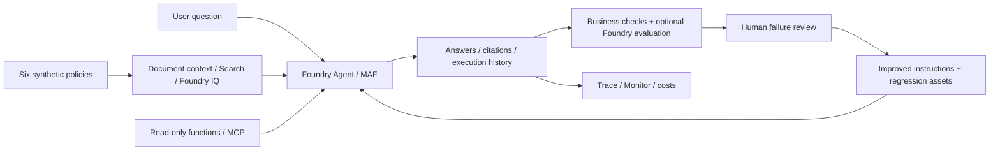

# Microsoft Foundry v2 Hands-on Labs

**English** | [한국어](README.ko.md)

## Start here

**Build one travel-policy assistant, then hand over its reviewed answers and cleanup record.**
Use only the supplied synthetic data.

1. Choose **A** or **B** below.
2. Complete [the setup card](docs/setup.md) **for that route**.
3. Follow your route's checklist from Lab 00. Leave each lab through **A done / B done**, not the next section on the page.

| Route | Choose it if | You do | You finish with |
|---|---|---|---|
| **[A — Beginner](docs/paths/a-beginner.md)** | You are new to Azure or agents | Browser steps and a prepared Lab 05 workflow path; no Python writing | Your agent, a six-question assessment, a workflow review and a cleanup handoff |
| **[B — Implementation](docs/paths/b-practitioner.md)** | You are comfortable with Python and APIs | SDK calls, managed prompt agent, tools, workflows, Search/IQ, controlled evaluation, traces, local packaging | Saved run records and an acceptance report |

**Time after setup:** A 4 h 30 min; B 8 h (two 4-hour sessions). **Files:** A uses the small learner ZIP; B uses the source repository, with no second ZIP.
Both need a prepared Azure environment. Lab 05 uses either a prepared hosted workflow agent in the browser or a prepared terminal (the owner decides before class).
If neither option was supplied, complete [Lab 00 B](docs/labs/00-start.md#path-b) and [Lab 02 B](docs/labs/02-models.md#path-b) before class.
Without Azure access, use only the [offline rehearsal](docs/labs/00-start.md#offline-rehearsal) and mark cloud labs **not run**.

After finishing a core route, you can choose optional [C. Advanced modules](docs/paths/c-advanced.md).
Preparing a class: [Instructor guide](docs/instructor.md). Returning from the old edition: [Migration map](docs/reference/migration.md).
Background reading and recordings below are optional, not prerequisites.

<details>
<summary>Background and previous recordings — optional context, not prerequisites</summary>

## Background: learning loops and frontier ecosystems

In his [June 14, 2026 essay](https://x.com/satyanadella/status/2066182223213293753),
Satya Nadella argued for a **frontier ecosystem, not just a frontier model**:
organizations should build learning systems that retain their knowledge and expertise even when the underlying model changes.
He reiterated this in Microsoft's [July 29, 2026 earnings call](https://www.microsoft.com/en-us/Investor/events/FY-2026/earnings-fy-2026-q4),
emphasizing each organization's own **continuous learning loop** and control of its core IP.
The focus shifts from simply choosing the strongest model to building an ecosystem in which organizations can keep learning and creating value.

This workshop turns that perspective into a practical engineering loop:
**run → observe and evaluate → human review → improve → verify again**.
Using only bundled synthetic data, you connect Foundry and Microsoft Agent Framework (MAF) agents,
knowledge, tools, workflows, Hosted deployment, and evaluation into one system.
Here, learning means reviewed improvements to instructions, retrieval, tools, and workflows—not automatic model-weight training.
Dev data supports iteration; holdout is reserved for final acceptance.

**Start with one agent. Finish with a system whose knowledge, evaluation criteria, and operational decisions your team can reuse.**

English by default · Korean available · Synthetic data only

Execution evidence, recording metadata, action counts, playback checks, coverage and dated run results now live in [Execution evidence and recordings](docs/evidence.md).
Use that hub for [live results](docs/live-run.md), [recordings](docs/video-summary.md), [action captures](docs/action-captures.md), [coverage](docs/coverage.md) and [validation](docs/reference/validation.md).

</details>

## One scenario, an expanding system

Build a travel-policy assistant for the fictional **Hanbit Technology**.
It handles current and historical lodging limits, meals, advance approval, and
unsupported international-travel questions. No real company documents, personal
information, or Microsoft 365 data are used. The assistant provides guidance;
it does not approve, book, or reimburse travel.



| Module | Topics |
|---|---|
| [00. Getting started](docs/labs/00-start.md) | Learning paths, browser/code setup, offline/cloud boundaries |
| [01. Foundry and projects](docs/labs/01-foundry.md) | Platform vs. SDK, resources, projects, roles |
| [02. Models](docs/labs/02-models.md) | Deployment names, Playground, SDK, comparison and Router |
| [03. Your first agent](docs/labs/03-prompt-agent.md) | Instructions, synthetic documents, citations, tool/permission boundaries |
| [04. MAF and tools](docs/labs/04-agents-tools.md) | Single agent, functions, local MCP |
| [05. MAF workflows](docs/labs/05-workflows.md) | Prepared example, sequential/concurrent/Group Chat code, human review |
| [06. RAG and Foundry IQ](docs/labs/06-knowledge.md) | Search vs. IQ, GA API, source citations |
| [07. Evaluation and learning](docs/labs/07-evaluation.md) | Dev, failure analysis, instruction improvements, holdout |
| [08. Hosted Agent](docs/labs/08-hosted.md) | Safe packaging, local server, code deployment |
| [09. Operations and cleanup](docs/labs/09-operations.md) | Traces, release gates, costs, ownership-aware cleanup |
| [10. IQ extensions](docs/labs/10-iq-extensions.md) | Fabric, Work IQ, Toolbox, Preview approval boundaries |
| [11. Capstone](docs/labs/11-capstone.md) | Final handoff across knowledge, models, evaluation, and operations |

## Shortest code-path start

**Optional offline preview, not B's Azure setup.** Run from **this repository's root** in Bash
(WSL on Windows). Use Python 3.13 for the full code route; 3.14 supports only offline checks.
A learners can skip this section.

```bash
# Try the checker without external packages or Azure.
python3.13 scripts/workshop.py --language en doctor
python3.13 scripts/workshop.py --language en demo --label first-offline --prompt v2
python3.13 scripts/workshop.py --language en evaluate --label first-offline
```

**Check:** `doctor` reports `result: PASS` and `azure_tested: false`.
Open `outputs/first-offline/business-evaluation.json`: the bundled v2 fixture should give
`total: 6`, `passed: 6`, `errors: 0`. This verifies the checker, **not model quality or Azure connectivity**.
For another run, use a fresh label in both `demo` and `evaluate`; existing runs are not overwritten.
Continue to [Lab 00 B](docs/labs/00-start.md#path-b) for SDK installation, authentication and real calls.

## Scope of this edition

- Current Foundry and Projects SDK **2.x** pins were refreshed on 2026-09-24 and live-verified that evening on the core B route in both languages; the 2026-09-24 recordings used the previous pins. Lab 03 B and the Lab 09 B trace search were recorded with the new pins on 2026-09-25 ([supplement](docs/video-summary.md#review-refresh-supplement)), and both routes ran end to end as written that day ([results](docs/live-run.md#end-to-end-20260925)). See [versions](docs/reference/versions.md).
- **MAF code** owns workflow authoring and orchestration. Portal workflow creation/publishing is excluded. Assistants retired on 2026-08-26, portal Workflows retire on 2026-12-01, and classic threads/runs agents retire on 2027-03-31; see the [migration map](docs/reference/migration.md).
- The first-pass preset is **`gpt-6-sol`**, deployed with that exact name, model version **`2026-09-22`**.
  It was chosen on September 23, 2026 and the main steps were recorded with it on September 24 ([why this model](docs/reference/model-choice.md)).
  The optional IQ Chat path keeps its own `gpt-5.6-luna` deployment because Search knowledge bases accepted no GPT-6 model;
  other models belong to explicit comparison experiments.
- Service GA and SDK Preview are separate. The Hosted Agent service is GA, while this
  edition's Python hosting package is prerelease. Foundry IQ GA and richer Preview contracts are distinct.
- Model replacement, instruction improvement, and accumulating evaluation evidence are included.
  **Automatic weight training, fine-tuning, and RL are not.**
- Deployment, paid evaluation, and external connections are optional, separately executed steps.
  Opening the repository or running `doctor` creates no resources.
- Unannounced Ignite 2026 capabilities, future prices, regions, and quotas are not guaranteed.

**Evidence:** [Versions/status](docs/reference/versions.md) ·
[Validation scope](docs/reference/validation.md) · [Sources](docs/reference/sources.md) ·
[Troubleshooting](docs/reference/troubleshooting.md) · [Cleanup](docs/reference/cleanup.md)

New terms: [glossary](docs/reference/glossary.md). Next learning: [learning resources](docs/reference/learning-resources.md). Execution options:
[command reference](docs/reference/commands.md). Environment variables:
[configuration](docs/reference/configuration.md).

## Repository layout

```text
docs/                  English labs, learning paths, instructor and reference guides
docs/ko/               Matching Korean guides
src/foundry_workshop/   Shared settings, retrieval, agents, evaluation, and lineage
scripts/               Workshop CLI, packaging, and documentation checks
data/knowledge/        Six canonical synthetic policies (Korean)
data/evaluation/       Six dev / four holdout / two judge-calibration cases
data/fixtures/         Fixed examples for the offline checker
data/learner/          Ready-to-use English/Korean browser materials and ZIPs
prompts/               Canonical v1 / v2 instructions (Korean)
examples/              Local MCP server, Hosted Agent entry point and standalone SDK recipes
tests/                 Offline logic and contract checks
outputs/               Personal run outputs; excluded from Git
```

Licensed under [MIT](LICENSE). Source attribution and repository-specific license
boundaries are recorded in [Sources](docs/reference/sources.md).
