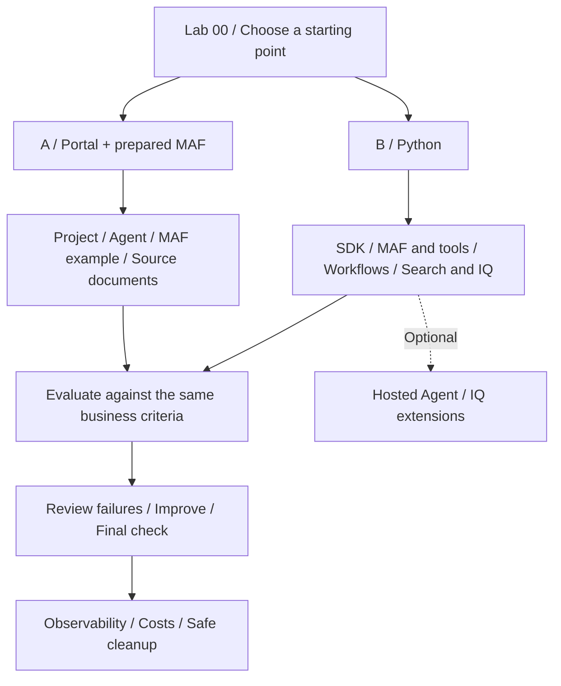

# Microsoft Foundry v2 Hands-on Labs

**English** | [한국어](ko/index.md)

**Move from building an agent to preserving your team's knowledge, evaluation criteria, and operational decisions.**

This is the Pre-Ignite 2026 Edition, with separate language assets and recording sets.
Beginners use the portal and
a prepared MAF environment; practitioners use Python. Both solve the same
**synthetic travel-policy scenario**. Neither path authors workflows in the portal.

| What you need | Start here |
|---|---|
| A starting point and schedule | [Learning paths](paths.md) |
| First-run instructions | [Lab 00](labs/00-start.md) |
| Classroom preparation | [Instructor guide](instructor.md) |
| New English recordings | [Current videos](video-summary.md) |
| One video in guide order | [Lab 00–11 chapters](video-chapters.md) |
| A particular screen or action | [Current action/capture index](action-captures.md) |
| Actual results and limits | [Execution evidence](live-run.md) |
| Separate Korean recordings | [Korean videos](ko/video-summary.md) |
| Hosted matrices and independent gates | [Evaluation workbook](reference/evaluation-workbook.md) |
| Final deliverables | [Capstone](labs/11-capstone.md) |
| Supported contracts and versions | [Compatibility snapshot](reference/versions.md) |
| Errors, roles, or quota | [Troubleshooting](reference/troubleshooting.md) |
| Finishing without overlooked costs | [Cleanup](reference/cleanup.md) |
| English/Korean scope and sample translations | [Language contract](reference/languages.md) |

> **Keep three things separate.** `offline-fixture` is a fixed example. Local MAF runs
> on your computer but calls a model in Azure. Hosted Agent runs your code in the cloud.
> Their completion criteria are different. English execution explicitly selects its own frozen
> English policies/prompts/datasets; Korean originals remain unchanged.

Both current and historical documents are intentional: retrieving the newest document
does not prove that the assistant applied the policy valid **on the travel date**.
Observing models, retrieval, and business checks independently is the core of these labs.
