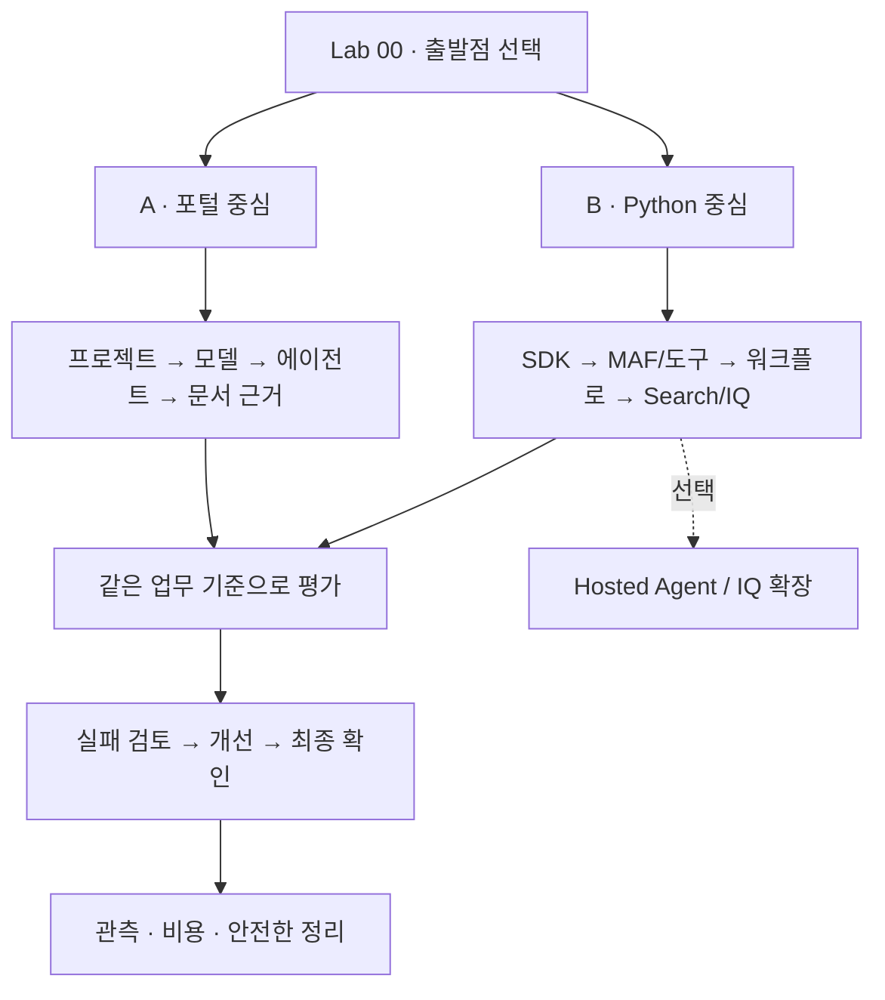

# Microsoft Foundry v2 실습

**에이전트를 만드는 경험에서, 조직의 지식·평가·운영 기준을 남기는 경험으로.**

이 자료는 2026-09-13 기준의 Pre-Ignite 2026 Edition입니다.
완전초보자는 브라우저에서, 경험자는 Python에서 같은 **합성 출장 규정 상담 업무**를 해결합니다.

| 찾는 것 | 바로가기 |
|---|---|
| 나에게 맞는 시작점과 시간표 | [학습 경로](paths.md) |
| 처음 실행하는 방법 | [Lab 00](labs/00-start.md) |
| 수업 전에 준비할 환경 | [강사 가이드](instructor.md) |
| 마지막에 확인할 결과물 | [캡스톤](labs/11-capstone.md) |
| 현재 지원 상태와 버전 | [호환성 기준](reference/versions.md) |
| 오류·권한·할당량 문제 | [문제 해결](reference/troubleshooting.md) |
| 비용을 남기지 않고 마치기 | [정리](reference/cleanup.md) |

> **세 가지를 구분합니다.** `offline-fixture`는 고정 예제, 로컬 MAF는 내 PC에서
> 실행하지만 모델은 Azure에 호출하는 코드, Hosted Agent는 내 코드를 클라우드에서
> 실행하는 서비스입니다. 셋의 완료 조건은 같지 않습니다.

현재/과거 문서를 모두 주는 이유는 최신 문서가 검색되었다는 사실만으로 **출장일에
맞는 규정을 적용했다**고 결론 내릴 수 없기 때문입니다. 모델, 검색, 업무 검사를
각각 관찰하는 것이 이 통합 실습의 핵심입니다.
