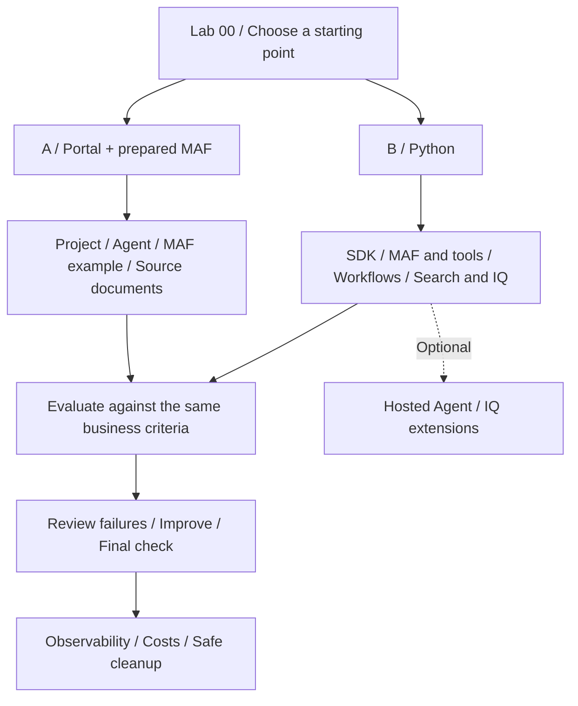

# Microsoft Foundry v2 Hands-on Labs

**English** | [한국어](ko/index.md)

**Start with [the setup card and learner ZIP](setup.md), then follow [A. Beginner](paths/a-beginner.md).**
Already comfortable with Python/APIs: choose [B. Implementation](paths/b-practitioner.md) instead.
Each route links directly to its own lab section. Stop at the **A done / B done** link rather than continuing into another path.

This is the Pre-Ignite 2026 Edition, with separate language assets and recording sets.
Beginners use the portal and
a prepared MAF environment; practitioners use Python. Both solve the same
**synthetic travel-policy scenario**. Neither path authors workflows in the portal.

Use the ready files rather than assembling JSON documents or copying reference-answer records.
Advanced sections and recordings are optional reading, not extra steps required between labs.

A keeps the extracted learner ZIP as a personal evidence folder. B uses
[the source copy's notes directory](labs/00-start.md#prepare-notes), without a second ZIP.
Fill `session-notes.txt`, `workflow-review.txt` and `operations-checklist.txt` as you go;
A also fills a copy of `assessment.csv`.
Do not put credentials or your filled files in the repository's generated data directory.

Reference directory — open only for the item you need

[C — Advanced](paths/c-advanced.md) adds selected modules after the core route.
[Coverage and evidence](coverage.md) records new-module status separately.

| What you need | Start here |
|---|---|
| Accounts, exact model, input files, and a self-setup route | [One-time setup](setup.md) |
| A starting point and schedule | [Learning paths](paths.md) |
| First-run instructions | [Lab 00](labs/00-start.md) |
| Classroom preparation | [Instructor guide](instructor.md) |
| September 24 `gpt-6-sol` English recordings | [Videos: 6:29 in guide order, 3:11 CLI, 2:55 portal](video-summary.md) |
| One video in guide order | [Lab chapters](video-chapters.md) |
| A particular screen or action | [98 actions and 293 captures](action-captures.md) |
| Actual results and limits | [Execution evidence](live-run.md) |
| Separate Korean recordings | [Korean videos](ko/video-summary.md) |
| Hosted matrices and independent gates | [Evaluation workbook](reference/evaluation-workbook.md) |
| Final deliverables | [Capstone](labs/11-capstone.md) |
| Supported contracts and versions | [Compatibility snapshot](reference/versions.md) |
| Errors, roles, or quota | [Troubleshooting](reference/troubleshooting.md) |
| Finishing without overlooked costs | [Cleanup](reference/cleanup.md) |
| English/Korean scope and sample translations | [Language contract](reference/languages.md) |

> **Keep three things separate.** `offline-fixture` is a fixed example. Local MAF runs
> on your computer but calls a model in Azure. Hosted Agent runs your code in the cloud.
> Their completion criteria are different. English execution explicitly selects its own frozen
> English policies/prompts/datasets; Korean originals remain unchanged.

Both current and historical documents are intentional: retrieving the newest document
does not prove that the assistant applied the policy valid **on the travel date**.
Observing models, retrieval, and business checks independently is the core of these labs.
