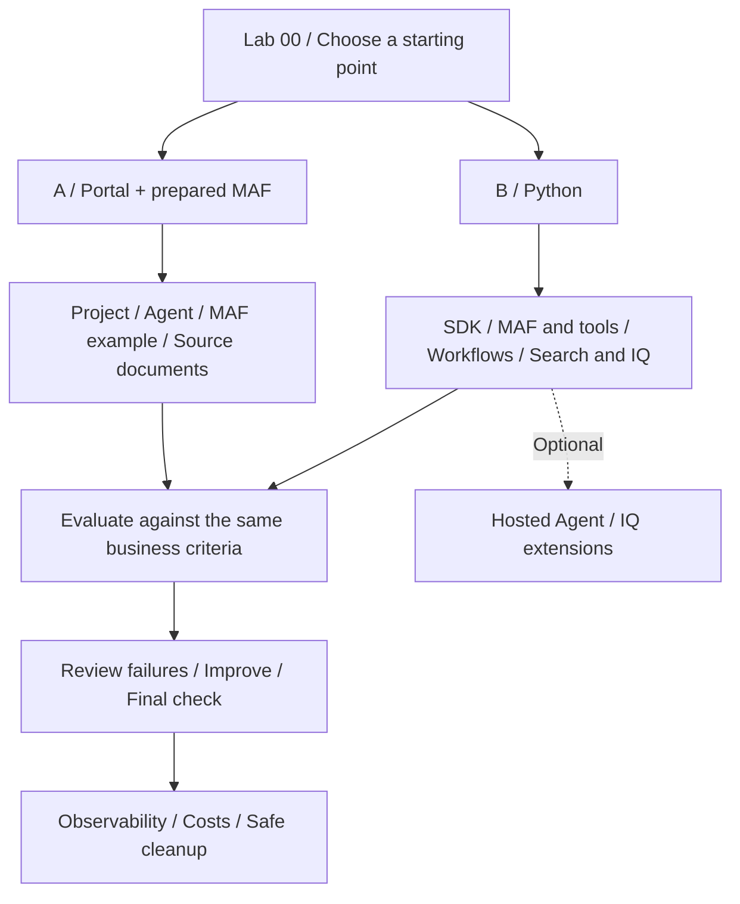

# Microsoft Foundry v2 Hands-on Labs

**English** | [한국어](ko/index.md)

<!-- translation-pending: ko-integrated-20260915 -->

> **Translation pending** — The [Korean-first integration revision](ko/index.md) is current for the new workflow/evaluation curriculum. This English page retains the earlier material. English expansion and new media follow Korean execution, capture, and corrections.

**Move from building an agent to preserving your team's knowledge, evaluation criteria, and operational decisions.**

This is the Pre-Ignite 2026 Edition, with English documentation, new recordings, and
Azure checks on September 15, 2026. The September 14 source evidence remains separate. Beginners use the portal and
a prepared MAF environment; practitioners use Python. Both solve the same
**synthetic travel-policy scenario**. Neither path authors workflows in the portal.

| What you need | Start here |
|---|---|
| A starting point and schedule | [Learning paths](paths.md) |
| First-run instructions | [Lab 00](labs/00-start.md) |
| Classroom preparation | [Instructor guide](instructor.md) |
| New English-guide recordings | [Portal 4:45 / CLI 5:15](english-recordings.md) |
| One video in guide order | [13:09 walkthrough and chapters](english-recordings.md#chapters) |
| A particular screen or action | [234-action / 537-image index](english-captures.md) |
| New results and unverified features | [Execution boundaries](english-recordings.md#actual-results-and-boundaries) |
| Original Korean-content recordings | [September 14 source videos](video-summary.md) |
| Final deliverables | [Capstone](labs/11-capstone.md) |
| Supported contracts and versions | [Compatibility snapshot](reference/versions.md) |
| Errors, roles, or quota | [Troubleshooting](reference/troubleshooting.md) |
| Finishing without overlooked costs | [Cleanup](reference/cleanup.md) |
| English/Korean scope and sample translations | [Language contract](reference/languages.md) |

> **Keep three things separate.** `offline-fixture` is a fixed example. Local MAF runs
> on your computer but calls a model in Azure. Hosted Agent runs your code in the cloud.
> Their completion criteria are different. Canonical policy inputs remain Korean,
> and an English guide is not an English-language quality evaluation.

Both current and historical documents are intentional: retrieving the newest document
does not prove that the assistant applied the policy valid **on the travel date**.
Observing models, retrieval, and business checks independently is the core of these labs.
