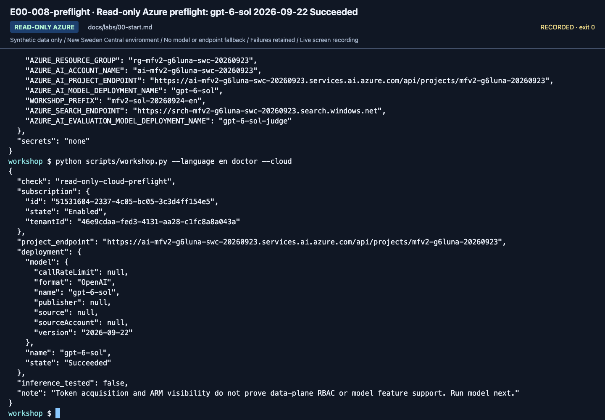

# Instructor guide: resolve setup risks before class

**English** | [한국어](ko/instructor.md)

**Class time is not installation, subscription creation, or feature-approval time. Verify every team's environment first.**

Parent: [Learning paths](paths.md) · Evidence: [Validation record](reference/validation.md)

## 1. Choose the class scope

| Class | Prepare | Optional exclusions |
|---|---|---|
| A. Beginner | 270 min (4 h 30 min): browser accounts, project, model, synthetic documents, assessment sheet, prepared MAF environment or hosted workflow agent | Python authoring, actual M365/Fabric |
| B. Implementation | 480 min (two 4-hour sessions): Python/SDKs, code environment, model access, Lab 03 B managed agent, Search service, scoped read/write permissions for Lab 06 and trace access for Lab 09 | Paid judge and local/remote Hosted execution are separate gates |
| IQ advanced | Search, authentication, semantic/knowledge retrieval settings | Planner, embeddings, richer Preview are unnecessary for basic GA |
| Hosted advanced | Python 3.13 runtime, actual ARM ID, deployment/identity permissions | Local Docker is unnecessary for code deployment |

Do not make beginners depend on every Preview approval or company M365 connection.
Give each team a unique agent/Search prefix. Only instructors manage shared service
creation and deletion. Do not prepare a portal Workflow Designer exercise: A's Lab 05
runs existing MAF code or an owner-prepared hosted workflow agent in the Playground. Check the SDK, venv, and each learner's model-call permission.

English and Korean use **separate frozen language bundles** with equivalent IDs, dates, amounts and judgments.
English commands explicitly select `--language en`; neither language silently substitutes the other.
Give each learner [the setup card](setup.md). A receives the learner ZIP; B uses the source copy,
not raw evaluation records or a request to assemble policy JSON.
The ZIP supplies complete instructions, six TXT sources, questions only and blank assessment/review/operations records.
B learners can prepare their notes directly from the source copy in [Lab 00 B](labs/00-start.md#prepare-notes); the browser ZIP is not another required download for them.
[Language lineage](reference/languages.md) stays intact.

## 2. Three to seven days before: accounts, permissions, costs

1. Assign an owner and a dedicated training subscription/resource group; keep production separate.
2. Verify the current Foundry project and **`gpt-6-sol` / `2026-09-22`**, deployed as **`gpt-6-sol`**.
   Check quota, SKU and region; do not let first-time learners guess a replacement.
   Recheck [the model choice](reference/model-choice.md) and its published price before class.
3. Assign the required project roles, such as `Foundry User`, to participants.
4. Connect Application Insights to the project for server-side traces and give learners **Log Analytics Reader** on it. If protected tables are enabled, also grant **Privileged Monitoring Data Reader**. This is required for Lab 09 trace checks. In the 2026-09-24 check, managed agent calls appeared in the connected Application Insights within minutes; direct model calls did not.
5. **For B or a selected IQ module**, prepare separate Search data read/write roles. They are not required for default A.
6. **Only for selected remote hosting**, prepare the runtime identity's model/tool roles. B's package-only step does not need them.
7. Optional for A: prepare the Lab 05 hosted workflow agent with the **Responses** protocol and record its stable endpoint, active version, name and Playground location for learners. The local Responses path was checked on 2026-09-24; a remote Playground run was not.
8. Send a first request using an **actual participant account**, not an administrator.
9. Set budget alerts and log retention. Budget alerts are not an automatic spending cap.
10. Review optional-feature approvals, cross-region processing, and tenant policies.

Role names may still appear as `Azure AI ...`. Check the current
[Foundry role table](https://learn.microsoft.com/azure/foundry/concepts/rbac-foundry).


**What to check:** This is the September 24, 2026 deployment list. A deployment type (SKU) is not quota `used`/`limit`;
query quota and capacity again immediately before class. This Sweden Central availability does not apply automatically
to another subscription or date.

### Values to give each team

Distribute **values only**, separately, in `.env.example` format. Never distribute passwords, keys, or tokens.

- Subscription/tenant IDs, resource group, and Foundry account.
- Full project endpoint, including `/api/projects/...`.
- Exact `gpt-6-sol` answer deployment and verified model version `2026-09-22`.
- Unique `WORKSHOP_PREFIX`: `mfv2-` followed by lowercase letters/digits and single hyphens, at most 32 characters total.
- **For B:** the Search endpoint, writer access and an approved, unseeded learner prefix (or the matching prepared working copy).
- **Only for optional IQ Chat:** account OpenAI root and the **chat-base name printed by `iq-chat setup`**, distinct from the GA base.
- Optional judge deployment and underlying model.
- Actual project ARM ID, location code, unique agent name and an empty standalone directory if Hosted is selected.

Also hand over the repository location and an activated, participant-signed-in MAF terminal for Lab 05.
For self-study, [Lab 00 B](labs/00-start.md#b-code-one-folder-one-environment) is the full setup route, not an assumed instructor action.

## 3. Prepare Search/IQ

**Default A: skip this section. B: prepare the service and learner permissions; Lab 06 creates the learner's owned objects.**
Model-based IQ Chat is an additional opt-in, not part of B's GA preparation.

The default is a text index and **GA `2026-04-01` minimal/extractive retrieval**.
Check these separately:

| Item | Check |
|---|---|
| Service tier/region | Support for the selected features |
| Data-plane authentication | Document reads/writes with Entra ID |
| Participant roles | Reader + Search Index Data Reader; Search Service/Index Data Contributor only for required writers |
| Semantic ranker | Configuration and separate charges for GA semantic intent |
| Knowledge retrieval | Management-plane usage/billing consent; `free`/`standard` conditions |
| Source citations | Returned `id`, `title`, and `content` |

Scripts do not silently change billing to `standard`. An administrator reviews
[official migration/configuration guidance](https://learn.microsoft.com/azure/search/agentic-retrieval-how-to-migrate).
For a Chat completion model, give **the Search service's identity** `Cognitive Services User` on the model's Foundry account.
Selecting managed identity is supported; it does not borrow the local user's or Hosted agent's role.
The model-based Preview path is separate from the default direct-intent retrieval experiment.
For that optional segment, use the fixed **`gpt-5.6-luna` + Search system-assigned identity + `low` + `answerSynthesis`** preset;
Search accepted no GPT-6 model for KB binding on September 23, 2026, so prepare that separate deployment.
Follow [the owner sequence](setup-owner.md) once and give learners its exact chat-base name.
Do not hand out the model-free GA base as a ready-to-chat configuration.
`iq-chat check` is read-only; `iq-chat setup --confirm-create` creates only the owned separate base;
`iq-chat ask --label <new-label> --confirm-cost` verifies actual paid planning/synthesis.
Neither command deploys a model or grants roles. [Details and recovery](reference/iq-model-identity.md).
For the learner's CLI checks, verify Reader on the training Foundry account/Search service
and Search Index Data Reader for retrieval. Project-only access is not account-level ARM/role visibility;
do not discover that missing prerequisite halfway through Lab 06.

**Ownership handoff:** for fresh B learner copies, prepare the Search service/roles and give each learner an unseeded prefix.
If you seed their objects first, use the authorized prepared working copy that contains the corresponding ledger.
Do not hand out a seeded prefix without that working copy or distribute another team's ledger.
English/Korean selection does not rename configured Search objects. After a language/prefix change, follow
[the fresh-copy rule](reference/configuration.md#workspace-scope) and preserve the original cleanup records.

## 4. The day before: rehearse the same edition

Freeze the documentation/code version and rehearse in a fresh, independent folder.
Hosted initialization can discover a parent `azure.yaml`; stay outside another azd project.
Complete Lab 00 B's `.env`, venv and participant sign-in first.
Reuse that venv; do not recreate it after setup. Run each block only with the approved training values.

```bash
source .venv/bin/activate &&
python -m pip install -e ".[cloud,agents,dev]" &&
python -m pip check &&
python -m ruff check . &&
python -m ruff format --check . &&
python -m compileall -q src scripts examples tests tests_sdk &&
python -m unittest discover -s tests -t . -v &&
python scripts/check_docs.py &&
python scripts/workshop.py --language en doctor
```

The chain stops on the first failed check. Resolve it before continuing. No command in this block calls Azure.
The Hosted SDK is not needed for core A/B; its full SDK checks are optional below.

Only after all local checks pass, run the read-only cloud preflight:

```bash
python scripts/workshop.py --language en doctor --cloud
```

After preflight and inference-cost approval, run each request and inspect it before the next:

```bash
python scripts/workshop.py --language en model --question "This is a synthetic workshop connectivity check. Reply briefly in English."
```

Check the actual `text`, deployment/model and response ID. Then verify structured output:

```bash
python scripts/workshop.py --language en answer --prompt v2 --retrieval local
```

Check the answer fields, source IDs and real response metadata. Then test the prepared MAF workflow:

```bash
python scripts/workshop.py --language en workflow --pattern sequential
```

The connection-check question means: "This response checks the synthetic workshop
connection. Answer briefly in English." If a real model call fails, rehearsal has not
passed. Resolve roles, quota, and tool/Structured Outputs support before proceeding.



**What to check:** Review project, Search, and logging resources together. One successful
resource creation is not a ready environment. The participant's first model call is a separate gate.

<a id="rehearse-route"></a>

### Rehearse the route you will teach

**Those three requests check connectivity, not course completion.** Use the selected route's complete commands and save checkpoints:

| Selected class | Required rehearsal | Not required |
|---|---|---|
| [A. Beginner](paths/a-beginner.md) | Portal agent, learner files, the participant's sequential MAF run or prepared hosted workflow Playground option, six-question manual assessment, source checks, Lab 09 trace check and handoff | Search service or cloud judges |
| [B. Implementation](paths/b-practitioner.md) | All core B steps, including managed agent, function/MCP calls, all three workflows, Search **and** GA IQ, gated evaluation, trace check, package and handoff | Local/remote Hosted execution, cloud judges or C modules |
| [A selected C module](paths/c-advanced.md) | Only that module's stated prerequisites, calls and evidence | Every other C module |

Use a participant account, approved costs and unique prefixes. For fresh B copies, let Lab 06 create owned objects and preserve its ledger.
The learner ZIP already contains the six policy files; exporting them is optional regeneration, not another A prerequisite.

<details>
<summary>Optional full SDK rehearsal — only for selected Hosted/Toolbox modules or SDK maintenance</summary>

In the same dedicated venv, install the full lock and run SDK checks with stub transports.
These checks do not send Azure requests and do not prove a deployment:

```bash
python -m pip install -r requirements.lock.txt -e ".[cloud,agents,hosted,dev]" &&
python -m pip check &&
python scripts/check_sdk.py &&
python -m unittest discover -s tests_sdk -t . -v
```

</details>

### Record the actual environment

Use a new directory per rehearsal. A repeated copy stops instead of replacing the previous environment record.

```bash
mkdir -p outputs &&
mkdir outputs/instructor &&
python -m pip freeze > outputs/instructor/environment.txt
```

Record model ID/version/SKU, Python/SDK versions, installation date, region, successful
commands, failures, remediation, and unselected features. **Upstream success is not
this edition's validation.** Never publish `.env`, tokens, personal identifiers, or raw traces.

## 5. Budget and request planning

- Lab 07 collects dev 6 + dev 6 + holdout 4 = **16 target-case requests**.
- Tools, SDK retries, reasoning, and additional comparisons consume more.
- Six candidates with two evaluators produce **12 evaluation items**, not necessarily 12 internal LLM calls.
- Search can incur SKU charges while idle.
- Hosted compute/storage costs must be checked **per active session**.
- Application Insights/Log Analytics ingestion and retention also cost money.

Default collection concurrency is one; Group Chat is capped at three rounds.
Calculate aggregate team quota. Do not promise an unsupported fixed low price.

## 6. During class

| Situation | Instructor response |
|---|---|
| A team is blocked by setup for over ten minutes | Use a preverified team environment and explicitly record account/model changes |
| No model/region quota | Use an approved prepared environment or mark live work not run |
| A's MAF environment is missing | Restore it or record "observed; not personally executed"; no portal-workflow substitute |
| IQ Preview access unavailable | GA path or design observation, labeled as different outcomes |
| SDK download unavailable | Prepared environment/browser path; never disable certificate verification |
| Baseline passes everything | Record it honestly; discuss coverage rather than manufacturing failures |
| Hosted deployment fails | Separate package/local verification; avoid repeated costly deployment attempts |

Recordings and demonstrations help learners but are not evidence of personal execution.
Explain screen/version differences when using a source video.

## Media separation plan

Large MP4/WebP assets live in this repository and its history; the current pack is about 977 MiB. Moving them to release assets, Pages or LFS, or rewriting history, needs separate approval and a coordinated migration. For this edition, learners can use **Download ZIP** for browser materials or the sparse-checkout approach in [owner preparation](setup-owner.md) to avoid `docs/assets/` and videos.

## Advanced Hosted workflow/evaluation preparation

Use the [evaluation workbook](reference/evaluation-workbook.md) after the basic rehearsal.
Prepare actual API support for every listed deployment, a separate judge, the intended runtime identity,
the dedicated English policy index/source/base, and App Insights query access.
The English corpus/prompts/dev/calibration/holdout are separate frozen assets selected by `--language en`.
Never reuse Korean run outcomes or rename its footage.

The local user and Hosted identity are distinct. Check account inference and Search roles separately.
Validate actual local/remote responses, not just readiness or successful package creation.
For four models, budget 24/24/16 target rows plus internal workflow/retrieval/retry/judge calls.
Preserve all failures and native findings; an all-pass baseline does not need a fabricated regression.
Keep holdout out of prompt development.

### Source-language and media order

Use the user's current production order and the active `source_language` in
[`docs/localization.json`](localization.json), not a historical Korean-first or English-first checklist.
Revise and check the source guide first, then its counterpart.
Any deferred translation needs a visible warning and exact source/target hashes.
New recordings require their own authorized execution and independent language evidence;
a guide-only revision does not require or claim a new recording.

## 7. End of class and pre-Ignite freeze

- Separate real participant outputs from fixtures.
- Check all session-list pages and stop only owned active sessions.
- Use both `--new-session --new-conversation` for independent Responses checks.
- Separate team agents, Search objects, and connections from shared resources.
- Check residual service, model, log, and capacity charges.
- Update the dates in [Versions](reference/versions.md) and actual evidence in [Validation](reference/validation.md).
- Keep both languages, CLI, code, checks, and configuration tables aligned when APIs change.
- Do not add unverified Ignite 2026 announcements or future support promises.
