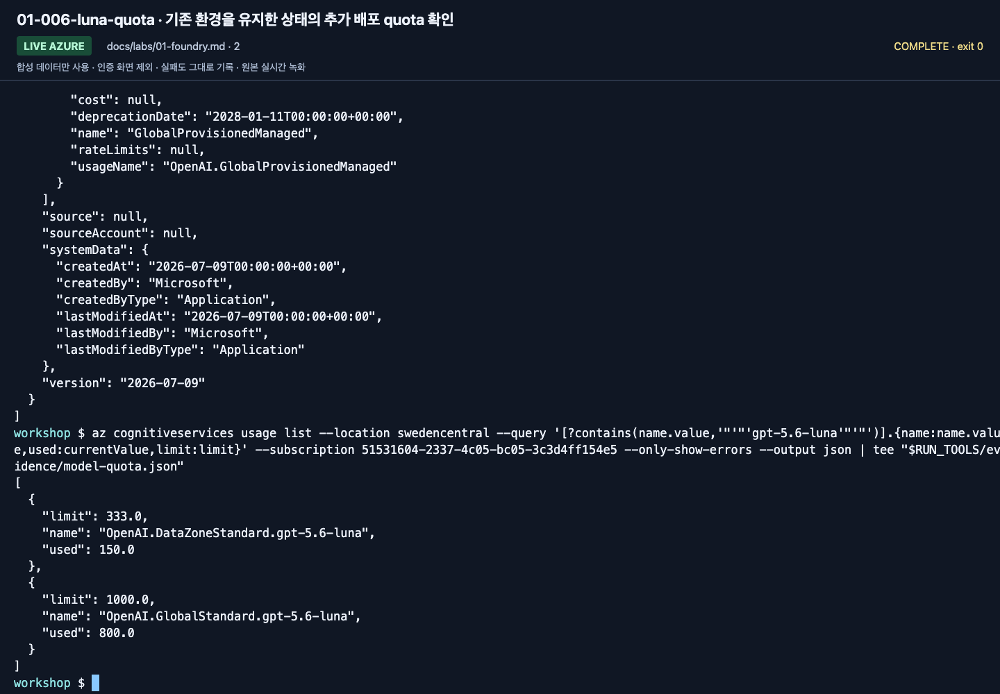
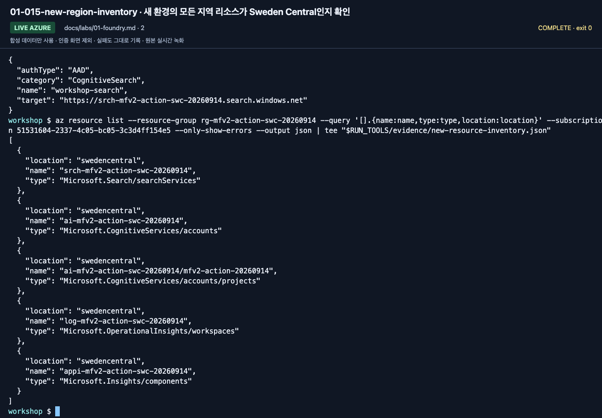

# 강사 가이드: 수업 전에 실패 지점을 없애기

**수업 시간은 설치·구독 개설·기능 승인 시간이 아닙니다. 조별 환경을 먼저 확인하세요.**

상위: [학습 경로](paths.md) · 실제 확인 범위: [검증 기록](reference/validation.md)

## 1. 수업 범위 확정

| 수업 | 기본 준비 | 미리 빼도 되는 것 |
|---|---|---|
| A. 완전초보자 | 브라우저 계정, 프로젝트, 모델, 합성 문서, 평가표, 준비된 MAF 실행 환경 | Python 코드 작성, Hosted, 실제 M365/Fabric |
| B. 경험자 | 위 + Python/SDK, 읽기 권한, 코드 환경 | 유료 judge, Hosted 원격 배포는 별도 게이트 |
| IQ 심화 | 준비된 Search, 인증·semantic/knowledge retrieval 설정 | planner·임베딩·richer Preview는 기본 GA에 불필요 |
| Hosted 심화 | 3.13 런타임, 실제 ARM ID, 배포/identity 권한 | 로컬 Docker는 code deployment에 불필요 |

초보자의 core를 “모든 Preview 승인과 회사 M365 연결”에 의존시키지 않습니다.
각 조는 고유한 agent/검색 접두사를 사용하고, 공유 서비스의 생성/삭제는 강사만 담당합니다.
포털 workflow 작성 환경은 준비하지 않습니다. A의 Lab 05도 기존 MAF 예제를 실행하므로,
SDK·가상환경·학습자 계정의 모델 호출 권한을 미리 확인합니다.

## 2. 3–7일 전: 계정·권한·비용

1. 실습용 구독/Resource Group과 담당자를 정합니다. 운영 자원과 섞지 않습니다.
2. 현재 Foundry 프로젝트, 지원되는 모델 배포, quota/SKU/리전을 확인합니다.
3. 참가자에게 프로젝트의 `Foundry User` 등 필요한 역할을 부여합니다.
4. Search에는 데이터 읽기/작성 역할을 따로 준비합니다.
5. 원격 agent identity가 모델/도구에 접근할 때 필요한 역할을 별도로 준비합니다.
6. 관리자 아닌 **실제 참가자 계정**으로 첫 요청을 보내 봅니다.
7. 예산 알림과 로그 보존 기간을 정합니다. 예산 알림은 사용을 자동 차단하는 hard cap이 아닙니다.
8. 선택 기능의 승인, 지역 간 처리, 테넌트 정책을 확인합니다.

Foundry User와 Project Manager 등의 역할 이름이 이전 `Azure AI ...`로 보일 수 있습니다.
현재 [역할 표](https://learn.microsoft.com/azure/foundry/concepts/rbac-foundry)를 기준으로 확인합니다.



**화면 확인:** 2026-09-14 준비 과정의 예시입니다. `used`, `limit`, SKU를 구분하고 수업 직전에 다시 조회합니다.
사진의 숫자나 Sweden Central 가용성을 다른 구독·날짜의 배포 가능 여부로 복사하지 않습니다.

### 조별로 전달할 값

`.env.example` 형식으로 **값만 별도 전달**합니다. 비밀번호/API key/token은 전달하지 않습니다.

- 구독·tenant, Resource Group, Foundry 리소스 이름.
- `/api/projects/...`까지 포함한 프로젝트 endpoint.
- 지원 확인한 모델의 실제 배포 이름.
- 조별 `WORKSHOP_PREFIX`.
- 선택 Search endpoint 및 이름.
- 선택 judge 배포와 실제 underlying model.
- Hosted를 선택한 경우 실제 프로젝트 ARM ID와 고유 agent 이름.

## 3. Search/IQ 준비

기본은 텍스트 index와 **GA `2026-04-01` minimal/extractive retrieval**입니다.
다음은 별개의 준비 항목입니다.

| 항목 | 확인 |
|---|---|
| 서비스 tier·리전 | 사용하려는 기능의 지원 범위 |
| 데이터 평면 인증 | Entra ID로 문서 조회/작성이 가능한가 |
| 참가자 역할 | Reader, 필요한 작성자에만 Service/Index Data Contributor |
| semantic ranker | GA semantic intent에 필요한 구성·별도 요금 |
| knowledge retrieval | 서비스 관리 평면의 사용/과금 동의; `free`/`standard` 조건 |
| source 인용 | `id`, `title`, `content`를 돌려주는가 |

스크립트가 billing 설정을 자동으로 `standard`로 바꾸지 않습니다.
과금 동의와 feature availability는 관리자가
[공식 migration/설정 안내](https://learn.microsoft.com/azure/search/agentic-retrieval-how-to-migrate)를
확인합니다. richer Preview의 planner 모델·Search identity 모델 호출 권한은 별도 항목입니다.

## 4. 하루 전: 같은 배포본으로 리허설

문서/코드 버전을 고정한 뒤 새 폴더에서 진행합니다.
Hosted 초기화는 상위 `azure.yaml`을 찾을 수 있으므로 기존 azd 프로젝트 바깥의 독립된 폴더를 사용합니다.

```bash
python3.13 -m venv .venv
source .venv/bin/activate
python -m pip install -r requirements.lock.txt -e ".[cloud,agents,hosted,dev]"
python -m pip check
python scripts/check_sdk.py
python -m unittest discover -s tests -t . -v
python -m unittest discover -s tests_sdk -t . -v
python scripts/check_docs.py
python scripts/workshop.py doctor
python scripts/workshop.py doctor --cloud
python scripts/workshop.py model --question "이 응답은 합성 워크숍 연결 확인입니다. 한국어로 짧게 답하세요."
python scripts/workshop.py answer --prompt v2 --retrieval local
python scripts/workshop.py workflow --pattern sequential
```

여기서 실제 모델 호출이 실패하면 리허설은 통과가 아닙니다.
권한, quota, 모델의 tool/Structured Outputs 지원을 해결한 뒤 다시 확인합니다.



**화면 확인:** 준비한 프로젝트·Search·로그 리소스의 이름과 위치를 함께 검토한 예시입니다.
한 리소스의 생성 성공만으로 전체 환경이 준비됐다고 판단하지 않습니다. 실제 참가자 계정의 첫 모델 호출은 별도 게이트입니다.

추가 모듈은 실제 선택한 것만 확인합니다.

```bash
python scripts/export_policy_docs.py
python scripts/workshop.py maf --tools
python scripts/workshop.py maf --mcp
python scripts/workshop.py workflow --pattern concurrent
python scripts/workshop.py workflow --pattern group-chat
python scripts/workshop.py seed-search --iq --confirm-create
python scripts/workshop.py retrieve --provider iq
```

첫 export와 seed는 소유권/이름 충돌을 확인합니다. 재실행 실패를 `--force`로 숨기지 않습니다.
공유 리소스 대신 조별 전용 접두사와 소유권 기록을 사용합니다.

### 실제 실행 기록

```bash
mkdir -p outputs/instructor
python -m pip freeze > outputs/instructor/environment.txt
```

모델 ID/버전/SKU, Python/SDK, 설치 일시, 지역, 실제 성공한 명령, 실패와 대응,
선택하지 않은 기능을 함께 적습니다. **업스트림 리포의 성공 기록을 이 에디션의 성공으로 복사하지 않습니다.**
`.env`, 토큰, 개인 식별자, 원문 trace를 공개 GitHub에 올리지 않습니다.

## 5. 비용과 호출량 계획

- Lab 07의 기본 target 수집은 dev 6 + dev 6 + holdout 4 = **16개 사례 요청**입니다.
- 도구 호출, SDK 재시도, reasoning, 추가 모델 비교에는 별도 사용량이 생깁니다.
- candidate 6건에 evaluator 2개면 **12개 평가 항목**입니다. 내부 LLM 호출 수/요금과 같다고 단정하지 않습니다.
- Search는 요청이 없을 때도 선택 SKU의 비용이 생길 수 있습니다.
- Hosted는 활성 **session별** 컴퓨트/스토리지 비용을 확인합니다.
- Application Insights/Log Analytics 수집량과 보존 기간도 비용입니다.

수업 기본 동시성은 1이며, Group Chat은 최대 3라운드입니다.
여러 조의 합산 quota를 계산합니다. 무조건 “몇백 원이면 된다”는 비용 약속을 하지 않습니다.

## 6. 수업 중 진행 기준

| 상황 | 강사 조치 |
|---|---|
| 한 조가 10분 이상 환경 오류 | 사전 확인한 조별 환경으로 이동, 계정/모델 변경을 명시적으로 기록 |
| 모델/region quota 없음 | 승인된 준비 환경 사용 또는 실제 실습 미실행으로 표시 |
| A의 MAF 실행 환경 미준비 | 준비된 학습자 환경으로 복구하거나 `MAF 관찰 / 직접 실행 미완료`로 기록; 포털 workflow 작성으로 대체하지 않음 |
| IQ Preview 승인 없음 | GA 경로 또는 설계 관찰. 서로 같은 결과로 표시하지 않음 |
| SDK 다운로드 불가 | 미리 준비한 환경/브라우저 경로. 인증서 검증 해제 금지 |
| baseline 전부 통과 | 그대로 기록; 실패를 조작하지 않고 평가 범위의 한계 토론 |
| Hosted 배포 실패 | 패키지/로컬 확인까지 분리 기록; 반복 배포로 비용을 키우지 않음 |

녹화나 강사 관찰은 좋은 보조자료지만 참가자의 직접 실행 증거는 아닙니다.
원본 영상 링크를 사용하더라도 화면/버전 차이를 먼저 설명합니다.

## 7. 수업 종료 / Ignite 전 최종 동결

- 참가자 결과와 fixture가 구분되어 있는지 확인.
- session 목록의 다음 페이지까지 확인하고 본인 활성 session 중지.
- Responses 재검증은 `--new-session --new-conversation`을 함께 사용해 이전 대화가 섞이지 않는지 확인.
- 조별 에이전트·Search 객체·별도 연결과 공유 자원을 구분해 정리.
- 강사가 전용 서비스·모델·로그·capacity의 잔여 과금을 확인.
- [버전 기준](reference/versions.md)의 점검일과 [검증 기록](reference/validation.md)을 실제로 갱신.
- 문서/API 이름이 바뀌었다면 한 모듈만 수정하지 말고 CLI·코드·검사·환경표도 같이 갱신.
- 확인하지 않은 Ignite 2026 발표 내용이나 미래 지원 일정을 추가하지 않음.
