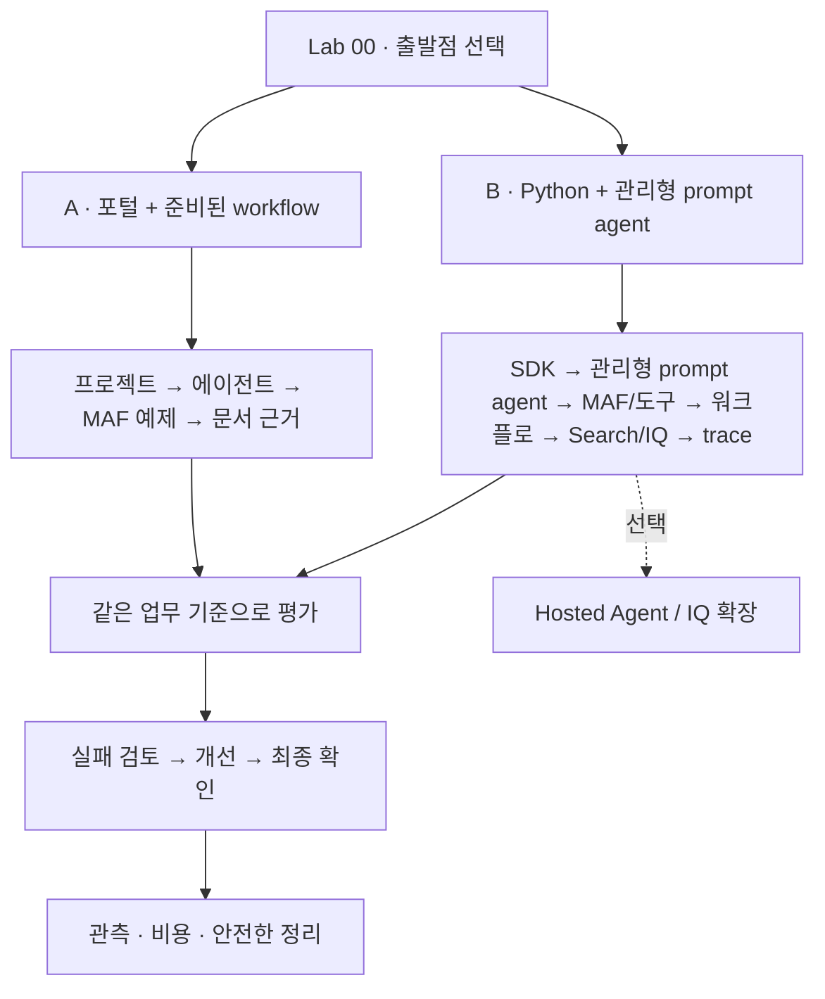

# Microsoft Foundry v2 실습

[English](../index.md) | **한국어**

**출장 규정 안내 도우미 하나를 만들고 다른 학습자가 검토할 수 있는 실행 근거를 남깁니다.**

1. Azure나 에이전트가 처음이라면 [A. 입문](paths/a-beginner.md)을 고릅니다.
   Python·API에 이미 익숙하다면 [B. 구현](paths/b-practitioner.md)을 고릅니다.
2. 고른 경로의 [준비](setup.md)를 마칩니다. A는 학습자 ZIP, B는 소스 저장소를 사용합니다.
3. 경로의 체크리스트를 따라 Lab 00부터 진행합니다. 다른 경로까지 이어서 실행하지 말고 **A 완료 / B 완료**로 나옵니다.

**첫 클릭 전에:** [A 시작 안내](paths/a-beginner.md#first-success)에서 실습 예제·필수 용어·작업 화면·첫 목표를 확인합니다.
본문의 순서대로 따라가면 되며 녹화 시청은 선행 조건이 아닙니다.

**Azure 권한이 없다면:** [오프라인 체험](labs/00-start.md#offline-rehearsal)까지만 합니다.
**혼자 학습한다면:** 먼저 [혼자 학습 준비](setup-owner.md#self-study)로 본인 환경을 준비합니다.
**이미 시작했다면:** 재설치하지 말고 [복구·재개](reference/troubleshooting.md#resume-safely)를 확인합니다.

이 Pre-Ignite 2026 Edition은 **합성 데이터만** 쓰며 영어·한국어 입력과 녹화를 구분합니다.
A의 준비 후 수업 계획은 4시간 30분이고, B는 [균등하게 나눈 4시간 세션 두 번](paths.md#b-session-budget), 총 8시간입니다.
이는 계획값이지 학습자 완료 시간의 실측값이 아닙니다. 어느 경로도 포털에서 workflow를 작성하지 않습니다. 심화 절과 녹화는 선택입니다.
A Lab 05는 준비된 터미널이 기본이며, 선택 브라우저 경로는 수업 전에 담당자가 Hosted Responses workflow를 검증해야 합니다.

A는 압축을 푼 학습자 ZIP을 개인 증거 폴더로 사용합니다.
B는 추가 ZIP 없이 [소스 복사본의 기록 폴더](labs/00-start.md#prepare-notes)를 사용합니다.
`session-notes.txt`, `workflow-review.txt`, `operations-checklist.txt`를 진행하면서 채웁니다.
[Lab 07 A](labs/07-evaluation.md#assessment-sheet)에서는 `assessment.csv`를 빈 채로 두고 **`assessment-baseline.csv`**라는 이름의 복사본을 작성합니다.
정답 레코드 대신 준비된 파일을 사용합니다. 인증정보나 작성한 양식을 `data/learner/`에 넣지 않습니다.

참고 문서 목록 — 필요한 항목만 펼쳐 보세요

[C — 고급 모듈](paths/c-advanced.md)은 기본 과정 뒤의 선택 확장입니다.
새 모듈의 실행 상태는 [기능·근거 기록](coverage.md)에 따로 표시합니다.

| 찾는 것 | 바로가기 |
|---|---|
| 계정·고정 모델·입력 파일·혼자 준비하는 경로 | [한 번만 하는 준비](setup.md) |
| 나에게 맞는 시작점과 시간표 | [학습 경로](paths.md) |
| Azure 호출 없이 SDK 코드를 이해하고 수정하기 | [코드 따라 만들기](code-along.md) |
| 공개 비교·품질 기준·한 번에 실행하는 로컬 검사 | [실습 품질 기준](reference/quality.md) |
| 처음 실행하는 방법 | [Lab 00](labs/00-start.md) |
| 수업 전에 준비할 환경 | [강사 가이드](instructor.md) |
| 2026-09-24 `gpt-6-sol` 국문 녹화 | [근거 hub](evidence.md)와 [영상: 통합본 6분 3초 · CLI 2분 57초 · 포털 2분 43초](video-summary.md) |
| 가이드 순서대로 한 영상에서 보기 | [Lab 챕터](video-chapters.md) |
| 특정 화면이나 액션 | [91개 액션·272개 캡처](action-captures.md) |
| 실제 결과와 한계 | [실행 기록](live-run.md) |
| 별도 영문 녹화 | [영문 영상](../video-summary.md) |
| Hosted matrix와 독립 게이트 | [평가 워크북](reference/evaluation-workbook.md) |
| IQ·Toolbox·Fabric·Work IQ의 선택 경계 | [IQ 확장 워크북](reference/iq-workbook.md) |
| 마지막에 확인할 결과물 | [캡스톤](labs/11-capstone.md) |
| 현재 지원 상태와 버전 | [호환성 기준](reference/versions.md) |
| 오류·권한·할당량 문제 | [문제 해결](reference/troubleshooting.md) |
| 비용을 남기지 않고 마치기 | [정리](reference/cleanup.md) |
| 영문·국문 범위와 샘플 번역 | [언어 계약](reference/languages.md) |

> **세 가지를 구분합니다.** `offline-fixture`는 고정 예제, 로컬 MAF는 내 PC에서
> 실행하지만 모델은 Azure에 호출하는 코드, Hosted Agent는 내 코드를 클라우드에서
> 실행하는 서비스입니다. 셋의 완료 조건은 같지 않습니다. 영문 실행은 별도로 고정한 영문 정책·지침·데이터를
> 명시적으로 선택하며 국문 원본은 바뀌지 않습니다.

현재/과거 문서를 모두 주는 이유는 최신 문서가 검색되었다는 사실만으로 **출장일에
맞는 규정을 적용했다**고 결론 내릴 수 없기 때문입니다. 모델, 검색, 업무 검사를
각각 관찰하는 것이 이 통합 실습의 핵심입니다.
