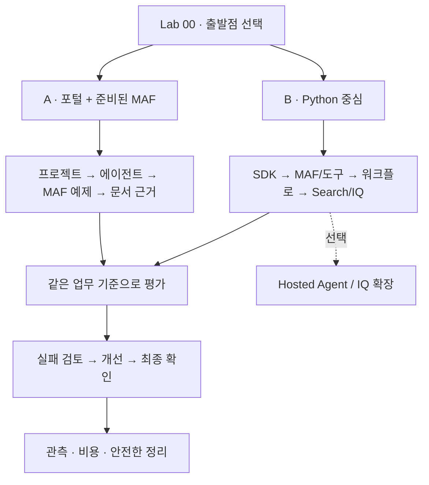

# Microsoft Foundry v2 실습

[English](../index.md) | **한국어**

**에이전트를 만드는 경험에서, 조직의 지식·평가·운영 기준을 남기는 경험으로.**

> **현재 한국어 개정:** `ko-integrated-20260915`.
> 새 Hosted workflow·평가 matrix 경로는 [통합 인수 기준](reference/consolidation.md)에 정리했습니다.
> 한국어 실제 실행/촬영 후 보완하고, 그다음 영어를 갱신합니다. 기존 영상은 새 기능의 검증 증거가 아닙니다.

이 자료는 2026-09-14 실제 실행을 확인한 Pre-Ignite 2026 Edition입니다.
완전초보자는 포털과 준비된 MAF 실행 환경에서, 경험자는 Python 코드에서
같은 **합성 출장 규정 상담 업무**를 해결합니다. 워크플로를 포털에서 작성하는 단계는 없습니다.

| 찾는 것 | 바로가기 |
|---|---|
| 나에게 맞는 시작점과 시간표 | [학습 경로](paths.md) |
| 고정 Hosted version의 다중 모델 평가 | [평가·학습 루프 워크북](reference/evaluation-workbook.md) |
| IQ·Toolbox·Fabric·Work IQ의 선택 경계 | [IQ 확장 워크북](reference/iq-workbook.md) |
| 처음 실행하는 방법 | [Lab 00](labs/00-start.md) |
| 수업 전에 준비할 환경 | [강사 가이드](instructor.md) |
| 새 영상으로 실제 조작 따라가기 | [대기 제거 편집본: 포털 9분 09초 · CLI 14분 02초](video-summary.md) |
| 2026-09-15 영문 가이드 새 촬영 | [통합본 13분 09초·CLI 5분 15초·포털 4분 45초](english-recordings.md) |
| 새 영문 촬영본의 액션별 화면 | [234개 액션·537개 캡처](english-captures.md) |
| 가이드 순서대로 한 영상에서 보기 | [CLI·포털 통합본 23분 35초와 챕터](video-chapters.md) |
| 단계별로 필요한 화면 찾기 | [236개 액션의 전·후 캡처](action-captures.md) |
| 실제 결과와 아직 확인하지 않은 것 | [실행·검증 기록](live-run.md) |
| 마지막에 확인할 결과물 | [캡스톤](labs/11-capstone.md) |
| 현재 지원 상태와 버전 | [호환성 기준](reference/versions.md) |
| 오류·권한·할당량 문제 | [문제 해결](reference/troubleshooting.md) |
| 비용을 남기지 않고 마치기 | [정리](reference/cleanup.md) |

> **세 가지를 구분합니다.** `offline-fixture`는 고정 예제, 로컬 MAF는 내 PC에서
> 실행하지만 모델은 Azure에 호출하는 코드, Hosted Agent는 내 코드를 클라우드에서
> 실행하는 서비스입니다. 셋의 완료 조건은 같지 않습니다.

현재/과거 문서를 모두 주는 이유는 최신 문서가 검색되었다는 사실만으로 **출장일에
맞는 규정을 적용했다**고 결론 내릴 수 없기 때문입니다. 모델, 검색, 업무 검사를
각각 관찰하는 것이 이 통합 실습의 핵심입니다.
