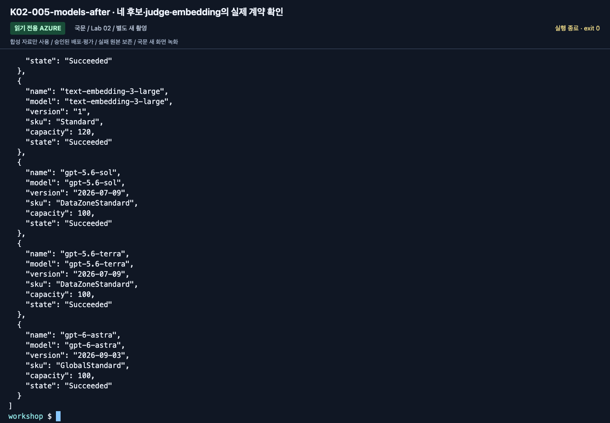
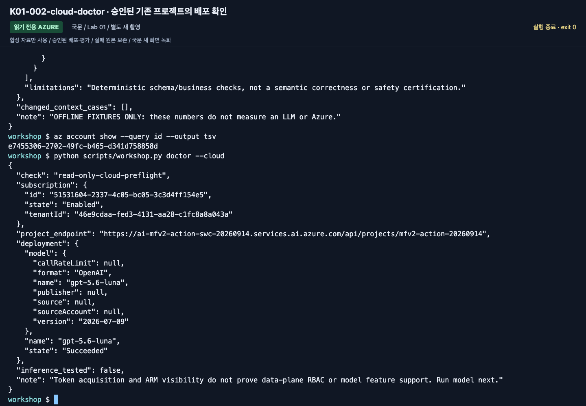

# 강사 가이드: 수업 전에 실패 지점을 없애기

[English](../instructor.md) | **한국어**

**수업 시간은 설치·구독 개설·기능 승인 시간이 아닙니다. 조별 환경을 먼저 확인하세요.**

상위: [학습 경로](paths.md) · 실제 확인 범위: [검증 기록](reference/validation.md)

## 1. 수업 범위 확정

| 수업 | 기본 준비 | 미리 빼도 되는 것 |
|---|---|---|
| A. 완전초보자 | 브라우저 계정, 프로젝트, 모델, 합성 문서, 평가표, 준비된 MAF 실행 환경 | Python 코드 작성, Hosted, 실제 M365/Fabric |
| B. 경험자 | 위 + Python/SDK, 읽기 권한, 코드 환경 | 유료 judge, Hosted 원격 배포는 별도 게이트 |
| IQ 심화 | 준비된 Search, 인증·semantic/knowledge retrieval 설정 | planner·임베딩·richer Preview는 기본 GA에 불필요 |
| Hosted 심화 | 3.13 런타임, 실제 ARM ID, 배포/identity 권한 | 로컬 Docker는 code deployment에 불필요 |

초보자의 core를 “모든 Preview 승인과 회사 M365 연결”에 의존시키지 않습니다.
각 조는 고유한 agent/검색 접두사를 사용하고, 공유 서비스의 생성/삭제는 강사만 담당합니다.
포털 workflow 작성 환경은 준비하지 않습니다. A의 Lab 05도 기존 MAF 예제를 실행하므로,
SDK·가상환경·학습자 계정의 모델 호출 권한을 미리 확인합니다.

영어·한국어는 ID·날짜·금액·정답 기준이 동등한 **별도 동결 언어 번들**입니다.
영어 명령은 `--language en`을 명시하며 서로를 자동 대체하지 않습니다.
학습자에게 정답 레코드나 JSON 조립 과제 대신 [준비 카드·완성된 ZIP](setup.md)을 전달합니다.
완성 지침·TXT 원문 6개·질문 전용 파일·빈 평가표가 있으며 [언어 계보](reference/languages.md)를 유지합니다.

## 2. 3–7일 전: 계정·권한·비용

1. 실습용 구독/Resource Group과 담당자를 정합니다. 운영 자원과 섞지 않습니다.
2. 현재 Foundry 프로젝트와 **`gpt-5.6-luna` / `2026-07-09`**, 배포 이름 **`gpt-5.6-luna`**를 확인합니다.
   Quota/SKU/리전을 점검하며 초보자에게 대체 모델을 추측하게 하지 않습니다.
3. 참가자에게 프로젝트의 `Foundry User` 등 필요한 역할을 부여합니다.
4. Search에는 데이터 읽기/작성 역할을 따로 준비합니다.
5. 원격 agent identity가 모델/도구에 접근할 때 필요한 역할을 별도로 준비합니다.
6. 관리자 아닌 **실제 참가자 계정**으로 첫 요청을 보내 봅니다.
7. 예산 알림과 로그 보존 기간을 정합니다. 예산 알림은 사용을 자동 차단하는 hard cap이 아닙니다.
8. 선택 기능의 승인, 지역 간 처리, 테넌트 정책을 확인합니다.

Foundry User와 Project Manager 등의 역할 이름이 이전 `Azure AI ...`로 보일 수 있습니다.
현재 [역할 표](https://learn.microsoft.com/azure/foundry/concepts/rbac-foundry)를 기준으로 확인합니다.



**화면 확인:** 실제 배포의 SKU/capacity이며 quota의 `used`/`limit`와는 다릅니다. 할당량과 지역 가용 용량은 수업 직전에 별도로 다시 조회합니다.
사진의 숫자나 Sweden Central 가용성을 다른 구독·날짜의 배포 가능 여부로 복사하지 않습니다.

### 조별로 전달할 값

`.env.example` 형식으로 **값만 별도 전달**합니다. 비밀번호/API key/token은 전달하지 않습니다.

- 구독·tenant, Resource Group, Foundry 리소스 이름.
- `/api/projects/...`까지 포함한 프로젝트 endpoint.
- 응답용 배포 `gpt-5.6-luna`와 확인한 실제 모델 버전 `2026-07-09`.
- 조별 `WORKSHOP_PREFIX`.
- 선택 Search endpoint·계정 OpenAI root·**`iq-chat setup`이 출력한 chat-base 이름**. GA base와 구분.
- 선택 judge 배포와 실제 underlying model.
- Hosted를 선택한 경우 실제 프로젝트 ARM ID와 고유 agent 이름.

Lab 05를 위해 저장소 위치와 학습자 본인으로 로그인·활성화한 MAF 터미널도 전달합니다.
혼자 학습하면 [Lab 00 B](labs/00-start.md#b-코드--한-폴더-한-환경)가 전체 준비 경로이며 강사의 숨은 조작을 전제로 하지 않습니다.

## 3. Search/IQ 준비

기본은 텍스트 index와 **GA `2026-04-01` minimal/extractive retrieval**입니다.
다음은 별개의 준비 항목입니다.

| 항목 | 확인 |
|---|---|
| 서비스 tier·리전 | 사용하려는 기능의 지원 범위 |
| 데이터 평면 인증 | Entra ID로 문서 조회/작성이 가능한가 |
| 참가자 역할 | Reader + Search Index Data Reader. 필요한 작성자에만 Search Service/Index Data Contributor |
| semantic ranker | GA semantic intent에 필요한 구성·별도 요금 |
| knowledge retrieval | 서비스 관리 평면의 사용/과금 동의; `free`/`standard` 조건 |
| source 인용 | `id`, `title`, `content`를 돌려주는가 |

스크립트가 billing 설정을 자동으로 `standard`로 바꾸지 않습니다.
과금 동의와 feature availability는 관리자가
[공식 migration/설정 안내](https://learn.microsoft.com/azure/search/agentic-retrieval-how-to-migrate)를
확인합니다. Chat completion model을 쓸 때는 **Search 서비스 identity**에 모델의 Foundry 계정 범위로
`Cognitive Services User`를 부여해야 합니다. Managed identity 선택은 정상 지원되며,
사용자나 Hosted agent의 역할을 대신 사용하는 것이 아닙니다.
선택 Preview 실습은 **Luna + Search system-assigned identity + `low` + `answerSynthesis`** preset으로 고정합니다.
[담당자 실행 순서](setup.md#4-환경-담당자의-준비)를 한 번 완료하고 출력된 정확한 chat-base 이름을 전달합니다.
모델 없는 GA base를 채팅 준비 완료로 전달하지 않습니다.
`iq-chat check`는 읽기 전용, `iq-chat setup --confirm-create`는 별도 본인 base 생성,
`iq-chat ask --label <new-label> --confirm-cost`는 실제 유료 계획·합성 확인입니다.
모델 배포나 역할 부여는 하지 않습니다. [상세 설정·복구](reference/iq-model-identity.md)를 확인하세요.
학습자 CLI에는 실습 Foundry 계정·Search의 Reader와 검색용 Search Index Data Reader도 확인합니다.
프로젝트 권한만으로 계정 ARM/역할 조회가 되는 것은 아니므로 Lab 06 중간에 이 선행 조건을 발견하지 않도록 합니다.

## 4. 하루 전: 같은 배포본으로 리허설

문서/코드 버전을 고정한 뒤 새 폴더에서 진행합니다.
Hosted 초기화는 상위 `azure.yaml`을 찾을 수 있으므로 기존 azd 프로젝트 바깥의 독립된 폴더를 사용합니다.
먼저 Lab 00 B의 `.env`·학습자 로그인을 완료하고 승인된 실습 값으로만 아래를 실행합니다.

```bash
python3.13 -m venv .venv
source .venv/bin/activate
python -m pip install -r requirements.lock.txt -e ".[cloud,agents,hosted,dev]"
python -m pip check
python scripts/check_sdk.py
python -m unittest discover -s tests -t . -v
python -m unittest discover -s tests_sdk -t . -v
python scripts/check_docs.py
python scripts/workshop.py doctor
python scripts/workshop.py doctor --cloud
python scripts/workshop.py model --question "이 응답은 합성 워크숍 연결 확인입니다. 한국어로 짧게 답하세요."
python scripts/workshop.py answer --prompt v2 --retrieval local
python scripts/workshop.py workflow --pattern sequential
```

여기서 실제 모델 호출이 실패하면 리허설은 통과가 아닙니다.
권한, quota, 모델의 tool/Structured Outputs 지원을 해결한 뒤 다시 확인합니다.



**화면 확인:** 이번 촬영은 기존 승인 환경을 재사용했습니다. 새 Resource Group을 만든 결과가 아닙니다.
한 리소스의 생성 성공만으로 전체 환경이 준비됐다고 판단하지 않습니다. 실제 참가자 계정의 첫 모델 호출은 별도 게이트입니다.

추가 모듈은 실제 선택한 것만 확인합니다.

```bash
python scripts/export_policy_docs.py
python scripts/workshop.py maf --tools
python scripts/workshop.py maf --mcp
python scripts/workshop.py workflow --pattern concurrent
python scripts/workshop.py workflow --pattern group-chat
python scripts/workshop.py seed-search --iq --confirm-create
python scripts/workshop.py retrieve --provider iq
```

완성 학습자 ZIP에는 동일한 TXT 원문이 이미 있습니다. Export는 선택적인 재생성이지 A의 숨은 필수 단계가 아닙니다.
첫 export와 seed는 소유권/이름 충돌을 확인합니다. 재실행 실패를 `--force`로 숨기지 않습니다.
공유 리소스 대신 조별 전용 접두사와 소유권 기록을 사용합니다.

### 실제 실행 기록

```bash
mkdir -p outputs/instructor
python -m pip freeze > outputs/instructor/environment.txt
```

모델 ID/버전/SKU, Python/SDK, 설치 일시, 지역, 실제 성공한 명령, 실패와 대응,
선택하지 않은 기능을 함께 적습니다. **업스트림 리포의 성공 기록을 이 에디션의 성공으로 복사하지 않습니다.**
`.env`, 토큰, 개인 식별자, 원문 trace를 공개 GitHub에 올리지 않습니다.

## 5. 비용과 호출량 계획

- Lab 07의 기본 target 수집은 dev 6 + dev 6 + holdout 4 = **16개 사례 요청**입니다.
- 도구 호출, SDK 재시도, reasoning, 추가 모델 비교에는 별도 사용량이 생깁니다.
- candidate 6건에 evaluator 2개면 **12개 평가 항목**입니다. 내부 LLM 호출 수/요금과 같다고 단정하지 않습니다.
- Search는 요청이 없을 때도 선택 SKU의 비용이 생길 수 있습니다.
- Hosted는 활성 **session별** 컴퓨트/스토리지 비용을 확인합니다.
- Application Insights/Log Analytics 수집량과 보존 기간도 비용입니다.

수업 기본 동시성은 1이며, Group Chat은 최대 3라운드입니다.
여러 조의 합산 quota를 계산합니다. 무조건 “몇백 원이면 된다”는 비용 약속을 하지 않습니다.

## 6. 수업 중 진행 기준

| 상황 | 강사 조치 |
|---|---|
| 한 조가 10분 이상 환경 오류 | 사전 확인한 조별 환경으로 이동, 계정/모델 변경을 명시적으로 기록 |
| 모델/region quota 없음 | 승인된 준비 환경 사용 또는 실제 실습 미실행으로 표시 |
| A의 MAF 실행 환경 미준비 | 준비된 학습자 환경으로 복구하거나 `MAF 관찰 / 직접 실행 미완료`로 기록; 포털 workflow 작성으로 대체하지 않음 |
| IQ Preview 승인 없음 | GA 경로 또는 설계 관찰. 서로 같은 결과로 표시하지 않음 |
| SDK 다운로드 불가 | 미리 준비한 환경/브라우저 경로. 인증서 검증 해제 금지 |
| baseline 전부 통과 | 그대로 기록; 실패를 조작하지 않고 평가 범위의 한계 토론 |
| Hosted 배포 실패 | 패키지/로컬 확인까지 분리 기록; 반복 배포로 비용을 키우지 않음 |

녹화나 강사 관찰은 좋은 보조자료지만 참가자의 직접 실행 증거는 아닙니다.
원본 영상 링크를 사용하더라도 화면/버전 차이를 먼저 설명합니다.

## 통합 심화 수업 준비

**2026-09-15 신규 코드/문서에 대한 준비이며, 기존 영상 재생을 새 인수로 간주하지 않습니다.**
[평가 워크북](reference/evaluation-workbook.md)은 별도 150–180분 세션으로 편성합니다.
Source repository의 숫자나 이전 v2 실행을 이 환경의 성공으로 복사하지 않습니다.

1. 네 모델 비교가 목표라면 해당 구독에서 실제 배포 네 개와 API 지원을 먼저 확인합니다.
   미승인 모델을 강제로 만들지 말고 명시적인 모델 목록과 실제 행 수를 조정합니다.
2. 프로젝트/계정 endpoint와 `account-chat` token audience를 구분합니다.
   모델 하나가 실패했다고 그 모델만 다른 endpoint로 보내면 동일 실험이 아닙니다.
3. `benchmark plan`으로 논리 호출량을 계산합니다. 64행의 순차 workflow는 논리 모델 호출 192회,
   native 2종이면 평가 항목 128개이며 retrieval/retry/내부 judge 호출은 추가입니다.
4. 학습자·Hosted instance의 모델/Search 권한, App Insights 조회자의 권한을 각각 준비합니다.
5. 실제 `azd ext list`의 Incompatible을 해결한 호환 조합으로 재확인합니다. [버전 게이트](reference/versions.md)를 따릅니다.
6. 하나의 agent name을 유지해 v1/v2를 배포하고 서로 다른 실제 version을 기록합니다.
   반복 init으로 새 `-2` agent를 만들지 않습니다.
7. native catalog는 baseline에서 고정해 다음 평가에 재사용합니다.
   calibration 예제는 target 응답 집계에 넣지 않습니다.
8. 회귀는 실제 dev의 기존 질문/정답과 연결하고, 다음 candidate가 그 기록을 소비하는지 확인합니다.
9. holdout은 후보를 고정한 마지막 단계에만 열고, 이미 공개된 교육용 세트라는 한계를 표시합니다.

강사는 다음을 서로 다른 체크박스로 남깁니다:
패키지 생성, local SDK 계약, 실제 local 모델 응답, 실제 remote version, 전체 matrix,
native 실행/품질, 실제 trace export, 사용자 검토, 세션/비용 정리.

### 촬영과 언어 갱신 순서

다음 미디어 갱신도 **한국어 우선** 순서를 따릅니다.
한국어 새 실습 실행·캡처/녹화 → 한국어 오류/설명 보완 → 영어 번역/보강 →
영어 캡처/녹화 → 최종 문서/명령 검사를 순서대로 수행합니다.
현재 두 언어의 자료·촬영본이 있으며 영문 유예 목록은 비어 있습니다.
향후 유예가 생기면 파일·해시를 `docs/localization.json`에 기록하고 영어 페이지에 경고를 유지합니다.
이전 미디어는 두 새 언어 세트가 모두 검증된 뒤에만 교체/삭제합니다.
원본 평가·실패·데이터 계보와 최종 자료의 재현에 필요한 실행 코드는 유지합니다.

## 7. 수업 종료 / Ignite 전 최종 동결

- 참가자 결과와 fixture가 구분되어 있는지 확인.
- session 목록의 다음 페이지까지 확인하고 본인 활성 session 중지.
- Responses 재검증은 `--new-session --new-conversation`을 함께 사용해 이전 대화가 섞이지 않는지 확인.
- 조별 에이전트·Search 객체·별도 연결과 공유 자원을 구분해 정리.
- 강사가 전용 서비스·모델·로그·capacity의 잔여 과금을 확인.
- [버전 기준](reference/versions.md)의 점검일과 [검증 기록](reference/validation.md)을 실제로 갱신.
- 문서/API 이름이 바뀌었다면 한 모듈만 수정하지 말고 CLI·코드·검사·환경표도 같이 갱신.
- 확인하지 않은 Ignite 2026 발표 내용이나 미래 지원 일정을 추가하지 않음.
