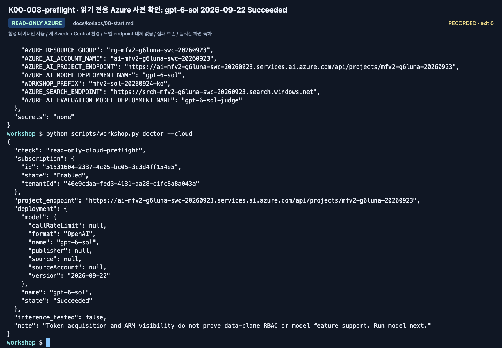

# 강사 가이드: 수업 전에 실패 지점을 없애기

[English](../instructor.md) | **한국어**

**수업 시간은 설치·구독 개설·기능 승인 시간이 아닙니다. 조별 환경을 먼저 확인하세요.**

**강사 진행 순서:** 1–3절 준비 → [리허설](#rehearse-route) → [A](paths/a-beginner.md) 또는 [B](paths/b-practitioner.md) 진행 → [인계](#class-handoff).
실제 확인 범위: [검증 기록](reference/validation.md).

## 1. 수업 범위 확정

| 수업 | 기본 준비 | 미리 빼도 되는 것 |
|---|---|---|
| A. 입문 | 270분(4시간 30분): 브라우저 계정, 프로젝트, 모델, 합성 문서, 평가표, 준비된 MAF 실행 환경 또는 hosted workflow agent | Python 코드 작성, 실제 M365/Fabric |
| B. 구현 | 480분(4시간 세션 2회): Python/SDK·코드 환경·모델 접근·Lab 03 B 관리형 agent·Search 서비스·Lab 06의 범위 제한 읽기/쓰기 권한·Lab 09 trace 접근 | 유료 judge와 로컬/원격 Hosted 실행은 별도 게이트 |
| IQ 심화 | 준비된 Search, 인증·semantic/knowledge retrieval 설정 | planner·임베딩·richer Preview는 기본 GA에 불필요 |
| Hosted 심화 | 3.13 런타임, 실제 ARM ID, 배포/identity 권한 | 로컬 Docker는 code deployment에 불필요 |

이 시간은 수업 계획값이며 학습자 완료 시간의 실측값이 아닙니다. B의 [세션별 시간표](paths.md#b-session-budget)는 Lab 06을 첫째 날에 배치해
두 세션 모두 핵심 실습 195분과 휴식·진행 버퍼 45분으로 구성합니다.
A Lab 05는 터미널을 기본으로 준비하고, 선택 Hosted Responses 브라우저 방식은 참가자 계정으로 검증한 뒤에만 제공합니다.

초보자의 core를 “모든 Preview 승인과 회사 M365 연결”에 의존시키지 않습니다.
각 조는 고유한 agent/검색 접두사를 사용하고, 공유 서비스의 생성/삭제는 강사만 담당합니다.
포털 workflow 작성 환경은 준비하지 않습니다. A의 Lab 05도 기존 MAF 예제 또는 Playground의 담당자 준비 hosted workflow agent를 실행하므로,
SDK·가상환경·학습자 계정의 모델 호출 권한을 미리 확인합니다.

영어·한국어는 ID·날짜·금액·정답 기준이 동등한 **별도 동결 언어 번들**입니다.
영어 명령은 `--language en`을 명시하며 서로를 자동 대체하지 않습니다.
학습자에게 [준비 카드](setup.md)를 전달합니다. A는 학습자 ZIP, B는 소스 복사본을 사용하며
정답 레코드나 JSON 조립 과제를 주지 않습니다.
완성 지침·TXT 원문 6개·질문 전용 파일·빈 평가/검토/운영 양식이 있습니다.
B는 [Lab 00 B](labs/00-start.md#prepare-notes)에서 소스 복사본의 기록 양식을 준비하므로 브라우저 ZIP을 추가로 받을 필요가 없습니다.
[언어 계보](reference/languages.md)는 유지합니다.

## 2. 3–7일 전: 계정·권한·비용

1. 실습용 구독/Resource Group과 담당자를 정합니다. 운영 자원과 섞지 않습니다.
2. 현재 Foundry 프로젝트와 **`gpt-6-sol` / `2026-09-22`**, 배포 이름 **`gpt-6-sol`**을 확인합니다.
   Quota/SKU/리전을 점검하며 초보자에게 대체 모델을 추측하게 하지 않습니다.
   수업 전에 [모델 선택](reference/model-choice.md)과 공개 가격을 다시 확인합니다.
3. B와 A의 준비 터미널은 [담당자 체크리스트](setup-owner.md#class-owner-checklist)에 따라 `Foundry User` 등 프로젝트/모델 역할과
   **Foundry 계정의 Reader**를 확인합니다. 학습자 계정으로 `doctor --cloud`를 검사합니다. 역할 변경은 담당자의 별도 승인이 필요합니다.
4. 실제 서버 측 trace를 확인하려면 Application Insights를 프로젝트에 연결하고 학습자에게 **Log Analytics Reader**를 부여합니다.
   보호된 테이블을 사용한다면 **Privileged Monitoring Data Reader**도 부여합니다. Lab 09에는 추적 상태를 기록해야 합니다.
   이 조건이 준비되지 않았다면 `추적 미확인: <이유>`를 적고 진행하며, 실제 trace를 확인한 것으로 표시하지 않습니다.
   2026-09-24 확인에서는 관리형 agent 호출이 연결된 Application Insights에 몇 분 안에 나타났고, 모델을 직접 호출한 요청은 나타나지 않았습니다.
5. **B 또는 선택한 IQ 모듈에만** Search 데이터 읽기·작성 역할을 준비합니다. 기본 A에는 필요 없습니다.
6. **원격 호스팅을 선택한 경우에만** 런타임 ID의 모델·도구 역할을 준비합니다. 패키징만 하는 B에는 필요 없습니다.
7. A 선택 사항: 학습자 언어로 Lab 05의 **순차·local 검색·v2·Responses** Hosted workflow를 준비합니다.
   참가자 계정으로 Playground 응답을 확인한 뒤 이름·버전·위치를 전달합니다. Lab 03 Prompt Agent가 아닙니다.
   2026-09-24에 local Responses 경로는 확인했지만 원격 Playground 실행은 하지 않았습니다.
8. 관리자 아닌 **실제 참가자 계정**으로 첫 요청을 보내 봅니다.
9. 예산 알림과 로그 보존 기간을 정합니다. 예산 알림은 사용을 자동 차단하는 hard cap이 아닙니다.
10. 선택 기능의 승인, 지역 간 처리, 테넌트 정책을 확인합니다.

Foundry User와 Project Manager 등의 역할 이름이 이전 `Azure AI ...`로 보일 수 있습니다.
현재 [역할 표](https://learn.microsoft.com/azure/foundry/concepts/rbac-foundry)를 기준으로 확인합니다.


**화면 확인:** 2026-09-24 배포 목록의 배포 유형(SKU)이며 quota의 `used`/`limit`와는 다릅니다. 할당량과 지역 가용 용량은 수업 직전에 별도로 다시 조회합니다.
사진의 숫자나 Sweden Central 가용성을 다른 구독·날짜의 배포 가능 여부로 복사하지 않습니다.

### 조별로 전달할 값

`.env.example` 형식으로 **값만 별도 전달**합니다. 비밀번호/API key/token은 전달하지 않습니다.

- 구독·tenant, Resource Group, Foundry 리소스 이름.
- `/api/projects/...`까지 포함한 프로젝트 endpoint.
- 응답용 배포 `gpt-6-sol`과 확인한 실제 모델 버전 `2026-09-22`.
- 조별 `WORKSHOP_PREFIX`: `mfv2-` 뒤에 소문자 영문·숫자·하이픈 하나씩 사용하며 전체 최대 32자.
- **B 필수:** Search endpoint·작성 권한·승인된 미사용 learner prefix 또는 그에 대응하는 준비 작업 폴더.
- **선택 IQ Chat만:** 계정 OpenAI root·**`iq-chat setup`이 출력한 chat-base 이름**. GA base와 구분.
- 선택 judge 배포와 실제 underlying model.
- Hosted를 선택한 경우 실제 프로젝트 ARM ID·location 코드·고유 agent 이름·빈 독립 폴더.

Lab 05용으로 준비한 방식도 전달합니다. 저장소 위치와 학습자 본인으로 로그인·활성화한 MAF 터미널, 또는 준비된 Hosted workflow agent 정보입니다.
혼자 학습하면 [혼자 학습 준비](setup-owner.md#self-study)가 위의 전달 값을 대신합니다. [Lab 00 B](labs/00-start.md#b-코드--한-폴더-한-환경)는 계속 전체 터미널 준비 경로이며 강사의 숨은 조작을 전제로 하지 않습니다.

## 3. Search/IQ 준비

**기본 A는 이 절을 건너뜁니다. B는 서비스·학습자 권한을 준비하고 Lab 06에서 본인 객체를 만듭니다.**
모델 기반 IQ Chat은 추가 선택이며 B의 GA 준비에 포함되지 않습니다.

기본은 텍스트 index와 **GA `2026-04-01` minimal/extractive retrieval**입니다.
다음은 별개의 준비 항목입니다.

| 항목 | 확인 |
|---|---|
| 서비스 tier·리전 | 사용하려는 기능의 지원 범위 |
| 데이터 평면 인증 | Entra ID로 문서 조회/작성이 가능한가 |
| 참가자 역할 | seed하는 모든 B 학습자는 **Search Service Contributor** + **Search Index Data Contributor**. 읽기 전용 조회·검색은 **Reader** + **Search Index Data Reader** |
| semantic ranker | GA semantic intent에 필요한 구성·별도 요금 |
| knowledge retrieval | 서비스 관리 평면의 사용/과금 동의; `free`/`standard` 조건 |
| source 인용 | `id`, `title`, `content`를 돌려주는가 |

스크립트가 billing 설정을 자동으로 `standard`로 바꾸지 않습니다.
과금 동의와 feature availability는 관리자가
[공식 migration/설정 안내](https://learn.microsoft.com/azure/search/agentic-retrieval-how-to-migrate)를
확인합니다. Chat completion model을 쓸 때는 **Search 서비스 identity**에 모델의 Foundry 계정 범위로
`Cognitive Services User`를 부여해야 합니다. Managed identity 선택은 정상 지원되며,
사용자나 Hosted agent의 역할을 대신 사용하는 것이 아닙니다.
선택 Preview 실습은 **`gpt-5.6-luna` + Search system-assigned identity + `low` + `answerSynthesis`** preset으로 고정합니다.
2026-09-23 Search가 KB 연결에서 GPT-6 모델을 받지 않았으므로 이 별도 배포를 준비합니다.
[담당자 실행 순서](setup-owner.md)를 한 번 완료하고 출력된 정확한 chat-base 이름을 전달합니다.
모델 없는 GA base를 채팅 준비 완료로 전달하지 않습니다.
`iq-chat check`는 읽기 전용, `iq-chat setup --confirm-create`는 별도 본인 base 생성,
`iq-chat ask --label <new-label> --confirm-cost`는 실제 유료 계획·합성 확인입니다.
모델 배포나 역할 부여는 하지 않습니다. [상세 설정·복구](reference/iq-model-identity.md)를 확인하세요.
Search CLI 검사를 위해 Search 서비스의 **Reader**와 검색용 **Search Index Data Reader**를 확인합니다.
2절에서 확인한 Foundry 계정 권한과는 별개입니다.

**소유권 인계:** 새 B 학습자 복사본에는 Search 서비스/권한과 아직 seed하지 않은 고유 prefix를 제공합니다.
먼저 객체를 seed했다면 해당 ledger가 있는 승인된 준비 작업 폴더를 사용합니다.
Seed한 prefix만 주거나 다른 조의 ledger를 배포하지 않습니다.
영어/한국어 선택만으로 Search 이름이 바뀌지 않습니다. 언어/prefix 변경 시에는
[새 복사본 규칙](reference/configuration.md#workspace-scope)을 따르고 원래 정리 기록을 보존합니다.

## 4. 하루 전: 같은 배포본으로 리허설

문서/코드 버전을 고정한 뒤 새 폴더에서 진행합니다.
Hosted 초기화는 상위 `azure.yaml`을 찾을 수 있으므로 기존 azd 프로젝트 바깥의 독립된 폴더를 사용합니다.
먼저 Lab 00 B의 `.env`·가상환경·학습자 로그인을 완료합니다.
준비한 가상환경을 다시 만들지 않고 사용하며 승인된 실습 값으로 블록 하나씩 실행합니다.

```bash
source .venv/bin/activate &&
python -m pip install -e ".[cloud,agents,dev]" &&
python -m pip check &&
python scripts/verify_workshop.py --label instructor-check &&
python scripts/workshop.py doctor
```

검사기가 실패를 포함한 로컬 검사 전체를 `outputs/verification/instructor-check/report.json`에 기록합니다.
다음 리허설에는 새 label을 사용하며 기존 보고서 폴더를 덮어쓰지 않습니다.
검사기가 실패하면 `doctor` 전에 실행이 멈춥니다. 실패를 해결한 뒤 계속합니다. 이 블록은 Azure를 호출하지 않습니다.
기본 A/B에 Hosted SDK는 필요 없습니다. 전체 SDK 검사는 아래 선택 절에 있습니다.
[품질 기준](reference/quality.md#verify-this-copy)에서 보고서의 소스 해시와 명시적으로 미확인 상태인 항목을 확인합니다.

로컬 검사가 모두 통과한 뒤 읽기 전용 cloud 사전 확인을 실행합니다.

```bash
python scripts/workshop.py doctor --cloud
```

사전 확인과 추론 비용 승인 후 명령별 결과를 확인하며 다음 요청을 실행합니다.

```bash
python scripts/workshop.py model --question "이 응답은 합성 워크숍 연결 확인입니다. 한국어로 짧게 답하세요."
```

실제 `text`·배포/모델·response ID를 확인한 뒤 구조화 출력을 검증합니다.

```bash
python scripts/workshop.py answer --prompt v2 --retrieval local
```

답변 필드·원문 ID·실제 응답 정보를 확인한 뒤 준비된 MAF workflow를 실행합니다.

```bash
python scripts/workshop.py workflow --pattern sequential
```

여기서 실제 모델 호출이 실패하면 리허설은 통과가 아닙니다.
권한, quota, 모델의 tool/Structured Outputs 지원을 해결한 뒤 다시 확인합니다.



**화면 확인:** 2026-09-24 녹화는 녹화 전에 준비한 실습 환경을 사용했으며 리소스를 생성한 결과가 아닙니다.
한 리소스의 생성 성공만으로 전체 환경이 준비됐다고 판단하지 않습니다. 실제 참가자 계정의 첫 모델 호출은 별도 게이트입니다.

<a id="rehearse-route"></a>

### 가르칠 경로 그대로 리허설하기

**위 세 요청은 연결 확인이지 과정 완료가 아닙니다.** 고른 경로의 완전한 명령과 저장 지점을 따릅니다.

| 수업 | 필수 리허설 | 필요하지 않은 것 |
|---|---|---|
| [A. 입문](paths/a-beginner.md) | 포털 agent·학습자 파일·본인의 순차 MAF 실행 또는 준비된 hosted workflow Playground 옵션·6문항 수동 평가·원문 확인·Lab 09 trace 확인·인계 | Search 서비스·cloud judge |
| [B. 구현](paths/b-practitioner.md) | 관리형 agent·함수/MCP 호출·workflow 세 패턴·Search와 GA IQ·조건을 충족한 평가·trace 확인·패키지·인계를 포함한 기본 B 전체 | 로컬/원격 Hosted 실행·cloud judge·C 모듈 |
| [선택한 C 모듈](paths/c-advanced.md) | 그 모듈의 준비 조건·호출·근거만 | 나머지 C 모듈 전체 |

참가자 계정·승인된 비용·고유 prefix를 사용합니다. 새 B 복사본은 Lab 06에서 본인 객체를 만들고 ledger를 보존합니다.
학습자 ZIP에는 정책 원문 6개가 이미 있습니다. Export는 선택 재생성이며 A의 추가 필수 단계가 아닙니다.

<details>
<summary>선택 전체 SDK 리허설 — Hosted/Toolbox 모듈을 선택했거나 SDK를 유지보수할 때만</summary>

같은 전용 가상환경에 전체 lock을 설치하고 stub 전송으로 SDK 검사를 실행합니다.
Azure 요청을 보내지 않으며 배포를 검증하는 것도 아닙니다.

```bash
python -m pip install -r requirements.lock.txt -e ".[cloud,agents,hosted,dev]" &&
python -m pip check &&
python scripts/check_sdk.py &&
python -m unittest discover -s tests_sdk -t . -v
```

</details>

### 실제 실행 기록

리허설마다 새 폴더를 사용합니다. 재실행은 이전 환경 기록을 덮어쓰지 않고 멈춥니다.

```bash
mkdir -p outputs &&
mkdir outputs/instructor &&
python -m pip freeze > outputs/instructor/environment.txt
```

모델 ID/버전/SKU, Python/SDK, 설치 일시, 지역, 실제 성공한 명령, 실패와 대응,
선택하지 않은 기능을 함께 적습니다. **업스트림 리포의 성공 기록을 이 에디션의 성공으로 복사하지 않습니다.**
`.env`, 토큰, 개인 식별자, 원문 trace는 어디에도 게시하지 않습니다.

## 5. 비용과 호출량 계획

- A의 기본 브라우저 요청은 Lab 02의 2건 + Lab 03의 4건 + Lab 07 baseline의 6건 = **12건**이며 Lab 05 MAF 호출은 별도로 더합니다. 정당한 candidate 실행은 6건을 추가하며 A는 holdout을 사용하지 않습니다.
- B Lab 07의 기본 target 수집은 dev 6 + dev 6 + holdout 4 = **16개 사례 요청**이며 다른 랩의 요청은 별도입니다.
- 도구 호출, SDK 재시도, reasoning, 추가 모델 비교에는 별도 사용량이 생깁니다.
- candidate 6건에 evaluator 2개면 **12개 평가 항목**입니다. 내부 LLM 호출 수/요금과 같다고 단정하지 않습니다.
- Search는 요청이 없을 때도 선택 SKU의 비용이 생길 수 있습니다.
- Hosted는 활성 **session별** 컴퓨트/스토리지 비용을 확인합니다.
- Application Insights/Log Analytics 수집량과 보존 기간도 비용입니다.

수업 기본 동시성은 1이며, Group Chat은 최대 3라운드입니다.
여러 조의 합산 quota를 계산합니다. 무조건 “몇백 원이면 된다”는 비용 약속을 하지 않습니다.

## 6. 수업 중 진행 기준

| 상황 | 강사 조치 |
|---|---|
| 한 조가 10분 이상 환경 오류 | 실패한 시도를 보존하고 담당자가 원래 환경을 복구하거나 세션을 미완료로 기록. 별도 승인된 새 회차는 본인 설정 카드·폴더·label을 따로 사용 |
| 모델/region quota 없음 | 멈추고 담당자에게 정확한 preset의 용량 복구 요청. 불가하면 실제 실습 미실행으로 기록하며 오류 뒤 다른 모델로 대체하지 않음 |
| A의 MAF 실행 환경 미준비 | 준비된 학습자 환경으로 복구하거나 `MAF 관찰 / 직접 실행 미완료`로 기록; 포털 workflow 작성으로 대체하지 않음 |
| IQ Preview 승인 없음 | 선택한 Preview 모듈은 차단 상태로 기록. 별도의 GA 수업이나 설계 기록은 해당 모듈의 완료가 아님 |
| SDK 다운로드 불가 | 고정 SDK 또는 같은 경로의 준비 환경을 복구하고, 불가하면 미완료로 기록. 인증서 검증 해제 금지 |
| baseline 전부 통과 | 그대로 기록; 실패를 조작하지 않고 평가 범위의 한계 토론 |
| Hosted 배포 실패 | 패키지/로컬 확인까지 분리 기록; 반복 배포로 비용을 키우지 않음 |

녹화나 강사 관찰은 좋은 보조자료지만 참가자의 직접 실행 증거는 아닙니다.
원본 영상 링크를 사용하더라도 화면/버전 차이를 먼저 설명합니다.

## 미디어 분리 계획

큰 MP4/WebP asset은 이 저장소와 Git 이력에 들어 있으며 현재 pack은 약 977 MiB입니다. Release asset, Pages, LFS로 옮기거나 이력을 다시 쓰려면 별도 승인과 조율된 migration이 필요합니다. 이번 판에서는 학습자가 브라우저 자료에 **Download ZIP**을 사용하거나, [담당자 준비](setup-owner.md)의 sparse-checkout 방식으로 `docs/assets/`와 video를 피할 수 있습니다.

## 고급 Hosted workflow·평가 준비

<details>
<summary>선택 — 고급 Hosted workflow·평가를 수업 범위로 정한 경우에만</summary>

기본 리허설 뒤 [평가 워크북](reference/evaluation-workbook.md)을 사용합니다.
나열한 모든 배포의 실제 API 지원, 별도 judge, 의도한 런타임 ID,
전용 국문 정책 index·source·base, App Insights 조회 권한을 준비합니다.
국문 corpus·지침·dev/calibration/holdout은 기본값으로 선택되는 별도 고정 자산입니다.
영문 실행 결과를 재사용하거나 그 영상의 이름만 바꿔 쓰지 않습니다.

로컬 사용자와 Hosted ID는 서로 다릅니다. account 추론 권한과 Search 역할을 따로 확인합니다.
준비 상태나 패키지 생성 성공만이 아니라 실제 로컬·원격 응답을 확인합니다.
네 모델이면 target 24/24/16행과 workflow 내부·검색·retry·judge 호출을 예산에 넣습니다.
모든 실패와 native 발견 사항을 보존하며, 전 문항 통과 baseline에 회귀를 지어낼 필요는 없습니다.
holdout은 지침 개발에 쓰지 않습니다.

독립적인 Hosted Responses 확인에는 [Lab 08의 완전한 호출 블록](labs/08-hosted.md#hosting-gates)에서
`--new-session --new-conversation`을 함께 사용합니다.

</details>

### 원본 언어와 미디어 순서

과거의 국문 우선·영문 우선 체크리스트가 아니라 사용자의 현재 제작 순서와
[`docs/localization.json`](../localization.json)의 활성 `source_language`를 따릅니다.
원본 언어의 가이드를 먼저 고치고 검사한 뒤 대응 번역을 갱신합니다.
번역을 미룬다면 눈에 보이는 경고와 원본·대상의 정확한 hash가 필요합니다.
새 녹화는 별도 승인된 실제 실행과 언어별 독립 근거가 필요합니다.
가이드만 고치는 작업은 새 녹화를 요구하지도, 새 녹화를 주장하지도 않습니다.

<a id="class-handoff"></a>

## 7. 수업 종료 / Ignite 전 최종 동결

1. [Lab 11 A](labs/11-capstone.md#path-a), [Lab 11 B](labs/11-capstone.md#path-b) 또는 선택한 [C 모듈 인계](labs/11-capstone.md#path-c)에서 이미 저장한 파일을 검토합니다.
   참가자 결과와 fixture를 구분하고 실패·미완료 결과도 보존합니다. 인계의 빈칸을 채우려고 새 Azure 요청을 보내지 않습니다.
2. A/B의 `operations-checklist.txt`에서 본인/공유 자산, trace 근거 또는 미확인 이유, 정리 담당자, 잔여 비용을 확인합니다.
3. 실제 사용한 자산만 [정리](reference/cleanup.md)를 따릅니다. Hosted를 실행한 경우에만 session 목록의 다음 페이지까지 확인하고 본인 활성 session을 중지합니다. 패키징만 했다면 session은 생성되지 않았습니다.
   공유 자원은 권한이 있는 담당자에게 맡깁니다.
4. 담당자가 서비스·모델·로그·capacity의 잔여 과금을 확인합니다.

**수업 후 배포본 유지보수 담당자만:**

- [버전 기준](reference/versions.md)의 점검일과 [검증 기록](reference/validation.md)을 실제로 갱신.
- 문서/API 이름이 바뀌었다면 한 모듈만 수정하지 말고 CLI·코드·검사·환경표도 같이 갱신.
- 확인하지 않은 Ignite 2026 발표 내용이나 미래 지원 일정을 추가하지 않음.
