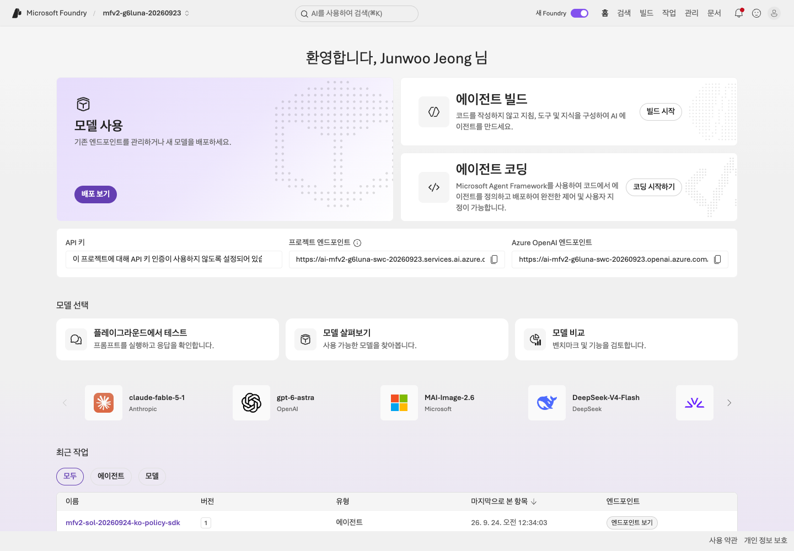
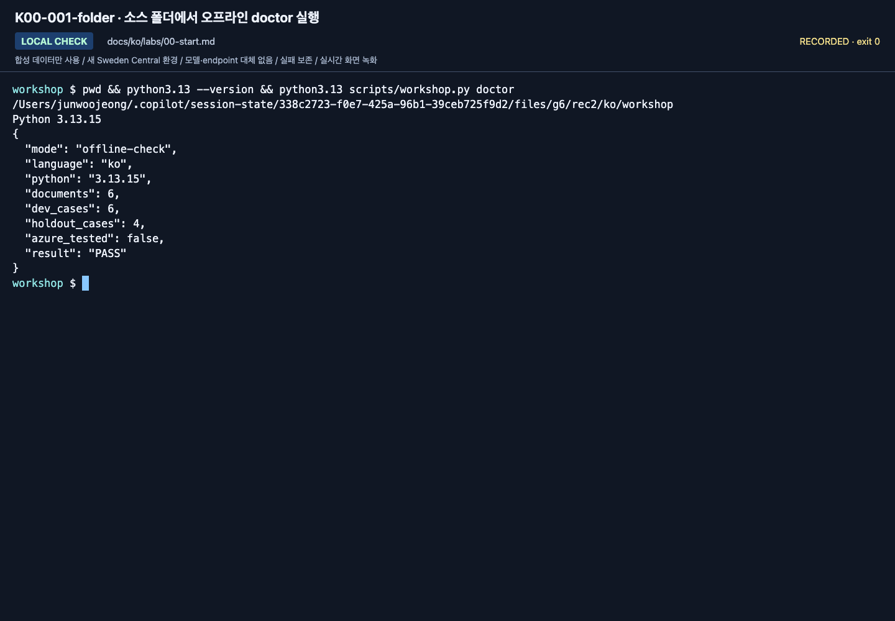
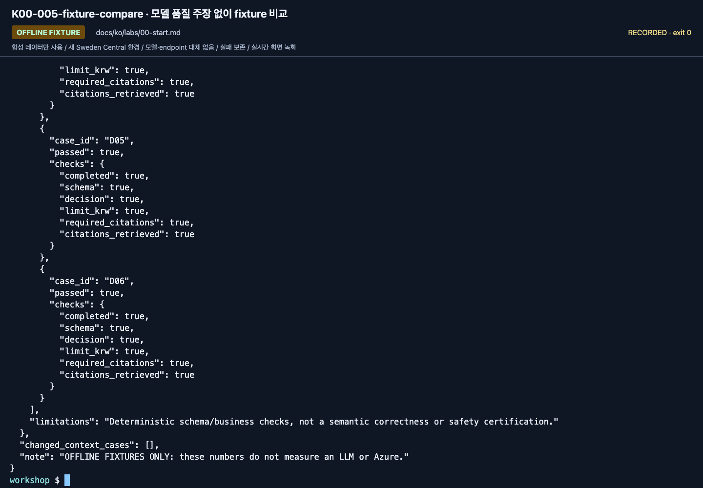
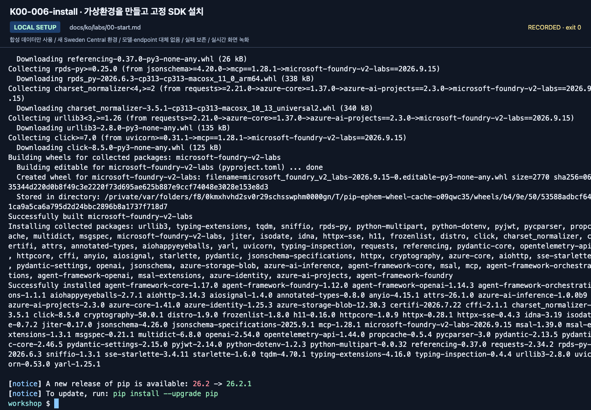
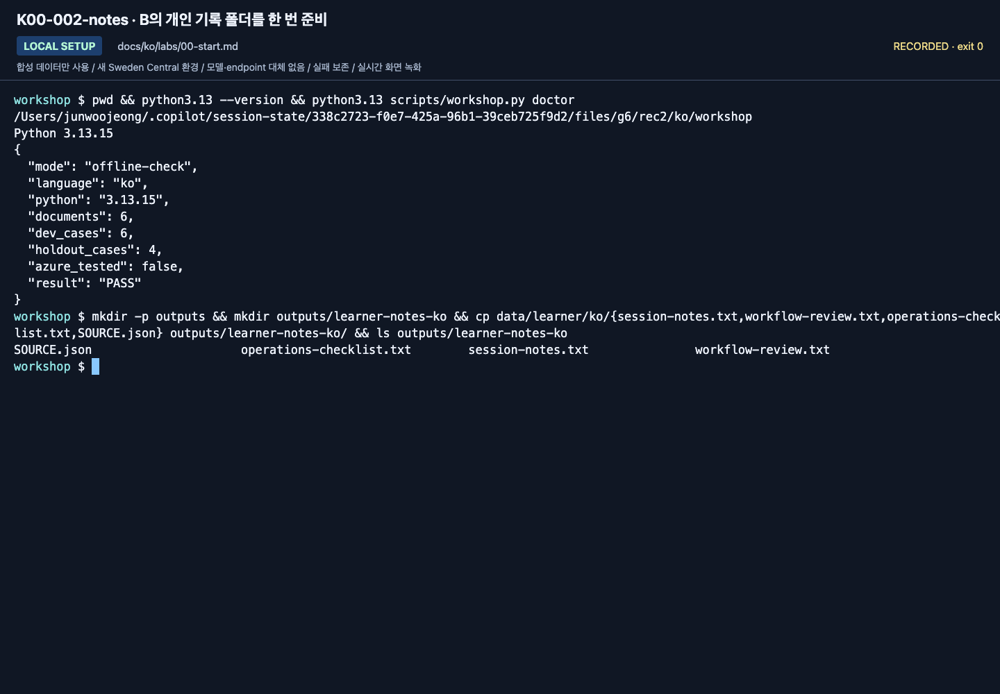
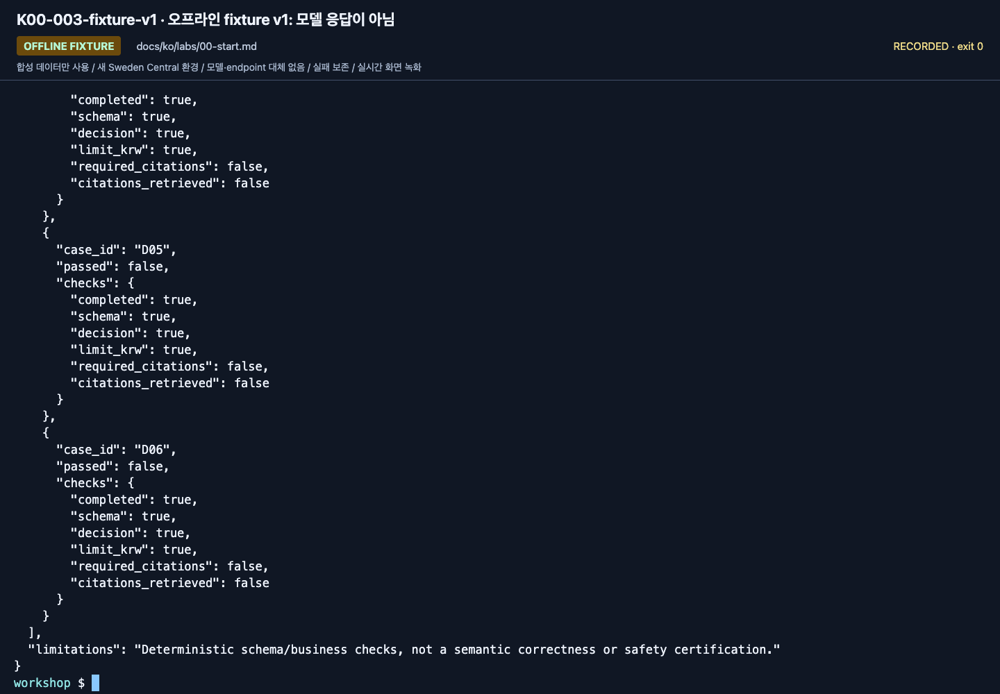
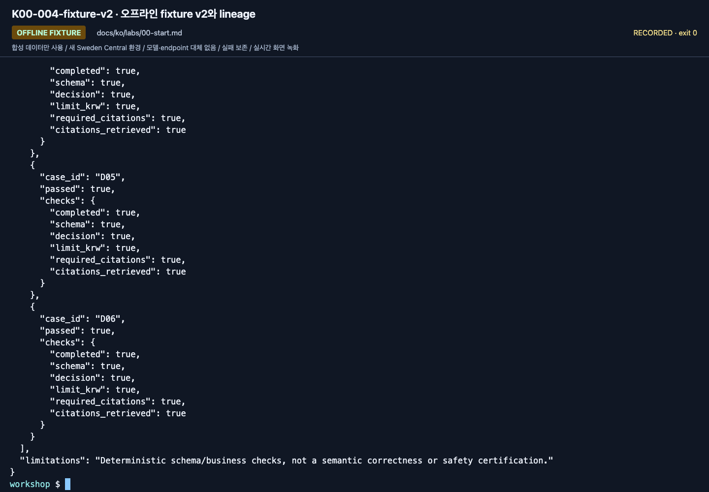
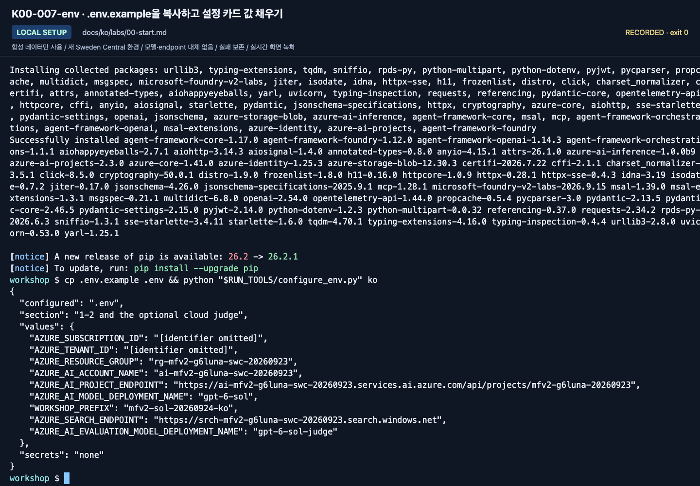

# Lab 00. 시작과 공통 환경

[English](../../labs/00-start.md) | **한국어**

**완료 목표:** 내가 사용할 계정·프로젝트·경로를 알고, 다음 실습의 출발점을 확인합니다.

**내 구간 바로 열기:** [A — 브라우저](#path-a) · [B — 코드](#path-b) · [오프라인만](#offline-rehearsal) · [학습 경로](../paths.md)

## 시작 전

**이번 순서:** 준비 카드를 읽습니다. A는 브라우저와 학습자 ZIP, B는 소스 저장소와 포함된 기록 양식을 사용합니다.

**준비물:** 본인 계정·준비된 프로젝트와 모델. B는 Python 3.13·터미널도 필요합니다.

**다음으로 갈 기준:** A: 정확한 프로젝트와 값 기록. B: offline 검사와 cloud 사전 검사의 의미 확인.

**막히면:** 멈추고 담당자에게 tenant, 프로젝트 이름, 프로젝트의 **Foundry User** 역할, `gpt-6-sol` 접근 권한을 확인해 달라고 요청합니다. 다른 리소스를 고르지 않습니다.

[한 번만 하는 준비와 학습자 파일](../setup.md).

## 이 가이드의 화면 읽는 법

<details>
<summary>선택 화면 도움말 — 녹화가 아니라 현재 본문의 명령을 실행합니다</summary>

각 단계의 이미지는 **2026-09-24에 `gpt-6-sol`로 별도 실행한 국문 녹화 화면**입니다.
설정 카드와 준비된 학습자 파일을 사용해 별도 실습 프로젝트에서 촬영했으며 영문 촬영본을 재사용하지 않았습니다.
실습 프로젝트 생성은 녹화 전에 따로 준비했으므로 리소스 생성 명령을 녹화한 것처럼 표시하지 않습니다.
[녹화 영상과 범위](../video-summary.md)에서 실제 호출·fixture·관찰·녹화하지 않은 범위를 구분합니다. 클릭하면 크게 볼 수 있습니다.
화면의 계정·프로젝트·모델·접두사를 그대로 복사하지 말고 강사가 제공한 본인 값과 대조하세요.
터미널 이미지는 **마지막으로 입력한 명령(`workshop $` 뒤에 내용이 있는 줄)과 그 아래 결과**를 읽습니다.
위쪽에는 앞 명령의 출력이 남아 있을 수 있고, 맨 아래의 빈 프롬프트는 명령이 끝났다는 표시입니다.
`OFFLINE FIXTURE`와 `LIVE AZURE`를 구분합니다. `.env` 단계의 `RUN_TOOLS/configure_env.py`는 설정 카드 값을 써 넣은
촬영 보조 도구이므로 이미지에서 복사하지 않고 `.env`를 직접 편집합니다. **실행할 명령은 본문의 코드 블록**입니다.
더 많은 전·후 화면은 [액션 인덱스](../action-captures.md)에 있습니다.

국문 명령은 별도로 고정된 국문 정책·지침·dev/holdout/calibration 데이터·fixture를 기본값으로 사용합니다.
[언어별 hash와 label](../reference/languages.md)은 번역한 데이터셋을 같은 입력의 실험으로 표시하지 않도록 구분합니다.

</details>

<a id="path-a"></a>

## A. 브라우저 — 코드를 몰라도 됩니다

1. Edge 또는 Chrome에서 `https://ai.azure.com`을 엽니다.
2. 강사가 지정한 **Microsoft Entra 계정과 디렉터리(tenant)**로 로그인합니다.
   개인 Microsoft 계정·GitHub 로그인과 Azure 업무 계정은 같은 개념이 아닙니다.
3. 강사가 알려 준 프로젝트를 선택합니다. 이름이 비슷한 운영 프로젝트를 선택하지 않습니다.
   프로젝트 선택 메뉴에서 찾기 어렵다면 메뉴 아래의 전체 리소스 보기 링크(영문 UI **View all resources**)에서
   프로젝트 이름을 검색하고, 이름·부모 리소스·리전을 확인한 뒤 엽니다.
4. 준비 단계에서 받지 않았다면 [학습자 ZIP](../../../data/learner/ko/learner-materials.zip)을 내려받아 풉니다.
   `START-HERE.txt`를 열어 둡니다. 혼자 학습하면 [준비 카드](../setup.md)에서 환경 준비를 먼저 확인합니다.
   [Lab 05](05-workflows.md)에서는 준비된 MAF 터미널에서 명령을 복사해 실행합니다.
   Python 코드를 직접 작성하거나 포털에서 workflow를 만들지는 않습니다.
5. ZIP의 `session-notes.txt`를 열어 **Lab 00 - 설정 카드** 구역을 확인합니다. 준비 단계에서 채운 줄을 하나씩 확인하고 빈 줄은 채웁니다.
   화면 전체나 개인 정보를 공유 채팅에 올리지 않습니다.

| `session-notes.txt`의 줄 | 적을 내용 |
|---|---|
| `언어 / 경로:` | `국문 / A` |
| `Tenant / subscription:` | 담당자가 준 값. 로그인한 디렉터리와 같아야 합니다 |
| `리소스 그룹 / Foundry 계정 / 프로젝트:` | 담당자가 준 값. 지금 연 프로젝트와 같아야 합니다 |
| `전체 project endpoint:` | 담당자가 준 값. Lab 01에서 **홈** 화면과 대조합니다 |
| `응답 배포 / 모델 버전:` | `gpt-6-sol` / `2026-09-22` |
| `개인 prefix:` | 본인 값. 예: `mfv2-team01-ko` |
| `비용·권한 담당자:` | 비용과 역할을 승인하는 사람 |
| `준비된 MAF 터미널 위치:` | Lab 05용으로 준비된 터미널을 여는 곳 |
| `선택 IQ Chat의 선택 또는 미선택:` | 담당자가 따로 준비해 주지 않았다면 `미선택` |



**화면 확인:** 상단의 프로젝트 이름이 본인 실습 프로젝트입니다. **홈**의 **프로젝트 엔드포인트**는
`전체 project endpoint:` 줄에 들어갈 값이며, 브라우저 주소 `ai.azure.com`과 다릅니다.

프로젝트가 보이지 않으면 지정한 tenant로 로그인했는지 확인한 뒤 담당자에게 프로젝트 이름과 본인의 **Foundry User** 역할을
확인해 달라고 요청합니다. 새 리소스를 만들지 않습니다. tenant·역할 오류는 [문제 해결](../reference/troubleshooting.md)을 참고합니다.

**A 완료:** 정확한 프로젝트가 열렸고 `session-notes.txt`에 본인 설정값이 있습니다.
[Lab 01 A](01-foundry.md#path-a)로 이동합니다. 아래 B 설치는 A의 추가 실습이 아닙니다.

<a id="path-b"></a>

## B. 코드 — 한 폴더, 한 환경

지원: macOS/Linux 또는 Windows의 WSL, Bash/zsh, Python 3.13. 1–3단계는 `python3.13`을 호출하고, 3단계에서 `.venv`를 활성화한 뒤에는 그 환경의 `python`을 사용합니다. Hosted 런타임도 3.13입니다.
오프라인 리허설만 한다면 Python 3.14도 됩니다. 1–2단계의 `python3.13`을 `python3.14`로 바꿉니다.
이 가이드의 workshop 명령은 `--language`를 생략합니다. 생략하면 국문 번들을 사용하며, 확장 모듈처럼 `--language ko`를 붙여도 결과는 같습니다. 영문 가이드는 같은 명령에 `--language en`을 붙입니다.
전역 Python에 패키지를 설치하거나 시스템 기본 구독을 바꾸지 않습니다.

활성화·설정이 끝난 터미널을 받았다면 **그 저장소와 터미널을 그대로 사용**해 **1·2·5**를 확인합니다.
다른 복사본을 내려받거나 SDK를 재설치하거나 `.env`를 교체하지 않습니다. 직접 준비한다면 **1–5**를 순서대로 완료합니다.

<a id="reading-code-blocks"></a>

### 무엇을 어디에 복사하나요?

| 블록·표기 | 할 일 |
|---|---|
| `bash` | 저장소 터미널에서 실행합니다. 브라우저 콘솔·Python의 `>>>`가 아닙니다. 코드 앞뒤의 백틱은 복사하지 않습니다 |
| `dotenv` / `.env` 값 | 편집기로 지정된 파일을 수정합니다. 명령으로 실행하거나 셸 `source`로 읽지 않습니다 |
| Python·JSON·YAML 예시 | 앞뒤 설명에서 흐름 설명·예상 출력·편집할 파일 중 무엇인지 확인합니다. 추가 터미널 명령이 아닙니다 |
| `<your-...>` | 꺾쇠까지 포함한 전체 자리를 확인한 실제 값으로 바꿉니다 |
| `read -r NAME` | 요청한 값만 따옴표를 덧붙이지 않고 입력한 뒤 Enter를 누릅니다. 뒤 명령의 `$NAME`·`${NAME:?...}`는 그대로 둡니다 |

블록 하나를 실행하고 결과를 확인한 뒤 다음으로 갑니다. `\`로 이어진 줄은 명령 하나이며
`&&`는 앞 명령이 성공했을 때만 다음 명령을 실행합니다. 셸 프롬프트가 돌아온 것은 **종료**이지 **통과**가 아닙니다.
`${NAME:?...}`는 필수 값이 없으면 명령 실행 전에 멈춥니다. 녹화가 아니라 본인 기록에서 값을 복구합니다.
새 터미널에는 `read`로 입력한 값이 자동으로 전달되지 않습니다.

<a id="offline-rehearsal"></a>

<a id="source-folder"></a>

### 1. 폴더 열기

**Azure 승인을 기다리고 있나요?** 아래 1–2만 완료합니다. Azure 인증정보나 외부 Python 패키지는 필요 없습니다.

**준비된 소스 폴더가 있나요?** 다운로드를 건너뛰고 그 폴더를 사용합니다. `.env`·`.venv`·`outputs/`를 유지하며,
기존 `outputs/azure-objects.json` 소유권 기록도 보존합니다.

**아직 소스 폴더가 없나요?** 접근 권한이 있는 GitHub 계정으로
[이 저장소](https://github.com/junwoojeong100/microsoft-foundry-v2-labs)를 열고 **Code → Download ZIP**을 선택합니다.
압축을 풀고 그 폴더를 VS Code로 엽니다. 작은 학습자 자료 ZIP이 아니라 **소스 저장소 ZIP**입니다.
**Terminal → New Terminal**(한국어 VS Code: **터미널 → 새 터미널**)을 엽니다.

어느 경우든 터미널의 현재 위치에 `README.md`, `pyproject.toml`, `scripts/`가 있어야 합니다.
Python이 없다면 [Python 3.13](https://www.python.org/downloads/)을 먼저 설치합니다. `command not found`를 무시하고 넘어가지 않습니다.

```bash
pwd
python3.13 --version
python3.13 scripts/workshop.py doctor
```

정상 출력에는 `documents: 6`, `dev_cases: 6`, `holdout_cases: 4`,
`azure_tested: false`, `result: PASS`가 있습니다.
**이 PASS는 Azure 로그인 성공이 아닙니다.**




**화면 확인:** `documents: 6`, `dev_cases: 6`, `holdout_cases: 4`와 함께 `azure_tested: false`를 읽습니다.
이 단계에서는 파일과 실행 환경만 확인하며 Azure 호출 성공을 판정하지 않습니다.

<a id="prepare-notes"></a>

#### B의 개인 기록 폴더 한 번 준비하기

소스 ZIP에 빈 기록 양식이 이미 있습니다. **B는 학습자 ZIP을 추가로 받거나 Lab 03 agent를 만들 필요가 없습니다**.
Git에서 제외되는 별도 작업 폴더를 만듭니다. 폴더가 이미 있으면 `&&` 연결이 멈춰 이전 기록을 덮어쓰지 않습니다.

```bash
mkdir -p outputs &&
mkdir outputs/learner-notes-ko &&
cp data/learner/ko/{session-notes.txt,workflow-review.txt,operations-checklist.txt,SOURCE.json} outputs/learner-notes-ko/
```

현재 회차의 폴더가 이미 있다면 복사 블록을 반복하지 말고 기존 파일로 재개합니다.
새 회차라면 새 기록 폴더 이름을 정해 일관되게 사용합니다. `data/learner/` 원본에 작성하지 않습니다.
복사한 `session-notes.txt`를 열어 **Lab 00 - 설정 카드**에 담당자가 준 값을 적습니다(경로: `국문 / B`).
이후에는 **B - 코드 근거와 인계**, **중단 / 재개**만 사용합니다. Playground·원문 확인 항목을 포함한
**A - 브라우저 전용 기록** 전체는 건너뜁니다. B 구간에 Lab별 검토란이 따로 있습니다.
이전에 작성한 개인 파일에 해당 줄이 없다면 그 줄만 추가합니다. 새 빈 양식으로 기존 기록을 덮어쓰지 않습니다.

Lab 02/04/05/06의 B 명령에는 **`--output`**이 있어 JSON 전체를 이 기록 폴더에 저장하면서 화면에도 출력합니다.
**터미널 출력을 편집기로 복사할 필요가 없습니다.** 각 **저장** 지점에서 생성된 파일을 엽니다.
상위 폴더가 있어야 하며, 파일이 이미 있거나 경로가 허용 범위 밖이면 요청 전에 멈춥니다.
다른 기록 폴더를 선택했다면 모든 `--output` 경로를 함께 바꿉니다. 기존 결과를 읽기 위해 유료 호출을 반복하지 않습니다.
`--output`이 없으면 기존처럼 JSON만 출력합니다. 요청 실패 시 실제 오류와 단계를 기록하며 성공 응답 파일은 만들지 않습니다.
[저장 동작과 복구](../reference/commands.md#saving-json)를 확인하세요.
`collect`·`evaluate`는 `outputs/<label>/`를 자동 작성합니다. 이 생성 폴더는 옮기거나 응답을 수정하지 않습니다.

### 2. Azure 없이 먼저 실행 형태 익히기

```bash
python3.13 scripts/workshop.py demo --label rehearsal-v1 --prompt v1
python3.13 scripts/workshop.py demo --label rehearsal-v2 --prompt v2
python3.13 scripts/workshop.py compare --baseline rehearsal-v1 --candidate rehearsal-v2
```

`outputs/rehearsal-v2/`에서 `manifest.json`, `responses.jsonl`,
`business-evaluation.json`을 엽니다.
v1은 **고정 답변에서 인용을 제거한 검사기 연습**, v2는 고정 답변 원본입니다.
두 점수의 차이를 “프롬프트 개선 실측”이라고 발표하면 안 됩니다.
재실행하려면 `rehearsal2-v1`처럼 새 label을 사용합니다.



**화면 확인:** 상단의 `OFFLINE FIXTURE` 표시와 결과 끝의 주의 문구를 확인합니다.
고정 답변에 대한 검사 결과이지, 두 프롬프트로 모델을 실제 호출해 얻은 성능 차이가 아닙니다.

**오프라인 전용 중단점:** fixture 폴더 두 개를 보관하고 cloud는 **미실행**으로 기록합니다.
아래 SDK·로그인은 코드 경로의 준비이며 오프라인 체험 완료에는 필요하지 않습니다.

### 3. 가상환경과 SDK 설치

```bash
python3.13 -m venv .venv
source .venv/bin/activate
python -m pip install -e ".[cloud,agents]"
```

설치 버전은 `pyproject.toml`에 고정되어 있습니다. `agent-framework` 전체 메타패키지를
추가 설치하지 않습니다. `.[hosted]`는 [선택한 Hosted/Toolbox SDK 작업](extensions/developer-toolkit.md#hosted-sdk)에만 필요하며 B의 패키징 전용 Lab 08에는 필요 없습니다.
다운로드 실패를 인증서 검증 해제나 출처 불명의 미러로 우회하지 않습니다.

새 터미널을 열 때는 저장소 루트로 돌아와 `source .venv/bin/activate`를 다시 실행합니다.
브라우저의 개발자 콘솔이나 Python의 `>>>` 프롬프트에 Bash 명령을 붙여 넣지 않습니다.




**화면 확인:** 출력이 `Successfully installed …`로 끝나야 합니다. 뒤에 나오는 새 pip 버전 `[notice]`는 오류가 아니며 pip를 업그레이드하지 않습니다.
`ERROR`로 시작하는 줄이 있으면 멈추고 설치 문제부터 해결합니다. 설치 완료도 Azure 연결 성공과는 별개입니다.

### 4. 로그인과 `.env`

Azure CLI 설치는 [공식 설치 가이드](https://learn.microsoft.com/cli/azure/install-azure-cli)를
사용합니다. 로그인은 학습자가 직접 합니다.

```bash
az login
if [ -e .env ] || [ -L .env ]; then
  printf '%s\n' '.env exists; edit it without replacing it.'
else
  cp .env.example .env
fi
```

**화면 확인:** `az login`이 본인 계정과 의도한 구독을 표시하며 끝나고, `.env`가 새로 생겼습니다
(또는 블록이 `.env exists`를 출력했으므로 기존 파일을 편집합니다).

VS Code에서 `.env`의 **1번 구간**에 준비 카드의 값을 입력하고 로컬 기본값은 유지합니다.
**2번 구간의 Search endpoint는 Lab 06에서만** 추가하며, 해당 모듈을 선택하지 않았다면 심화 값은 건드리지 않습니다.
이미 `.env`가 있다면 복사 명령으로 덮어쓰지 말고 기존 파일을 확인합니다.

| 필수 값 | 어디에서 얻나요? |
|---|---|
| `AZURE_SUBSCRIPTION_ID`, `AZURE_TENANT_ID` | 지정된 구독과 디렉터리의 ID |
| `AZURE_RESOURCE_GROUP`, `AZURE_AI_ACCOUNT_NAME` | 강사가 준비한 실습 리소스 |
| `AZURE_AI_PROJECT_ENDPOINT` | 프로젝트의 **전체** endpoint |
| `AZURE_AI_MODEL_DEPLOYMENT_NAME` | `gpt-6-sol`; 담당자가 모델 버전 `2026-09-22` 확인 |
| `WORKSHOP_PREFIX` | 반드시 `mfv2-`로 시작. 소문자 영문·숫자·하이픈 하나씩 사용, 끝 하이픈 금지, 전체 최대 32자 |
| `WORKSHOP_AUTH_MODE` | 로컬은 `cli`; 실제 Azure 런타임만 `managed-identity` |

스크립트는 `.env`를 읽지만 이미 설정된 환경변수는 덮어쓰지 않습니다.
endpoint가 다른 터미널에 남아 있으면 새 터미널에서 다시 확인합니다.
API key, 비밀번호, access token은 이 파일에 넣지 않습니다.
Microsoft 365 계정이나 실제 고객 문서도 필요하지 않습니다.

### 5. 읽기 전용 Azure 검사 실행

```bash
python scripts/workshop.py doctor --cloud
```

실습 구독, tenant, 배포의 실제 모델·버전과 `Succeeded` 상태를 확인합니다.
이 명령은 리소스를 만들거나 기본 구독을 바꾸지 않습니다.
권한 오류가 나오면 담당자에게 실습 Foundry 계정의 **Reader** 역할을 요청합니다. 이 검사는 Azure Resource Manager로 배포 정보를 읽습니다.
검사 통과만으로 모델의 데이터 평면 권한/Structured Outputs 지원이 증명되지는 않습니다.
그 확인은 [Lab 02](02-models.md)의 실제 호출에서 합니다.


**화면 확인:** `deployment.name`, `deployment.model.name`, `deployment.model.version`,
`deployment.state: Succeeded`, `inference_tested: false`, `note`를 읽습니다.
실제 응답을 받아야 추론 경로까지 확인한 것입니다.
A의 터미널을 준비하러 왔다면 Lab 02 B의 실제 응답 확인까지 마친 뒤
[A 복귀 안내](02-models.md#a-terminal-ready)를 따릅니다. A를 시작하기 전이면 Lab 00부터, Lab 05에서 멈췄다면 그 단계부터 이어갑니다.

**B 완료:** 로컬 검사를 통과했고 의도한 배포의 읽기 전용 사전 확인도 완료했습니다.
[Lab 02 B](02-models.md#path-b)에서 실제 추론을 확인합니다. 이후 명령도 저장소 루트·활성 `.venv`에서 실행합니다.

<details>
<summary>2026-09-24 gpt-6-sol 녹화 화면 더 보기 (참고; 그대로 재실행할 단계가 아님)</summary>

2026-09-24 `gpt-6-sol` / `2026-09-22` 국문 녹화 화면입니다. 본인의 리소스 이름·버전·결과를 사용합니다.



**화면 확인:** B는 개인 기록 폴더를 한 번만 준비하고, 이후 명령은 JSON을 그 폴더에 저장합니다. 여기서는 Azure를 호출하지 않습니다.



**화면 확인:** `OFFLINE FIXTURE` v1은 고정된 예시 파일이지 모델 응답이 아닙니다. 실패한 검사도 실습의 일부입니다.



**화면 확인:** v2는 fixture만 바꿉니다. lineage 필드를 읽고, 결과를 모델 품질로 해석하지 않습니다.



**화면 확인:** 녹화에서는 `RUN_TOOLS/configure_env.py` 도우미가 설정 카드 값을 `.env`에 넣었습니다. 본인은 직접 편집합니다.
프로젝트 엔드포인트, `gpt-6-sol`, judge 배포, 본인 prefix를 본인 설정 카드와 대조합니다.

[전체 액션 인덱스](../action-captures.md) · [녹화 영상](../video-summary.md)

</details>

## 이 랩의 완료 기준

- A: 올바른 프로젝트를 열고, 배포 이름과 내 경로를 설명할 수 있습니다.
- B: 오프라인 검사와 SDK 설치를 마쳤고, cloud preflight의 결과를 이해합니다.
- 승인 대기자: 오프라인 체험만 마쳤다면 `Azure 실습 미실행`으로 기록합니다.

다음: A → [Lab 01](01-foundry.md#path-a) · B → [Lab 02](02-models.md#path-b)
