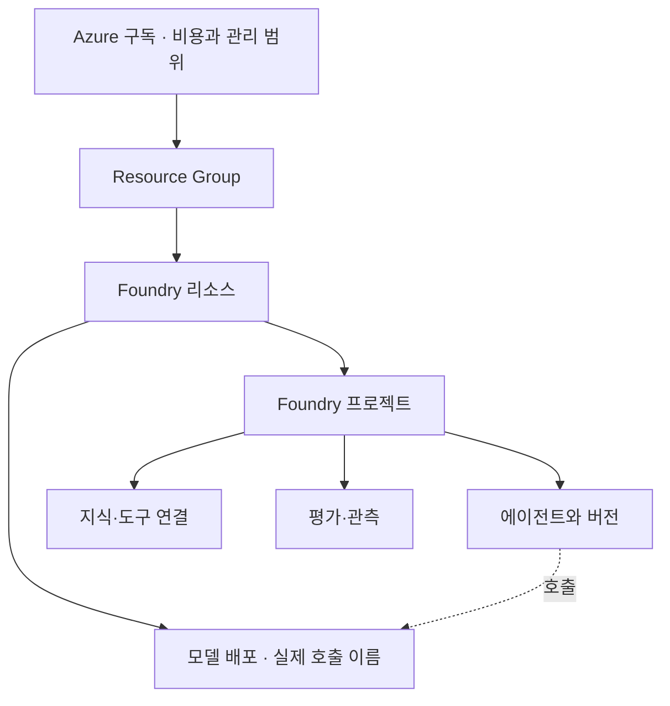
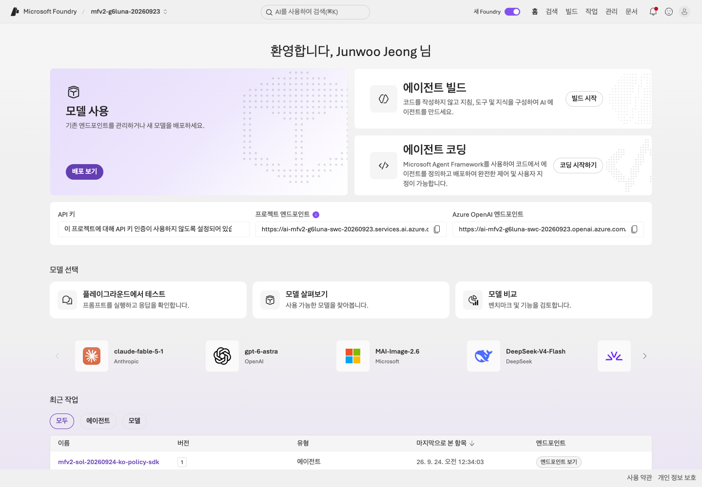

# Lab 01. Foundry를 이해하고 프로젝트 준비하기

[English](../../labs/01-foundry.md) | **한국어**

**완료 목표:** Foundry, Agent Framework, 모델 배포, 에이전트의 관계를 설명합니다.

**내 구간 바로 열기:** [A — 준비된 프로젝트](#path-a) · B: [Lab 02 B로 이동](02-models.md#path-b) · [학습 경로](../paths.md)

## 시작 전

**이번 순서:** A는 1–3절에서 준비된 프로젝트를 확인합니다. 환경이 없다면 먼저 [담당자 준비](../setup-owner.md)를 따릅니다. 리소스 생성은 이 랩의 단계가 아닙니다.

**준비물:** 설정 카드의 tenant·프로젝트·계정과 gpt-6-sol 배포.

**다음으로 갈 기준:** 계정·프로젝트·배포·agent를 구분하고 본인의 endpoint를 확인했습니다.

**막히면:** 멈추고 담당자에게 tenant, 프로젝트 이름, 본인의 **Foundry User** 역할, `gpt-6-sol` 접근 권한을 확인해 달라고 요청합니다. 비슷한 이름의 다른 프로젝트를 열지 않습니다.

[한 번만 하는 준비와 학습자 파일](../setup.md).

<a id="path-a"></a>

## 먼저 네 가지를 구분하기

| 용어 | 쉬운 설명 | 이 실습에서의 예 |
|---|---|---|
| Foundry 리소스 | Azure에서 AI 서비스를 운영하는 자원 | 실습용 Foundry account |
| 프로젝트 | 에이전트·연결·평가를 함께 관리하는 작업 공간 | 한빛기술 실습 프로젝트 |
| 모델 배포 | 특정 모델·버전·SKU를 호출할 수 있게 한 구성 | 이번 preset의 호출 이름 `gpt-6-sol` |
| 에이전트 | 모델에 지침·도구·실행 방식을 붙인 업무 단위 | 출장 규정 안내 도우미 |

**Foundry는 클라우드 플랫폼, Microsoft Agent Framework(MAF)는 코드로 에이전트와
워크플로를 만드는 오픈소스 SDK**입니다. MAF를 로컬에서 실행하더라도 그 안의 모델 호출은
Azure에서 과금될 수 있습니다.



실선은 자산이 속한 위치, 점선은 호출 관계입니다.
프로젝트와 모델 배포는 모두 Foundry 리소스 아래에 있습니다. 에이전트는 프로젝트에 속하며 모델 배포를 호출합니다.

<a id="1-강사가-준비한-환경-확인"></a>

## 1. 준비된 환경 확인

1. `https://ai.azure.com`을 열고 실습 프로젝트를 선택합니다. 상단 **Microsoft Foundry** 옆에 프로젝트 이름이 표시됩니다.
2. **홈**에서 **프로젝트 엔드포인트**의 복사 아이콘을 누릅니다. `session-notes.txt`의 `전체 project endpoint:` 옆 새 줄에 붙여 넣고
   설정 카드의 값을 덮어쓰지 않은 채 전체 URL을 비교합니다.
   서로 다르거나 카드가 비어 있으면 멈추고 담당자와 의도한 프로젝트를 확인한 뒤 진행합니다.
3. 같은 화면에서 **배포 보기**를 눌러 **`gpt-6-sol`** 행을 확인한 뒤 목록을 닫습니다.
4. 상단 막대의 **빌드**(**빌드 시작** 버튼이 아님)를 누르고 왼쪽 메뉴에서 **에이전트**, **모델**, **지식**, **평가**를 찾습니다.
   프로젝트 화면의 진입 메뉴이지 자산의 소유 계층이 아닙니다. 모델 배포는 상위 Foundry 리소스에 속합니다.
   메뉴 이름은 언어·배포 시점에 따라 다를 수 있으니 같은 대상을 찾습니다.
   프로젝트 이름 아래에 이 항목들이 보이면 계속합니다. 보이지 않으면 Foundry 계정이나 다른 프로젝트가 아니라
   실습 프로젝트를 열었는지 확인합니다.



**화면 확인:** 긴 엔드포인트는 화면에서 잘리므로 붙여 넣은 값으로 확인합니다. **프로젝트 엔드포인트**는 `/api/projects/<project>`로 끝나고, 옆의 **Azure OpenAI 엔드포인트**는
`.openai.azure.com`으로 끝나는 다른 값입니다. **배포 보기**는 상위 Foundry 리소스의 모델 배포를 열고,
**빌드 시작**은 프로젝트 안의 에이전트를 만듭니다. **배포 보기**의 `gpt-6-sol` 행에는 버전 **`2026-09-22`**와 **Succeeded**가 표시되고,
`gpt-6-sol-judge`는 평가용 별도 배포입니다.

classic Hub 프로젝트나 threads/runs 코드가 보이면 멈추고 [마이그레이션 지도](../reference/migration.md)를 확인합니다.

<a id="4-endpoint-혼동-없애기"></a>

## 2. 설정 카드의 endpoint 확인

포털에서 복사한 값이 설정 카드의 `전체 project endpoint:` 값과 같은지 먼저 확인한 뒤, 아래 표의 첫 행과 모양을 비교합니다.

| 용도 | 모양 |
|---|---|
| 프로젝트 SDK | `https://<account>.services.ai.azure.com/api/projects/<project>` |
| 계정의 Azure OpenAI API | `https://<account>.openai.azure.com/openai/v1/` |
| Azure AI Search | `https://<search>.search.windows.net` |
| 브라우저 포털 | `https://ai.azure.com` — **SDK endpoint가 아님** |

끝부분 `/api/projects/<project>`가 있어야 하며, 모양뿐 아니라 **기록한 본인의 계정·프로젝트 이름**도 같아야 합니다.
다르면 [Lab 00의 프로젝트 선택](00-start.md#path-a)으로 돌아가 담당자가 준 값을 확인합니다. 다른 프로젝트를 통과시키려고 카드를 덮어쓰지 않습니다.

## 3. 관계 그림과 설명 적기

`session-notes.txt`의 **Lab 01** 칸에 다음 두 가지를 적습니다.

1. 본인 이름으로 `Foundry 리소스 <account> → 프로젝트 <project> → 에이전트(Lab 03)`를 그립니다.
   `배포 gpt-6-sol`은 **Foundry 리소스** 아래에 프로젝트와 나란히 두고 **에이전트 → 호출 → 배포**를 연결합니다.
   배포는 프로젝트의 하위 리소스가 아닙니다. 텍스트로 적어도 되며, 꺾쇠괄호 이름은 본인 값으로 바꿉니다.

   ```text
   Foundry 리소스 <account>
       프로젝트 <project>
           에이전트(Lab 03)  -- 호출 -->  배포 gpt-6-sol
       배포 gpt-6-sol
   ```

2. 이 문장: `모델을 바꾸면 에이전트의 지침·지식·평가·권한을 다시 확인해야 한다.`

**A 완료:** **Lab 01** 칸에 관계와 문장이 있고, 포털의 전체 project endpoint가 검증된 설정 카드와 일치합니다.
[Lab 02 A](02-models.md#path-a)로 이동합니다. 준비된 프로젝트 확인을 위해 리소스를 만들거나 역할을 부여하지 않습니다.

<details>
<summary>담당자 참고 전용 — 리소스 생성·역할 부여는 학습자 단계가 아닙니다</summary>

## 담당자: 환경이 없는 경우

참가자 수업 시간에 포함하지 않으며 별도 승인이 필요한 준비입니다.
이 랩 안의 별도 설정 순서가 아니라 [혼자 학습 준비](../setup-owner.md#self-study) 또는
[수업 담당자 체크리스트](../setup-owner.md#class-owner-checklist)를 사용합니다.
그 안내의 학습자 인계를 마치고 [Lab 00 A](00-start.md#path-a)로 돌아온 뒤 이 페이지의 1–3절에서 프로젝트를 확인합니다.
리전을 고르기 전에 **모델/SKU/할당량**을 확인합니다. 선택 Hosted를 쓴다면
[Hosted 지원 리전](https://learn.microsoft.com/azure/foundry/agents/concepts/hosted-agents)도 별도로 확인합니다. 두 목록이 같지는 않을 수 있습니다.
녹화의 리전/SKU/capacity를 복사하지 않습니다. 역할 반영을 기다린 뒤 학습자 계정으로 실제 모델 요청을 확인합니다.

리소스를 만들 수 있다고 모델을 호출할 수 있는 것은 아닙니다. **관리 평면과 데이터
평면의 권한이 다릅니다.** 실습자 모두에게 구독 Owner를 부여하지 않습니다.


2026-09-24 녹화는 녹화 전에 따로 준비한 실습 프로젝트를 사용했으며 녹화 중에 리소스를 만들지 않았습니다.
준비에는 녹화에서 받아 적은 명령이 아니라 [환경 담당자 체크리스트](../setup.md#4-환경-담당자의-준비)를 사용합니다.

## 담당자: 최소 권한의 출발점

| 역할 | 권한의 출발점 | 범위 |
|---|---|---|
| 학습자: 에이전트·평가 개발 | `Foundry User` | 실습 프로젝트 |
| 기존 에이전트 호출만 | `Foundry Agent Consumer` | 해당 에이전트 |
| 기존 프로젝트에 Hosted 배포 | `Foundry Project Manager` 등 배포 가이드의 권한 | 해당 프로젝트 |
| 리소스·역할 준비 담당자 | 생성 권한 + 필요한 역할 할당 권한 | 실습 전용 범위 |
| 로그 조회자 | `Log Analytics Reader` 등 | 연결된 관찰 리소스 |

역할 이름이 아직 `Azure AI User`처럼 보일 수 있습니다. 현재 이름 변경은 기존 역할 ID를
바꾸지 않습니다. 필요한 추가 권한과 역할 ID는 [공식 RBAC](https://learn.microsoft.com/azure/foundry/concepts/rbac-foundry)를
확인합니다. 사용자, Search managed identity, Hosted agent identity는 서로 다른 주체입니다.


**화면 확인:** `doctor --cloud`가 읽어 온 모델 배포 정보와 본인의 설정을 대조합니다.
관리 평면을 읽을 수 있다는 사실과 실제 추론 권한은 다릅니다. [Lab 02](02-models.md)의 요청까지 확인하세요.

</details>

[전체 액션 인덱스](../action-captures.md) · [녹화 영상](../video-summary.md)

## 완료 확인

“모델을 바꿔도 프로젝트의 지식과 평가 기준을 남길 수 있나요?”에 답해 보세요.
모델 배포는 바꿀 수 있지만 지식·지침·평가·권한을 자동으로 검증해 주는 것은 아닙니다.
그래서 뒤의 모듈에서 같은 데이터와 기준을 다시 사용합니다.

다음: A → [Lab 02](02-models.md#path-a) · B: [Lab 02로 이동](02-models.md#path-b)
