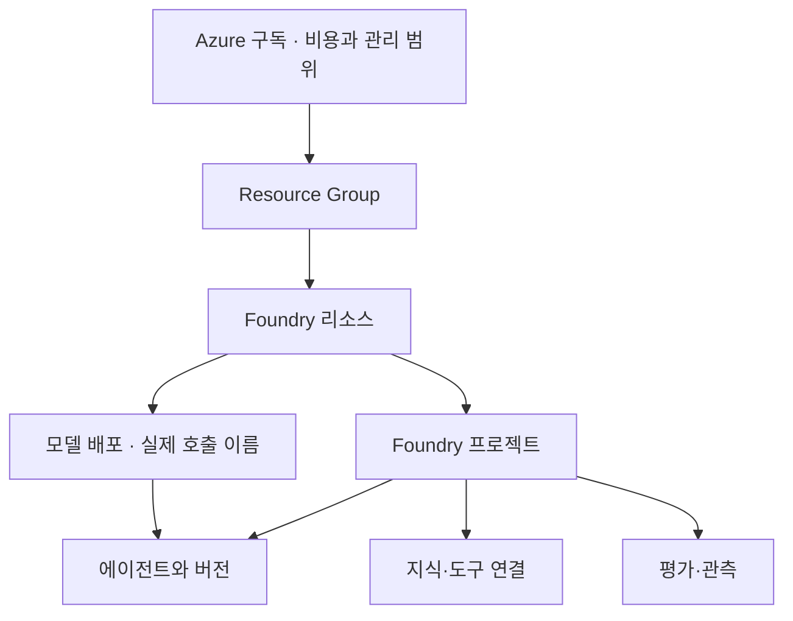
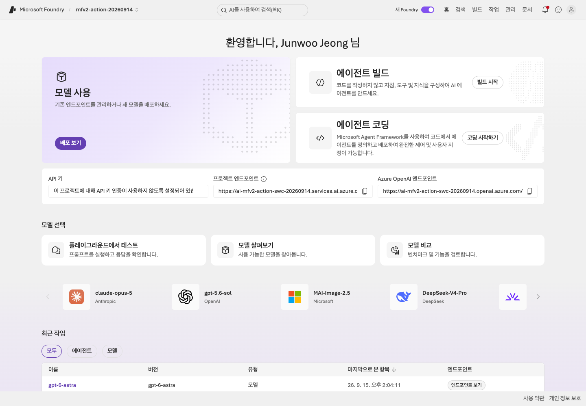

# Lab 01. Foundry를 이해하고 프로젝트 준비하기

[English](../../labs/01-foundry.md) | **한국어**

**완료 목표:** Foundry, Agent Framework, 모델 배포, 에이전트의 관계를 설명합니다.

**내 구간 바로 열기:** [A — 준비된 프로젝트](#path-a) · B: [Lab 02 B로 이동](02-models.md#path-b) · [학습 경로](../paths.md)

## 시작 전

**이번 순서:** A는 준비된 프로젝트를 확인합니다. 환경이 없는 담당자만 2절의 준비를 진행합니다.

**준비물:** 시작 카드의 tenant·프로젝트·계정과 gpt-5.6-luna 배포.

**다음으로 갈 기준:** 계정·프로젝트·배포·agent를 구분하고 본인의 endpoint를 확인했습니다.

**막히면:** 프로젝트가 없으면 tenant/RBAC부터 해결합니다. 비슷한 이름의 다른 프로젝트로 진행하지 않습니다.

[한 번만 하는 준비와 학습자 파일](../setup.md).

## 먼저 네 가지를 구분하기

| 용어 | 쉬운 설명 | 이 실습에서의 예 |
|---|---|---|
| Foundry 리소스 | Azure에서 AI 서비스를 운영하는 자원 | 실습용 Foundry account |
| 프로젝트 | 에이전트·연결·평가를 함께 관리하는 작업 공간 | 한빛기술 실습 프로젝트 |
| 모델 배포 | 특정 모델·버전·SKU를 호출할 수 있게 한 구성 | 이번 preset의 호출 이름 `gpt-5.6-luna` |
| 에이전트 | 모델에 지침·도구·실행 방식을 붙인 업무 단위 | 출장 규정 안내 도우미 |

**Foundry는 클라우드 플랫폼, Microsoft Agent Framework(MAF)는 코드로 에이전트와
워크플로를 만드는 오픈소스 SDK**입니다. MAF를 로컬에서 실행하더라도 그 안의 모델 호출은
Azure에서 과금될 수 있습니다.

## 1. 강사가 준비한 환경 확인

1. `https://ai.azure.com`에서 현재 Foundry 경험과 실습 프로젝트를 엽니다.
2. 프로젝트 이름, 리소스 이름, 연결된 모델 배포를 워크시트에 적습니다.
3. 같은 프로젝트에서 에이전트·모델·평가/관측 기능이 어디에 있는지 찾아봅니다.
4. 메뉴 이름은 언어와 배포 시점에 따라 달라질 수 있습니다. **메뉴 위치보다
   “프로젝트의 모델 배포 목록”처럼 확인할 대상**을 기준으로 이동합니다.
5. classic Hub 기반 프로젝트나 과거 threads/runs 코드를 보게 되면
   [마이그레이션 지도](../reference/migration.md)를 확인합니다. 서로 다른 API를 섞지 않습니다.

**화면 확인:** **View deployments**는 모델 배포, **Start building**은 에이전트 제작의 진입점입니다.
같은 프로젝트 안에 있어도 모델 배포와 에이전트는 다른 자산이라는 점을 위 관계 그림과 연결해 보세요.

## 설정 카드의 endpoint 확인

| 용도 | 모양 |
|---|---|
| 프로젝트 SDK | `https://<account>.services.ai.azure.com/api/projects/<project>` |
| 계정의 Azure OpenAI API | `https://<account>.openai.azure.com/openai/v1/` |
| Azure AI Search | `https://<search>.search.windows.net` |
| 브라우저 포털 | `https://ai.azure.com` — **SDK endpoint가 아님** |

프로젝트 endpoint에서 `/api/projects/<project>`를 지우지 않습니다.
기본 추론의 인증·endpoint는 프로젝트 SDK가 처리합니다.
다른 endpoint로 자동 우회하거나 토큰 audience를 추측하지 않습니다.

**A 완료:** `session-notes.txt`에 네 객체의 관계 그림과 실제 project endpoint를 적습니다.
모델 교체 시 다시 확인할 지식·지침을 설명한 뒤 [Lab 02 A](02-models.md#path-a)로 이동합니다.
준비된 프로젝트 확인을 위해 리소스를 만들거나 역할을 부여하지 않습니다.

담당자 참고 전용 — 리소스 생성·역할 부여는 학습자 단계가 아닙니다

## 2. 환경이 없는 경우 — 강사/관리자만 먼저 수행

참가자 수업 시간에 포함하지 않는 준비 단계입니다.

1. 실습용 Azure 구독과 전용 Resource Group을 정합니다.
2. [Foundry 공식 시작 가이드](https://learn.microsoft.com/azure/foundry/quickstarts/get-started-code)에
   따라 Foundry 리소스와 현재 프로젝트를 만듭니다.
3. 리전을 선택하기 전에 필요한 **모델/SKU/할당량**을 확인합니다.
   Hosted를 쓸 경우에는 [Hosted 지원 리전](https://learn.microsoft.com/azure/foundry/agents/concepts/hosted-agents)도
   별도로 확인합니다. 두 목록이 항상 같지는 않습니다.
4. `gpt-5.6-luna`, 모델 버전 `2026-07-09`를 배포 이름 `gpt-5.6-luna`로 준비합니다.
   녹화의 리전/SKU/capacity를 복사하지 말고 실제 가용성을 확인합니다.
5. 프로젝트에 필요한 참가자 역할을 부여하고 반영을 기다립니다.
6. 한 명의 학습자 계정으로 실제 모델 호출을 확인합니다.
7. Search·Application Insights·Hosted는 사용할 모듈에만 준비합니다.

리소스를 만들 수 있다고 모델을 호출할 수 있는 것은 아닙니다. **관리 평면과 데이터
평면의 권한이 다릅니다.** 실습자 모두에게 구독 Owner를 부여하지 않습니다.

이번 새 촬영은 기존 실습용 Resource Group/프로젝트를 재사용했습니다.
새 Resource Group을 생성한 것으로 집계하지 않습니다. 참가자는 강사의 준비 단계를 승인 없이 실행하지 않습니다.

## 3. 최소 권한의 출발점

| 역할 | 권한의 출발점 | 범위 |
|---|---|---|
| 학습자: 에이전트·평가 개발 | `Foundry User` | 실습 프로젝트 |
| 기존 에이전트 호출만 | `Foundry Agent Consumer` | 해당 에이전트 |
| 기존 프로젝트에 Hosted 배포 | `Foundry Project Manager` 등 배포 가이드의 권한 | 해당 프로젝트 |
| 리소스·역할 준비 담당자 | 생성 권한 + 필요한 역할 할당 권한 | 실습 전용 범위 |
| 로그 조회자 | `Log Analytics Reader` 등 | 연결된 관찰 리소스 |

역할 이름이 아직 `Azure AI User`처럼 보일 수 있습니다. 현재 이름 변경은 기존 역할 ID를
바꾸지 않습니다. 필요한 추가 권한과 역할 ID는 [공식 RBAC](https://learn.microsoft.com/azure/foundry/concepts/rbac-foundry)를
확인합니다. 사용자, Search managed identity, Hosted agent identity는 서로 다른 주체입니다.

**화면 확인:** `doctor --cloud`가 읽어 온 모델 배포 정보와 본인의 설정을 대조합니다.
관리 평면을 읽을 수 있다는 사실과 실제 추론 권한은 다릅니다. [Lab 02](02-models.md)의 요청까지 확인하세요.

## 완료 확인

“모델을 바꿔도 프로젝트의 지식과 평가 기준을 남길 수 있나요?”에 답해 보세요.
모델 배포는 바꿀 수 있지만 지식·지침·평가·권한을 자동으로 검증해 주는 것은 아닙니다.
그래서 뒤의 모듈에서 같은 데이터와 기준을 다시 사용합니다.

다음: A → [Lab 02](02-models.md#path-a) · B: [Lab 02로 이동](02-models.md#path-b)
