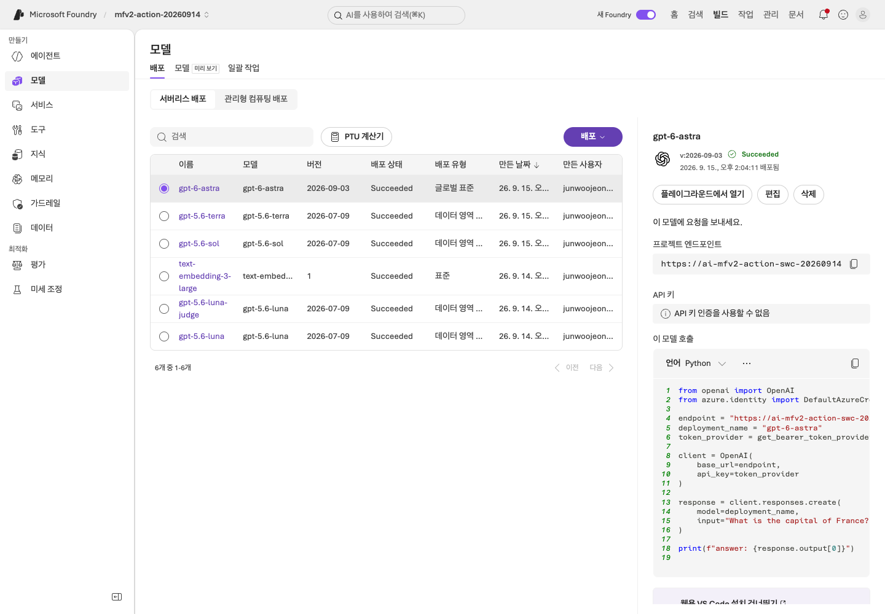
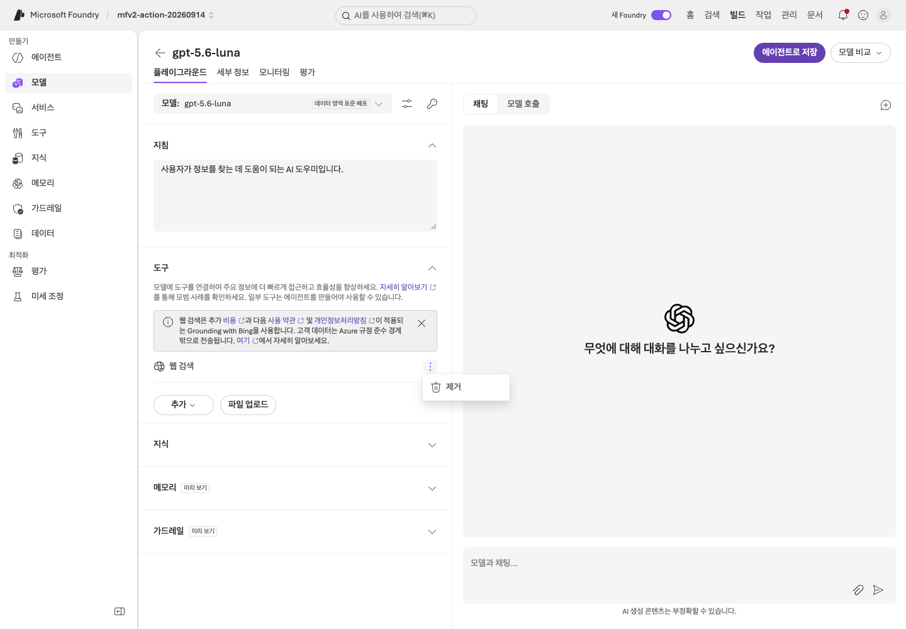
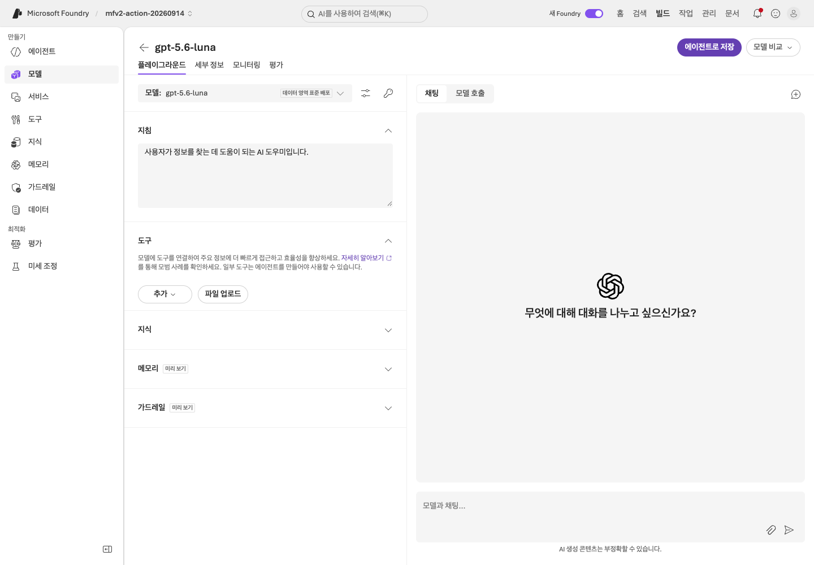
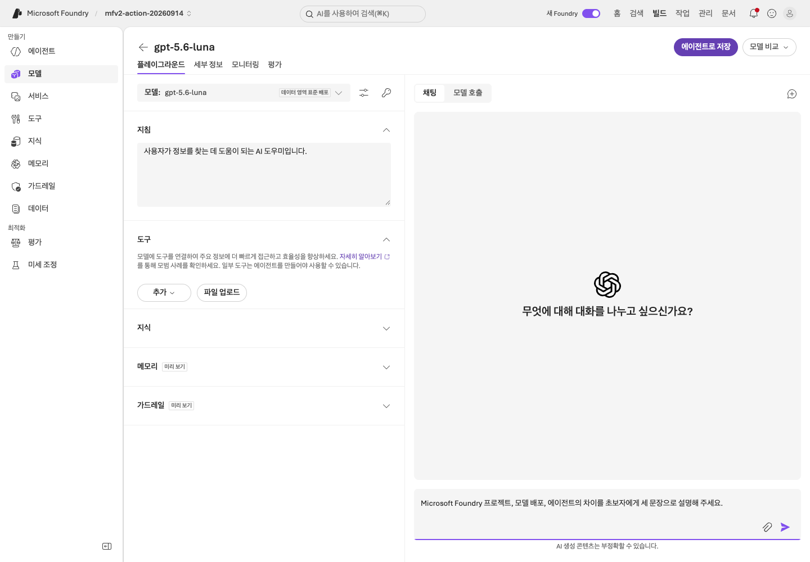
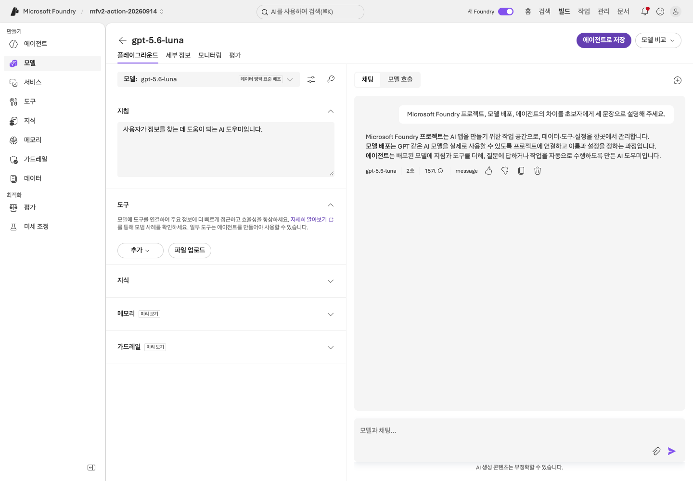
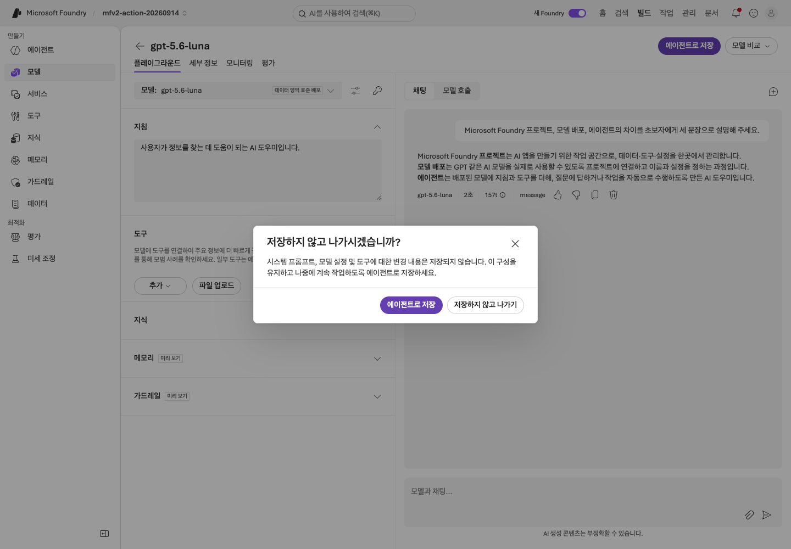
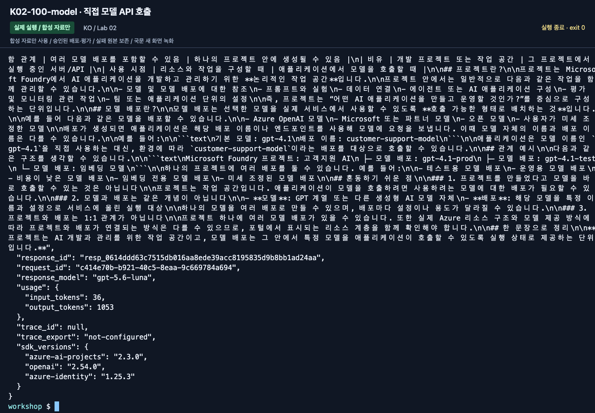

# Lab 02. 준비된 모델을 실제로 호출하기

[English](../../labs/02-models.md) | **한국어**

**완료 목표:** 모델 이름과 배포 이름을 구분하고, 한 번의 실제 응답을 확인합니다.

**내 구간 바로 열기:** [A — Playground](#path-a) · [B — SDK](#path-b) · [학습 경로](../paths.md)

## 시작 전

**이번 순서:** A는 Playground, B는 CLI 확인과 구조화 출력을 실행합니다. 첫 회차에는 모델 비교를 건너뜁니다.

**준비물:** 준비된 gpt-5.6-luna 배포. B는 Lab 00의 활성 환경과 .env.

**다음으로 갈 기준:** 실제 응답과 배포 이름을 기록했습니다. B는 구조화된 답변도 확인했습니다.

**막히면:** 모델 없음·403·429는 준비/권한/용량 문제입니다. 모델을 자동 대체하지 않습니다.

[한 번만 하는 준비와 학습자 파일](../setup.md).

<a id="path-a"></a>

## A. 브라우저 — Playground에서 시작

승인된 수업 예산으로 실제 모델을 호출합니다. 두 실제 관찰을 `session-notes.txt`에 저장합니다.

### 1. 사용할 배포 확인

1. 실습 프로젝트의 모델/배포 목록을 엽니다.
2. **`gpt-5.6-luna`**를 선택하고 모델 **`gpt-5.6-luna`**, 버전 **`2026-07-09`**를 확인합니다.
   이번에는 두 이름이 같아도 카탈로그 모델 이름·버전·배포 이름을 따로 적습니다.



**화면 확인:** **Name**은 호출할 배포 이름, **Model / Version**은 기반 모델 정보입니다.
촬영에서는 응답용 `gpt-5.6-luna`와 평가용 `gpt-5.6-luna-judge`를 구분했습니다.
상세 패널에 judge가 보이더라도 질문은 강사가 지정한 응답용 배포의 Playground에서 보냅니다.

### 2. 외부 웹 도구 끄기

해당 모델의 Playground를 엽니다.
Tools에 기본 Web Search가 있으면 **Actions → Remove**로 제거합니다. 이 기본 경로는 외부 웹을 조회하지 않습니다.



**화면 확인:** **Web search** 행의 Actions 메뉴를 열고 **Remove**를 선택합니다.
안내 배너를 닫는 **Dismiss**는 도구 제거가 아닙니다.



**화면 확인:** Web search 행이 도구 목록에서 사라졌는지 확인한 뒤 질문을 입력합니다.
다른 Playground나 새 에이전트로 이동하면 도구 설정을 다시 확인해야 합니다.

### 3. 질문을 입력하고 응답 확인

> Foundry 리소스, 프로젝트, 모델 배포, 에이전트의 차이를 초보자에게 네 문장으로 설명해 주세요.



**화면 확인:** 오른쪽 아래 **Chat with the model...**에 질문을 넣고 전송합니다.
왼쪽 **Instructions**는 시스템 지침 입력란이므로 질문과 혼동하지 않습니다.



**화면 확인:** 응답 내용뿐 아니라 답변 아래의 모델 이름·시간·토큰 표시도 기록합니다.
이 화면은 촬영 환경의 예시이며, 참가자의 결과가 자동으로 같아지는 것은 아닙니다.

### 4. 근거 없는 질문과 비교

**New chat**으로 새 대화를 시작한 뒤 “한빛기술의 2026년 9월 숙박비 한도는?”을 질문합니다.
**아직 합성 규정을 주지 않았으므로 금액을 아는 척하면 안 됩니다.**
실제 회사 정책을 아는지 시험하는 질문이 아닙니다.


**화면 확인:** 근거를 제공하지 않았을 때 확인이 필요하다고 답하는지 봅니다.
그럴듯한 금액을 제시했다면 성공이 아니라 근거 없는 응답으로 기록하세요.

이제 모델만으로는 회사의 규정·적용 시점·승인 기준이 생기지 않는다는 점을 확인합니다.

이번 새 국문 화면에서도 도구를 제거한 뒤 다른 탭으로 이동할 때
**Leave without saving?** 확인 창이 나타났습니다. 이 모델 Playground의 임시 설정을
유지할 필요가 없다면 **Leave without saving**으로 이동합니다.
새 에이전트에 이 설정이 자동 적용되는 것은 아니므로 [Lab 03](03-prompt-agent.md)에서
모델과 도구 목록을 다시 확인합니다.



**화면 확인:** 화면 이동이 멈춘 것처럼 보이면 **Leave without saving?** 창이 있는지 확인합니다.
임시 모델 설정을 유지하지 않을 때만 **Leave without saving**을 선택합니다.

### 배포가 아직 없다면

여기서 멈추고 권한 있는 환경 담당자와 [준비 카드](../setup.md)를 완료합니다.
이 날짜의 첫 경로는 텍스트·도구·Structured Outputs·IQ chat을 확인한 **Luna**를 사용합니다.
배포가 없다는 이유로 `-judge`, router, 목록의 다른 모델을 선택하지 않습니다.
다른 모델은 명시적으로 재검증한 별도 변형이며 같은 preset이 아닙니다.
승인된 생성 작업 전에도 quota/SKU/리전/가격을 확인합니다.

**A 완료:** 실제 배포·버전, 개념 응답 한 건, 정책 근거 없는 관찰 한 건이 있습니다.
[Lab 03 A](03-prompt-agent.md#path-a)로 이동합니다. Lab 05 터미널을 직접 준비하는 경우가 아니라면 B의 SDK 호출은 실행하지 않습니다.

<a id="path-b"></a>

## B. 코드 — 같은 프로젝트를 Responses API로 호출

저장소 루트·활성 `.venv`에서 실행합니다. 사전 검사는 읽기 전용이며 모델·구조화 답변 요청은 유료입니다.

```bash
python scripts/workshop.py doctor --cloud
```

의도한 배포가 `Succeeded`인지 사전 확인한 뒤에만 실제 요청을 보냅니다.

```bash
python scripts/workshop.py model --question "Foundry와 Agent Framework의 차이를 한국어로 세 문장으로 설명해 주세요."
```

핵심 코드는 `src/foundry_workshop/cloud.py`의 `project_clients`, `call_model`입니다.

```python
with AIProjectClient(endpoint=project_endpoint, credential=credential) as project:
    with project.get_openai_client() as client:
        response = client.responses.create(
            model=deployment_name,
            input="Foundry와 MAF의 차이를 설명해 주세요.",
            store=False,
        )
```

위 블록은 흐름 설명용입니다. 실행에는 위 CLI와 `.env`의 실제 값을 사용합니다.
`response_id`, 실제 `response_model`, 토큰 사용량이 결과에 기록됩니다.
`trace_id: null`은 아직 Application Insights trace를 수집한 것이 아니라는 뜻입니다.
`response_id`를 임의의 trace ID로 바꿔 적지 않습니다.



**화면 확인:** 마지막 명령 아래의 `text`, `response_model`, `response_id`, `usage`를 읽습니다.
`trace_id: null`과 `trace_export: not-configured`도 그대로 기록하며, 생성된 응답 ID를 Trace ID로 바꾸지 않습니다.

### 구조화 출력까지 확인

```bash
python scripts/workshop.py answer --prompt v2 --retrieval local
```

이 명령은 합성 문서에서 로컬 키워드 검색을 한 뒤 **실제 Azure 모델**을 호출합니다.
JSON의 `answer`, `decision`, `limit_krw`, `citations`를 확인합니다.
`local`은 검색 위치를 뜻할 뿐 **모델 호출이 오프라인이라는 뜻이 아닙니다.**


**화면 확인:** 사진은 긴 출력의 하단입니다. `source_ids`, `response_id`, `usage`,
`trace_export`를 확인하고, 출력 위쪽의 `answer`·`decision`·`limit_krw`·`citations`와 함께 읽습니다.
답변만 복사하고 이력을 버리지 않습니다.

지원하지 않는 모델이 `json_schema`를 거부하면 여기서 중단합니다.
코드는 일반 텍스트로 몰래 전환하거나 JSON을 임의로 고치지 않습니다.
강사가 지원 여부를 확인한 배포로 명시적으로 다시 구성한 후 새 실행으로 기록합니다.

**B 완료:** Lab 00 기록 폴더에 `model.json`, `answer-local.json`으로 출력 전체를 저장합니다.
Response ID·사용량·원문 ID도 포함합니다.
[Lab 04 B](04-agents-tools.md#path-b)로 이동합니다. A 터미널 준비 때문에 왔다면 [Lab 05 A](05-workflows.md#path-a)로 돌아갑니다.

## 경험자 확장: 모델을 어떻게 비교할까?

<details>
<summary>선택 모델 비교·Router — 첫 요청의 필수 단계가 아닙니다</summary>

같은 질문 하나만으로 모델 순위를 정하지 않습니다.
[Lab 07](07-evaluation.md)에서 **같은 dev·지식·지침·출력 한도·동시성**을 사용하고
배포 하나만 바꾸어 비교합니다. judge 모델도 응답 모델과 구분합니다.
정확한 비용은 토큰 종류, 실제 배포 가격, 캐시·추론 토큰, 도구/검색 요금을 함께 계산합니다.
이 저장소는 불확실한 단가로 원화 비용을 만들어 내지 않습니다.

### Model Router — 선택 관찰

해당 프로젝트에 Model Router가 제공되면 같은 질문이 어떤 라우팅 구성으로 처리되는지
살펴봅니다. Router 배포를 사용하는 것과 모델 A/B를 고정해 평가하는 것은 다른 실험입니다.
라우팅 정책·가능한 후보·실제 응답 모델을 기록할 수 없다면 고정 모델 순위로 발표하지 않습니다.
Router의 접근 권한/모델 목록은 수업 직전 공식 모델 문서와 포털에서 확인합니다.
Router가 없어도 이 랩은 완료할 수 있습니다.

</details>

## 완료·복구

모델·배포·실제 평가 범위는 [실행 기록](../live-run.md)에 구분했습니다.

- 완료: 실제 모델 응답과 배포 이름이 있고, 근거 없는 회사 정책 질문의 한계를 설명합니다.
- 401/403: [인증·권한](../reference/troubleshooting.md). 무조건 Owner를 추가하지 않습니다.
- 404: 프로젝트 endpoint와 **배포 이름**부터 확인합니다.
- 429: 동시 호출을 멈추고 quota/TPM을 확인합니다. 무한 재시도하지 않습니다.

다음: A → [Lab 03](03-prompt-agent.md#path-a) · B → [Lab 04](04-agents-tools.md#path-b)
