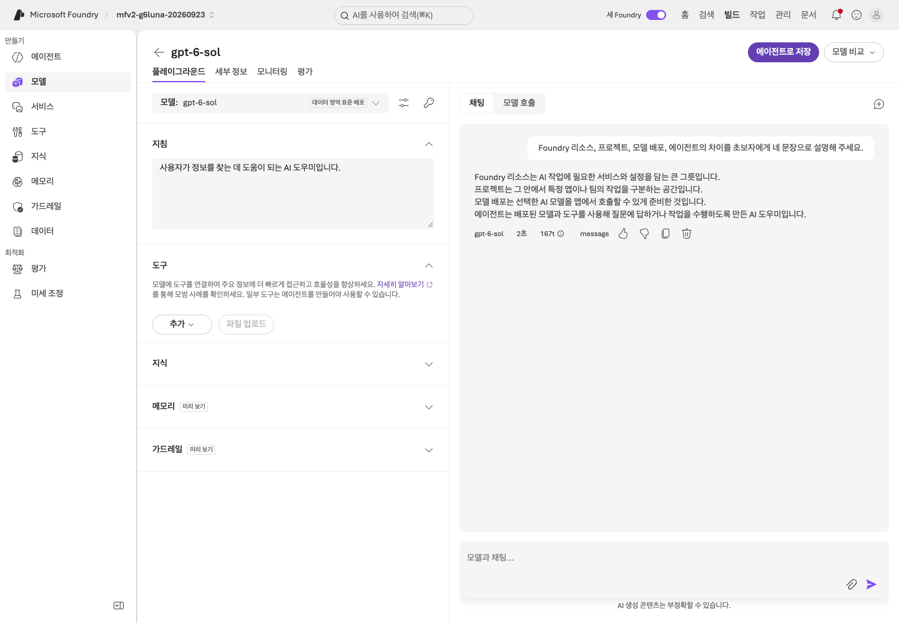
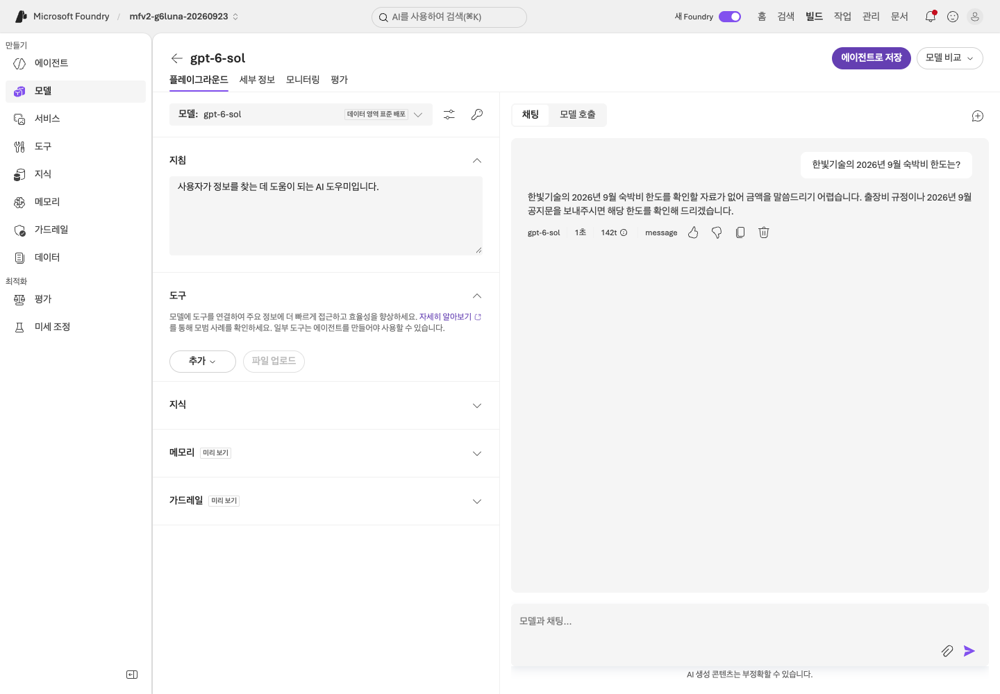
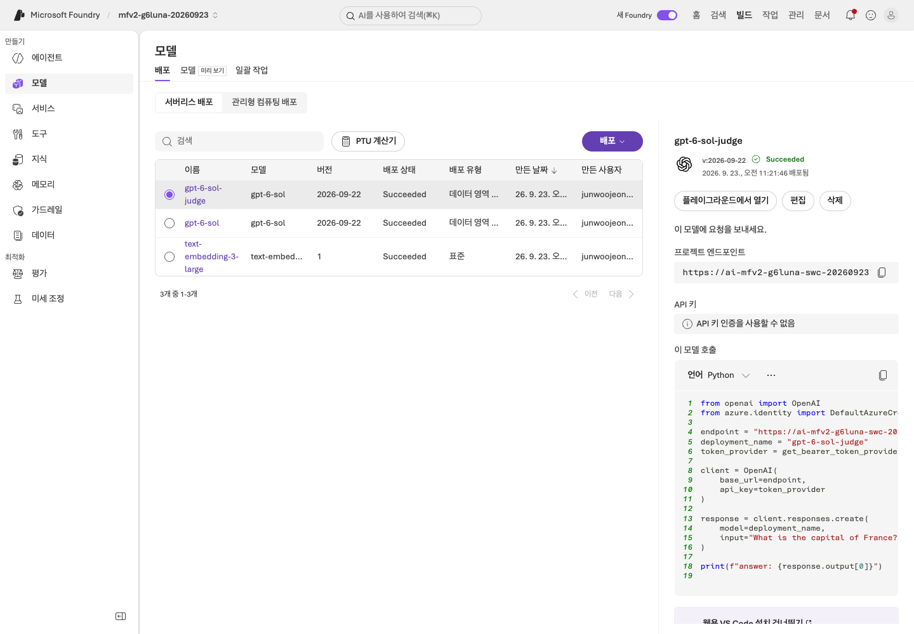
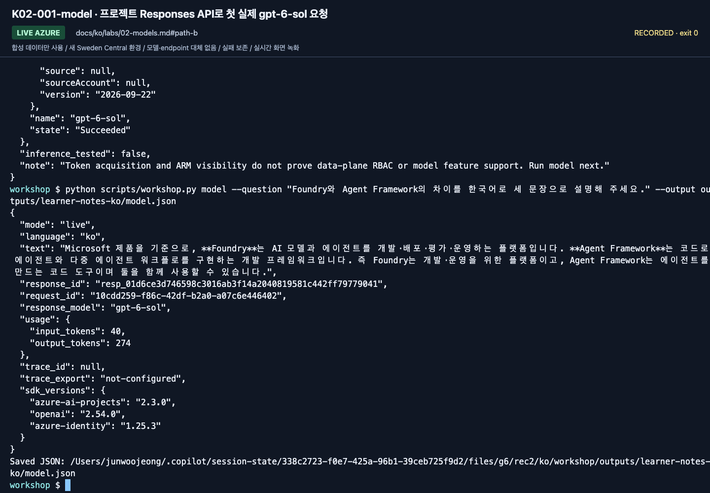
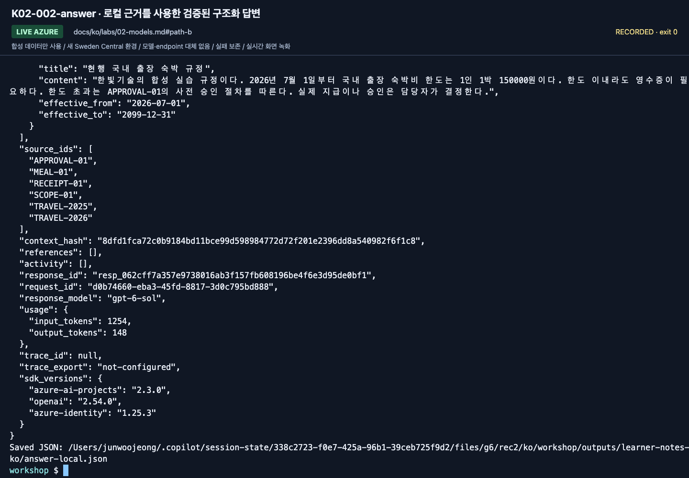

# Lab 02. 준비된 모델을 실제로 호출하기

[English](../../labs/02-models.md) | **한국어**

**완료 목표:** 모델 이름과 배포 이름을 구분하고, 한 번의 실제 응답을 확인합니다.

**내 구간 바로 열기:** [A — Playground](#path-a) · [B — SDK](#path-b) · [학습 경로](../paths.md)

## 시작 전

**이번 순서:** A는 Playground를 사용하고 B는 배포 확인 후 실제 응답 두 개를 저장합니다. 모델 비교는 선택입니다.

**준비물:** 준비된 gpt-6-sol 배포. B는 Lab 00의 활성 환경과 .env.

**다음으로 갈 기준:** 실제 응답과 배포 이름을 기록했습니다. B는 구조화된 답변도 확인했습니다.

**막히면:** 멈추고 오류를 담당자에게 알립니다. 401/403이면 프로젝트의 **Foundry User** 역할을, 429이면 배포의 quota(TPM)를 확인해 달라고 요청합니다. 배포가 없으면 `gpt-6-sol` 준비를 요청합니다. 모델을 바꾸지 않습니다.

[한 번만 하는 준비와 학습자 파일](../setup.md).

<a id="path-a"></a>

## A. 브라우저 — Playground에서 시작

승인된 수업 예산으로 실제 모델을 호출합니다. 두 실제 관찰을 `session-notes.txt`에 저장합니다.

### 1. 사용할 배포 확인

프로젝트 **홈**에서 **배포 보기**를 선택한 뒤 **`gpt-6-sol`** 행을 선택합니다.
모델 **`gpt-6-sol`**, 버전 **`2026-09-22`**가 `session-notes.txt`의 `응답 배포 / 모델 버전:` 줄과 같은지 확인합니다
(여기서는 배포 이름과 모델 이름이 같지만 서로 다른 대상입니다).


**화면 확인:** **이름**은 호출할 배포 이름, **모델**·**버전**은 기반 모델 정보입니다.
목록의 `gpt-6-sol-judge`는 선택 평가에서 점수만 매기는 배포입니다.
오른쪽 패널 코드에 judge가 보이더라도 질문은 응답용 `gpt-6-sol` 플레이그라운드에서 보냅니다.

### 2. 외부 웹 도구 끄기

**`gpt-6-sol`** 이름 링크를 선택해 플레이그라운드를 엽니다. **도구**에 **웹 검색**이 있으면 그 행의
**⋮** 메뉴를 열고 **제거**를 선택합니다. 처음부터 없다면 도구를 바꾸지 말고 3단계로 갑니다.
화면 예시와 맞추려고 추가하지 않습니다. 이 기본 경로는 외부 웹을 조회하지 않습니다.


**화면 확인:** **웹 검색** 행의 **⋮** 메뉴에 **제거**가 보입니다.
그 위 안내 상자의 **X**는 안내만 닫으며 도구를 제거하지 않습니다.


**화면 확인:** **웹 검색** 행이 도구 목록에서 사라졌는지 확인한 뒤 질문을 입력합니다.
다른 플레이그라운드나 새 에이전트로 이동하면 도구 설정을 다시 확인해야 합니다.

### 3. 질문을 입력하고 응답 확인

오른쪽 아래 **모델과 채팅...**(왼쪽 **지침**이 아님)을 선택해 아래 질문을 붙여 넣고 보내기 화살표를 선택합니다.

> Foundry 리소스, 프로젝트, 모델 배포, 에이전트의 차이를 초보자에게 네 문장으로 설명해 주세요.


**화면 확인:** 질문이 오른쪽 아래 채팅 입력란에 들어갔습니다.
왼쪽 **지침**은 시스템 지침 입력란이므로 바꾸지 않습니다.



**화면 확인:** `session-notes.txt`의 **Lab 02** 구역 `배포 / 시각 / 사용량:`에 배포 이름, 질문을 보낸 시각,
답변 아래 작은 줄의 토큰 수를 적습니다(녹화 화면의 줄은 `gpt-6-sol`, `2초`, `167t`이며 `2초`는 응답 시간, `167t`는 토큰 167개입니다).
`개념 설명의 실제 응답:`에는 답변 전체를 붙여 넣습니다. 이 화면은 촬영 환경의 예시이며 본인의 응답이 아닙니다.
[Lab 01의 표·그림](01-foundry.md#path-a)과 네 정의를 대조합니다.
유창한 답변도 Foundry 리소스와 프로젝트를 혼동할 수 있습니다. 유창함을 정확성으로 판단하지 말고 원래 응답과 발견 사항을 남깁니다.

### 4. 근거 없는 질문과 비교

채팅 오른쪽 위의 **새 채팅**(+ 아이콘)을 선택한 뒤 “한빛기술의 2026년 9월 숙박비 한도는?”을 질문합니다.
**아직 합성 규정을 주지 않았으므로 금액을 아는 척하면 안 됩니다.**
실제 회사 정책을 아는지 시험하는 질문이 아닙니다.




**화면 확인:** 근거를 제공하지 않았을 때 확인이 필요하다고 답하는지 봅니다.
그럴듯한 금액을 제시했다면 성공이 아니라 근거 없는 응답입니다. 답변은
`정책 근거가 없는 질문의 실제 응답:`에 붙여 넣고 판단은 `내 관찰 결과:`에 적습니다.

이제 모델만으로는 회사의 규정·적용 시점·승인 기준이 생기지 않는다는 점을 확인합니다.

뒤로 화살표(←)나 다른 메뉴를 선택하면 저장 확인 창이 나타날 수 있습니다.
**저장하지 않고 나가기**를 선택합니다. 이 임시 플레이그라운드 설정은 필요 없고 새 에이전트에도 적용되지 않습니다.



**화면 확인:** 화면 이동이 멈춘 것처럼 보이면 확인 창이 열려 있는지 봅니다.
저장하지 않을 임시 설정만 버립니다.

### 배포가 아직 없다면

멈추고 담당자에게 [준비 카드](../setup.md)대로 **`gpt-6-sol`**(버전 `2026-09-22`) 준비를 요청합니다.
통과하려고 `gpt-6-sol-judge`, router, 다른 모델을 선택하지 않습니다([이 모델을 쓰는 이유](../reference/model-choice.md)).

**A 완료:** 실제 배포·버전, 개념 응답 한 건, 정책 근거 없는 관찰 한 건이 있습니다.
[Lab 03 A](03-prompt-agent.md#path-a)로 이동합니다. Lab 05 터미널을 직접 준비하는 경우가 아니라면 B의 SDK 호출은 실행하지 않습니다.

<a id="path-b"></a>

## B. 코드 — 같은 프로젝트를 Responses API로 호출

저장소 루트·활성 `.venv`에서 실행합니다. 사전 검사는 읽기 전용이며 모델·구조화 답변 요청은 유료입니다.
`session-notes.txt`의 B 구간에서 `Lab 02 model.json / answer-local.json 검토:`에 저장 파일별 확인 결과를 적습니다.
이 SDK 호출에는 A 전용 Playground 항목을 채울 필요가 없습니다.

### 1. 배포 확인

```bash
python scripts/workshop.py doctor --cloud
```

프로젝트가 준비 카드와 같고 **배포/모델 `gpt-6-sol`, 버전 `2026-09-22`, 상태 `Succeeded`**가 모두 확인된 뒤 계속합니다.
다른 모델도 `Succeeded`일 수 있지만 이번 preset은 아닙니다. 설정이 다르면 모델 요청 전에 멈추고 해결합니다.
이 사전 확인은 추론까지 검증한 것이 아닙니다.

### 2. 실제 모델 응답 하나 저장

```bash
python scripts/workshop.py model \
  --question "Foundry와 Agent Framework의 차이를 한국어로 세 문장으로 설명해 주세요." \
  --output outputs/learner-notes-ko/model.json
```

`response_id`, 실제 `response_model`, 토큰 사용량이 결과에 기록됩니다.
`trace_id: null`은 아직 Application Insights trace를 수집한 것이 아니라는 뜻입니다.
`response_id`를 임의의 trace ID로 바꿔 적지 않습니다.
2026-09-24 확인에서 `model`, `answer`, `maf`, `collect`처럼 Responses API를 직접 호출한 명령은 프로젝트에 연결된 Application Insights에 서버 측 span을 만들지 않았습니다.
관리형 agent 호출은 span을 만듭니다(Lab 03 B, [Lab 09](09-operations.md#path-b)에서 확인).



**화면 확인:** 마지막 명령 아래의 `text`, `response_model`, `response_id`, `usage`를 읽습니다. `usage`에는 `input_tokens`와 `output_tokens`가 나옵니다. `gpt-6-sol`은 출력 수에 reasoning이 포함되므로 짧은 답보다 크게 보일 수 있습니다.
`trace_id: null`과 `trace_export: not-configured`도 그대로 기록하며, 생성된 응답 ID를 Trace ID로 바꾸지 않습니다.

**저장:** `model.json`은 `--output`이 Lab 00 기록 폴더에 작성합니다. 저장된 응답 전체를 연 뒤 다음 요청으로 갑니다.

<a id="구조화-출력까지-확인"></a>

### 3. 검증된 구조화 답변 저장

```bash
python scripts/workshop.py answer --prompt v2 --retrieval local \
  --output outputs/learner-notes-ko/answer-local.json
```

이 명령은 합성 문서에서 로컬 키워드 검색을 한 뒤 **실제 Azure 모델**을 호출합니다.
JSON의 최상위 `answer` 객체를 열고 그 안의 `answer`, `decision`, `limit_krw`, `citations`를 확인합니다.
`local`은 검색 위치를 뜻할 뿐 **모델 호출이 오프라인이라는 뜻이 아닙니다.**




**화면 확인:** 답변 필드·`source_ids`·`response_id`·`usage`·`trace_export`를 포함한 출력 전체를 읽습니다.
금액만 맞고 근거가 없는 것으로는 충분하지 않습니다.

**저장:** `answer-local.json`이 같은 기록 폴더에 작성됩니다. 답변뿐 아니라 원문과 응답 metadata도 확인합니다.

지원하지 않는 모델이 `json_schema`를 거부하면 여기서 중단합니다.
코드는 일반 텍스트로 몰래 전환하거나 JSON을 임의로 고치지 않습니다.
강사가 지원 여부를 확인한 배포로 명시적으로 다시 구성한 후 새 실행으로 기록합니다.

<a id="a-terminal-ready"></a>

**B 수강이 아니라 A의 터미널을 준비하러 왔나요?** 이제 터미널 준비가 끝났습니다. 이 SDK 호출로 브라우저 실습까지 완료한 것은 아닙니다.
아래에서 복귀 위치를 고르고 B 경로는 여기서 멈춥니다.

| A에서의 진행 상태 | 다음 위치 |
|---|---|
| A를 시작하기 전 사전 준비 중 | [Lab 00 A](00-start.md#path-a)부터 A 체크리스트를 따릅니다. Lab 03의 agent 만들기를 건너뛰지 않습니다 |
| Lab 05 A에서 터미널 준비 때문에 중단 | 기존 agent와 기록을 유지하고 [Lab 05 A](05-workflows.md#path-a)로 돌아갑니다 |

**B 완료:** Lab 00 기록 폴더에 `model.json`, `answer-local.json`으로 출력 전체를 저장합니다.
Response ID·사용량·원문 ID도 포함합니다.
[Lab 03 B](03-prompt-agent.md#path-b)로 이동해 로컬 MAF 도구 전에 관리형 Prompt Agent를 만듭니다.

<details>
<summary>최소 SDK 예제(선택, 저장소 밖 재사용)</summary>

작은 독립 예제는 [`examples/recipes/02_responses.py`](../../../examples/recipes/02_responses.py)를 참고합니다. 핵심 줄은 다음과 같습니다.

```python
subscription = os.environ.get("AZURE_SUBSCRIPTION_ID") or None  # pin the lab subscription
credential = AzureCliCredential(subscription=subscription)
with (
    AIProjectClient(endpoint=endpoint, credential=credential) as project,
    project.get_openai_client() as client,
):
    response = client.responses.create(model=deployment, input=question, store=False)
    print(response.output_text, response.id, response._request_id)
```

**직접 작성:** 질문 문자열만 바꾸어 같은 배포에 실행하고 response ID와 request ID를 따로 기록합니다.

이 예제는 `AZURE_SUBSCRIPTION_ID`를 고정합니다. 2026-09-24 실제 확인에서 고정하지 않은 `AzureCliCredential()`은 로그인된 다른 tenant의 기본 계정을 사용해 요청이 403으로 실패했습니다.

</details>

## 경험자 확장: 모델을 어떻게 비교할까?

<details>
<summary>선택 모델 비교·Router — 첫 요청의 필수 단계가 아닙니다</summary>

같은 질문 하나만으로 모델 순위를 정하지 않습니다.
[Lab 07](07-evaluation.md)에서 **같은 dev·지식·지침·출력 한도·동시성**을 사용하고
배포 하나만 바꾸어 비교합니다. judge 모델도 응답 모델과 구분합니다.
정확한 비용은 토큰 종류, 실제 배포 가격, 캐시·추론 토큰, 도구/검색 요금을 함께 계산합니다.
이 저장소는 불확실한 단가로 원화 비용을 만들어 내지 않습니다.

### Model Router — 선택 관찰

해당 프로젝트에 Model Router가 제공되면 같은 질문이 어떤 라우팅 구성으로 처리되는지
살펴봅니다. Router 배포를 사용하는 것과 모델 A/B를 고정해 평가하는 것은 다른 실험입니다.
라우팅 정책·가능한 후보·실제 응답 모델을 기록할 수 없다면 고정 모델 순위로 발표하지 않습니다.
Router의 접근 권한/모델 목록은 수업 직전 공식 모델 문서와 포털에서 확인합니다.
Router가 없어도 이 랩은 완료할 수 있습니다.

</details>

<details>
<summary>2026-09-24 gpt-6-sol 녹화 화면 더 보기 (참고; 그대로 재실행할 단계가 아님)</summary>

2026-09-24 `gpt-6-sol` / `2026-09-22` 국문 녹화 화면입니다. 본인의 리소스 이름·버전·결과를 사용합니다.


**화면 확인:** 목록에는 응답용 `gpt-6-sol`, 별도의 `gpt-6-sol-judge`, 포털이 만든 `text-embedding-3-large`가 있습니다. 질문은 응답용 배포로만 보냅니다.


**화면 확인:** 모델 선택 목록은 기존 배포와 카탈로그 모델을 따로 보여 줍니다. `gpt-6-sol`을 유지하고 judge나 카탈로그 모델을 고르지 않습니다.

[전체 액션 인덱스](../action-captures.md) · [녹화 영상](../video-summary.md)

</details>

## 완료·복구

모델·배포·실제 평가 범위는 [실행 기록](../live-run.md)에 구분했습니다.

- 완료: 실제 모델 응답과 배포 이름이 있고, 근거 없는 회사 정책 질문의 한계를 설명합니다.
- 401: 의도한 tenant와 로그인 상태를 확인합니다. 만료된 인증은 [Lab 00의 로그인 경계](00-start.md#azure-sign-in)를 지켜 갱신합니다.
- 403: 호출 주체·오류·시각을 보존하고 담당자에게 프로젝트의 **Foundry User**를 확인하도록 요청합니다([역할](../reference/troubleshooting.md)). Owner는 필요 없으며, 반복 로그인으로 누락된 역할이 생기지는 않습니다.
- 404: 전체 프로젝트 엔드포인트와 **배포 이름** `gpt-6-sol`을 확인합니다.
- 429: 반복 호출을 멈추고 담당자에게 `gpt-6-sol` quota(TPM) 확인을 요청합니다. 반복 재시도하지 않습니다.

다음: A → [Lab 03](03-prompt-agent.md#path-a) · B → [Lab 03](03-prompt-agent.md#path-b)
