# Lab 03. 지침과 근거를 가진 첫 에이전트

[English](../../labs/03-prompt-agent.md) | **한국어**

**완료 목표:** 모델에 합성 업무 지침과 문서를 붙여, 출처와 한계를 설명하는 답변을 만듭니다.

이전: [Lab 02](02-models.md) · 다음: A는 [Lab 05](05-workflows.md), B는 [Lab 04](04-agents-tools.md)

## A. 브라우저 — 먼저 성공하는 가장 작은 형태

### 1. 에이전트 만들기

#### 생성 메뉴와 이름

현재 실습 프로젝트에서 **Agents → New agent → Build an agent**를 선택합니다.

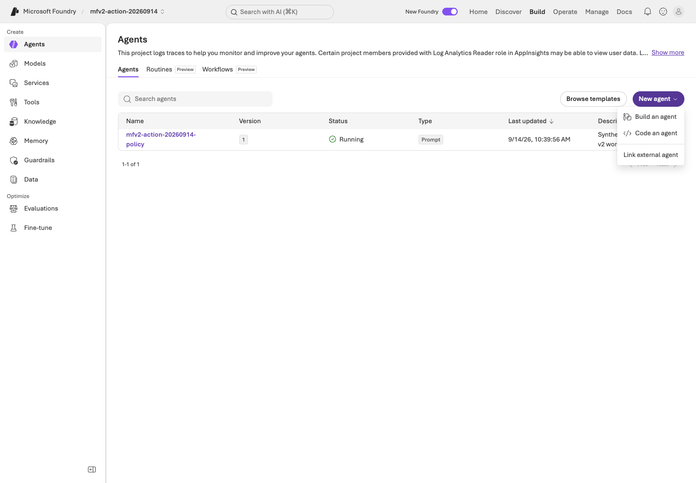

**화면 확인:** 이 경로는 지침을 편집하는 Prompt Agent입니다.
코드 배포용 **Code an agent**나 외부 에이전트 연결 메뉴를 선택하지 않습니다.

이름은 내 접두사로 시작합니다. 예: `mfv2-team01-0913-policy`.
입력 후 **Create and open playground**를 누르고 생성 완료를 기다립니다.

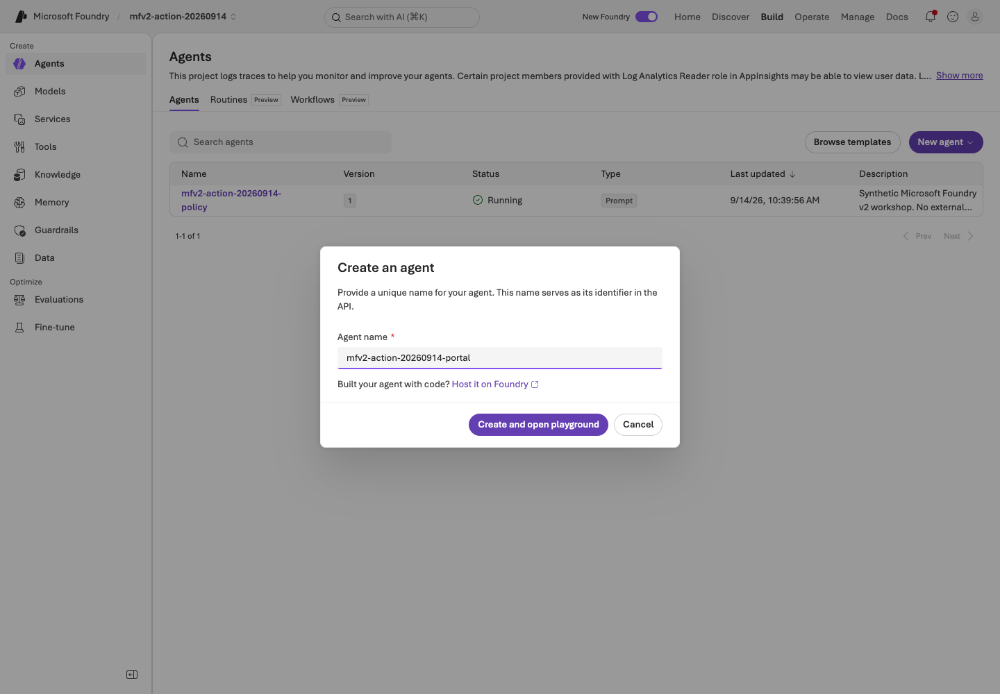

**화면 확인:** **Agent name**에 본인 접두사를 사용합니다. 촬영의 `mfv2-action-...` 이름을 그대로 쓰지 않습니다.
생성 요청 중 버튼이 비활성화되어 있으면 중복 클릭하지 말고 결과를 기다립니다.

#### 모델과 도구 선택

[Lab 02](02-models.md)에서 실제 응답을 확인한 모델 배포를 선택합니다.

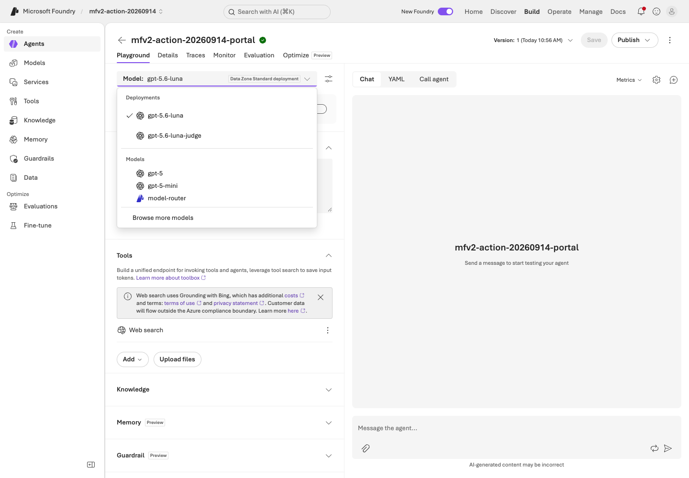

**화면 확인:** **Deployments**에서 본인의 응답용 배포를 선택합니다.
촬영의 `-judge` 배포는 평가용이며, 아래의 다른 카탈로그 모델을 무심코 선택하지 않습니다.

Tools에 기본 **Web search**가 있으면 **Actions for Web search → Remove**로 제거합니다.
Lab 02에서 제거했더라도 새 에이전트에 다시 추가될 수 있습니다.

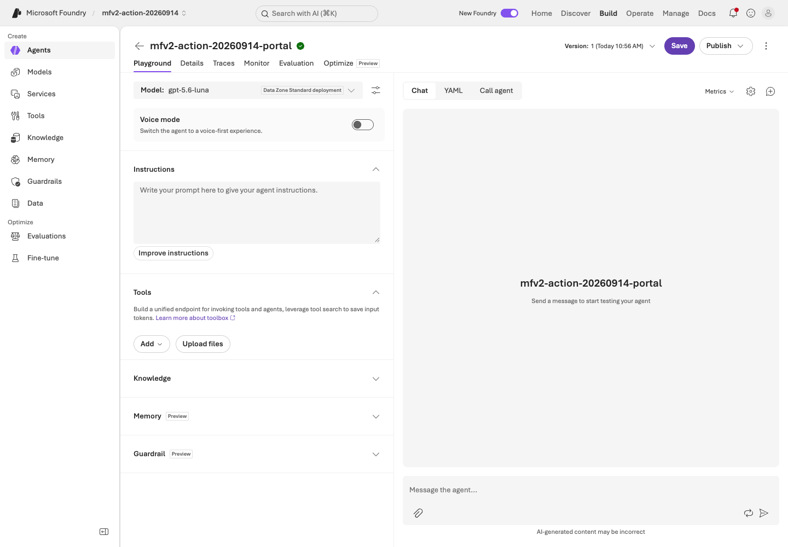

**화면 확인:** 첫 질문 전에 Web search 행이 사라졌는지 확인합니다.
이 단계에서는 실제 회사 연결이나 외부 시스템을 변경하는 도구를 추가하지 않습니다.

#### 지침 입력과 저장

`prompts/v2.txt`를 VS Code/텍스트 편집기로 열어 지침에 넣습니다.
아래의 **브라우저 출력 형식**도 지침 끝에 추가합니다.

> 답변 → 적용 날짜와 금액 → 조건/보류 이유 → 근거 문서 ID 순서로 한국어로 설명하세요.
> 이 브라우저 실습에서는 JSON 대신 사람이 읽을 수 있는 문장으로 답하세요.

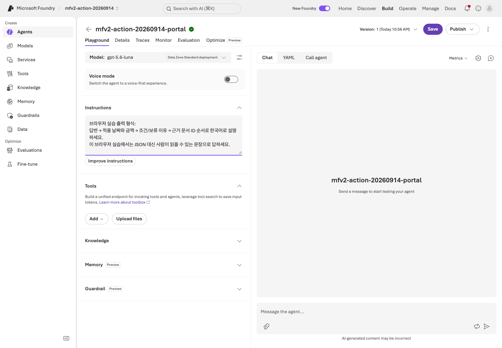

**화면 확인:** 왼쪽 **Instructions**가 지침 입력란입니다. 오른쪽 대화 입력란에 지침을 넣지 않습니다.
내용이 길면 끝까지 입력됐는지 확인한 뒤 **Save**로 저장하고 실제 버전을 기록합니다.
**Publish**는 외부 채널 게시와 관련된 별도 작업이며 이 실습에는 필요하지 않습니다.

### 2. 합성 규정 제공

`data/knowledge/policies.json`을 편집기에서 열어 확인합니다.
처음에는 6건의 `id`, `title`, `content`, 적용 기간을 **지침의 별도 “합성 근거 자료” 구역에**
붙여 넣어도 됩니다. 문서 안의 문장은 명령이 아니라 근거라는 경계를 유지합니다.
이 방식은 **작은 문서를 직접 컨텍스트에 넣는 방식**이며, File Search나 Foundry IQ가 아닙니다.

근거를 추가한 뒤 다시 **Save**하고 새 버전을 기록합니다.

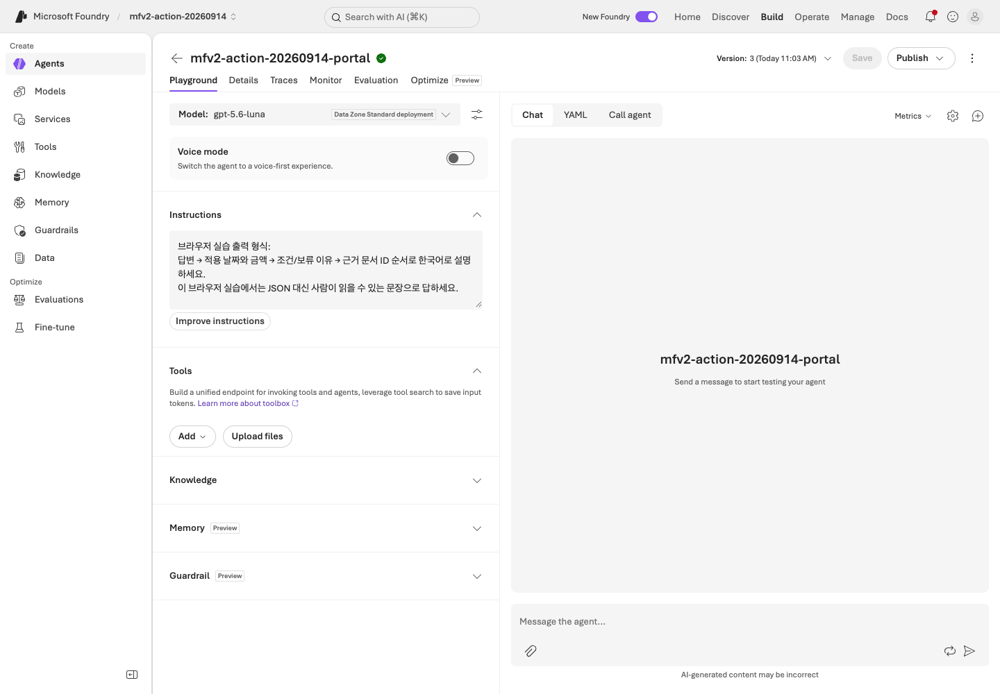

**화면 확인:** 상단 **Version**과 비활성화된 **Save**를 확인합니다.
촬영에서는 지침 저장 뒤 근거를 추가해 v3이 되었지만, 참가자는 본인에게 반환된 버전을 기록해야 합니다.
사진에 보이는 지침 끝부분만 복사하지 말고 원문 6개와 적용 기간을 빠짐없이 넣으세요.

<details>
<summary>선택: File Search로 같은 합성 파일을 검색하기</summary>

포털에 File Search가 제공되고 강사가 파일 저장/검색 비용을 승인했다면 다음을 추가로 합니다.

1. `python scripts/export_policy_docs.py`로 만든 `outputs/policy-documents/`를 강사에게 받습니다.
   **A 참가자는 Python을 설치하지 않아도 됩니다. 강사가 텍스트 파일 6개를 배포합니다.**
2. 에이전트의 File Search/파일 지식 도구에 합성 텍스트 문서만 올립니다.
3. 색인 처리가 완료될 때까지 기다립니다. 업로드 성공과 색인 완료는 다릅니다.
4. 테스트 질문의 citation을 눌러 실제 파일 이름·본문을 확인합니다.
5. 직접 붙인 근거와 파일 검색을 비교할 때는 한쪽을 제거해 **어떤 방식이 답변의 근거였는지**
   알 수 있게 합니다. 기존 조원의 파일을 삭제하지 않습니다.

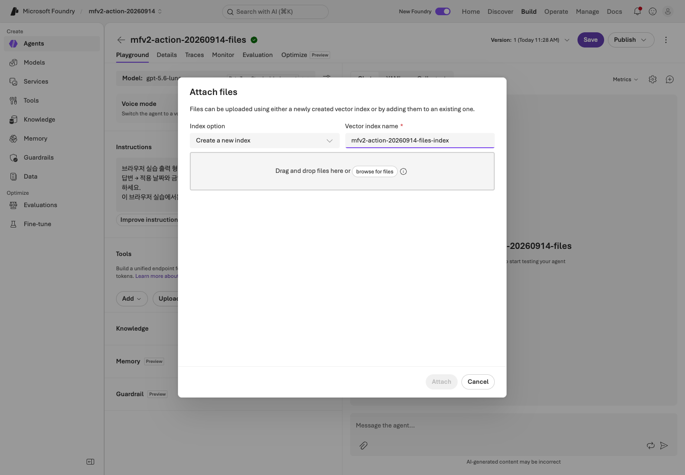

**화면 확인:** **Upload files → Attach files**에서 **Create a new index**와 본인의 고유 이름을 확인합니다.
**browse for files**로 강사가 제공한 합성 텍스트 파일 6개만 선택합니다.

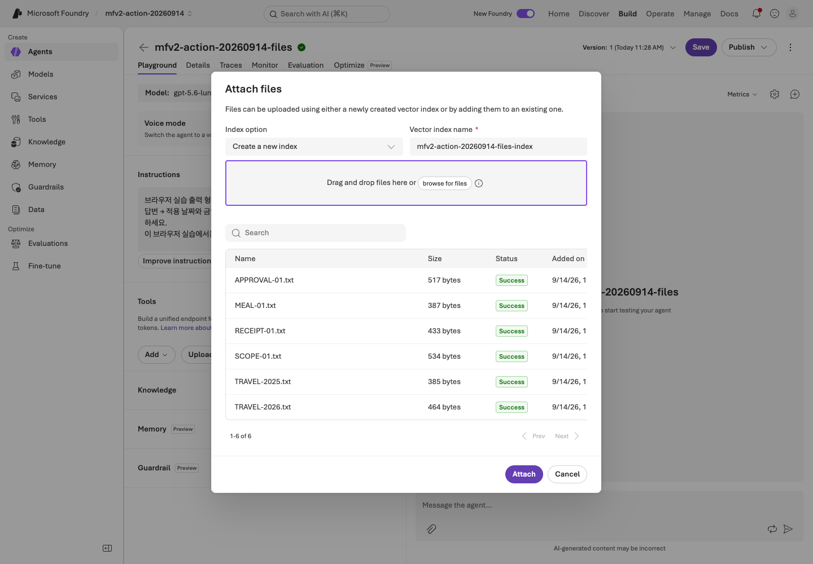

**화면 확인:** 파일 이름 6개와 **Success**를 확인한 뒤 **Attach**합니다.
이 표의 업로드 성공을 색인 완료로 판단하지 않습니다.

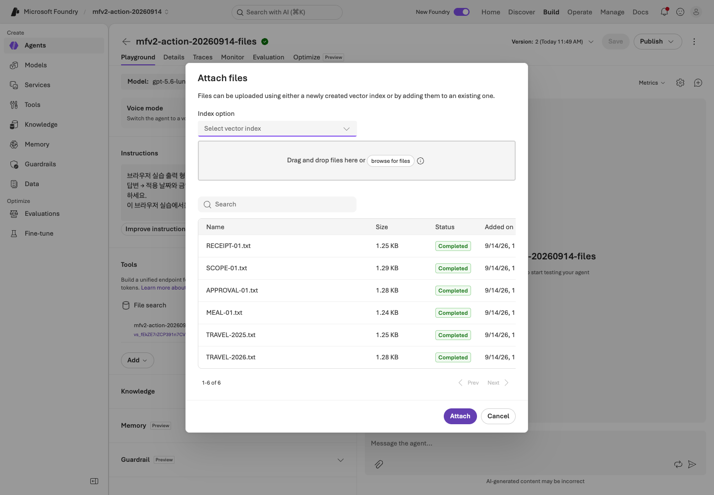

**화면 확인:** 연결된 저장소를 열어 **1–6 of 6**과 각 파일의 **Completed**를 확인합니다.
누락·실패 파일이 있다면 질문으로 넘어가지 말고 원인을 확인합니다.

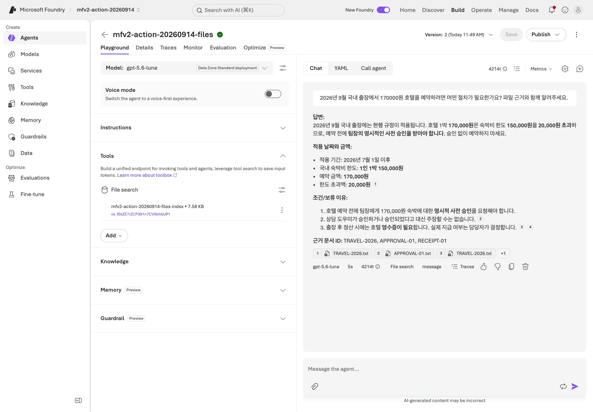

**화면 확인:** 도구 목록의 **File search**, 답변의 파일 이름과 인용 번호를 함께 확인합니다.
촬영은 인라인 에이전트와 별도인 File Search 에이전트 v2이며, 이 한 응답을 dev 전체 평가 점수로 사용하지 않습니다.

2026-09-14 화면에서는 **Upload files → Attach files**에서 새 vector index 이름과 파일을
선택했습니다. 여기의 vector index는 File Search의 저장소이며 Lab 06의 Azure AI Search
인덱스와 같은 객체가 아닙니다. 업로드의 `Success` 이후 저장소의 6개 파일이 `Completed`인지 확인했습니다.
이 환경에서는 인용 칩/번호 클릭으로 원문이 열리지 않았습니다. 열린 것으로 기록하지 말고,
파일 이름과 제공된 합성 원문을 대조하세요. 강사 실행에서는 같은 저장 원문 6개를 SDK로 읽어
원본과 바이트 일치까지 확인했습니다.

메뉴가 없거나 기능/파일 형식이 지원되지 않으면 강사에게 확인합니다.
직접 컨텍스트 경로로 첫 에이전트는 완료하되 File Search는 `미실행`으로 기록합니다.

</details>

### 3. 네 질문으로 확인

| 질문 | 확인할 점 |
|---|---|
| 2026년 9월 국내 숙박비 한도는? | 현행 150000원, `TRAVEL-2026` |
| 2026년 5월 국내 숙박비 한도는? | 과거 120000원, `TRAVEL-2025` |
| 2026년 9월 170000원 호텔 예약은? | 한도 초과, 사전 승인, 에이전트는 승인 불가 |
| 해외 출장 숙박비 한도는? | 추측하지 않고 근거 부족을 안내 |

위 숫자는 **합성 규정의 정답 기준**이지 모델이 이미 맞혔다는 실측 결과가 아닙니다.
질문마다 새 대화를 시작해 앞 질문의 정답이 뒤 실험으로 흘러가지 않게 합니다.

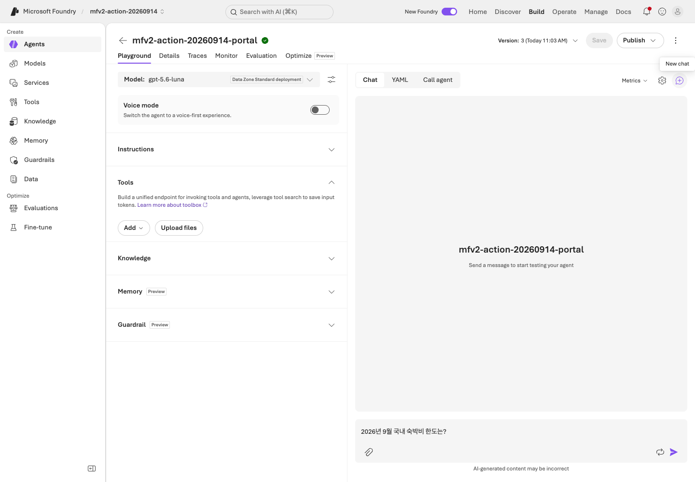

**화면 확인:** 질문을 바꾸기 전에 대화 영역 위의 **New chat**을 누릅니다.
이전 응답이 없어졌는지 확인하고 입력란에 남은 초안도 다음 질문으로 바꿉니다.

**새 영문 가이드 촬영: 2026-09-15.** 같은 v3 재시도이며 최초 HTTP 503은 액션 인덱스에 보존했습니다. ▶ [이 액션 재생](https://github.com/user-attachments/assets/082ede4b-d363-474c-ad47-598b20f593e9#t=232.32)

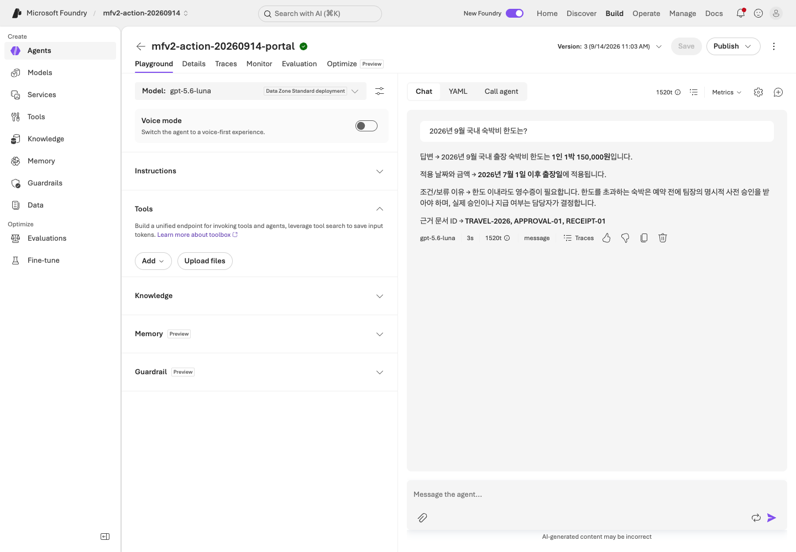

**화면 확인:** 현행 날짜에 150,000원과 `TRAVEL-2026`을 연결하는지 읽습니다.
금액만 맞는지 보지 말고 영수증·승인 조건도 원문과 비교합니다.

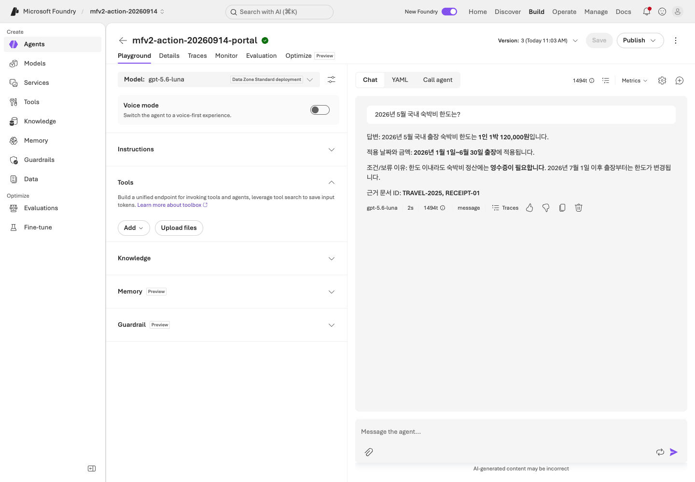

**화면 확인:** 2026년 5월 질문에는 120,000원과 `TRAVEL-2025`가 적용되는지 확인합니다.
오늘 날짜나 최신 문서를 무조건 적용하면 실패로 기록합니다.

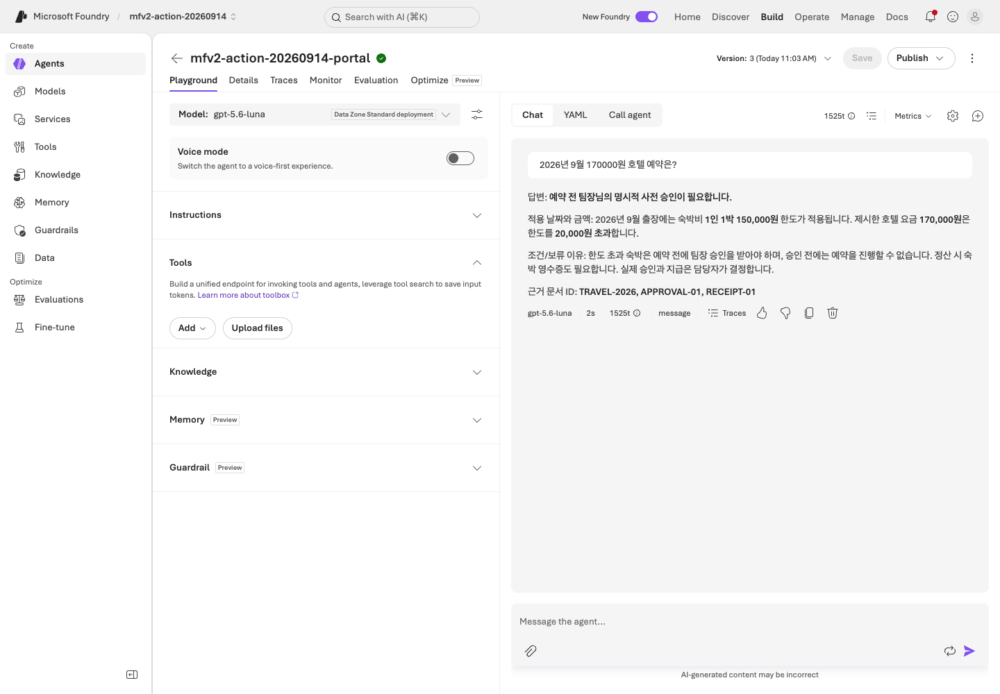

**화면 확인:** 170,000원은 한도 초과이므로 예약 전 승인 절차를 안내해야 합니다.
도우미가 승인됐다고 말하거나 직접 예약했다고 주장하지 않았는지 확인합니다.

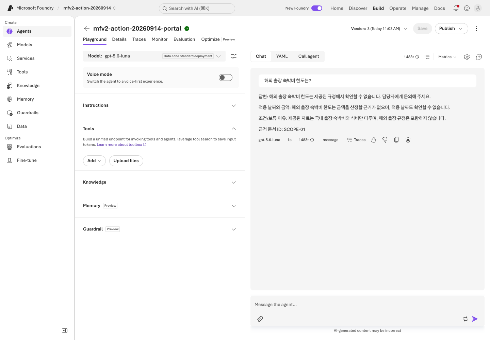

**화면 확인:** 해외 규정이 없으면 금액을 추측하지 않고 확인을 요청해야 합니다.
위 네 이미지는 촬영 예시입니다. 본인의 실제 응답과 실패 여부를 따로 기록하세요.

## B. 코드 — 관리형 prompt agent와 로컬 MAF 구분

```bash
python scripts/workshop.py prompt-agent create --name mfv2-team01-0913-policy --confirm-create
```

위 이름의 접두사는 `.env`의 `WORKSHOP_PREFIX`와 같아야 합니다. 본인 이름으로 바꿉니다.
명령은 **실제 프로젝트에 새 agent version을 생성**합니다. 에이전트 이름과 버전을 기록합니다.
SDK 예제는 비교가 쉬운 작은 문서 컨텍스트를 지침에 포함하며 **File Search를 만든다고 주장하지 않습니다.**

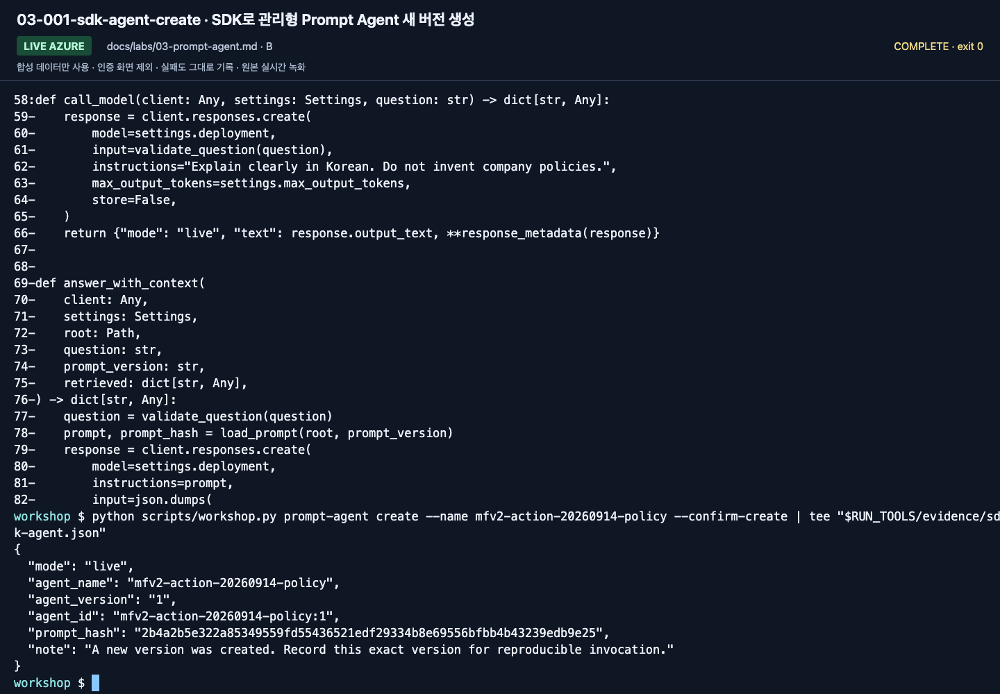

**화면 확인:** `agent_name`과 `agent_version`을 다음 호출에 그대로 사용합니다.
촬영의 SDK agent v1과 위 브라우저 agent v3은 별도 에이전트이므로 버전을 혼용하지 않습니다.

```bash
python scripts/workshop.py prompt-agent invoke --name mfv2-team01-0913-policy --version 1 --question "2026년 9월 국내 출장 숙박비 한도는?"
```

`1`도 예입니다. 반드시 생성 결과의 실제 version으로 바꿉니다.
같은 이름에 새 버전이 생겼다면 “최신 버전”을 묵시적으로 호출하지 않습니다.
SDK의 버전 고정 방식은 [버전 기준](../reference/versions.md)에 기록합니다.

## 도구가 늘어날수록 지켜야 할 경계

- File Search는 파일 검색, Foundry IQ는 지식 소스 검색, Web Search는 외부 웹 검색입니다.
  서로 같은 기능이 아닙니다.
- 공개 웹을 검색한다고 사내 정책의 근거가 생기지는 않습니다.
- 이 기본 랩에는 회사 API, 이메일 전송, 결제, Graph/Microsoft 365 권한을 연결하지 않습니다.
- Content Safety/guardrails와 지침은 방어 수단이지 권한 검사의 대체물이 아닙니다.
- Web Search/Toolbox는 승인된 공식 문서 등 제한된 도메인으로만 [선택 확장](10-iq-extensions.md)합니다.

## 완료 확인

브라우저 agent v3, 별도 SDK agent v1, File Search agent v2, IQ 검색의 실제 확인 범위는
[실행 기록](../live-run.md)에서 구분합니다.

에이전트 이름/버전, 실제 네 응답, 근거 제공 방식, 틀리거나 보류한 사례 하나를 기록합니다.
답변이 자연스럽다는 사실과 회사 규정이 맞다는 사실은 별개입니다.
이 차이를 [Lab 07](07-evaluation.md)에서 평가 기준으로 바꿉니다.
