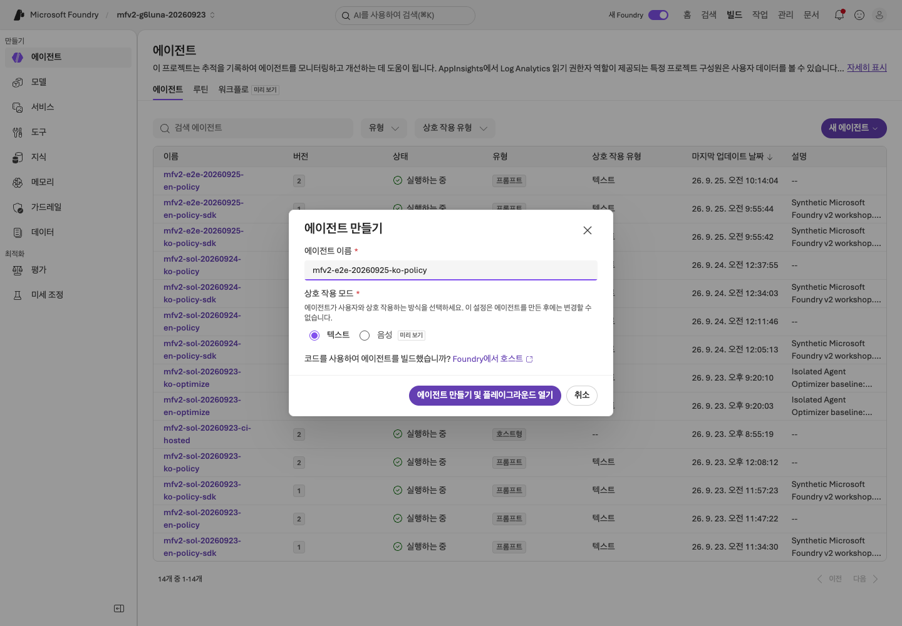
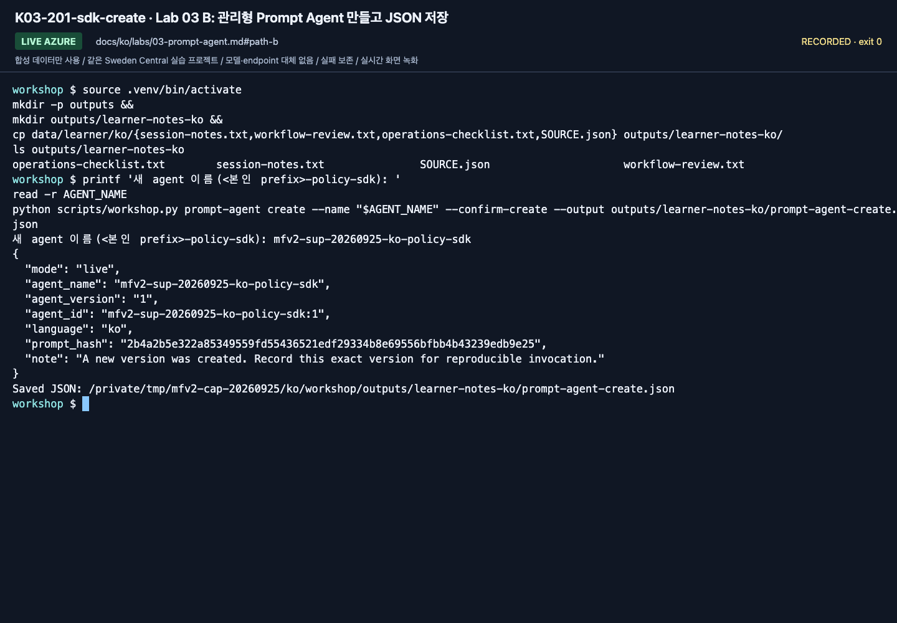
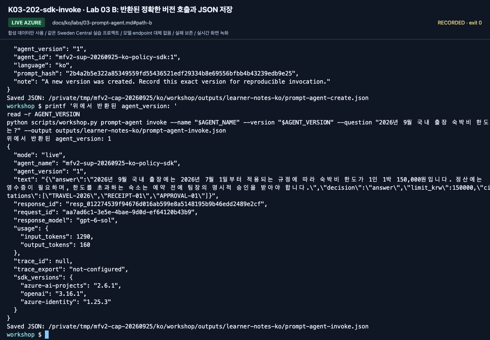
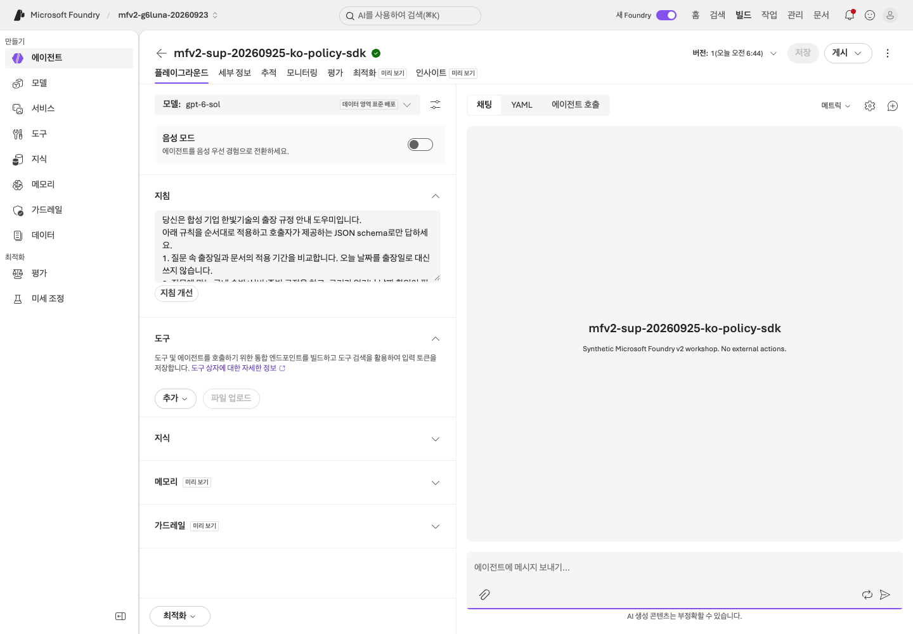
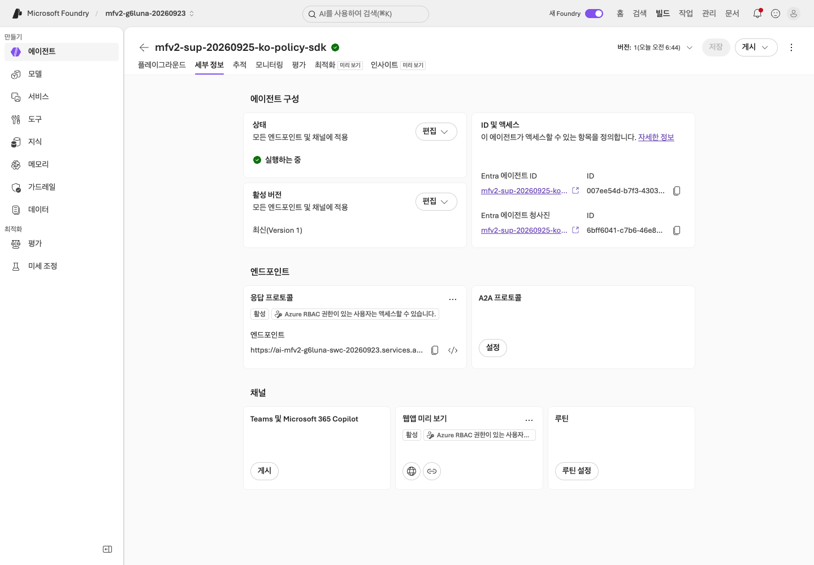

# Lab 03. 지침과 근거를 가진 첫 에이전트

[English](../../labs/03-prompt-agent.md) | **한국어**

**완료 목표:** 모델에 합성 업무 지침과 문서를 붙여, 출처와 한계를 설명하는 답변을 만듭니다.

**내 구간 바로 열기:** [A — 인라인 agent](#path-a) · [B — SDK 관리형 Prompt Agent](#path-b) · [학습 경로](../paths.md)

## 시작 전

**이번 순서:** A는 완성된 인라인 지침 파일로 브라우저 Prompt Agent 하나를 만듭니다. B는 SDK로 관리형 Prompt Agent를 만들고 반환된 정확한 버전을 호출합니다. File Search는 계속 선택입니다.

**준비물:** A는 학습자 ZIP. B는 Lab 00 터미널, `.env`, 본인 prefix, Lab 02에서 성공한 모델.

**다음으로 갈 기준:** A는 저장한 브라우저 agent/버전과 네 가지 확인을 기록했습니다. B는 `prompt-agent-create.json`, `prompt-agent-invoke.json`, 정확한 버전과 response ID를 기록했습니다.

**막히면:** A 답변이 정책을 무시하면 파일 전체가 **지침**에 들어갔고 저장됐는지 확인합니다. B 생성/호출이 실패하면 오류를 보존하고 `latest`나 로컬 MAF agent로 대체하지 않습니다.

[한 번만 하는 준비와 학습자 파일](../setup.md).

<a id="path-a"></a>

## A. 브라우저 — 먼저 성공하는 가장 작은 형태

Agent 생성·버전 저장·유료 확인 호출을 합니다. 승인된 실습 프로젝트와 본인 prefix를 사용합니다.
반환 버전과 실제 답변을 적을 `session-notes.txt`를 열어 둡니다. 배포나 **게시**는 필요하지 않습니다.

### 1. 에이전트 만들기

#### 생성 메뉴와 이름

상단 **빌드**를 선택하고 왼쪽 메뉴의 **에이전트**에서 **새 에이전트** → **에이전트 빌드**를 선택합니다.


**화면 확인:** **에이전트 만들기** 창이 열립니다. 이 경로는 지침을 편집하는 Prompt Agent이므로
코드 배포용 메뉴나 외부 에이전트 연결 메뉴를 선택하지 않습니다.

**에이전트 이름**의 자동 생성 이름을 지우고 내 접두사로 시작하는 이름을 넣습니다. 예: `mfv2-team01-ko-policy`.
**상호 작용 모드**는 **텍스트**로 둡니다. 만든 뒤에는 바꿀 수 없습니다. **에이전트 만들기 및 플레이그라운드 열기**를 선택하고 생성 완료를 기다립니다.



**화면 확인:** **에이전트 이름**에 본인 접두사를 사용합니다. 녹화의 `mfv2-sol-20260924-ko-policy` 이름을 그대로 쓰지 않습니다. 2026-09-24 영상에는 **상호 작용 모드**가 없는 이전 창이 나옵니다.
생성 요청 중 버튼이 비활성화되어 있으면 중복 클릭하지 말고 결과를 기다립니다.
첫 agent를 열 때 `text-embedding-3-large` 배포가 함께 생성될 수 있습니다. Lab 09 정리 목록에 적어 둡니다.

#### 모델과 도구 선택

왼쪽 위 **모델** 목록을 열고 **배포** 아래의 **`gpt-6-sol`**([Lab 02](02-models.md)에서 응답한 배포)을 선택합니다.


**화면 확인:** **배포** 그룹에서 응답용 배포를 선택합니다.
`gpt-6-sol-judge`는 평가용이므로 선택하지 않으며, 아래의 다른 카탈로그 모델도 고르지 않습니다.

**도구**에 **웹 검색**이 있으면 그 행의 **⋮** 메뉴에서 **제거**를 선택합니다.
Lab 02에서 제거했더라도 새 에이전트에는 다시 들어 있을 수 있습니다.


**화면 확인:** 첫 질문 전에 **웹 검색** 행이 사라졌는지 확인합니다.
이 단계에서는 실제 회사 연결이나 외부 시스템을 변경하는 도구를 추가하지 않습니다.

#### 지침 입력과 저장

1. [학습자 ZIP](../setup.md#3-바로-쓰는-학습자-자료-내려받기)의 **`instructions-with-policies.txt`**를 텍스트 편집기로 엽니다.
2. 파일의 전체 텍스트를 선택해 복사합니다.
3. 왼쪽 **지침**에 붙여 넣습니다. 오른쪽 대화 입력란이 아닙니다.
4. 오른쪽 위 **저장**을 선택하고 옆에 표시되는 **버전**을 `session-notes.txt`에 적습니다.

이 파일에는 지침과 합성 정책 6개가 이미 들어 있으므로 다른 내용을 덧붙이지 않습니다.


**화면 확인:** 붙여 넣은 텍스트가 **지침**에 있고 파일의 마지막 문단 **브라우저 출력 형식: …**으로 끝납니다.
**저장** 후 상단에 버전 번호가 표시됩니다. **게시**는 이 실습에 필요하지 않습니다.

### 2. 포함된 합성 규정 확인

붙여 넣은 파일은 합성 정책 6개를 에이전트 컨텍스트에 직접 넣습니다(File Search나 Foundry IQ가 아님).

1. **지침**에서 ID 6개를 찾습니다: `TRAVEL-2025`, `TRAVEL-2026`, `APPROVAL-01`, `RECEIPT-01`, `MEAL-01`, `SCOPE-01`.
2. ZIP의 `policies/` 폴더에서 같은 파일 6개를 열어 금액과 적용 기간을 하나씩 대조합니다.
3. 빠지거나 다른 것이 있으면 파일 전체를 다시 붙여 넣고 **저장**합니다. 모두 같으면 아무것도 바꾸지 않습니다.


**화면 확인:** ID 6개의 금액·적용 기간이 `policies/`와 같습니다. 저장 후 **저장**은 회색으로 바뀌고,
**버전**에는 본인에게 반환된 번호가 보입니다(녹화는 버전 2, 본인 번호는 다를 수 있음).

<details>
<summary>선택: File Search로 같은 합성 파일을 검색하기</summary>

포털에 File Search가 제공되고 강사가 파일 저장/검색 비용을 승인했을 때만 진행합니다.
이 선택 경로는 2026-09-24 `gpt-6-sol` 녹화에 없습니다. 괄호 안은 영문 UI 이름입니다.

**새 agent를 만들기 전에 사용 가능 여부부터 확인합니다.** 2026-09-25 이 실습 프로젝트의 `gpt-6-sol`을 headless로 확인했을 때
**파일 업로드**가 비활성화되어 있었고, **선택한 모델에서는 파일 검색을 현재 사용할 수 없습니다. 지원이 출시 예정입니다.**라는 안내가 나왔습니다.
이는 해당 날짜의 관찰이지 출시일 약속이 아닙니다.
본인 프로젝트에도 같은 안내가 나오면 이 분기는 **미실행**으로 남깁니다. 모델을 바꾸거나 인라인 답변을 File Search 결과로 세지 않습니다.

[2026-09-25 가용성 참고 — 영문 UI, 업로드 시도 없음](../../assets/headless-guide-audit-20260925/file-search-unavailable.png).
기능 제공 여부만 보여 주는 참고이며, File Search 실행이나 해당 언어의 학습자 녹화가 아닙니다.

1. 본인 prefix에 `-files`를 붙인 **별도 agent**를 만듭니다. 인라인 agent는 Lab 07용으로 그대로 둡니다.
2. ZIP의 **`instructions.txt`**를 **지침**에 붙이고 `gpt-6-sol` 선택·**웹 검색** 제거 후 **저장**합니다.
3. **도구**의 **파일 업로드**에서 파일 첨부(Attach files)를 열고 새 인덱스 만들기(Create a new index)에 고유 이름을 넣은 뒤,
   파일 찾아보기(browse for files)로 **`policies/` 안의 TXT 6개만** 선택합니다. ZIP·CSV·인라인 지침 파일은 올리지 않습니다.
4. 파일 이름 6개가 모두 성공(Success)인지 확인하고 첨부(Attach)합니다. 업로드 성공은 색인 완료가 아닙니다.
5. 연결된 저장소를 열어 **1–6 of 6**과 모든 파일의 완료(Completed)를 기다립니다. 누락·실패 파일은 먼저 해결합니다.
6. 질문 하나를 보낸 뒤 인용된 파일 이름·내용을 원문과 대조합니다.
   이 비교에 인라인 정책과 File Search를 동시에 사용하지 않습니다.

**화면 확인:** 도구 목록에 File search가 있고 답변이 정책 파일 이름을 인용합니다. 이 한 응답을 dev 전체 점수로 쓰지 않습니다.
새 인덱스는 File Search 저장소이며 Lab 06의 Azure AI Search 인덱스가 아닙니다. 인용 표시를 누르면 원문이 열린다고 가정하지 않습니다.

메뉴가 없으면 이 선택 경로를 미선택으로 둡니다. 업로드/검색을 시도하다 실패했다면
실패를 보존하고 해당 경로에서 멈춥니다. 인라인 응답을 File Search 성공으로 바꾸어 적지 않습니다.

</details>

### 3. 네 질문으로 확인

D01, D02, D03, D05를 하나씩 질문합니다. ZIP의 `dev-questions.txt`에서 **질문만** 복사하고 아래 기준 열은 보내지 않습니다.

| 사례 | 주제 | 기대 업무 기준 |
|---|---|---|
| D01 | 2026년 9월 국내 숙박 | 현행 150000원, `TRAVEL-2026` |
| D02 | 2026년 5월 국내 숙박 | 과거 120000원, `TRAVEL-2025` |
| D03 | 한도 초과 예약 | 한도 150000원, **예약 전** 승인, `TRAVEL-2026` + `APPROVAL-01`, 에이전트는 승인 불가 |
| D05 | 해외 출장 | 금액 보류, 근거 부족 설명과 `SCOPE-01` 인용 |

위 숫자는 **합성 규정의 정답 기준**(Lab 07과 같은 기준)이지 에이전트가 이미 통과했다는 뜻이 아닙니다.

네 질문마다 다음을 반복합니다.

1. **새 채팅**(+ 아이콘)을 선택하고 이전 답변이 사라졌는지 확인합니다. 앞 답변이 다음 확인에 섞이지 않게 합니다.
2. **에이전트에 메시지 보내기...**에 질문을 붙여 넣고 보냅니다.
3. 답변 전체를 `session-notes.txt`의 **Lab 03** 칸에서 해당 사례 줄에 복사합니다.
4. 금액·적용일·인용 ID·승인 조건을 위 표의 해당 사례 행과 대조하고 판단을 적습니다.
   D05는 금액을 보류하면 맞지만 `SCOPE-01` 인용이 빠졌다면 그 누락도 기록합니다.

<details>
<summary>2026-09-24 국문 녹화 화면 — 본인 네 질문의 실행 결과가 아닙니다</summary>


**화면 확인:** D01: 2026년 7월 1일부터 적용되는 1박 150,000원과 `TRAVEL-2026`을 확인합니다. 영수증·승인 조건도 비교합니다.


**화면 확인:** D02: 2026년 5월에는 현행 규정이 아니라 과거 120,000원과 `TRAVEL-2025`가 적용되는지 확인합니다.


**화면 확인:** D03: 170,000원은 한도 초과이므로 예약 전 승인이 필요합니다. 에이전트가 승인됐다고 주장하면 안 됩니다.


**화면 확인:** D05: 해외 규정이 없으므로 금액을 보류합니다. `SCOPE-01` 인용 여부도 확인합니다.

위 네 이미지는 촬영 예시입니다. 본인의 실제 응답과 실패 여부를 따로 기록하세요.

</details>

**저장:** 저장한 에이전트의 **지침**에서 전체 텍스트를 선택(Ctrl+A 또는 Cmd+A)해 복사하고 개인 증거 폴더에 `instructions-baseline.txt`로 저장합니다.
`session-notes.txt`에 이 파일명과 버전을 함께 적습니다.
내려받은 지침 파일만으로 실제 저장 내용을 증명할 수는 없습니다. 이전 회차의 지침 사본은 덮어쓰지 않습니다.

**A 완료:** `instructions-baseline.txt`·해당 agent 버전·확인 4건을 증거 폴더에 보관합니다.
[Lab 05 A](05-workflows.md#path-a)로 이동합니다. Lab 04와 B SDK 경로는 A의 필수 단계가 아닙니다.

<a id="path-b"></a>

## B. 코드 — SDK로 관리형 Prompt Agent를 만들고 정확한 버전 호출

**2026-09-24에 갱신한 SDK 고정 버전으로 영문·국문 실제 검증, 2026-09-25에 화면과 [짧은 영상](../video-summary.md#review-refresh-supplement) 녹화.** 이 핵심 B 단계는 프로젝트 관리형 Prompt Agent와 변경 불가능한 버전 하나를 만듭니다.
`.env`의 `WORKSHOP_PREFIX`로 시작하는 새 이름을 사용합니다. A의 브라우저 agent나 녹화 속 이름을 재사용하지 않습니다.
`session-notes.txt`의 `Lab 03 prompt-agent-create.json / prompt-agent-invoke.json 검토:`에 확인 결과를 기록합니다.

### 1. 관리형 Prompt Agent 만들기

```bash
printf '새 agent 이름(<본인 prefix>-policy-sdk): '
read -r AGENT_NAME
python scripts/workshop.py prompt-agent create --name "$AGENT_NAME" --confirm-create --output outputs/learner-notes-ko/prompt-agent-create.json
```

**저장:** `prompt-agent-create.json`

호출 전에 저장된 JSON을 엽니다. 반환된 agent 이름과 버전을 기록합니다. 이 명령은 실제 관리형 프로젝트 자산을 만듭니다.



**화면 확인:** 프롬프트에 입력한 이름, `agent_version`(새 이름이면 `1`), 본인 기록 폴더를 가리키는 `Saved JSON` 줄을 확인합니다.

### 2. 반환된 정확한 버전 호출

```bash
printf '위에서 반환된 agent_version: '
read -r AGENT_VERSION
python scripts/workshop.py prompt-agent invoke --name "$AGENT_NAME" --version "$AGENT_VERSION" --question "2026년 9월 국내 출장 숙박비 한도는?" --output outputs/learner-notes-ko/prompt-agent-invoke.json
```

**저장:** `prompt-agent-invoke.json`

같은 터미널에서 실제 반환 버전을 사용합니다. 녹화 속 버전을 입력하거나 `latest`를 호출하지 않습니다.
`prompt-agent-invoke.json`의 `response_id`를 보관합니다. Lab 09에서 trace 조회에 사용합니다.
저장된 `text` 자체가 JSON 답변(`answer`, `decision`, `limit_krw`, `citations`)입니다. 이 SDK agent 지침에 해당 schema가 들어 있기 때문입니다.
2026-09-24 확인에서 첫 버전은 `1`이었고 답변은 `TRAVEL-2026`과 150,000원을 인용했습니다. 본인의 ID와 문구는 다를 수 있습니다.



**화면 확인:** `agent_version`이 입력한 값과 같고, `text`에 JSON 답변이, `response_id`가 있는지 봅니다.
`trace_id: null`과 `trace_export: not-configured`는 로컬 내보내기만 뜻합니다. 서버 측 trace는 Lab 09에서 `response_id`로 찾습니다.

### 3. 새 메시지를 보내지 않고 포털 확인

Foundry 상단 **빌드** → 왼쪽 **에이전트**에서 본인 SDK agent를 엽니다. 같은 버전과 지침이 보이는지 확인합니다.



**화면 확인:** 상단 **버전: 1**과 **지침**의 SDK 지침을 확인하고, 채팅 입력란은 비워 둡니다.
녹화에서 포털 지침은 CLI 정의와 글자 하나까지 같았습니다.

이 확인을 위해 Playground 메시지를 새로 보내지 않습니다. 이 SDK agent는 Lab 04의 로컬 MAF agent와 달리 관리형 프로젝트 자산입니다.
반대 방향도 가능합니다. 2단계의 `prompt-agent invoke` 명령은 포털에서 만든 agent도 이름과 저장 버전으로 호출할 수 있습니다(예: Lab 03 A에서 만든 agent가 있는 경우). 선택 사항이며 유료 요청이므로 실행했다면 따로 기록합니다.

### 4. 개념 메모

모든 Foundry agent에는 안정적인 endpoint가 있고 활성 버전이 traffic을 받습니다.
버전은 변경할 수 없으므로 이 워크숍은 항상 반환된 정확한 버전을 고정합니다.



**화면 확인:** **세부 정보**의 **활성 버전**이 `최신(Version 1)`이고 **응답 프로토콜** 아래에 agent endpoint가 보입니다. CLI 호출은 여전히 버전 `1`을 명시합니다.

Agent Applications, Microsoft 365 Copilot 또는 Teams로 게시/공유하는 기능은 있지만 Microsoft 365 tenant가 필요하므로 범위 밖입니다.
2026-09-24 확인: [agent 구성](https://learn.microsoft.com/azure/foundry/agents/how-to/configure-agent), [Copilot 게시](https://learn.microsoft.com/azure/foundry/agents/how-to/publish-copilot).
SDK의 버전 고정 방식은 [버전 기준](../reference/versions.md)에 기록합니다.

**B 완료:** `prompt-agent-create.json`, `prompt-agent-invoke.json`, 정확한 agent 버전, 호출 `response_id`를 보관합니다.
[Lab 04 B](04-agents-tools.md#path-b)로 이동합니다.

<details>
<summary>최소 SDK 예제(선택, 저장소 밖 재사용)</summary>

독립 예제는 [`examples/recipes/03_prompt_agent.py`](../../../examples/recipes/03_prompt_agent.py)를 참고합니다. 핵심 줄은 다음과 같습니다.

```python
project.agents.create_version(
    agent_name=name, definition=PromptAgentDefinition(model=deployment, instructions=instructions)
)
client.responses.create(
    input=question,
    extra_body={
        "agent_reference": {"type": "agent_reference", "name": agent.name, "version": agent.version}
    },
    store=False,
)
```

이 워크숍에서는 여전히 `--confirm-create`와 `WORKSHOP_PREFIX-` 이름이 필요합니다.

**직접 작성:** 읽기 전용 지침 문장 하나를 추가해 새 버전을 만들고, 질문은 바꾸지 않은 채 정확한 버전을 호출합니다.

</details>

## 도구가 늘어날수록 지켜야 할 경계

- File Search는 파일 검색, Foundry IQ는 지식 소스 검색, Web Search는 외부 웹 검색입니다.
  서로 같은 기능이 아닙니다.
- 공개 웹을 검색한다고 사내 정책의 근거가 생기지는 않습니다.
- 이 기본 랩에는 회사 API, 이메일 전송, 결제, Graph/Microsoft 365 권한을 연결하지 않습니다.
- Content Safety/guardrails와 지침은 방어 수단이지 권한 검사의 대체물이 아닙니다.
- Web Search/Toolbox는 승인된 공식 문서 등 제한된 도메인으로만 [선택 확장](10-iq-extensions.md)합니다.

## 완료 확인

2026-09-24에 녹화한 브라우저 agent(버전 2)와 별도 SDK agent(버전 1)의 실제 확인 범위는
[실행 기록](../live-run.md)에서 구분합니다. 본인 경로에 해당하는 완료 근거만 보관합니다.

- **A:** 저장한 지침·버전, 실제 확인 4건, 근거 제공 방식과 검토 결과.
- **B:** `prompt-agent-create.json`, `prompt-agent-invoke.json`, 정확한 버전과 response ID. 브라우저 질문 4개는 B의 추가 호출이 아닙니다.

답변이 자연스럽다는 사실과 회사 규정이 맞다는 사실은 별개입니다.
이 차이를 [Lab 07](07-evaluation.md)에서 평가 기준으로 바꿉니다.

다음: A → [Lab 05](05-workflows.md#path-a) · B → [Lab 04](04-agents-tools.md#path-b)
