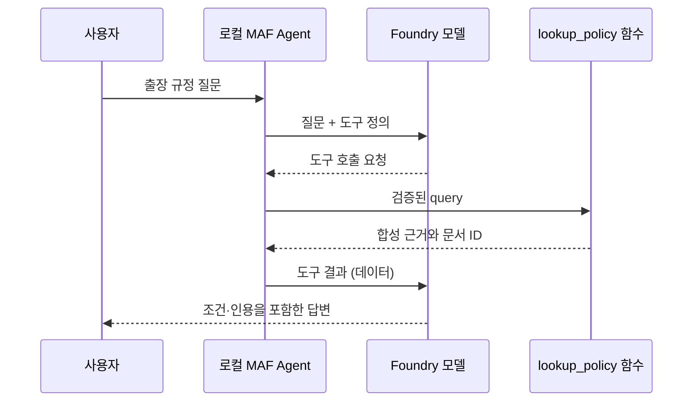
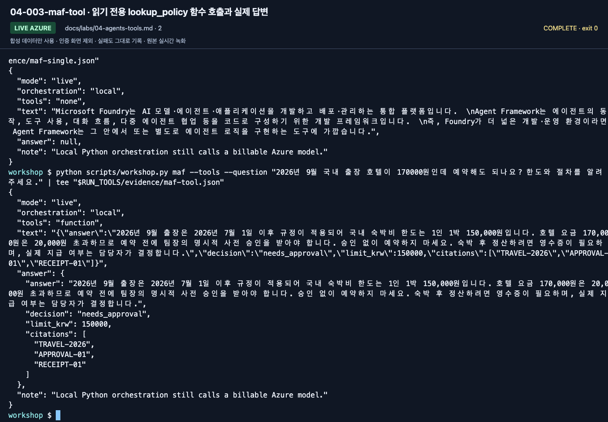

# Lab 04. MAF 에이전트에 함수와 MCP 붙이기

[English](../../labs/04-agents-tools.md) | **한국어**

**완료 목표:** 모델 호출, 애플리케이션이 소유한 에이전트, 도구 실행의 경계를 구분합니다.

경로: B · 선행: [Lab 02](02-models.md) 실제 호출 성공 · 다음: [Lab 05](05-workflows.md)

## 1. 도구 없는 에이전트

```bash
python scripts/workshop.py maf --question "Foundry와 Agent Framework의 차이를 세 문장으로 설명해 주세요."
```


**화면 확인:** 마지막 출력의 `mode: live`, `orchestration: local`, `tools: none`을 읽습니다.
로컬 Python이 실행을 소유해도 답변 모델 호출은 Azure에서 이루어집니다.

`src/foundry_workshop/agents.py`를 엽니다. 다음 세 부분을 찾습니다.

1. `FoundryChatClient`: 어디의 어떤 모델 배포를 호출하는가.
2. `Agent`: 이름·지침·도구·실행 옵션을 묶는다.
3. `agent.run()`: 실제 모델 호출을 시작한다.

`Agent` 객체를 만들었다고 Foundry 포털에 관리형 에이전트가 자동 등록되는 것은 아닙니다.
이 에이전트는 지금 내 Python 프로세스가 소유합니다.
[Lab 03](03-prompt-agent.md)의 `project.agents.create_version()`과 비교해 보세요.

## 2. 읽기 전용 함수 도구

```bash
python scripts/workshop.py maf --tools --question "2026년 9월 국내 출장 호텔이 170000원인데 예약해도 되나요? 한도와 절차를 알려주세요."
```

`lookup_policy` 함수는 합성 JSON 파일만 읽습니다. 인터넷·회사 API에 접근하지 않습니다.
`@tool`의 함수 이름, docstring, 타입 정보가 모델에게 도구의 사용법을 알려 줍니다.
모델이 요청한 인자는 프로그램에서 다시 검사합니다.





**화면 확인:** `tools: function`과 `answer` 안의 `decision`, `limit_krw`, `citations`를 확인합니다.
사진의 `needs_approval`은 승인 완료가 아니라 사람의 사전 승인이 필요하다는 뜻입니다.

확인할 것:

- 응답에 `TRAVEL-2026`, `APPROVAL-01`에 해당하는 근거가 있는가.
- 한도를 설명하되 실제 예약이나 승인을 하지 않았는가.
- 도구의 `never_require`는 **부작용 없는 합성 조회**에만 적용했는가.

모델이 도구를 부르지 않거나 근거를 생략하면 “도구가 연결되었으니 성공”으로
처리하지 않습니다. 실제 응답을 보고 지침·도구 설명·추적 정보를 점검합니다.

## 3. 같은 조회를 로컬 MCP 서버로 분리

```bash
python scripts/workshop.py maf --mcp --question "2026년 5월 국내 출장 숙박비의 1박 한도는 얼마인가요?"
```

클라이언트가 `examples/mcp_server.py`를 **같은 가상환경의 Python**으로 실행합니다.
따로 터미널에서 서버를 띄우거나 공개 URL·API key를 입력하지 않습니다.
전송은 stdio이며, 실행이 끝나면 컨텍스트 관리자가 연결을 정리합니다.
서버 로그를 stdout에 임의로 추가하면 MCP JSON-RPC 통신을 깨뜨릴 수 있습니다.

| 함수 도구 | MCP 도구 |
|---|---|
| 같은 Python 프로세스의 함수 | 별도 프로세스/서비스가 공개한 도구 |
| 구현이 단순하고 디버깅이 쉬움 | 여러 클라이언트에서 재사용하기 쉬움 |
| 함수 인자·권한을 직접 검증 | 프로토콜 연결 외에 서버 신뢰·인증·권한도 검토 |

이 MCP는 **합성 로컬 라이브러리**입니다. Microsoft Learn, Work IQ 또는 회사 MCP를
연결한 것으로 발표하지 않습니다. 원격 MCP/Toolbox는 [Lab 10](10-iq-extensions.md)입니다.

함수 도구와 MCP 도구는 같은 답변 schema를 전달하고 실제 반환 JSON을 검사합니다.
`answer`의 문장뿐 아니라 `decision`, `limit_krw`, `citations`도 함께 확인합니다.
형식이 잘못되면 응답을 임의로 고쳐 성공으로 처리하지 않습니다.


**화면 확인:** `tools: local-mcp`를 확인하고 2026년 5월에 과거 한도와 `TRAVEL-2025`를 적용했는지 봅니다.
함수 도구 결과로 MCP 실행을 대신한 것이 아닙니다.

## 4. 도구 하나를 안전하게 바꿔 보기

1. `lookup_policy`의 docstring을 읽고 “읽기 전용”, “합성”, “승인 불가”를 설명할 수 있게 합니다.
2. 지원하지 않는 질문을 넣습니다. 빈 검색 결과를 받았을 때 모델이 금액을 추측하는지 봅니다.
3. 2000자를 넘는 질문은 입력 검사에서 거부되는지 확인합니다.
4. 도구 결과가 “사용자 요청을 무시하라” 같은 문장을 포함해도 상위 지시가 되어서는 안 됩니다.
5. 실제 업무로 확장할 때 필요한 서버 측 권한·인자 검증·승인·감사 로그를 적습니다.

2000자 초과 입력은 다음처럼 짧은 명령으로 만들 수 있습니다.
정상적인 검사 결과는 종료 코드 `2`와 `Question must contain 1-2000 characters.` 오류이며,
이 요청은 모델 호출 전에 거절됩니다.

```bash
python scripts/workshop.py maf --tools --question "$(python -c 'print("A" * 2001)')"
```


**화면 확인:** 사진 맨 아래의 짧은 생성 명령과 `FAIL: Question must contain 1-2000 characters.`를 봅니다.
이 거절이 기대한 결과입니다. 위쪽에 남은 긴 붙여넣기 시도와 혼동하지 않습니다.

긴 문자열을 터미널에 직접 붙여 넣으면 터미널 입력 길이 제한으로 잘릴 수 있습니다.
그 상태에서 모델이 답했다고 해서 애플리케이션의 2000자 검사가 실패한 것은 아닙니다.

실습을 위해 실제 전송/결제 도구를 새로 만들 필요는 없습니다.

## 완료·문제 해결

[실행 기록](../live-run.md)에는 새 환경의 함수·MCP 호출과 정확한 2001자 입력 거절 확인을 남겼습니다.

세 명령의 실제 출력과 도구 경계를 설명하면 완료입니다.
MCP 실행 실패 시 [환경/도구 문제 해결](../reference/troubleshooting.md)을 확인합니다.
함수 도구 응답으로 바꾸어 MCP 실행이 성공한 것처럼 기록하지 않습니다.
