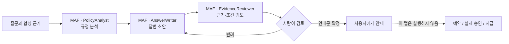
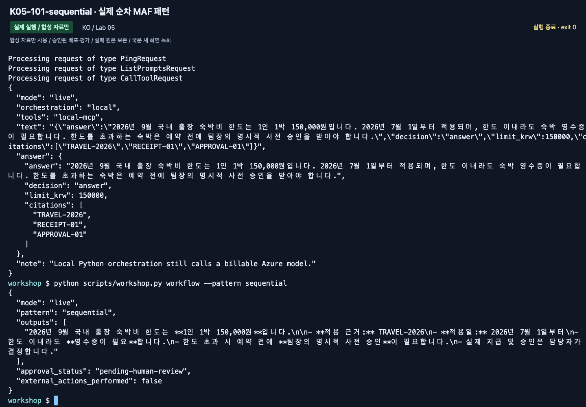
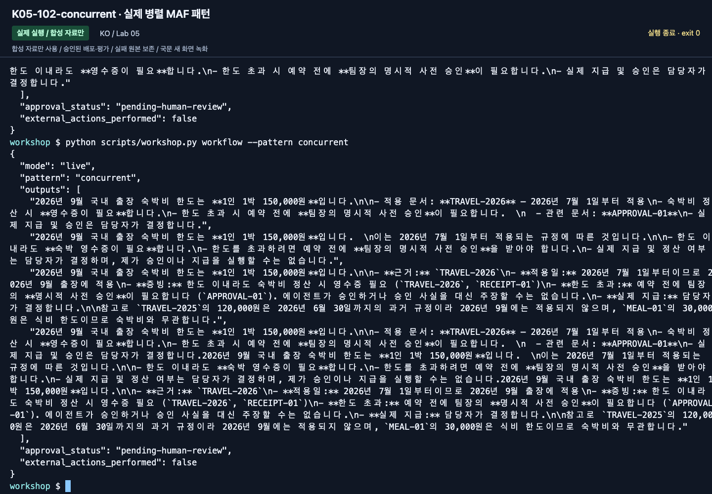
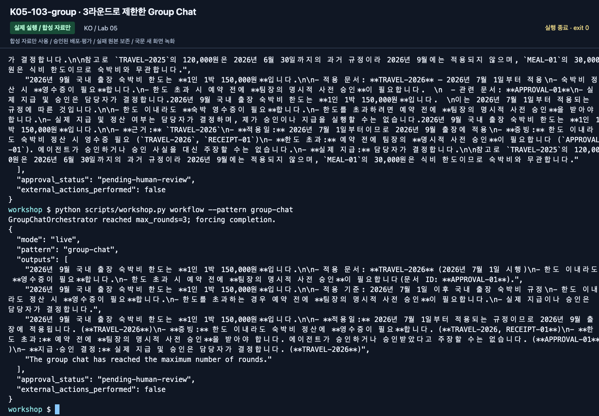
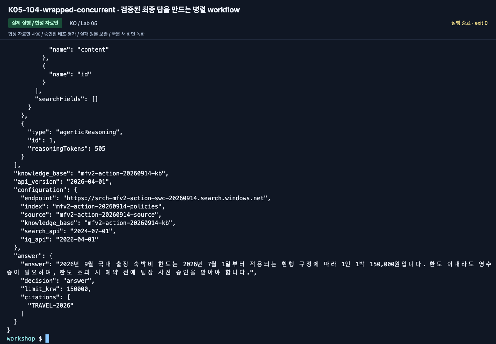
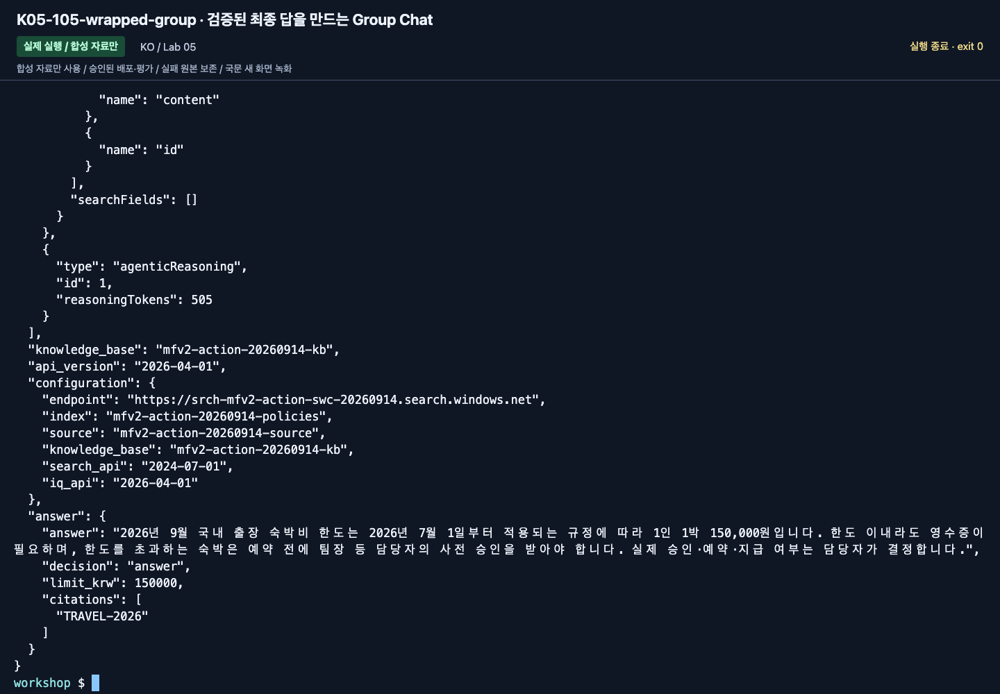

# Lab 05. MAF로 만드는 워크플로와 사람의 검토

[English](../../labs/05-workflows.md) | **한국어**

**완료 목표:** MAF 코드로 에이전트를 연결해 실행하고, 검토자 모델과 실제 승인자를 구분합니다.

다음: A → [Lab 06](06-knowledge.md) · B → [Lab 06](06-knowledge.md) · [학습 경로](../paths.md)

## 시작 전

**이번 순서:** A는 준비된 터미널에서 순차 명령 하나, B는 세 패턴을 비교합니다. 배포용 wrapper는 심화입니다.

**준비물:** A도 Lab 00 B의 활성 환경이 필요합니다. 제공받지 않았다면 그 설치를 한 번 완료한 뒤 돌아옵니다.

**다음으로 갈 기준:** 실제 MAF 출력과 사람의 검토 기록이 남았습니다. pending-human-review는 승인이 아닙니다.

**막히면:** 포털 Workflow Designer나 답변 수동 복사로 명령 실행을 대신하지 않습니다.

[한 번만 하는 준비와 학습자 파일](../setup.md).

## 이 랩은 MAF 워크플로만 사용합니다

Foundry 포털의 Workflow Designer에서 노드를 생성·연결·게시하는 경로는 사용하지 않습니다.
워크플로의 역할·순서·종료 조건은 **Microsoft Agent Framework(MAF) Python 코드**가 소유합니다.
Foundry는 그 코드가 호출하는 모델과 선택적인 호스팅·관측을 제공합니다.
포털의 Agent Playground를 사용하는 것과 포털에서 workflow를 작성하는 것은 다릅니다.

## A. 초보자 — 준비된 MAF 예제를 직접 실행

코드를 직접 작성하지 않아도 됩니다. 강사가 **준비된 MAF 실행 환경**을 제공합니다:
이 저장소, Python/SDK, 학습자 권한의 Azure 로그인, `.env`, 활성화된 가상환경입니다.
브라우저 IDE나 VS Code의 준비된 터미널을 사용하며, 관리자 계정을 참가자에게 공유하지 않습니다.
제공받은 환경이 없다면 [Lab 00 B](00-start.md#b-코드--한-폴더-한-환경)와
Lab 02 B를 한 번 완료한 뒤 돌아옵니다. Python 설치만 마치고 넘어오지 않습니다.

같은 출장 질문을 다음 세 역할이 처리합니다.



### 1. 명령 하나로 순차 워크플로 실행

준비된 터미널이 저장소 루트인지 확인한 뒤 다음 명령을 복사합니다.
이 명령은 실제 Azure 모델을 호출하므로 강사의 호출 예산 안에서 실행합니다.

```bash
python scripts/workshop.py workflow --pattern sequential --question "2026년 9월 국내 출장 호텔이 170000원입니다. 적용 한도와 예약 전 필요한 절차를 알려주세요."
```



**화면 확인:** 마지막 명령의 `pattern: sequential`과 `outputs`를 읽습니다.
터미널에서 실행한 MAF 결과이며 포털의 Workflow Designer를 조작한 화면이 아닙니다.

### 2. 실제 결과 읽기

| 출력 | 초보자가 확인할 내용 |
|---|---|
| `mode: live`, `pattern: sequential` | 준비된 MAF 코드가 실행한 결과인가 |
| `outputs` | 현행 한도와 사전 승인 조건을 근거와 함께 설명하는가 |
| `approval_status: pending-human-review` | 모델 검토를 실제 사람 승인으로 오해하지 않았는가 |
| `external_actions_performed: false` | 실제 예약·지급을 수행하지 않았는가 |

JSON 출력 전체를 읽고 원문 ID를 학습자 ZIP의 정책과 대조합니다.
본인의 `workflow-review.txt`에 명령·실제 출력·인용 정책 ID와
맞는 부분/수정할 부분/이유를 저장합니다. 안내문 검토이지 업무 승인이 아닙니다.
과거 날짜로 한 번 더 실행하는 것은 선택이며 A는 순차 실행 한 번과 검토로 완료합니다.


**화면 확인:** 170000원 요청에 적용 규정의 사전 승인이 필요한지 읽습니다.
저장하는 출력에 `approval_status: pending-human-review`, `external_actions_performed: false`를 그대로 남깁니다.

### 3. 완료 판정

**실제 MAF 실행 결과와 사람의 검토 기록**이 있어야 이 단계가 완료됩니다.
여러 포털 대화의 답변을 사람이 복사해 이어 붙이는 것을 MAF 실행으로 기록하지 않습니다.
환경이 준비되지 않아 강사 실행만 봤다면 `MAF 관찰 / 직접 실행 미완료`로 구분합니다.
이 단계는 로컬 MAF 실행이며 관리형 workflow 리소스나 Hosted Agent를 만든 것이 아닙니다.
**A는 [Lab 06](06-knowledge.md), B는 아래 비교로 진행합니다.**

## B. 코드 — 세 가지 오케스트레이션 비교

모든 명령은 실제 Azure 모델을 호출합니다.
워크플로를 정의하는 코드는 `src/foundry_workshop/agents.py`의 `run_workflow`입니다.
같은 데이터·모델·지침을 유지한 채 MAF builder와 실행 순서의 차이를 확인합니다.
이 명령은 포털 workflow 리소스를 생성하지 않습니다.

### 포털 중심 개념을 MAF 코드로 옮기기

| 옮길 개념 | 이 실습에서 사용하는 MAF 구현 |
|---|---|
| 에이전트 노드 | `Agent` + `FoundryChatClient`, 역할별 지침 |
| 순서대로 연결 | `SequentialBuilder(participants=...)` |
| 같은 입력을 여러 역할에 전달 | `ConcurrentBuilder(participants=...)` |
| 여러 역할의 짧은 토론 | `GroupChatBuilder` + 발화자 선택 함수 + 최대 라운드 |
| 업무 승인 경계 | 출력 이후 사람의 검토; 아래의 운영용 승인 설계를 별도 구현 |

조건 분기·상태 저장·durable 승인까지 자동으로 마이그레이션되는 것은 아닙니다.
필요한 업무 상태와 오류/재시도 정책을 코드에서 명시적으로 설계해야 합니다.

### 1. 순차: 앞 단계 결과가 다음 단계의 입력

```bash
python scripts/workshop.py workflow --pattern sequential
```

`PolicyAnalyst → AnswerWriter → EvidenceReviewer`를 사용합니다.
`SequentialBuilder`의 participants 순서와 실제 출력의 흐름을 비교합니다.
원문 오류를 초안이 그대로 이어받을 수 있다는 점도 관찰합니다.


**화면 확인:** 순차 실행의 응답 내용을 위의 세 역할과 연결해 읽습니다.
후속 검토자가 자연스럽게 설명해도 앞 단계의 잘못된 근거가 사라졌다고 가정하지 않습니다.

### 2. 병렬: 같은 입력을 독립적으로 검토

```bash
python scripts/workshop.py workflow --pattern concurrent
```

`ConcurrentBuilder`가 같은 질문·합성 근거를 세 역할에 보냅니다.
이 출력은 세 관점의 결과이며, **자동 합의·최종 답안 하나**가 아닙니다.
사용자가 읽어 통합하거나 별도의 검증된 집계 단계를 설계해야 합니다.
벽시계 시간이 줄어도 총 모델 호출 수나 비용이 줄었다고 단정하지 않습니다.




**화면 확인:** `pattern: concurrent`와 여러 참여자의 출력을 확인합니다.
여러 응답이 나왔다는 사실을 하나의 합의된 최종 답안으로 해석하지 말고 직접 비교·통합합니다.

### 3. Group Chat: 공유 대화와 종료 조건

```bash
python scripts/workshop.py workflow --pattern group-chat
```

이 예제는 정해진 순서로 최대 **3라운드**만 진행합니다.
`output_from=participants`로 실제 참여자 응답을 수집합니다.
종료 안내 문구만 나온 것을 업무 답변으로 취급하지 않습니다.
무한 토론이나 모델 스스로 끝날 때까지 기다리는 구조가 아닙니다.
전체 workflow timeout도 240초로 제한합니다.
큰 수로 늘리기 전에 호출량과 token budget을 먼저 계산합니다.



**화면 확인:** `pattern: group-chat`, 참여자 응답과 사람 검토 대기 상태를 확인합니다.
3라운드 상한으로 끝난 것이므로 모델 스스로 합의하거나 실제 승인을 마쳤다는 뜻은 아닙니다.

| 패턴 | 적합한 업무 | 주의할 점 |
|---|---|---|
| 순차 | 자료 분석 → 초안 → 검수 | 앞 단계 오류 전파 |
| 병렬 | 서로 다른 관점의 독립 검토 | 집계 기준과 비용 |
| Group Chat | 짧은 상호 검토·조정 | 종료 조건, 반복·동조 편향 |
| 단일 에이전트 | 규칙이 단순한 질문 | 불필요하게 multi-agent로 만들지 않기 |

## Human-in-the-loop를 정확히 이해하기

예제의 `approval_status: pending-human-review`는 **정지 표지**입니다.
응답을 받은 사람이 검토할 때까지 승인됐다고 표시하지 않습니다.
이 코드에는 지급/이메일 전송/예약 API가 아예 없으므로 `external_actions_performed`는
`false`입니다. **영속적인 승인 서비스나 재시작 가능한 durable workflow를 구현한 것은 아닙니다.**

운영용으로 확장하려면 별도로 구현해야 할 항목:

- 요청 ID와 초안의 hash를 묶은 승인 대상.
- 실제 승인자의 Entra identity와 권한 확인.
- 승인/반려/만료, 중복 요청 방지와 재시도 정책.
- 승인 이후 도구 호출 직전의 재검증.
- 상태 저장, 재시작, 감사 로그, rollback/보상 동작.

모델에게 “너는 승인자”라는 지침을 준 것으로 사람 승인을 대체하지 않습니다.

## C. 경험자 심화 — 같은 워크플로를 배포 가능한 Agent로

<details>
<summary>심화 C — 입문 패턴을 마친 뒤 배포용 wrapper 펼치기</summary>

**2026-09-15 실제 Azure 실행과 새 국문 촬영으로 확인한 경로입니다.**
앞의 `workflow` 명령은 세 패턴의 원래 출력 형태를 비교하는 입문 경로로 유지합니다.
아래 `workflow-agent`는 **사례별 근거·실제 모델 호출 이력·검증된 최종 답**을 함께 돌려주는 배포용 경로입니다.

```bash
python scripts/workshop.py workflow-agent --pattern sequential --retrieval local --prompt v2
python scripts/workshop.py workflow-agent --pattern concurrent --retrieval local --prompt v2
python scripts/workshop.py workflow-agent --pattern group-chat --retrieval local --prompt v2
```

| 배포용 패턴 | 실제 MAF 구성 | 읽을 결과 |
|---|---|---|
| sequential | PolicyAnalyst → AnswerWriter → EvidenceReviewer | 최종 답 한 개, 모델 호출 이력 3개 |
| concurrent | 세 역할의 병렬 검토 → FinalPolicyReviewer | 병렬 결과를 그대로 합의로 취급하지 않고 최종 답 생성, 논리 호출 4회 |
| group-chat | 고정 순서·최대 3라운드 → FinalPolicyReviewer | 종료 조건과 별도 최종 검토, 논리 호출 4회 |

도구/SDK 내부 재시도까지 포함한 청구 횟수는 별도입니다.
`model_calls`에는 실제 서비스의 response ID·관측 모델·사용량을 남깁니다.
MAF가 만든 workflow 응답 UUID를 Azure 모델 response ID나 trace ID로 바꾸어 적지 않습니다.
형식/인용이 틀리면 원문을 보존한 오류이며, 다른 모델이나 fixture로 성공을 만들지 않습니다.

### 직접 읽고 고칠 코드

`src/foundry_workshop/agents.py`의 `build_orchestration`에서 builder 선택을 확인합니다.
`src/foundry_workshop/runtime.py`에서는 다음 순서를 찾습니다.

1. `instruction_snapshot`: v1/v2 + 역할 + 출력 schema의 실제 지침.
2. `run_pipeline`: 한 번의 실제 retrieval → 새 참여자 → 선택한 MAF builder → 최종 검사.
3. `audit`: 실제 `ChatResponse.response_id`, `model`, `usage_details`를 수집하는 middleware.
4. `build_workflow_agent`: `list[Message]`를 받는 실제 `WorkflowBuilder`를 만들고 `.as_agent()`로 감싸는 경계.

개념을 가장 작게 보면 다음과 같습니다.

```python
workflow = SequentialBuilder(participants=[analyst, writer, reviewer]).build()
workflow_agent = workflow.as_agent(name="PolicyWorkflow")
server = ResponsesHostServer(workflow_agent)
```

위 세 줄은 이미 만든 객체 사이의 관계를 설명합니다.
이 저장소의 완전한 실행 코드는 입력/근거 검증과 요청별 자원 정리를 더한 `build_workflow_agent`입니다.
내부에서도 실제 MAF builder가 세 참여자를 실행하며, 문자열 답을 사람이 이어 붙인 모형이 아닙니다.

**상태 경계:** 각 요청마다 새 참여자와 내부 workflow를 만듭니다.
현재 질문만 실행에 넣고 이전 응답·다른 모델의 답·정답 라벨을 재사용하지 않습니다.
내부 모델 호출은 buffered이며 workflow 완료/상태 이벤트와 token별 streaming을 같은 것으로 부르지 않습니다.
SDK 호스트가 checkpoint store를 제공해도 이 코드가 durable 승인·crash recovery를 검증했다는 뜻은 아닙니다.

### IQ 근거를 같은 pipeline에 넣기

강사가 준비한 IQ가 있다면:

```bash
python scripts/workshop.py workflow-agent --pattern sequential --retrieval iq --prompt v2
```

이것은 `local` 검색 결과를 IQ로 이름만 바꾼 실행이 아닙니다.
GA retrieve의 실제 documents/references/activity와 context hash가 함께 반환됩니다.
실패 시 일반 Search로 전환하지 않습니다.
프로필·요청·model calls·근거를 [Lab 08](08-hosted.md)의 패키지로 그대로 연결합니다.

</details>

<details>
<summary>녹화 당시 참고 화면 (선택; 그대로 재실행할 단계가 아님)</summary>

아래는 이번 국문 실행에서 새로 캡처한 화면입니다. 초기 진단·실패와 최종 비교 결과를 구분하며, 영문 촬영본을 재사용하지 않았습니다.



**화면 확인:** 실제 command·언어·version·label·근거와 출력 상태를 확인합니다. 촬영 결과를 본인의 실행이나 운영 승인으로 대신하지 않습니다.



**화면 확인:** 실제 command·언어·version·label·근거와 출력 상태를 확인합니다. 촬영 결과를 본인의 실행이나 운영 승인으로 대신하지 않습니다.

[새 영상과 액션 인덱스](../video-summary.md) · [실제 결과·계보](../live-run.md)

</details>

## 완료 확인

각 패턴의 실제 실행·참여자 출력과 액션별 녹화는 [실행 기록](../live-run.md)에 있습니다.

A는 순차 MAF 실행과 사람의 검토 결과를 남깁니다.
B는 같은 질문에 대해 세 패턴의 호출 수·출력 형태·검토 부담을 비교한 표를 남깁니다.
우리 출장 상담에 단일 에이전트가 더 적절하다고 결론 내려도 좋습니다.
multi-agent 개수 자체가 성공 기준은 아닙니다.

다음: A → [Lab 06](06-knowledge.md) · B → [Lab 06](06-knowledge.md)
