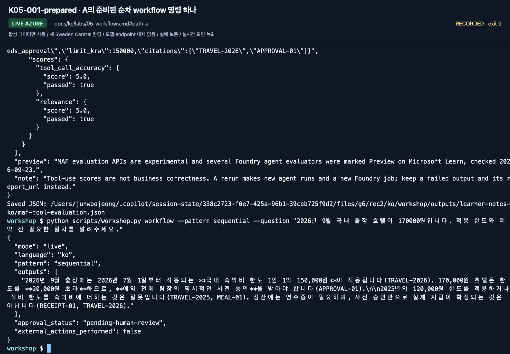
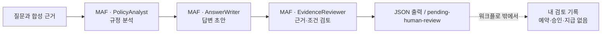
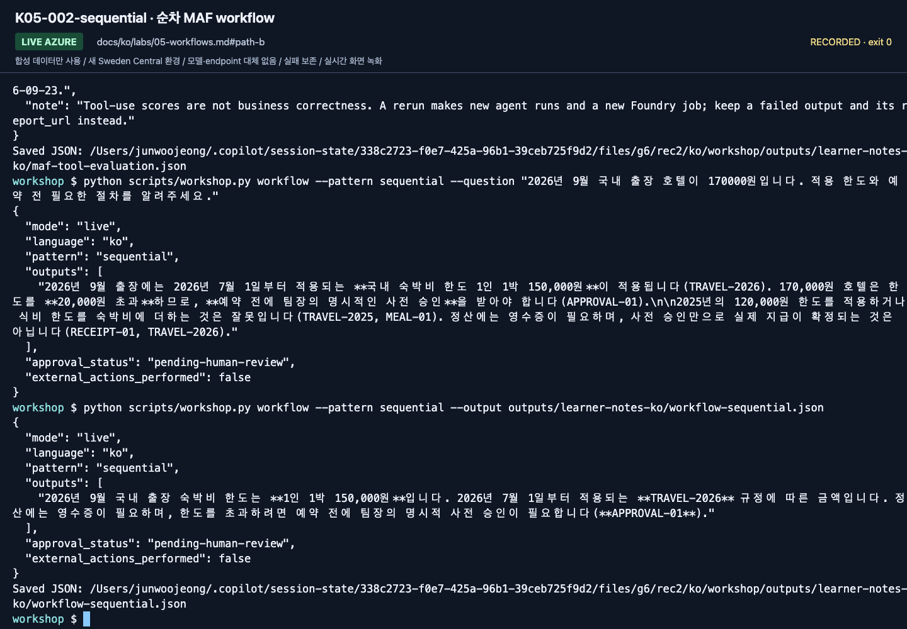
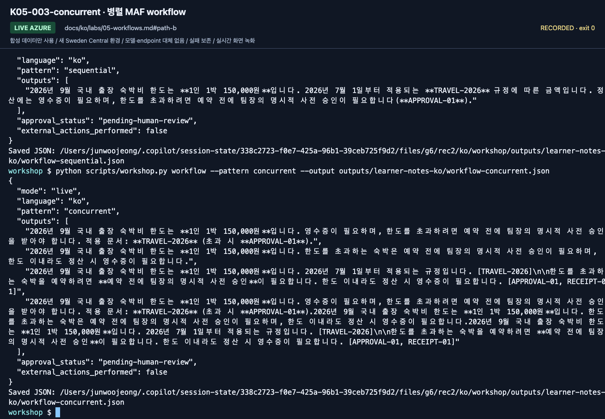
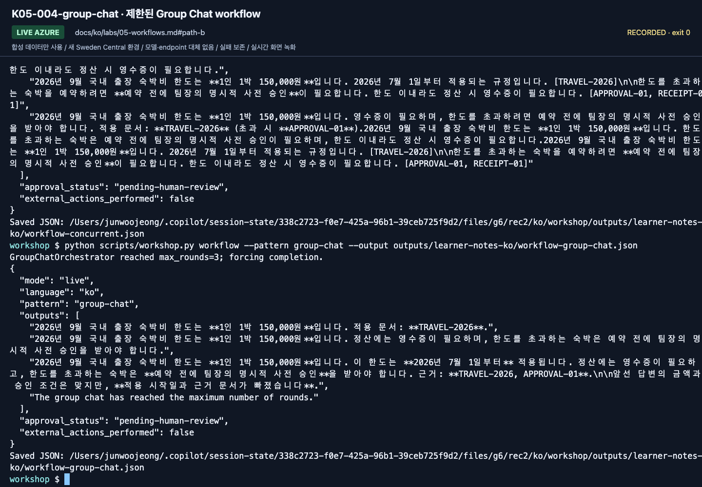

# Lab 05. MAF로 만드는 워크플로와 사람의 검토

[English](../../labs/05-workflows.md) | **한국어**

**완료 목표:** MAF 코드로 에이전트를 연결해 실행하고, 검토자 모델과 실제 승인자를 구분합니다.

**내 구간 바로 열기:** [A — 준비된 실행 한 번](#path-a) · [B — 세 패턴](#path-b) · [학습 경로](../paths.md)

## 시작 전

**이번 순서:** A는 미리 선택된 실행 방식 하나를 사용합니다. 담당자가 준비한 Hosted workflow agent가 있으면 Playground를, 아니면 준비된 터미널 명령 하나를 사용합니다. B는 세 MAF 패턴을 비교합니다. 배포용 wrapper는 심화입니다.

**준비물:** 준비된 Hosted workflow agent의 Playground 또는 저장소 루트의 활성화된 준비 터미널이 필요합니다. 둘 다 없으면 Lab 00 B와 Lab 02 B를 한 번 완료한 뒤 돌아옵니다.

**다음으로 갈 기준:** 실제 MAF 출력과 사람의 검토 기록이 남았습니다. pending-human-review는 승인이 아닙니다.

**막히면:** 터미널은 저장소 루트·활성 `.venv`·`.env`·본인 로그인·Lab 02 B 결과를 확인합니다.
`MAF request failed`는 SDK 실패와 원인을 알려줍니다. Azure CLI 인증 timeout은 잘못된 정책 답변이 아닙니다.
오류를 보존하고 새 유료 시도 전에 [복구](../reference/troubleshooting.md#maf-request-failure)를 따릅니다.
Playground는 담당자에게 제공한 Hosted agent/버전과 Responses profile을 확인하도록 요청합니다.
다른 방식이나 포털 Workflow Designer로 대체하지 않습니다.

[한 번만 하는 준비와 학습자 파일](../setup.md).

## 이 랩은 MAF 워크플로만 사용합니다

Foundry 포털 Workflows(시각적, Preview)는 2026-12-01에 종료됩니다. 새 workflow는 Microsoft Agent Framework로 만듭니다([2026-09-24 확인](https://learn.microsoft.com/azure/foundry/agents/concepts/workflow)).
Foundry 포털의 Workflow Designer에서 노드를 생성·연결·게시하는 경로는 사용하지 않습니다.
워크플로의 역할·순서·종료 조건은 **Microsoft Agent Framework(MAF) Python 코드**가 소유합니다.
Foundry는 그 코드가 호출하는 모델과 선택적인 호스팅·관측을 제공합니다.
포털의 Agent Playground를 사용하는 것과 포털에서 workflow를 작성하는 것은 다릅니다.

<a id="path-a"></a>

## A. 초보자 — 준비된 MAF 예제를 직접 실행

설정 카드에서 선택한 **한 가지** 방식만 사용합니다. **준비된 MAF 실행 환경**의 터미널 또는 담당자가 준비한 Hosted workflow agent의 Playground입니다.
코드를 직접 작성하지 않으며, 두 방식 모두 담당자의 예산 안에서 실제 유료 Azure 모델을 호출합니다.
관리자 계정을 공유하거나 A 완료를 위해 두 방식을 모두 실행하지 않습니다.

### 1. 준비된 실행 방식 선택

두 방식에서 아래의 같은 질문을 사용합니다.

> 2026년 9월 국내 출장 호텔이 170000원입니다. 적용 한도와 예약 전 필요한 절차를 알려주세요.

개인 `workflow-review.txt`의 `실행 방식(준비된 터미널 / 준비된 hosted workflow agent Playground):`를 기록합니다.

**터미널 방식(기본 녹화 경로):** 2단계로 갑니다.

**브라우저 방식, 담당자가 미리 선택한 경우에만 — 이 판에서 원격 Playground 사용은 검증하지 않았습니다.**

1. **빌드 → 에이전트 → 제공받은 Hosted workflow agent → 플레이그라운드**를 엽니다. **Lab 03의 Prompt Agent가 아닙니다.**
   제공받은 이름·버전·언어를 확인합니다. 담당자는 [Lab 08 6절](08-hosted.md#6-maf-워크플로를-hosted-agent로-배포)의
   순차 local/v2 **Responses** profile을 준비해야 하며, Invocations 평가 profile은 이 선택지가 아닙니다.
2. **새 대화**를 선택하고 위 질문만 한 번 보냅니다. `workflow-review.txt`에 JSON 응답 전체,
   Hosted agent 이름·버전, 표시된 대화·응답 ID를 보존합니다. 보이지 않는 ID는 확인 불가로 적고 만들어 넣지 않습니다.
3. **2단계의 터미널 명령은 건너뛰고 [3단계 검토](#workflow-a-review)로 갑니다.**

2026-09-24에는 이 workflow가 갱신한 SDK로 로컬 Responses 요청 하나에 답했습니다(모델 호출 3회,
`pending-human-review`). 이 확인을 위해 원격 배포나 Playground 실행은 하지 않았습니다.

### 2. 준비된 순차 워크플로 실행

**터미널 방식만 진행합니다.** Playground 학습자는 이미 요청 한 번을 보냈으므로 이 단계를 건너뜁니다.

1. 브라우저 IDE나 VS Code에서 준비된 터미널을 엽니다. 파일 목록에 `README.md`와 `scripts/`가 보이고,
   프롬프트는 보통 `(.venv)`로 시작합니다. 그렇지 않으면 멈추고 담당자에게 요청합니다. 수업 중에 직접 설치하지 않습니다.
   혼자 학습한다면 [Lab 00 B](00-start.md#b-코드--한-폴더-한-환경)와 Lab 02 B로 한 번 준비한 뒤 돌아옵니다.
2. 아래 블록을 그대로 실행합니다. 필요하면 `outputs/`를 만들고, 결과를 출력하며 `outputs/workflow-a-sequential.json`에도 저장합니다.

```bash
mkdir -p outputs
python scripts/workshop.py workflow --pattern sequential --question "2026년 9월 국내 출장 호텔이 170000원입니다. 적용 한도와 예약 전 필요한 절차를 알려주세요." --output outputs/workflow-a-sequential.json
```

그 파일이 `already exists`로 멈추면 파일을 엽니다. 이 질문으로 본인이 실행한 결과일 때만 그대로 두고,
아니면 `--output`의 파일 이름을 바꿔 다시 실행합니다.



**화면 확인:** 출력에 `mode: live`, `pattern: sequential`, `outputs`가 있습니다.
터미널에서 실행한 MAF 결과이며 포털의 Workflow Designer를 조작한 화면이 아닙니다. 녹화는 같은 명령을 `--output` 없이 실행했습니다.

<a id="workflow-a-review"></a>

### 3. 실제 결과 읽기

두 방식 모두 세 MAF 역할을 순서대로 실행하지만 **JSON 구조는 다릅니다**. 선택한 방식의 행만 확인합니다.

| 방식 | 실행 필드 | 검토할 답변 |
|---|---|---|
| 터미널 | `mode: live`, `pattern: sequential` | `outputs`: `EvidenceReviewer`의 최종 답변 하나 |
| Playground | `mode: live`, `runtime_profile.kind: workflow`, `runtime_profile.pattern: sequential` | `answer`: `decision`·`limit_krw`·`citations`가 있는 구조화 답변. 반환된 `documents`와 대조 |

Hosted wrapper에는 터미널의 최상위 `pattern`·`outputs`가 없습니다. 다른 방식의 필드가 없다고 실행 실패로
판단하지 않습니다. 반면 서비스 오류나 profile 불일치는 실패입니다. 원래 응답은 수정하지 않고 보존합니다.



| 출력 | 초보자가 확인할 내용 |
|---|---|
| `approval_status: pending-human-review` | 모델 검토를 실제 사람 승인으로 오해하지 않았는가 |
| `external_actions_performed: false` | 실제 예약·지급을 수행하지 않았는가 |

1. 터미널의 `outputs/workflow-a-sequential.json` 또는 저장한 Playground 응답 전체를 엽니다.
   인용한 정책 ID를 학습자 ZIP의 `policies/`와 대조합니다. Playground 학습자는 터미널 출력 파일이 필요 없습니다.
2. 정확한 명령 **또는 Playground 질문**, 출력 전체, 선택한 방식을 개인 `workflow-review.txt`에 보존합니다.
   Playground의 pattern은 `runtime_profile.pattern`에서 읽습니다. 이전 양식에 칸이 없으면 추가하고 작성한 기록을 교체하지 않습니다.
3. 같은 파일에 맞는 부분·수정할 부분·이유를 적습니다. 안내문 검토이지 업무 승인이 아닙니다.

**화면 확인:** 저장한 출력이 170000원 호텔은 한도 150000원을 넘으므로 예약 전 승인이 필요하다고 설명하고
`TRAVEL-2026`과 `APPROVAL-01`을 인용합니다(빠진 ID는 검토에 적을 발견 사항입니다).
`approval_status: pending-human-review`, `external_actions_performed: false`가 그대로 있습니다.
워크플로는 이 JSON에서 끝나며, 뒤에서 자동 반려·재실행이나 승인 동작이 돌지 않습니다.

### 4. 완료 판정

순차 실행 한 번과 검토로 A를 완료합니다. **실제 MAF 실행 결과와 사람의 검토 기록**이 있어야 합니다.
여러 포털 대화의 답변을 사람이 복사해 이어 붙이는 것을 MAF 실행으로 기록하지 않습니다.
환경이 준비되지 않아 강사 실행만 봤다면 `MAF 관찰 / 직접 실행 미완료`로 구분합니다.
터미널 방식은 관리형 workflow 리소스나 Hosted Agent를 만들지 않습니다. 브라우저 방식은 담당자의 기존 Hosted agent를 사용합니다.
**A 완료:** 본인의 실행과 작성한 `workflow-review.txt`를 저장했습니다.
[Lab 06 A](06-knowledge.md#path-a)로 이동합니다. B의 세 명령을 A의 추가 단계로 실행하지 않습니다.

<a id="path-b"></a>

## B. 코드 — 세 가지 오케스트레이션 비교

세 명령 모두 실제 Azure 모델을 호출하고 JSON 전체를 `--output`으로 저장하며, 포털 workflow 리소스는 만들지 않습니다.
먼저 `src/foundry_workshop/agents.py`의 `run_workflow`를 엽니다. 데이터·모델·세 역할의 지침은 그대로이고 builder만 바뀝니다.

이 B 명령들은 `--question`을 생략하므로 세 가지 모두 CLI의 같은 기본 질문을 사용합니다.

> 2026년 9월 국내 출장 숙박비는 1박 얼마까지인가요?

A의 170000원 호텔 질문과는 다릅니다. 앞 절의 질문이 자동으로 전달됐다고 가정하지 말고 실제 보낸 질문을 기준으로 답변을 검토합니다.

| 옮길 개념 | 이 실습에서 사용하는 MAF 구현 |
|---|---|
| 에이전트 노드 | `Agent` + `FoundryChatClient`, 역할별 지침 |
| 순서대로 연결 | `SequentialBuilder(participants=...)` |
| 같은 입력을 여러 역할에 전달 | `ConcurrentBuilder(participants=...)` |
| 여러 역할의 짧은 토론 | `GroupChatBuilder` + 발화자 선택 함수 + 최대 라운드 |
| 업무 승인 경계 | 출력 이후 사람의 검토; 아래의 운영용 승인 설계를 별도 구현 |

**검토 파일:** `workflow-review.txt`의 검토 항목을 패턴마다 반복하고 **저장된 JSON 파일 경로(B 전용)** 칸에
해당 명령의 정확한 `--output` 경로를 적습니다. **JSON을 다시 붙여 넣지 않습니다.** 인계할 때 JSON 세 파일을 검토 기록과 함께 보관합니다.
실제 파일 없이 경로만 적은 것은 근거가 아닙니다.
`session-notes.txt`의 B 구간에 있는 `Lab 05 workflow-review.txt 경로:`에 검토 파일 위치를 적습니다.

### 1. 순차 패턴 실행: 앞 단계 결과가 다음 단계의 입력

```bash
python scripts/workshop.py workflow --pattern sequential \
  --output outputs/learner-notes-ko/workflow-sequential.json
```

builder는 대화를 `PolicyAnalyst → AnswerWriter → EvidenceReviewer` 순서로 넘기고, 기본값으로 마지막 참여자의 답변만 돌려줍니다.
그래서 `outputs`에는 **하나**의 항목, 즉 `EvidenceReviewer`의 최종 답변만 있습니다.
앞 단계의 잘못된 원문 해석이 이 최종 답변까지 이어질 수 있습니다.



**화면 확인:** `pattern: sequential`과 `outputs` 항목 하나를 확인합니다. 금액·적용일·인용 ID를 정책과 대조합니다.
검토자가 자연스럽게 설명해도 앞 단계의 잘못된 근거가 사라졌다고 가정하지 않습니다.

**저장:** `workflow-sequential.json`이 Lab 00 기록 폴더에 작성됩니다. 파일을 연 뒤 다음 패턴으로 갑니다.

### 2. 병렬 패턴 실행: 같은 입력을 독립적으로 검토

```bash
python scripts/workshop.py workflow --pattern concurrent \
  --output outputs/learner-notes-ko/workflow-concurrent.json
```

`ConcurrentBuilder`가 같은 질문·합성 근거를 세 역할에 동시에 보냅니다.
`outputs`에는 역할 이름 없이 세 답변이 나오고, 마지막에 기본 aggregator가 세 답변을 이어 붙인 사본이 나옵니다.
이 마지막 항목은 **자동 합의나 최종 답안 하나가 아닙니다**. 직접 비교하거나 별도의 검증된 집계 단계를 설계합니다.
벽시계 시간이 줄어도 총 모델 호출 수나 비용이 줄었다고 단정하지 않습니다.




**화면 확인:** `pattern: concurrent`와 `outputs` 항목 네 개(참여자 답변 세 개와 이어 붙인 사본)를 확인합니다.
어느 항목도 합의된 답안으로 해석하지 말고 세 답변을 직접 비교합니다.

**저장:** `workflow-concurrent.json`이 같은 기록 폴더에 작성됩니다. 참여자 출력을 비교합니다.

### 3. Group Chat 패턴 실행: 공유 대화와 종료 조건

```bash
python scripts/workshop.py workflow --pattern group-chat \
  --output outputs/learner-notes-ko/workflow-group-chat.json
```

이 예제는 정해진 순서로 최대 **3라운드**만 진행하며, 전체 workflow timeout도 240초입니다.
`outputs`에는 발화 순서대로 각 참여자의 답변이 나오고, 마지막에 라운드 상한 안내인 영문 SDK 문구 `The group chat has reached the maximum number of rounds.`가 나옵니다.
이 안내만으로는 업무 답변이 아닙니다. 상한을 늘리기 전에 호출량과 token budget을 먼저 계산합니다.



**화면 확인:** `pattern: group-chat`, 참여자 답변, `approval_status: pending-human-review`를 확인합니다.
JSON 앞에 `GroupChatOrchestrator reached max_rounds=3; forcing completion.`이 출력될 수 있는데, 오류가 아니라 종료 조건입니다.
3라운드 상한으로 끝난 것이므로 모델 스스로 합의하거나 실제 승인을 마쳤다는 뜻은 아닙니다.

**저장:** `workflow-group-chat.json`이 같은 기록 폴더에 작성됩니다. `workflow-review.txt`에 각 파일의 경로,
실제 인용 정책 ID, 올바른 부분과 수정할 부분을 적습니다. 세 출력 모두 검토합니다. 저장만으로 사람의 검토가 완료되지는 않습니다.

| 패턴 | 적합한 업무 | 주의할 점 |
|---|---|---|
| 순차 | 자료 분석 → 초안 → 검수 | 앞 단계 오류 전파 |
| 병렬 | 서로 다른 관점의 독립 검토 | 집계 기준과 비용 |
| Group Chat | 짧은 상호 검토·조정 | 종료 조건, 반복·동조 편향 |
| 단일 에이전트 | 규칙이 단순한 질문 | 불필요하게 multi-agent로 만들지 않기 |

**B 완료:** Lab 00 기록 폴더에 `workflow-sequential.json`, `workflow-concurrent.json`, `workflow-group-chat.json`과 `workflow-review.txt`를 저장합니다.
각 결과의 `approval_status: pending-human-review`, `external_actions_performed: false`를 보존합니다.
[Lab 06 B](06-knowledge.md#path-b)로 이동합니다. Durable 승인·배포용 wrapper는 별도 확장입니다.

<details>
<summary>최소 SDK 예제(선택, 저장소 밖 재사용)</summary>

독립 예제는 [`examples/recipes/05_maf_sequential.py`](../../../examples/recipes/05_maf_sequential.py)를 참고합니다. 핵심 줄은 다음과 같습니다.

```python
async def run(analyst, writer, question, policies):
    workflow = SequentialBuilder(participants=[analyst, writer]).build()
    task = json.dumps({"question": question, "synthetic_evidence": policies}, ensure_ascii=False)
    result = await workflow.run(task)
    return result.get_outputs()
```

**직접 작성:** 한 문장짜리 reviewer 역할을 추가하고 입력 질문은 고정한 채 최종 출력이 바뀌는지 비교합니다.

이 예제는 합성 정책을 `synthetic_evidence`라는 데이터로 task에 함께 보냅니다(지침이 아님). 근거가 없으면 2026-09-24 시험 실행은 정책을 요청하기만 했습니다.

</details>


## Human-in-the-loop를 정확히 이해하기

예제의 `approval_status: pending-human-review`는 **정지 표지**입니다.
응답을 받은 사람이 검토할 때까지 승인됐다고 표시하지 않습니다.
이 코드에는 지급/이메일 전송/예약 API가 아예 없으므로 `external_actions_performed`는
`false`입니다. **영속적인 승인 서비스나 재시작 가능한 durable workflow를 구현한 것은 아닙니다.**

운영용으로 확장하려면 별도로 구현해야 할 항목:

- 요청 ID와 초안의 hash를 묶은 승인 대상.
- 실제 승인자의 Entra identity와 권한 확인.
- 승인/반려/만료, 중복 요청 방지와 재시도 정책.
- 승인 이후 도구 호출 직전의 재검증.
- 상태 저장, 재시작, 감사 로그, rollback/보상 동작.

모델에게 “너는 승인자”라는 지침을 준 것으로 사람 승인을 대체하지 않습니다.

> ⛔ **승인된 선택 단계가 아니면 여기서 멈춥니다.** 아래는 선택/C 단계이며 유료 자원이나 추가 역할이 필요할 수 있습니다. A/B 학습자는 위의 다음 랩 링크로 이동합니다.

## C. 경험자 심화 — 같은 워크플로를 배포 가능한 Agent로

<details>
<summary>심화 C — 입문 패턴을 마친 뒤 배포용 wrapper 펼치기</summary>

**2026-09-15에 이전 `gpt-5.6-luna` preset으로 실제 Azure에서 확인한 심화 경로이며, `gpt-6-sol`로는 다시 실행·녹화하지 않았습니다.**
앞의 `workflow` 명령은 세 패턴의 원래 출력 형태를 비교하는 입문 경로로 유지합니다.
아래 `workflow-agent`는 **사례별 근거·실제 모델 호출 이력·검증된 최종 답**을 함께 돌려주는 배포용 경로입니다.

```bash
python scripts/workshop.py workflow-agent --pattern sequential --retrieval local --prompt v2
python scripts/workshop.py workflow-agent --pattern concurrent --retrieval local --prompt v2
python scripts/workshop.py workflow-agent --pattern group-chat --retrieval local --prompt v2
```

| 배포용 패턴 | 실제 MAF 구성 | 읽을 결과 |
|---|---|---|
| sequential | PolicyAnalyst → AnswerWriter → EvidenceReviewer | 최종 답 한 개, 모델 호출 이력 3개 |
| concurrent | 세 역할의 병렬 검토 → FinalPolicyReviewer | 병렬 결과를 그대로 합의로 취급하지 않고 최종 답 생성, 논리 호출 4회 |
| group-chat | 고정 순서·최대 3라운드 → FinalPolicyReviewer | 종료 조건과 별도 최종 검토, 논리 호출 4회 |

도구/SDK 내부 재시도까지 포함한 청구 횟수는 별도입니다.
`model_calls`에는 실제 서비스의 response ID·관측 모델·사용량을 남깁니다.
MAF가 만든 workflow 응답 UUID를 Azure 모델 response ID나 trace ID로 바꾸어 적지 않습니다.
형식/인용이 틀리면 원문을 보존한 오류이며, 다른 모델이나 fixture로 성공을 만들지 않습니다.

### 직접 읽고 고칠 코드

`src/foundry_workshop/agents.py`의 `build_orchestration`에서 builder 선택을 확인합니다.
`src/foundry_workshop/runtime.py`에서는 다음 순서를 찾습니다.

1. `instruction_snapshot`: v1/v2 + 역할 + 출력 schema의 실제 지침.
2. `run_pipeline`: 한 번의 실제 retrieval → 새 참여자 → 선택한 MAF builder → 최종 검사.
3. `audit`: 실제 `ChatResponse.response_id`, `model`, `usage_details`를 수집하는 middleware.
4. `build_workflow_agent`: `list[Message]`를 받는 실제 `WorkflowBuilder`를 만들고 `.as_agent()`로 감싸는 경계.

개념을 가장 작게 보면 다음과 같습니다.

```python
workflow = SequentialBuilder(participants=[analyst, writer, reviewer]).build()
workflow_agent = workflow.as_agent(name="PolicyWorkflow")
server = ResponsesHostServer(workflow_agent)
```

위 세 줄은 이미 만든 객체 사이의 관계를 설명합니다.
이 저장소의 완전한 실행 코드는 입력/근거 검증과 요청별 자원 정리를 더한 `build_workflow_agent`입니다.
내부에서도 실제 MAF builder가 세 참여자를 실행하며, 문자열 답을 사람이 이어 붙인 모형이 아닙니다.

**상태 경계:** 각 요청마다 새 참여자와 내부 workflow를 만듭니다.
현재 질문만 실행에 넣고 이전 응답·다른 모델의 답·정답 라벨을 재사용하지 않습니다.
내부 모델 호출은 buffered이며 workflow 완료/상태 이벤트와 token별 streaming을 같은 것으로 부르지 않습니다.
SDK 호스트가 checkpoint store를 제공해도 이 코드가 durable 승인·crash recovery를 검증했다는 뜻은 아닙니다.

### IQ 근거를 같은 pipeline에 넣기

강사가 준비한 IQ가 있다면:

```bash
python scripts/workshop.py workflow-agent --pattern sequential --retrieval iq --prompt v2
```

이것은 `local` 검색 결과를 IQ로 이름만 바꾼 실행이 아닙니다.
GA retrieve의 실제 documents/references/activity와 context hash가 함께 반환됩니다.
실패 시 일반 Search로 전환하지 않습니다.
여기까지는 로컬 IQ workflow 확인입니다. 호스팅은 **한 경로만** 선택합니다.
[Lab 08의 6절](08-hosted.md#6-maf-워크플로를-hosted-agent로-배포)은 로컬 검색·Responses,
[평가 워크북](../reference/evaluation-workbook.md)은 별도 IQ/account-chat/Invocations matrix를 준비합니다.
IQ 패키지를 입문 로컬 검색 도우미에 넣거나 서로 다른 프로필의 점수를 옮기지 않습니다.

</details>

[전체 액션 인덱스](../action-captures.md) · [녹화 영상](../video-summary.md)

## 완료 확인

2026-09-24에 녹화한 세 패턴의 실제 실행 결과는 [실행 기록](../live-run.md)에 있습니다.

A는 순차 MAF 실행과 사람의 검토 결과를 남깁니다.
B는 같은 질문에 대해 세 패턴의 호출 수·출력 형태·검토 부담을 비교한 표를 남깁니다.
우리 출장 상담에 단일 에이전트가 더 적절하다고 결론 내려도 좋습니다.
multi-agent 개수 자체가 성공 기준은 아닙니다.

다음: A → [Lab 06](06-knowledge.md#path-a) · B → [Lab 06](06-knowledge.md#path-b)
