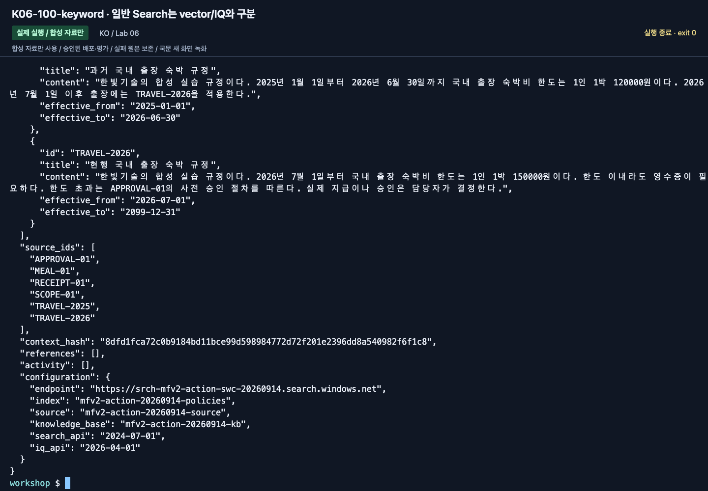
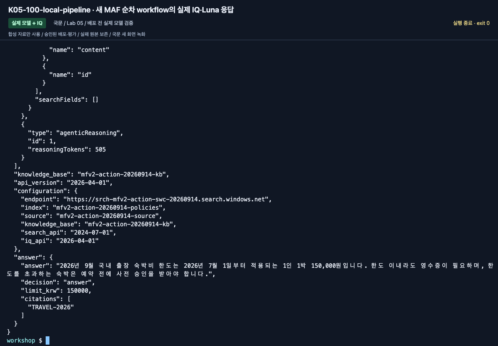
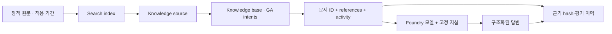
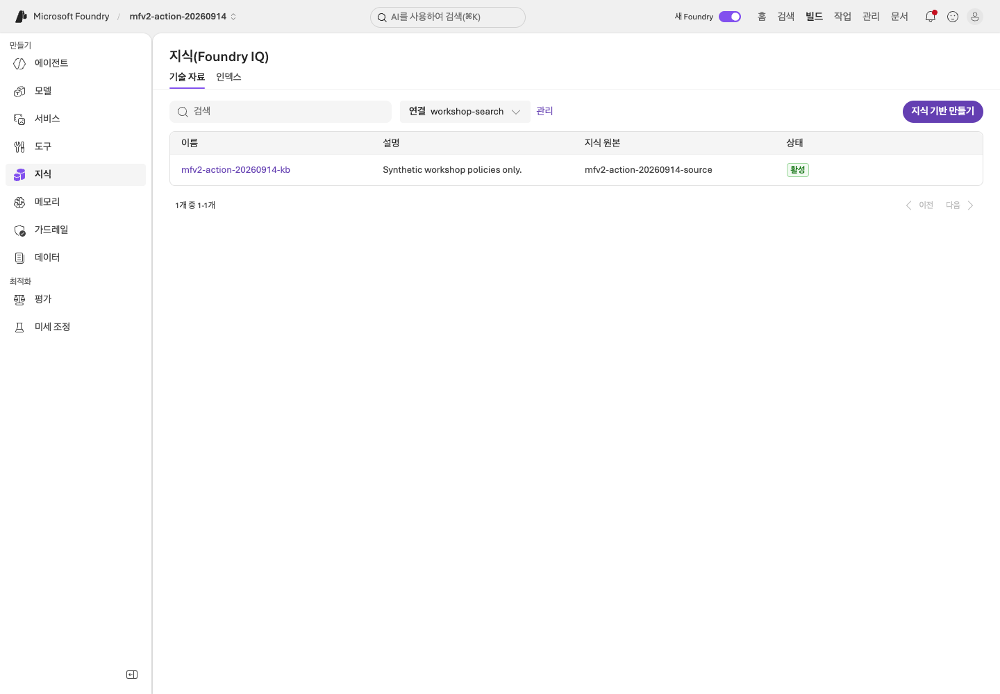
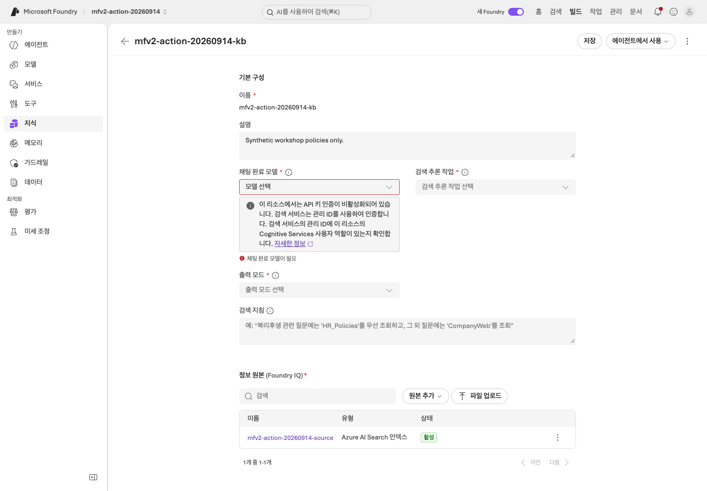
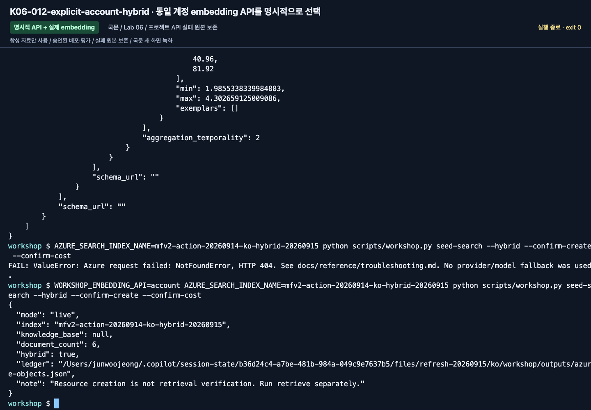
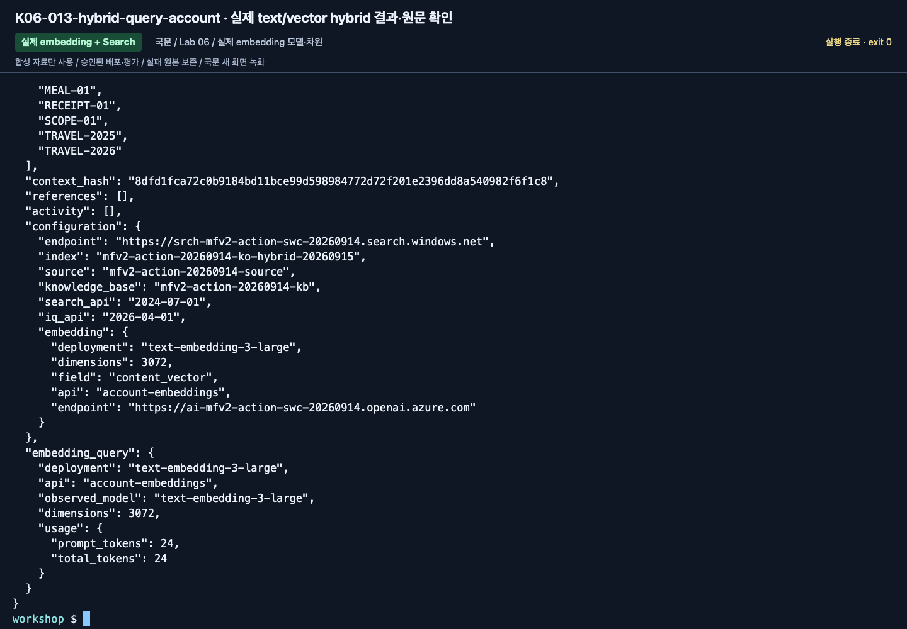
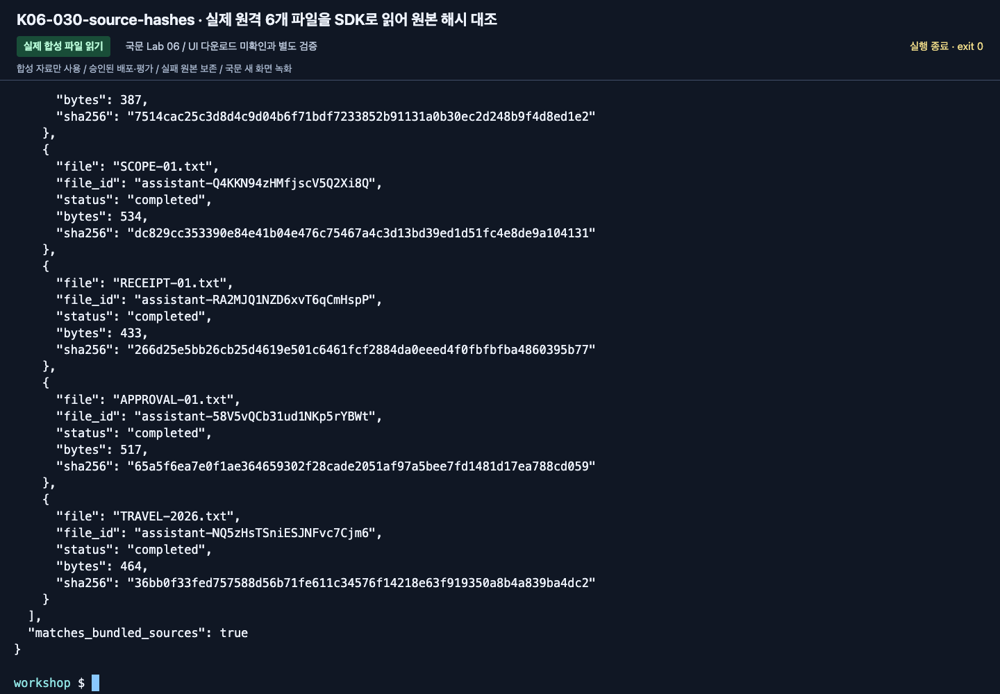

# Lab 06. 문서 근거에서 RAG와 Foundry IQ로

[English](../../labs/06-knowledge.md) | **한국어**

**완료 목표:** 일반 검색과 실제 IQ retrieval을 구분하고, 답변의 원문 근거를 보존합니다.

**내 구간 바로 열기:** [A — 기존 원문 확인](#path-a) · [B — GA Search/IQ](#path-b) · [학습 경로](../paths.md)

**IQ Chat은 Search의 관리 ID로 채팅 모델을 사용할 수 있습니다.** 이 선택 실습에서는 모델 없는 GA KB가 아니라
**`gpt-5.6-luna` / 낮음 / 응답 합성이 설정된 chat KB**를 엽니다.
[정상 설정 화면과 확인 순서](#iq-chat-model)를 참고하세요. A의 기본 원문 확인에는 IQ Chat이 필요 없습니다.

## 시작 전

**이번 순서:** A는 agent의 원문을 확인하고 고정 모델 IQ chat base는 준비된 경우 선택합니다. B는 번호 순서의 GA 검색 경로, hybrid는 선택입니다.

**준비물:** A: Lab 03 응답·학습자 파일. B: .env·준비된 Search 서비스·작성 권한·새 소유 prefix 또는 대응하는 소유권 ledger.

**다음으로 갈 기준:** A는 정책 ID·날짜 대조, B는 Search·GA IQ 출력을 저장합니다. Luna 계획·합성은 별도로 선택한 IQ Chat에서만 필요합니다.

**막히면:** 선택한 경로의 원본·권한 문제를 해결하고 provider를 바꾸지 않습니다. 기본 A의 원문 확인에는 IQ Chat 모델이 필요 없습니다.

[한 번만 하는 준비와 학습자 파일](../setup.md).

## 네 검색 경로는 같은 기능이 아닙니다

| 방식 | 이 저장소의 실행 | 무엇을 확인하나요? |
|---|---|---|
| 로컬 키워드 검색 | `retrieve --provider local` | 합성 파일에 대한 학습용 문자열 검색 |
| Azure AI Search | `retrieve --provider search` | 실제 Search index의 텍스트 검색 |
| 하이브리드 Search | `retrieve --provider hybrid` | 명시적 embedding + text/vector 검색을 함께 수행 |
| Foundry IQ | `retrieve --provider iq` | 실제 knowledge base의 retrieve, references·activity |

기본 local/Search/IQ 경로는 임베딩을 쓰지 않는 작은 텍스트/semantic 실습입니다. 일반 Search 경로를
**벡터·하이브리드 검색**이라고 표시하지 않습니다.
아래 선택 절에서 실제 embedding·차원·벡터 필드를 구성한 경우에만 하이브리드라고 표시합니다.

<a id="path-a"></a>

## A. 브라우저 — 인용이 보이면 끝인가?

1. [Lab 03](03-prompt-agent.md)의 현행·과거·한도 초과 실제 응답을 엽니다. 없다면 `dev-questions.txt`의 해당 질문만 새 대화에 보냅니다.
2. 인용/근거의 문서 이름과 본문을 엽니다. 직접 컨텍스트 방식이면 해당 문서 ID를 원본 파일과 대조합니다.
3. `TRAVEL-2025`와 `TRAVEL-2026`의 적용 기간을 비교합니다.
4. 2026년 5월 질문에 현행 문서를 인용하면 잘못된 근거 선택으로 기록합니다.
5. “숙박 한도를 초과했다”는 질문에서 승인 규정이 함께 설명되는지 확인합니다.

**A 완료:** `session-notes.txt`의 Lab 06에 대조한 정책 ID·날짜·확인 결과를 적습니다.
기본 경로는 새 검색 요청 없이 **IQ Chat 미선택**으로 기록하고 [Lab 07 A](07-evaluation.md#path-a)로 이동합니다.
실행 전에 별도로 선택·준비한 경우에만 아래 경로를 펼칩니다.

<a id="iq-chat-model"></a>

### 선택 IQ Chat — 준비된 Luna chat KB 열기

<details>
<summary>선택 Preview IQ Chat — 준비된 chat base·별도 비용 승인이 필요합니다</summary>

담당자가 [IQ 준비](../setup.md#4-환경-담당자의-준비)를 마친 경우에만 선택합니다.
아니라면 **IQ Chat 미선택**으로 기록하고 위 원문 확인을 마친 뒤 Lab 07로 이동합니다.
이 Search-index source의 계획·합성은 **2026-09-15 기준 Preview**이며 MI 자체는 정상 지원됩니다.

1. Foundry에서 **Knowledge → Knowledge bases**를 열고 담당자의 **`iq-chat setup`이 반환한 `knowledge_base` 이름**을 선택합니다.
   준비 카드에 적은 이름이며 기본값은 `<prefix>-chat-ko-kb`입니다. 채팅 설정을 보려고 기존 `<prefix>-kb`를 열지 않습니다.
2. 아래 **선택값 세 개가 채워져 있는지**와 국문 합성 source가 맞는지 확인합니다.
   모델이나 모드가 비어 있으면 **저장 전에 멈추고** 목록으로 돌아가 chat-base 이름부터 확인합니다.
   준비된 chat base가 없다면 담당자가 [check → 승인된 setup](../reference/iq-model-identity.md)을 완료합니다.
   모델 없는 GA base의 설정을 바꾸어 해결하지 않습니다.
3. Lab 05에서 사용한 준비된 터미널에서 아래 `check`를 실행합니다. `configured: true`여야 합니다.
   `ready_for_setup: true`만으로는 저장된 chat base가 있다는 뜻이 아닙니다.
4. 비용 승인 후 `ask`를 **한 번** 실행합니다. API·요청 필드·실제 activity를 보존하기 위해 이 검사는 CLI로 합니다.
   포털에서 같은 채팅을 추가 전송하지 않습니다.
5. `answer`, `source_ids`, `references`, 두 모델 activity를 합성 원문과 비교합니다. 실패는 그대로 기록합니다.

| 설정 | 첫 실습의 정확한 선택 |
|---|---|
| Chat 배포 / 실제 모델 | **`gpt-5.6-luna` / `gpt-5.6-luna`**, 모델 버전 **`2026-07-09`** |
| 인증 | **Search**의 **System assigned identity**. 학습자/Hosted agent identity가 아님 |
| 모델 계정 역할 | Foundry 계정 범위에서 Search identity에 **`Cognitive Services User`** |
| Reasoning / 출력 | **`low` / `answerSynthesis`** — 국문 화면에서는 **낮음 / 응답 합성** |
| API | **`2026-08-01-preview`**, API key 없음 |


**화면 확인:** `gpt-5.6-luna`, **낮음**, **응답 합성**, 국문 source와 **활성** 상태가 보입니다.
**Chat completions model is required** 같은 모델 미선택 오류가 없습니다. 필수 표시 별표와 회색 MI 안내는 정상입니다.
MI 안내는 Search의 ID를 사용한다는 뜻이지 인증 실패나 역할 확인 완료라는 뜻이 아닙니다.
**이미 저장된** chat KB를 새로 캡처한 원본 화면이며, 이번 캡처를 위해 저장·배포·모델 호출을 하지는 않았습니다.
화면의 이름을 복사하지 말고 본인에게 반환된 이름을 사용합니다.

**화면을 맞추려고 선택된 Luna를 지우거나 추천 모델을 배포하지 않습니다.**
2026-09-17 확인 당시 빠른 모델 목록과 **Browse more models**는 기존 배포 목록이 아니라 배포용 카탈로그를 열었습니다.
그 카탈로그에 Luna가 없어도 이미 저장된 Luna 연결은 정상 표시됐습니다.
기존 선택을 유지하고, 최초 구성은 담당자의 고정 CLI preset으로 합니다. 다른 모델 선택이나 API key 활성화로 우회하지 않습니다.

```bash
python scripts/workshop.py iq-chat check
```

위 검사를 통과하고 요청 비용이 승인된 경우에만 실행합니다.

```bash
python scripts/workshop.py iq-chat ask --label iq-chat-lab06 --confirm-cost
```

결과의 `model_planning_verified: true`, `model_synthesis_verified: true`와
Luna의 실제 `modelQueryPlanning` / `modelAnswerSynthesis`를 확인합니다.
요청·응답·원문 근거·실패는 `outputs/iq-chat/iq-chat-lab06/`에 남습니다. 새 요청은 새 label을 사용합니다.
`check`는 Azure를 변경하지 않고 `ask`는 모델/provider를 자동 대체하지 않습니다.
`configured: false`, 권한 누락, 다른 모델 버전, 403/429이면 멈추고 [고정 preset 복구 안내](../reference/iq-model-identity.md)를 따릅니다.
모델 고정은 흔한 설정 불일치를 없애지만 quota와 서비스 가동까지 보장하지는 않습니다.

</details>

<a id="path-b"></a>

## B. 코드 — 공통 환경에 Search만 추가

### 1. 강사 사전 준비 확인

- 기존 Azure AI Search 서비스, 필요한 tier·리전·인증 설정.
- 읽기 사용자: `Search Index Data Reader`.
- 색인/소스 작성자: 해당 서비스의 `Search Service Contributor` 및 `Search Index Data Contributor`.
- GA knowledge retrieval과 semantic ranker의 사용/과금 설정을 관리자가 별도로 확인.
- `.env`의 `AZURE_SEARCH_ENDPOINT`와 고유 `WORKSHOP_PREFIX`.

구독 Owner만으로 Search 데이터 접근이 된다고 가정하지 않습니다.
기본 실습 스크립트는 Search 서비스나 역할을 생성하지 않고 **준비된 서비스 안의
본인 접두사 객체만** 만듭니다.

**Seed 전에 소유권 상황을 정합니다.** 새 학습자 복사본은 아직 seed하지 않은 새 `mfv2-...` prefix와 작성 권한이 필요합니다.
강사의 준비 복사본에는 대응하는 `outputs/azure-objects.json`이 있어야 합니다.
원격 index는 있는데 로컬 ledger가 비어 있다면 생성/갱신 실습의 준비 완료가 아닙니다. 덮어쓰지 않습니다.
`--language en`은 Search 이름에 `-en`을 붙이지 않습니다. [작업 폴더·언어 변경 규칙](../reference/configuration.md#workspace-scope)을 확인합니다.

### 2. 작은 지식 원본 확인

```bash
python scripts/workshop.py retrieve --provider local \
  --question "2026년 9월 국내 출장 숙박비 한도는?" \
  --output outputs/learner-notes-ko/retrieve-local.json
```

`documents`, `source_ids`, `context_hash`를 확인합니다.
학습용 로컬 검색은 한국어 형태소 검색이나 의미 검색의 대체물이 아닙니다.
검색 문서가 부족하면 정답을 코드에 넣지 말고 검색의 한계를 기록합니다.


**화면 확인:** `source_ids`와 `context_hash`를 확인합니다. 이 단계는 합성 파일의 로컬 검색입니다.
Search나 IQ를 호출했다고 표시하지 않습니다. 설정된 endpoint 이름만 보지 말고 반환된 provider를 확인합니다.

**저장:** `retrieve-local.json`이 Lab 00 기록 폴더에 작성됩니다. 파일을 열어 원문 근거를 확인합니다.

### 3. 일반 Search 색인 만들기

**클라우드 쓰기 작업입니다.** 준비된 실습 서비스·접두사·권한을 확인한 뒤 실행합니다.

```bash
python scripts/workshop.py seed-search --confirm-create
```

이름을 생략한 선택 환경변수는 다음과 같이 결정됩니다.

| 환경변수 | 기본 이름 |
|---|---|
| `AZURE_SEARCH_INDEX_NAME` | `<WORKSHOP_PREFIX>-policies` |
| `AZURE_SEARCH_KNOWLEDGE_SOURCE_NAME` | `<WORKSHOP_PREFIX>-source` |
| `AZURE_SEARCH_KNOWLEDGE_BASE_NAME` | `<WORKSHOP_PREFIX>-kb` |

기존 객체가 있는데 내 로컬 소유권 기록이 없으면 덮어쓰지 않습니다.
이미 seed한 뒤 prefix를 바꾸려면 새 소스 복사본도 사용하거나 강사에게 원래 작업 폴더 복구를 요청합니다.
기존 ledger를 삭제하지 않습니다.
문서 업로드가 부분 실패하면 전체 성공으로 처리하지 않습니다.


**화면 확인:** seed 결과의 `mode: live`, 본인의 `index`, `document_count: 6`,
`hybrid: false`, `knowledge_base: null`을 확인합니다. IQ가 아니라 일반 Search 객체를 만든 단계입니다.

Seed 성공을 확인한 뒤에만 해당 index를 조회합니다.

```bash
python scripts/workshop.py retrieve --provider search \
  --question "2026년 9월 국내 출장 숙박비 한도는?" \
  --output outputs/learner-notes-ko/retrieve-search.json
```



**화면 확인:** `--provider search` 명령의 결과를 읽고 endpoint/index가 본인 값인지 확인합니다.
`references`·`activity`가 없는 일반 Search 결과를 IQ 결과로 바꾸어 적지 않습니다.

**저장:** `retrieve-search.json`이 같은 기록 폴더에 작성됩니다. 검토한 뒤 IQ source/base를 만듭니다.

### 4. GA Foundry IQ knowledge source/base 만들기

```bash
python scripts/workshop.py seed-search --iq --confirm-create
```

Seed 결과의 `document_count: 6`과 의도한 `knowledge_base`가 null이 아님을 확인한 뒤 계속합니다.
`outputs/azure-objects.json`을 보관하며, 중단할 때도 이 소유권 기록을 삭제하지 않습니다.

```bash
python scripts/workshop.py retrieve --provider iq \
  --question "2026년 9월 국내 출장에서 170000원 호텔의 사전 승인 조건은?" \
  --output outputs/learner-notes-ko/retrieve-iq.json
```


**화면 확인:** seed 결과의 `knowledge_base`가 이제 null이 아니며 `document_count: 6`입니다.
Source/base 구성과 `api_version: 2026-04-01`은 **retrieve 결과**에서 확인합니다.
`ledger`에 표시된 `outputs/azure-objects.json` 소유권 기록을 유지합니다.

기본 IQ 코드는 **REST `2026-04-01` GA의 직접 intents·extractive 검색**을 사용합니다.
이 non-web Search-index source에서는 해당 API가 **KB 내부의 LLM 사용을 지원하지 않습니다**.
따라서 `seed-search --iq`는 **KB의 `models`를 설정하지 않습니다**. API/source의 지원 범위이지 API key 인증이 필요하다는 뜻이 아닙니다.
조회에는 명시적 semantic `intents`를 보내며 최종 답변은 다음 단계의 별도 모델 호출에서 생성합니다.
이는 Search→Chat 모델의 managed identity 인증을 검증한 경로가 아닙니다.
서비스 내부 처리가 없다는 보장은 아니며 실제 activity에 보고된 reasoning 항목도 확인합니다.
검색 응답의 `maxOutputSizeInTokens`는 6000으로 제한합니다. 실제 GA 호출에서 5000 초과가
필요함을 확인했으며, 이는 답변 모델의 `WORKSHOP_MAX_OUTPUT_TOKENS`와 다른 설정입니다.

확인:

1. `provider`가 `foundry-iq`인가.
2. 실제 knowledge base 이름과 API 버전이 기록되었는가.
3. `references`, `activity`, 원문 `documents`가 있는가.
4. 참조 번호와 문서의 안정적인 `id`를 혼동하지 않았는가.
5. activity에 오류가 있으면 부분 성공으로 넘어가지 않았는가.

**빈 결과는 0건 검색입니다.** 이 경우에도 정상 답변처럼 금액을 채우지 않습니다.
실패 시 Search로 자동 대체하지 않습니다.




**화면 확인:** `activity`·base·API 버전·`references`·`documents`를 함께 읽습니다.
보고되지 않은 지연이나 사용량은 임의로 채우지 않습니다.

**저장:** `retrieve-iq.json`이 원문·activity와 함께 같은 기록 폴더에 작성됩니다. 답변 요청 전에 확인합니다.

### 5. 같은 질문을 근거와 함께 실제 모델에 전달

```bash
python scripts/workshop.py answer --prompt v2 --retrieval iq \
  --question "2026년 9월 국내 출장에서 170000원 호텔을 예약하려면 어떤 절차가 필요한가요?" \
  --output outputs/learner-notes-ko/answer-iq.json
```

검색→응답을 따로 둔 이유는 실패를 구분하기 위해서입니다.
검색에 현재 규정이 없는 것과, 올바른 규정을 받았는데 적용일을 잘못 해석한 것은 다른 문제입니다.


**화면 확인:** `--retrieval iq` 명령 아래의 base/API 설정, `response_model`, `response_id`, `usage`를 확인합니다.
`answer`의 금액·조건·인용을 원문과 대조합니다.

**저장:** `answer-iq.json`이 같은 기록 폴더에 작성됩니다. 응답과 검색 metadata 전체를 확인합니다.



**B 완료:** Lab 00 기록 폴더에 출력 전체를 `retrieve-local.json`, `retrieve-search.json`, `retrieve-iq.json`, `answer-iq.json`으로 저장합니다.
원문 ID·`references`·`activity`·`context_hash`·소유권 ledger를 포함합니다.
원래 `outputs/azure-objects.json`은 그대로 둡니다. 복사한 출력 파일이 객체 소유권을 만들어 주지 않습니다.
[Lab 07 B](07-evaluation.md#path-b)는 **명시적인 로컬 검색 실험**으로 시작하며 이 IQ 답변을 평가 결과로 재사용하지 않습니다.

## C. 선택 — 실제 하이브리드 RAG

**첫 회차는 [Lab 07](07-evaluation.md)로 이동합니다.** C·D는 별도 심화이며 GA 경로에서 빠진 단계가 아닙니다.

<details>
<summary>선택 embedding·하이브리드 index 실습 펼치기</summary>

**2026-09-15 실제 실행·촬영 결과는 기록 당시의 환경에 해당합니다.**
이미 만든 텍스트 index의 필드를 몰래 바꾸지 않습니다.
같은 실습 prefix 아래 별도 index 이름을 `.env`에 정하고, 강사가 확인한 embedding 배포와
**실제 반환 차원**을 입력합니다. embedding 모델을 새로 배포하는 작업은 별도 승인 대상입니다.

```dotenv
AZURE_SEARCH_INDEX_NAME=<your-mfv2-prefix>-policies-hybrid
AZURE_AI_EMBEDDING_DEPLOYMENT_NAME=<verified-embedding-deployment>
WORKSHOP_EMBEDDING_DIMENSIONS=<actual-dimensions>
WORKSHOP_EMBEDDING_API=account
AZURE_OPENAI_ENDPOINT=https://<same-foundry-account>.openai.azure.com
```

```bash
python scripts/workshop.py seed-search --hybrid --confirm-create --confirm-cost
python scripts/workshop.py retrieve --provider hybrid --question "2026년 9월 국내 출장 숙박비 한도는?"
python scripts/workshop.py answer --retrieval hybrid --prompt v2
```

`--confirm-create`는 준비된 Search의 본인 index 작성, `--confirm-cost`는 실제 embedding 요청을 확인합니다.
6개 합성 문서의 embedding을 일괄 요청하고 `content_vector`의 차원·HNSW profile을 맞춥니다.
조회에는 `"search"`와 `"vectorQueries"`가 동시에 들어가며 `top=6`입니다.
벡터를 0으로 채우거나 다른 차원으로 잘라 맞추지 않습니다.
이번 실제 실행에서 프로젝트 `/openai/v1/embeddings`는 404를 반환했습니다.
원래 실패를 보존하고 같은 계정의 OpenAI embeddings API를 `WORKSHOP_EMBEDDING_API=account`로
**명시적으로 설정한 뒤** 새 작업으로 실행했습니다. 오류 처리 중 자동으로 다른 endpoint를 시도하지 않습니다.

**확인할 것:** `provider: azure-ai-search-hybrid`, `embedding_query.observed_model`,
차원, index 이름, 실제 source IDs와 context hash입니다.
기존 텍스트 index를 같은 이름으로 hybrid로 바꾸거나, hybrid index에 text-only 업로드로
벡터를 지우려 하면 거부합니다. 소유권·index별 설정은 `outputs/azure-objects.json`에 남습니다.

일반/IQ/Hybrid를 비교할 때는 `AZURE_SEARCH_INDEX_NAME`이 어느 index인지 다시 확인합니다.
IQ의 source/base는 원래 연결한 index를 참조하므로 환경변수만 바꿨다고 원격 base가 바뀌지 않습니다.
이 실험의 index 변경을 Lab 07의 prompt-only 전후 비교 사이에 섞지 않습니다.

</details>

## D. IQ를 Hosted 워크플로와 평가로 연결

<details>
<summary>심화 workflow·평가 연결 펼치기</summary>

```bash
python scripts/workshop.py workflow-agent --pattern sequential --retrieval iq --prompt v2
```

로컬 workflow 출력을 저장합니다. 원격 matrix는 [평가 워크북의 준비](../reference/evaluation-workbook.md#matrix-setup)에서 시작합니다.
그 워크북에서 별도 IQ/account-chat/Invocations 대상을 한 번 패키징합니다.
Lab 08의 입문 도우미는 이 IQ 프로필이 아니라 로컬 검색을 받습니다.
Toolbox/Fabric/Work IQ의 승인·원문·OBO 경계는 [IQ 확장 워크북](../reference/iq-workbook.md)에서 따로 다룹니다.
외부 원본 저장소로 이동해야 실행되는 숨은 선행 단계는 없습니다.

</details>

## 모델 기반 IQ와 기본 GA 검색을 구분하기

이 Search-index source에서 Chat 모델이 query planning과 답변 합성을 수행하도록 하려면
지원되는 Preview 계약을 명시하고 모델·Search identity 권한·reasoning effort·출력 모드를 함께 구성합니다.
Managed identity는 이 경로의 정상적인 keyless 인증 방식이며 실제로 확인했습니다.
GA schema의 `models` 존재와 모든 source에 대한 LLM 기능 지원은 같은 뜻이 아닙니다.
요청 필드도 API별로 확인하며, 검증 예시는 [MI 모델 연결 가이드](../reference/iq-model-identity.md)에 있습니다.
기존 평가의 재현을 위해 모델 없는 GA base는 유지하고, 모델 기반 실습에는 별도로 준비한 chat base를 사용합니다.
IQ Chat의 기준 화면은 [새 정상 설정 캡처](#iq-chat-model)입니다.
아래 과거의 모델 미선택 화면은 GA 상태를 관찰한 기록이지 그대로 재현할 완료 화면이 아닙니다.

<details>
<summary>녹화 당시 참고 화면 (선택; 그대로 재실행할 단계가 아님)</summary>

영문 후속 실험에서 D05의 실제 IQ 근거에 `SCOPE-01`이 빠져 필수 인용 검사가 실패했습니다.
문서의 관측 reranker score는 약 1.775였으며 같은 endpoint·질문·corpus에
`WORKSHOP_IQ_RERANKER_THRESHOLD=0`을 명시한 진단은 합성 원문 6개를 반환했습니다.
검색 필터 조정이지 업무 rubric이나 judge 기준 변경이 아닙니다.
초기 실패를 보존하고 새 baseline/candidate는 같은 설정으로 실행합니다.
운영 권장값으로 일반화하거나 provider fallback으로 처리하지 않습니다.

아래는 이번 국문 실행에서 새로 캡처한 화면입니다. 초기 진단·실패와 최종 비교 결과를 구분하며, 영문 촬영본을 재사용하지 않았습니다.



**과거 기록의 범위:** 기존 GA base 목록이며 새 chat preset의 설정 완료 화면이 아닙니다.



**과거 기록의 한계:** 이 GA base는 `models: []`였습니다. 모델 미선택 오류는 MI 실패가 아니며,
IQ Chat에서 따라 할 완료 상태도 아닙니다. 새 채팅 실습에 맞추려고 이 base를 덮어쓰지 않습니다.



**화면 확인:** 실제 command·언어·version·label·근거와 출력 상태를 확인합니다. 촬영 결과를 본인의 실행이나 운영 승인으로 대신하지 않습니다.



**화면 확인:** 실제 command·언어·version·label·근거와 출력 상태를 확인합니다. 촬영 결과를 본인의 실행이나 운영 승인으로 대신하지 않습니다.



**화면 확인:** 실제 command·언어·version·label·근거와 출력 상태를 확인합니다. 촬영 결과를 본인의 실행이나 운영 승인으로 대신하지 않습니다.

[새 영상과 액션 인덱스](../video-summary.md) · [실제 결과·계보](../live-run.md)

</details>

## 완료 확인

A: 원문 ID·적용 기간을 확인하고 IQ Chat의 선택 여부와 실제 실행 여부를 기록합니다.
B: Search와 GA IQ를 각각 호출하고 반환된 근거를 구분합니다.
`outputs/azure-objects.json`은 내 Search 객체의 소유권 기록입니다.
공유 서비스 자체를 삭제하는 권한 증명이 아닙니다.

다음: A → [Lab 07](07-evaluation.md#path-a) · B → [Lab 07](07-evaluation.md#path-b)
