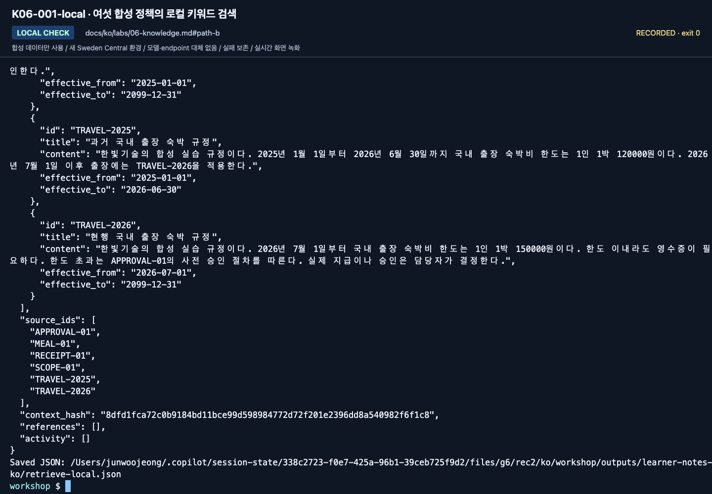
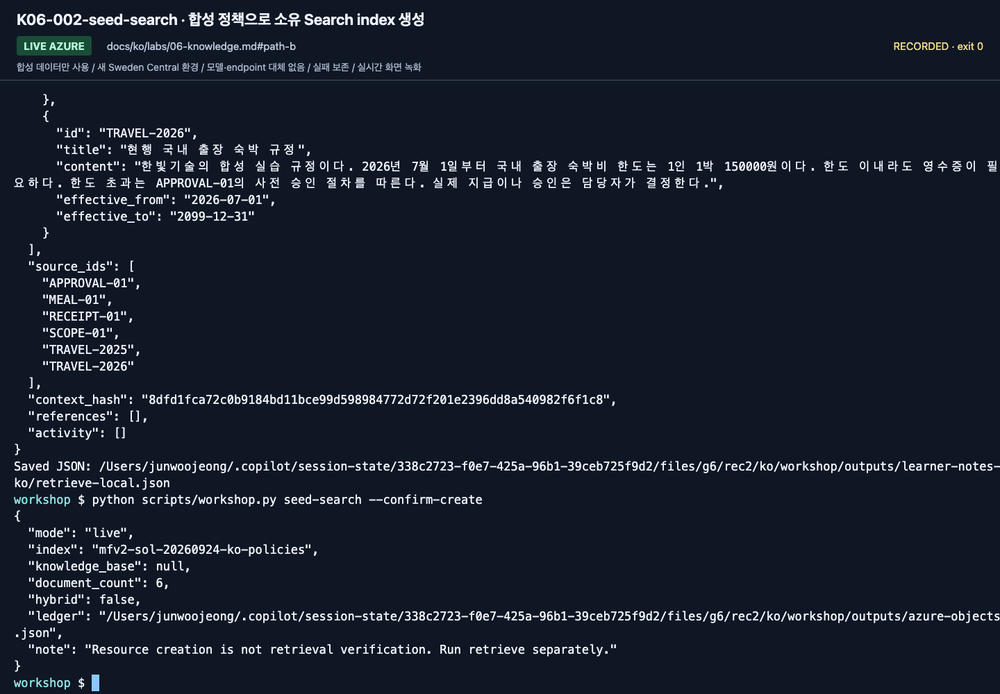
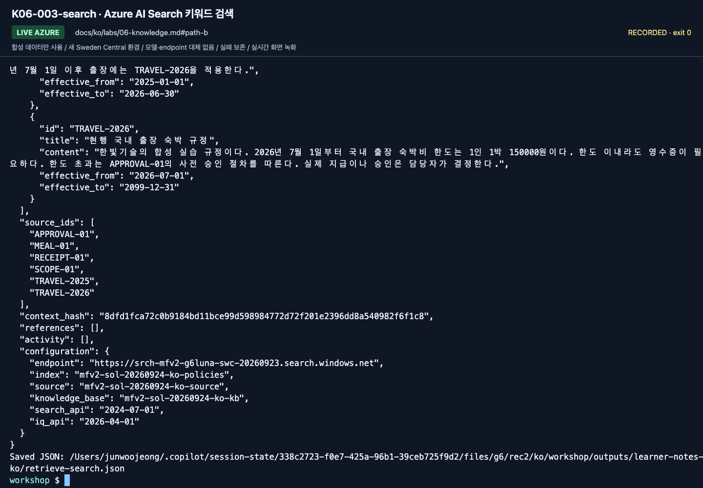
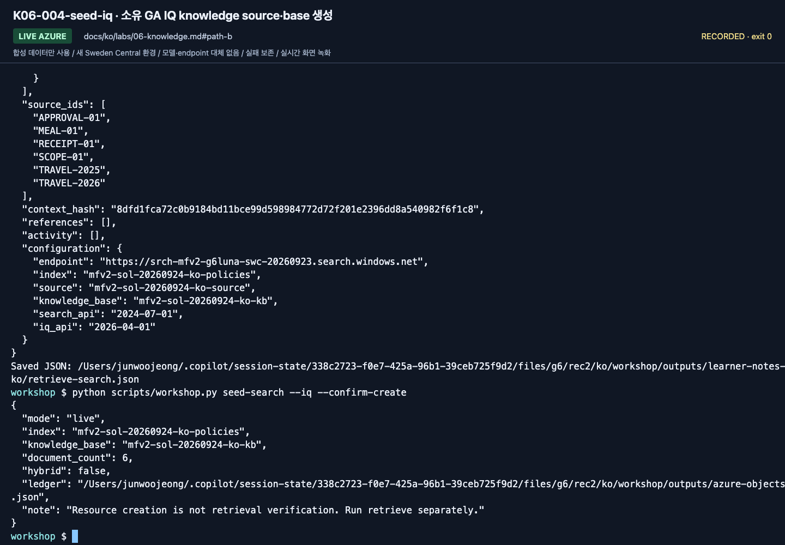
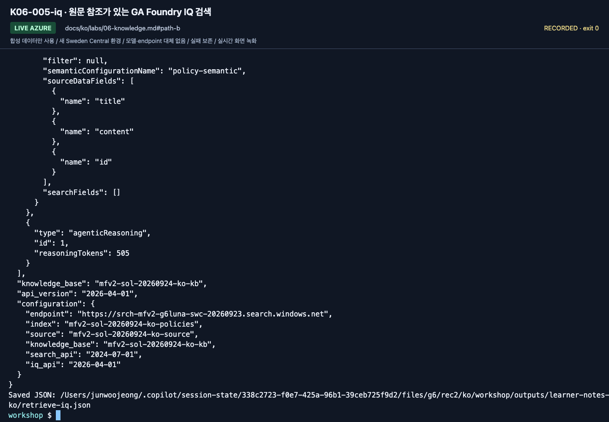
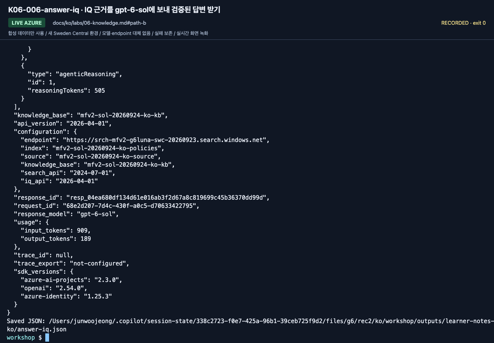
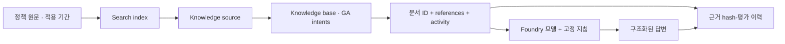
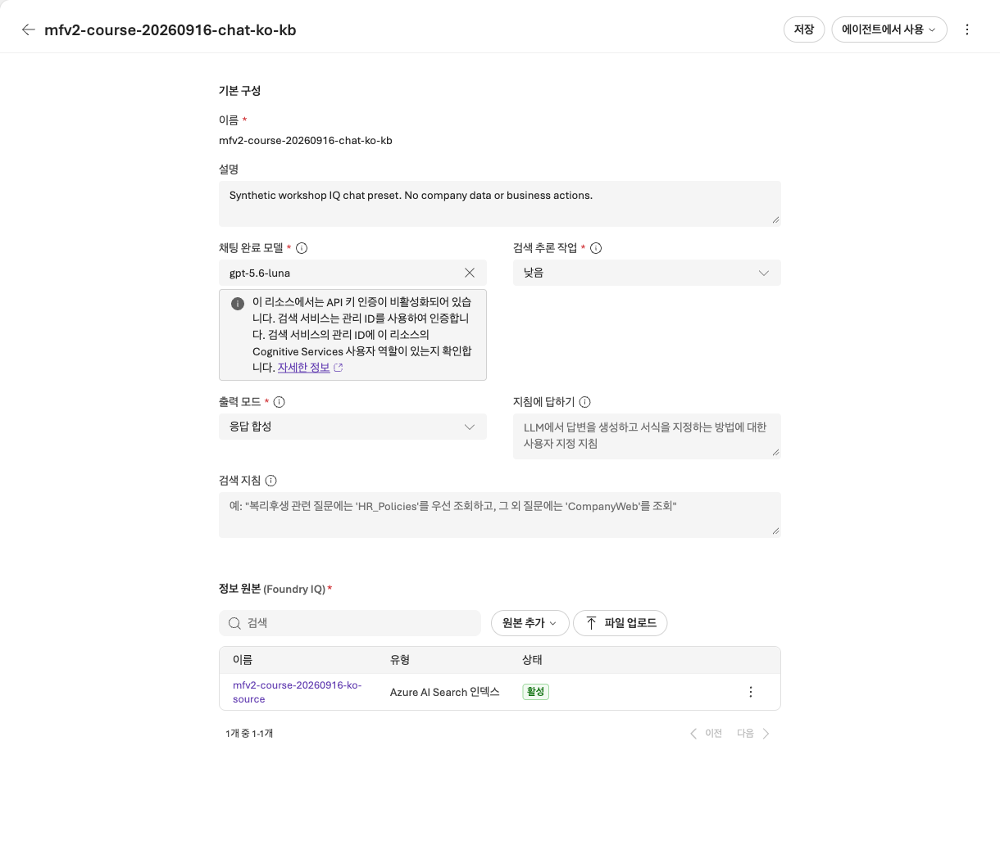

# Lab 06. 문서 근거에서 RAG와 Foundry IQ로

[English](../../labs/06-knowledge.md) | **한국어**

**완료 목표:** 일반 검색과 실제 IQ retrieval을 구분하고, 답변의 원문 근거를 보존합니다.

**내 구간 바로 열기:** [A — 기존 원문 확인](#path-a) · [B — GA Search/IQ](#path-b) · [학습 경로](../paths.md)

## 시작 전

**이번 순서:** A는 Lab 03 답변 세 개의 원문을 확인합니다. B는 번호 순서대로 Search와 GA IQ를 실행합니다. IQ Chat과 hybrid 검색은 선택입니다.

**준비물:** A: Lab 03 응답·학습자 파일. B: .env·준비된 Search 서비스·작성 권한·새 소유 prefix 또는 대응하는 소유권 ledger.

**다음으로 갈 기준:** A: 답변 세 개의 정책 ID·날짜를 대조했습니다. B: 검색·답변 파일 네 개를 저장했습니다.

**막히면:** A: 빠진 질문만 다시 보냅니다(1단계). B: Search 401/403이면 담당자에게 Search 서비스의 **Search Index Data Contributor**와 **Search Service Contributor**를 요청합니다. 다른 provider로 바꾸지 않습니다.

[한 번만 하는 준비와 학습자 파일](../setup.md).

<a id="path-a"></a>

## A. 브라우저 — 인용이 보이면 끝인가?

[Lab 03](03-prompt-agent.md#path-a)에서 저장한 D01·D02·D03 답변을 사용합니다.

1. 빠진 답변이 있으면 agent에서 **새 채팅**을 열고 `dev-questions.txt`의 해당 질문만 보냅니다.
2. 답변마다 인용한 정책 ID를 적습니다.
3. 학습자 ZIP의 `policies/` 폴더에서 해당 파일을 열어 금액과 적용 기간을 대조합니다.
4. `session-notes.txt`의 Lab 06 구간에 행마다 **맞음** 또는 **틀림**을 적습니다.

| 답변 | 올바른 근거와 금액 | 확인할 점 |
|---|---|---|
| D01 · 2026년 9월 숙박 | `TRAVEL-2026`(2026-07-01부터), 150000원 | 현행 규정을 적용했는가 |
| D02 · 2026년 5월 숙박 | `TRAVEL-2025`(2026-06-30까지), 120000원 | 여기서 `TRAVEL-2026`을 인용하면 잘못된 근거 선택 |
| D03 · 한도 초과 예약 | `TRAVEL-2026`과 `APPROVAL-01` | **예약 전** 승인 절차도 설명하는가 |

**화면 확인:** 인용한 ID가 모두 `policies/`에 있고 그 적용 기간이 질문의 출장 월을 포함합니다.
그럴듯해 보여도 다른 기간의 규정을 가리키면 틀린 것이므로 기록합니다.
포털에서 인용 원문이 열리지 않으면 보이는 ID와 문장을 `policies/` 파일과 대조합니다.

**A 완료:** `session-notes.txt`의 Lab 06 구간에 세 확인 결과와 **IQ Chat: 미선택**이 있습니다
(IQ Chat을 준비해 준 경우 먼저 [선택 IQ Chat](#iq-chat-model)을 진행합니다). [Lab 07 A](07-evaluation.md#path-a)로 이동합니다.


<a id="path-b"></a>

## B. 코드 — 로컬 근거, Search, GA IQ 순서로

**1–5단계를 순서대로 진행합니다: 로컬 근거 → Search → GA IQ → 근거 있는 답변.**
아래 조회·답변 명령 네 개에서 **2026년 9월의 170000원 호텔 질문을 동일하게** 유지합니다.
질문까지 바꾸지 않아야 검색된 근거를 비교할 수 있습니다. 검색 방식은 정해져 있으며 오류 시 서로 대체하지 않습니다.

| 단계 | 확인할 것 | Azure 사용 |
|---|---|---|
| 로컬 키워드 검색 | 합성 문서·원문 ID·context hash | 없음 |
| 일반 Search | 본인 index에서 검색한 결과 | 객체 작성·Search 비용 발생 가능 |
| GA Foundry IQ | Knowledge base의 references·activity·원문 | 객체 작성·검색 비용 발생 가능. 이 base 내부의 모델은 없음 |
| IQ 근거로 답변 | 새로 검색한 근거·정책 조건·인용 | IQ 재검색과 실제 `gpt-6-sol` 유료 요청 |

기본 단계에는 embedding 배포가 필요 없습니다. Hybrid 검색과 모델 기반 IQ Chat은 별도 선택입니다.
오류가 나도 검색 방식을 바꾸지 않습니다.

### 1. 강사 사전 준비 확인

준비된 Search 서비스가 필요합니다. 본인 계정에는 그 서비스의 **Search Service Contributor**와
**Search Index Data Contributor**가 필요합니다(읽기만 한다면 **Search Index Data Reader**).
Search 사용·과금은 담당자가 승인합니다.

seed 전에 `.env`에서 두 값을 확인합니다.

- `AZURE_SEARCH_ENDPOINT=https://<search>.search.windows.net` — 설정 카드의 값.
- `WORKSHOP_PREFIX` — 아직 seed한 적 없는 본인 prefix.

구독 Owner만으로 Search 데이터 접근이 된다고 가정하지 않습니다.
기본 실습 스크립트는 Search 서비스나 역할을 생성하지 않고 **준비된 서비스 안의
본인 접두사 객체만** 만듭니다.

**Seed 전에 소유권 상황을 정합니다.** 새 학습자 복사본은 아직 seed하지 않은 새 `mfv2-...` prefix와 작성 권한이 필요합니다.
강사의 준비 복사본에는 대응하는 `outputs/azure-objects.json`이 있어야 합니다.
원격 index는 있는데 로컬 ledger가 비어 있다면 생성/갱신 실습의 준비 완료가 아닙니다. 덮어쓰지 않습니다.
언어 옵션은 Search 객체 이름에 언어 접미사를 붙이지 않습니다. [작업 폴더·언어 변경 규칙](../reference/configuration.md#workspace-scope)을 확인합니다.

### 2. 작은 지식 원본 확인

```bash
python scripts/workshop.py retrieve --provider local \
  --question "2026년 9월 국내 출장 호텔이 170000원인데 예약해도 되나요? 한도와 절차를 알려주세요." \
  --output outputs/learner-notes-ko/retrieve-local.json
```

`documents`, `source_ids`, `context_hash`를 확인합니다.
학습용 로컬 검색은 한국어 형태소 검색이나 의미 검색의 대체물이 아닙니다.
검색 문서가 부족하면 정답을 코드에 넣지 말고 검색의 한계를 기록합니다.

**2–5단계의 화면**은 검색 방식마다 다른 질문을 사용한 2026-09-24 실행에서 가져왔습니다.
출력 필드를 찾는 데만 사용하고 이번 동일 질문 비교의 결과로 보지 않습니다. 화면을 맞추려고 유료 호출을 반복하지 않습니다.




**화면 확인:** `source_ids`와 `context_hash`를 확인합니다. 이 단계는 합성 파일의 로컬 검색입니다.
Search나 IQ를 호출했다고 표시하지 않습니다. 설정된 endpoint 이름만 보지 말고 반환된 provider를 확인합니다.

**저장:** `retrieve-local.json`이 Lab 00 기록 폴더에 작성됩니다. 파일을 열어 원문 근거를 확인합니다.

### 3. 일반 Search 색인 만들기

**클라우드 쓰기 작업입니다.** 준비된 실습 서비스·접두사·권한을 확인한 뒤 실행합니다.

```bash
python scripts/workshop.py seed-search --confirm-create
```

이름을 생략한 선택 환경변수는 다음과 같이 결정됩니다.

| 환경변수 | 기본 이름 |
|---|---|
| `AZURE_SEARCH_INDEX_NAME` | `<WORKSHOP_PREFIX>-policies` |
| `AZURE_SEARCH_KNOWLEDGE_SOURCE_NAME` | `<WORKSHOP_PREFIX>-source` |
| `AZURE_SEARCH_KNOWLEDGE_BASE_NAME` | `<WORKSHOP_PREFIX>-kb` |

기존 객체가 있는데 내 로컬 소유권 기록이 없으면 덮어쓰지 않습니다.
이미 seed한 뒤 prefix를 바꾸려면 새 소스 복사본도 사용하거나 강사에게 원래 작업 폴더 복구를 요청합니다.
기존 ledger를 삭제하지 않습니다.
문서 업로드가 부분 실패하면 전체 성공으로 처리하지 않습니다.




**화면 확인:** seed 결과의 `mode: live`, 본인의 `index`, `document_count: 6`,
`hybrid: false`, `knowledge_base: null`을 확인합니다. IQ가 아니라 일반 Search 객체를 만든 단계입니다.
소유권 기록 `outputs/azure-objects.json`이 이 명령의 저장된 증거이며 다른 파일은 필요 없습니다.

Seed 성공을 확인한 뒤에만 해당 index를 조회합니다.

```bash
python scripts/workshop.py retrieve --provider search \
  --question "2026년 9월 국내 출장 호텔이 170000원인데 예약해도 되나요? 한도와 절차를 알려주세요." \
  --output outputs/learner-notes-ko/retrieve-search.json
```



**화면 확인:** `--provider search` 명령의 결과를 읽고 endpoint/index가 본인 값인지 확인합니다.
`references`·`activity`가 없는 일반 Search 결과를 IQ 결과로 바꾸어 적지 않습니다.

**저장:** `retrieve-search.json`이 같은 기록 폴더에 작성됩니다. 검토한 뒤 IQ source/base를 만듭니다.

### 4. GA Foundry IQ knowledge source/base 만들기

```bash
python scripts/workshop.py seed-search --iq --confirm-create
```




**화면 확인:** seed 결과의 `knowledge_base`가 이제 null이 아니고, `document_count: 6`이며, `ledger` 경로가 `outputs/azure-objects.json`으로 끝납니다.
세 가지가 모두 보인 뒤 계속합니다. 이 소유권 기록은 보관하며 중단할 때도 삭제하지 않습니다.

이 GA IQ(REST `2026-04-01`)는 knowledge base 안의 모델 없이 문서를 검색하고,
5단계가 그 문서를 별도 호출로 `gpt-6-sol`에 보냅니다([모델 기반 IQ](../reference/iq-model-identity.md)는 선택).

```bash
python scripts/workshop.py retrieve --provider iq \
  --question "2026년 9월 국내 출장 호텔이 170000원인데 예약해도 되나요? 한도와 절차를 알려주세요." \
  --output outputs/learner-notes-ko/retrieve-iq.json
```




**화면 확인:** `provider: foundry-iq`, 본인의 `knowledge_base`, `api_version: 2026-04-01`, `references`, `activity`, 원문 `documents`를 확인합니다.
참조 번호는 문서 ID가 아닙니다. **빈 결과는 검색된 문서가 0건이라는 뜻입니다.** 기록하고 금액을 지어내지 않습니다.
IQ 오류는 오류로 남기며 일반 Search로 대체하지 않습니다. 보고되지 않은 지연이나 사용량은 임의로 채우지 않습니다.

**저장:** `retrieve-iq.json`이 원문·activity와 함께 같은 기록 폴더에 작성됩니다. 답변 요청 전에 확인합니다.

<a id="retrieval-comparison"></a>

**답변 요청 전 비교:** `retrieve-local.json`, `retrieve-search.json`, `retrieve-iq.json`을 함께 엽니다.
`session-notes.txt`에 각 파일의 `provider`, `source_ids`, `context_hash`를 기록합니다.
원문에 `TRAVEL-2026`(150000원)과 `APPROVAL-01`(예약 전 승인)이 있는지 확인합니다.
검색 방식이 다르면 문서나 hash도 다를 수 있습니다. IQ에 필요한 근거가 없다면 결과를 보존하고 5단계 전에 검색 원인을 확인합니다.
다른 방식으로 찾은 근거로 대신하지 않습니다.

### 5. 다시 검색한 뒤 실제 모델에 질문

```bash
python scripts/workshop.py answer --prompt v2 --retrieval iq \
  --question "2026년 9월 국내 출장 호텔이 170000원인데 예약해도 되나요? 한도와 절차를 알려주세요." \
  --output outputs/learner-notes-ko/answer-iq.json
```

**이 명령은 IQ를 다시 검색하며 `retrieve-iq.json`을 읽지 않습니다.**
새 근거와 모델 답변은 `answer-iq.json`에 함께 저장합니다.
그 파일의 `source_ids`·`context_hash`를 `retrieve-iq.json`과 대조합니다. 다르면 변경 사실을 적고
실제 답변에 사용한 원문을 검토합니다. 정책이 검색되지 않은 것과 올바른 정책을 잘못 해석한 것은 다른 문제입니다.



**화면 확인:** `--retrieval iq` 명령 아래의 base/API 설정, `response_model`, `response_id`, `usage`를 확인합니다.
`answer`의 `decision: needs_approval`, `limit_krw: 150000`, **예약 전 승인** 조건과
`TRAVEL-2026`·`APPROVAL-01` 인용을 이번 응답의 원문과 대조합니다. 불일치는 기록하며 저장된 답변을 고치지 않습니다.

**저장:** `answer-iq.json`이 같은 기록 폴더에 작성됩니다. 응답과 검색 metadata 전체를 확인합니다.



**B 완료:** Lab 00 기록 폴더에 출력 전체를 `retrieve-local.json`, `retrieve-search.json`, `retrieve-iq.json`, `answer-iq.json`으로 저장합니다.
원문 ID·`references`·`activity`·`context_hash`·소유권 ledger를 포함합니다.
원래 `outputs/azure-objects.json`은 그대로 둡니다. 복사한 출력 파일이 객체 소유권을 만들어 주지 않습니다.
[Lab 07 B](07-evaluation.md#path-b)는 **명시적인 로컬 검색 실험**으로 시작하며 이 IQ 답변을 평가 결과로 재사용하지 않습니다.

<a id="iq-chat-model"></a>

## 선택 IQ Chat — 준비된 gpt-5.6-luna chat KB 열기

담당자가 IQ Chat을 준비해 준 경우에만 진행합니다(A·B 공통). Search knowledge base가 2026-09-23 GPT-6 모델을 받지 않아
별도 `gpt-5.6-luna` 배포를 사용합니다([상세](../reference/model-choice.md)).

<details>
<summary>선택 Preview IQ Chat — 준비된 chat base·별도 비용 승인이 필요합니다</summary>

담당자가 [IQ 준비](../setup.md#4-환경-담당자의-준비)를 마친 경우에만 선택합니다.
아니라면 **IQ Chat 미선택**으로 기록하고 위 원문 확인을 마친 뒤 Lab 07로 이동합니다.
이 Search-index source의 계획·합성은 **2026-09-15 기준 Preview**이며 MI 자체는 정상 지원됩니다.

1. Foundry에서 **Knowledge → Knowledge bases**를 열고 담당자의 **`iq-chat setup`이 반환한 `knowledge_base` 이름**을 선택합니다.
   준비 카드에 적은 이름이며 기본값은 `<prefix>-chat-ko-kb`입니다. 채팅 설정을 보려고 기존 `<prefix>-kb`를 열지 않습니다.
2. 아래 **선택값 세 개가 채워져 있는지**와 국문 합성 source가 맞는지 확인합니다.
   모델이나 모드가 비어 있으면 **저장 전에 멈추고** 목록으로 돌아가 chat-base 이름부터 확인합니다.
   준비된 chat base가 없다면 담당자가 [check → 승인된 setup](../reference/iq-model-identity.md)을 완료합니다.
   모델 없는 GA base의 설정을 바꾸어 해결하지 않습니다.
3. Lab 05에서 사용한 준비된 터미널에서 아래 `check`를 실행합니다. `configured: true`여야 합니다.
   `ready_for_setup: true`만으로는 저장된 chat base가 있다는 뜻이 아닙니다.
4. 비용 승인 후 `ask`를 **한 번** 실행합니다. API·요청 필드·실제 activity를 보존하기 위해 이 검사는 CLI로 합니다.
   포털에서 같은 채팅을 추가 전송하지 않습니다.
5. `answer`, `source_ids`, `references`, 두 모델 activity를 합성 원문과 비교합니다. 실패는 그대로 기록합니다.

| 설정 | 첫 실습의 정확한 선택 |
|---|---|
| Chat 배포 / 실제 모델 | **`gpt-5.6-luna` / `gpt-5.6-luna`**, 모델 버전 **`2026-07-09`** |
| 인증 | **Search**의 **System assigned identity**. 학습자/Hosted agent identity가 아님 |
| 모델 계정 역할 | Foundry 계정 범위에서 Search identity에 **`Cognitive Services User`** |
| Reasoning / 출력 | **`low` / `answerSynthesis`** — 국문 화면에서는 **낮음 / 응답 합성** |
| API | **`2026-08-01-preview`**, API key 없음 |



**화면 확인:** `gpt-5.6-luna`, **낮음**, **응답 합성**, 국문 source와 **활성** 상태가 보입니다.
**Chat completions model is required** 같은 모델 미선택 오류가 없습니다. 필수 표시 별표와 회색 MI 안내는 정상입니다.
MI 안내는 Search의 ID를 사용한다는 뜻이지 인증 실패나 역할 확인 완료라는 뜻이 아닙니다.
**이미 저장된** chat KB를 새로 캡처한 원본 화면이며, 이번 캡처를 위해 저장·배포·모델 호출을 하지는 않았습니다.
2026-09-17 화면입니다. 2026-09-24 녹화는 IQ Chat을 다시 실행하지 않았고, 이 preset은 그 뒤로 바뀌지 않았습니다.
필드를 알아보는 용도로만 쓰고 본인 실행의 근거로 쓰지 않습니다.
화면의 이름을 복사하지 말고 본인에게 반환된 이름을 사용합니다.

**화면을 맞추려고 선택된 `gpt-5.6-luna`를 지우거나 추천 모델을 배포하지 않습니다.**
2026-09-17 확인 당시 빠른 모델 목록과 **Browse more models**는 기존 배포 목록이 아니라 배포용 카탈로그를 열었습니다.
그 카탈로그에 없어도 이미 저장된 `gpt-5.6-luna` 연결은 정상 표시됐습니다.
기존 선택을 유지하고, 최초 구성은 담당자의 고정 CLI preset으로 합니다. 다른 모델 선택이나 API key 활성화로 우회하지 않습니다.

```bash
python scripts/workshop.py iq-chat check
```

위 검사를 통과하고 요청 비용이 승인된 경우에만 실행합니다.

```bash
python scripts/workshop.py iq-chat ask --label iq-chat-lab06 --confirm-cost
```

결과의 `model_planning_verified: true`, `model_synthesis_verified: true`와
`gpt-5.6-luna`의 실제 `modelQueryPlanning` / `modelAnswerSynthesis`를 확인합니다.
요청·응답·원문 근거·실패는 `outputs/iq-chat/iq-chat-lab06/`에 남습니다. 새 요청은 새 label을 사용합니다.
`check`는 Azure를 변경하지 않고 `ask`는 모델/provider를 자동 대체하지 않습니다.
`configured: false`, 권한 누락, 다른 모델 버전, 403/429이면 멈추고 [고정 preset 복구 안내](../reference/iq-model-identity.md)를 따릅니다.
모델 고정은 흔한 설정 불일치를 없애지만 quota와 서비스 가동까지 보장하지는 않습니다.

</details>

## C. 선택 — 실제 하이브리드 RAG

**첫 회차는 [Lab 07](07-evaluation.md)로 이동합니다.** C·D는 별도 심화이며 GA 경로에서 빠진 단계가 아닙니다.

<details>
<summary>선택 embedding·하이브리드 index 실습 펼치기</summary>

**이 선택 경로는 2026-09-23에 `gpt-6-sol`로 다시 실행하지 않았습니다.**
이미 만든 텍스트 index의 필드를 몰래 바꾸지 않습니다.
같은 실습 prefix 아래 별도 index 이름을 `.env`에 정하고, 강사가 확인한 embedding 배포와
**실제 반환 차원**을 입력합니다. embedding 모델을 새로 배포하는 작업은 별도 승인 대상입니다.

```dotenv
AZURE_SEARCH_INDEX_NAME=<your-mfv2-prefix>-policies-hybrid
AZURE_AI_EMBEDDING_DEPLOYMENT_NAME=<verified-embedding-deployment>
WORKSHOP_EMBEDDING_DIMENSIONS=<actual-dimensions>
WORKSHOP_EMBEDDING_API=account
AZURE_OPENAI_ENDPOINT=https://<same-foundry-account>.openai.azure.com
```

```bash
python scripts/workshop.py seed-search --hybrid --confirm-create --confirm-cost
python scripts/workshop.py retrieve --provider hybrid --question "2026년 9월 국내 출장 숙박비 한도는?"
python scripts/workshop.py answer --retrieval hybrid --prompt v2
```

`--confirm-create`는 준비된 Search의 본인 index 작성, `--confirm-cost`는 실제 embedding 요청을 확인합니다.
6개 합성 문서의 embedding을 일괄 요청하고 `content_vector`의 차원·HNSW profile을 맞춥니다.
조회에는 `"search"`와 `"vectorQueries"`가 동시에 들어가며 `top=6`입니다.
벡터를 0으로 채우거나 다른 차원으로 잘라 맞추지 않습니다.
이번 실제 실행에서 프로젝트 `/openai/v1/embeddings`는 404를 반환했습니다.
원래 실패를 보존하고 같은 계정의 OpenAI embeddings API를 `WORKSHOP_EMBEDDING_API=account`로
**명시적으로 설정한 뒤** 새 작업으로 실행했습니다. 오류 처리 중 자동으로 다른 endpoint를 시도하지 않습니다.

**확인할 것:** `provider: azure-ai-search-hybrid`, `embedding_query.observed_model`,
차원, index 이름, 실제 source IDs와 context hash입니다.
기존 텍스트 index를 같은 이름으로 hybrid로 바꾸거나, hybrid index에 text-only 업로드로
벡터를 지우려 하면 거부합니다. 소유권·index별 설정은 `outputs/azure-objects.json`에 남습니다.

일반/IQ/Hybrid를 비교할 때는 `AZURE_SEARCH_INDEX_NAME`이 어느 index인지 다시 확인합니다.
IQ의 source/base는 원래 연결한 index를 참조하므로 환경변수만 바꿨다고 원격 base가 바뀌지 않습니다.
이 실험의 index 변경을 Lab 07의 prompt-only 전후 비교 사이에 섞지 않습니다.

</details>

## D. IQ를 Hosted 워크플로와 평가로 연결

<details>
<summary>심화 workflow·평가 연결 펼치기</summary>

```bash
python scripts/workshop.py workflow-agent --pattern sequential --retrieval iq --prompt v2
```

로컬 workflow 출력을 저장합니다. 원격 matrix는 [평가 워크북의 준비](../reference/evaluation-workbook.md#matrix-setup)에서 시작합니다.
그 워크북에서 별도 IQ/account-chat/Invocations 대상을 한 번 패키징합니다.
Lab 08의 입문 도우미는 이 IQ 프로필이 아니라 로컬 검색을 받습니다.
Toolbox/Fabric/Work IQ의 승인·원문·OBO 경계는 [IQ 확장 워크북](../reference/iq-workbook.md)에서 따로 다룹니다.
외부 원본 저장소로 이동해야 실행되는 숨은 선행 단계는 없습니다.

</details>

## 모델 기반 IQ와 기본 GA 검색을 구분하기

이 Search-index source에서 Chat 모델이 query planning과 답변 합성을 수행하도록 하려면
지원되는 Preview 계약을 명시하고 모델·Search identity 권한·reasoning effort·출력 모드를 함께 구성합니다.
Managed identity는 이 경로의 정상적인 keyless 인증 방식이며 실제로 확인했습니다.
GA schema의 `models` 존재와 모든 source에 대한 LLM 기능 지원은 같은 뜻이 아닙니다.
요청 필드도 API별로 확인하며, 검증 예시는 [MI 모델 연결 가이드](../reference/iq-model-identity.md)에 있습니다.
기존 평가의 재현을 위해 모델 없는 GA base는 유지하고, 모델 기반 실습에는 별도로 준비한 chat base를 사용합니다.
IQ Chat의 기준 화면은 [새 정상 설정 캡처](#iq-chat-model)입니다.

[전체 액션 인덱스](../action-captures.md) · [녹화 영상](../video-summary.md)

## 완료 확인

A: 원문 ID·적용 기간을 확인하고 IQ Chat의 선택 여부와 실제 실행 여부를 기록합니다.
B: Search와 GA IQ를 각각 호출하고 반환된 근거를 구분합니다.
`outputs/azure-objects.json`은 내 Search 객체의 소유권 기록입니다.
공유 서비스 자체를 삭제하는 권한 증명이 아닙니다.

다음: A → [Lab 07](07-evaluation.md#path-a) · B → [Lab 07](07-evaluation.md#path-b)
