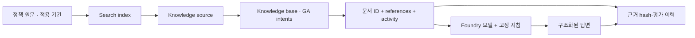

# Lab 06. 문서 근거에서 RAG와 Foundry IQ로

[English](../../labs/06-knowledge.md) | **한국어**

**완료 목표:** 일반 검색과 실제 IQ retrieval을 구분하고, 답변의 원문 근거를 보존합니다.

이전: [Lab 05](05-workflows.md) · 다음: [Lab 07](07-evaluation.md)

## 네 검색 경로는 같은 기능이 아닙니다

| 방식 | 이 저장소의 실행 | 무엇을 확인하나요? |
|---|---|---|
| 로컬 키워드 검색 | `retrieve --provider local` | 합성 파일에 대한 학습용 문자열 검색 |
| Azure AI Search | `retrieve --provider search` | 실제 Search index의 텍스트 검색 |
| 하이브리드 Search | `retrieve --provider hybrid` | 명시적 embedding + text/vector 검색을 함께 수행 |
| Foundry IQ | `retrieve --provider iq` | 실제 knowledge base의 retrieve, references·activity |

기본 local/Search/IQ 경로는 임베딩을 쓰지 않는 작은 텍스트/semantic 실습입니다. 일반 Search 경로를
**벡터·하이브리드 검색**이라고 표시하지 않습니다.
아래 선택 절에서 실제 embedding·차원·벡터 필드를 구성한 경우에만 하이브리드라고 표시합니다.

## A. 브라우저 — 인용이 보이면 끝인가?

1. [Lab 03](03-prompt-agent.md)의 실제 에이전트에서 현행과 과거 출장 질문을 각각 입력합니다.
2. 인용/근거의 문서 이름과 본문을 엽니다. 직접 컨텍스트 방식이면 해당 문서 ID를 원본 파일과 대조합니다.
3. `TRAVEL-2025`와 `TRAVEL-2026`의 적용 기간을 비교합니다.
4. 2026년 5월 질문에 현행 문서를 인용하면 잘못된 근거 선택으로 기록합니다.
5. “숙박 한도를 초과했다”는 질문에서 승인 규정이 함께 설명되는지 확인합니다.
6. 강사가 준비한 IQ 에이전트가 있으면 같은 질문을 보내 보고 원문 근거를 비교합니다.

**Chat completion model은 managed identity로 정상 구성할 수 있습니다.**
모델을 호출하는 주체는 Search 서비스의 identity이며, 모델이 있는 Foundry 계정의 `Cognitive Services User`가 필요합니다.
포털의 모델 기반 계획·답변 합성 경로와 아래의 모델 없는 GA 직접 검색은 서로 다른 실행 모드입니다.
Preview 여부와 MI 인증 지원을 혼동하지 않습니다.
[정상 설정 순서와 실제 HTTP 200 확인](../reference/iq-model-identity.md)을 참고하세요.


**화면 확인:** **Knowledge → Knowledge bases**에서 본인의 **Connection**, base 이름과 source를 대조합니다.
`Active`는 객체 상태입니다. 실제 검색 결과와 원문 근거는 아래의 retrieval 명령으로 따로 확인합니다.

## B. 코드 — 공통 환경에 Search만 추가

### 1. 강사 사전 준비 확인

- 기존 Azure AI Search 서비스, 필요한 tier·리전·인증 설정.
- 읽기 사용자: `Search Index Data Reader`.
- 색인/소스 작성자: 해당 서비스의 `Search Service Contributor` 및 `Search Index Data Contributor`.
- GA knowledge retrieval과 semantic ranker의 사용/과금 설정을 관리자가 별도로 확인.
- `.env`의 `AZURE_SEARCH_ENDPOINT`와 고유 `WORKSHOP_PREFIX`.

구독 Owner만으로 Search 데이터 접근이 된다고 가정하지 않습니다.
기본 실습 스크립트는 Search 서비스나 역할을 생성하지 않고 **준비된 서비스 안의
본인 접두사 객체만** 만듭니다.

### 2. 작은 지식 원본 확인

```bash
python scripts/workshop.py retrieve --provider local --question "2026년 9월 국내 출장 숙박비 한도는?"
```

`documents`, `source_ids`, `context_hash`를 확인합니다.
학습용 로컬 검색은 한국어 형태소 검색이나 의미 검색의 대체물이 아닙니다.
검색 문서가 부족하면 정답을 코드에 넣지 말고 검색의 한계를 기록합니다.


**화면 확인:** `source_ids`와 `context_hash`를 확인합니다. 이 단계는 합성 파일의 로컬 검색입니다.
Search나 IQ를 호출했다고 표시하지 않으며, 사진에 보이는 설정 항목만으로 실행 provider를 판단하지 않습니다.

### 3. 일반 Search 색인 만들기

**클라우드 쓰기 작업입니다.** 준비된 실습 서비스·접두사·권한을 확인한 뒤 실행합니다.

```bash
python scripts/workshop.py seed-search --confirm-create
python scripts/workshop.py retrieve --provider search --question "2026년 9월 국내 출장 숙박비 한도는?"
```

이름을 생략한 선택 환경변수는 다음과 같이 결정됩니다.

| 환경변수 | 기본 이름 |
|---|---|
| `AZURE_SEARCH_INDEX_NAME` | `<WORKSHOP_PREFIX>-policies` |
| `AZURE_SEARCH_KNOWLEDGE_SOURCE_NAME` | `<WORKSHOP_PREFIX>-source` |
| `AZURE_SEARCH_KNOWLEDGE_BASE_NAME` | `<WORKSHOP_PREFIX>-kb` |

기존 객체가 있는데 내 로컬 소유권 기록이 없으면 덮어쓰지 않습니다.
새 접두사를 쓰거나 강사에게 복구를 요청합니다.
문서 업로드가 부분 실패하면 전체 성공으로 처리하지 않습니다.


**화면 확인:** `mode: live`, 본인의 index 이름, `documents_uploaded: 6`을 확인합니다.
`iq_created: false`이면 이 단계에서는 일반 Search만 만든 것입니다.


**화면 확인:** `--provider search` 명령의 결과를 읽고 endpoint/index가 본인 값인지 확인합니다.
`references`·`activity`가 없는 일반 Search 결과를 IQ 결과로 바꾸어 적지 않습니다.

### 4. GA Foundry IQ knowledge source/base 만들기

```bash
python scripts/workshop.py seed-search --iq --confirm-create
python scripts/workshop.py retrieve --provider iq --question "2026년 9월 국내 출장에서 170000원 호텔의 사전 승인 조건은?"
```


**화면 확인:** `iq_created: true`, source/base 이름, `api_version: 2026-04-01`을 확인합니다.
위의 일반 Search 생성 결과와 구분하고, 본인의 소유권 기록도 유지합니다.

기본 IQ 코드는 **REST `2026-04-01` GA의 직접 intents·extractive 검색**을 사용합니다.
`seed-search --iq`는 Search-index source를 참조하는 KB를 만들되 **KB의 `models`를 설정하지 않습니다.**
조회에는 명시적 semantic `intents`를 보내며 최종 답변은 다음 단계의 별도 모델 호출에서 생성합니다.
이는 Search→Chat 모델의 managed identity 인증을 검증한 경로가 아닙니다.
서비스 내부 처리가 없다는 보장은 아니며 실제 activity에 보고된 reasoning 항목도 확인합니다.
검색 응답의 `maxOutputSizeInTokens`는 6000으로 제한합니다. 실제 GA 호출에서 5000 초과가
필요함을 확인했으며, 이는 답변 모델의 `WORKSHOP_MAX_OUTPUT_TOKENS`와 다른 설정입니다.

확인:

1. `provider`가 `foundry-iq`인가.
2. 실제 knowledge base 이름과 API 버전이 기록되었는가.
3. `references`, `activity`, 원문 `documents`가 있는가.
4. 참조 번호와 문서의 안정적인 `id`를 혼동하지 않았는가.
5. activity에 오류가 있으면 부분 성공으로 넘어가지 않았는가.

**빈 결과는 0건 검색입니다.** 이 경우에도 정상 답변처럼 금액을 채우지 않습니다.
실패 시 Search로 자동 대체하지 않습니다.


**화면 확인:** 사진 하단의 `activity`, knowledge base 이름과 API 버전을 읽습니다.
출력 위쪽의 `references`·`documents`도 함께 확인하세요. activity에 보고되지 않은 지연이나 사용량을 임의로 채우지 않습니다.

### 5. 같은 질문을 근거와 함께 실제 모델에 전달

```bash
python scripts/workshop.py answer --prompt v2 --retrieval iq --question "2026년 9월 국내 출장에서 170000원 호텔을 예약하려면 어떤 절차가 필요한가요?"
```

검색→응답을 따로 둔 이유는 실패를 구분하기 위해서입니다.
검색에 현재 규정이 없는 것과, 올바른 규정을 받았는데 적용일을 잘못 해석한 것은 다른 문제입니다.


**화면 확인:** `--retrieval iq` 명령 아래의 base/API 설정, `response_model`, `response_id`, `usage`를 확인합니다.
사진은 긴 출력의 하단이므로 답변의 금액·조건·인용은 위쪽 `answer`와 원문까지 대조합니다.



## C. 선택 — 실제 하이브리드 RAG

**2026-09-15 코드 추가. 새 live 확인/캡처는 별도 단계입니다.**
이미 만든 텍스트 index의 필드를 몰래 바꾸지 않습니다.
같은 실습 prefix 아래 별도 index 이름을 `.env`에 정하고, 강사가 확인한 embedding 배포와
**실제 반환 차원**을 입력합니다. embedding 모델을 새로 배포하는 작업은 별도 승인 대상입니다.

```dotenv
AZURE_SEARCH_INDEX_NAME=<your-mfv2-prefix>-policies-hybrid
AZURE_AI_EMBEDDING_DEPLOYMENT_NAME=<verified-embedding-deployment>
WORKSHOP_EMBEDDING_DIMENSIONS=<actual-dimensions>
WORKSHOP_EMBEDDING_API=account
AZURE_OPENAI_ENDPOINT=https://<same-foundry-account>.openai.azure.com
```

```bash
python scripts/workshop.py seed-search --hybrid --confirm-create --confirm-cost
python scripts/workshop.py retrieve --provider hybrid --question "2026년 9월 국내 출장 숙박비 한도는?"
python scripts/workshop.py answer --retrieval hybrid --prompt v2
```

`--confirm-create`는 준비된 Search의 본인 index 작성, `--confirm-cost`는 실제 embedding 요청을 확인합니다.
6개 합성 문서의 embedding을 일괄 요청하고 `content_vector`의 차원·HNSW profile을 맞춥니다.
조회에는 `"search"`와 `"vectorQueries"`가 동시에 들어가며 `top=6`입니다.
벡터를 0으로 채우거나 다른 차원으로 잘라 맞추지 않습니다.
이번 실제 실행에서 프로젝트 `/openai/v1/embeddings`는 404를 반환했습니다.
원래 실패를 보존하고 같은 계정의 OpenAI embeddings API를 `WORKSHOP_EMBEDDING_API=account`로
**명시적으로 설정한 뒤** 새 작업으로 실행했습니다. 오류 처리 중 자동으로 다른 endpoint를 시도하지 않습니다.

**확인할 것:** `provider: azure-ai-search-hybrid`, `embedding_query.observed_model`,
차원, index 이름, 실제 source IDs와 context hash입니다.
기존 텍스트 index를 같은 이름으로 hybrid로 바꾸거나, hybrid index에 text-only 업로드로
벡터를 지우려 하면 거부합니다. 소유권·index별 설정은 `outputs/azure-objects.json`에 남습니다.

일반/IQ/Hybrid를 비교할 때는 `AZURE_SEARCH_INDEX_NAME`이 어느 index인지 다시 확인합니다.
IQ의 source/base는 원래 연결한 index를 참조하므로 환경변수만 바꿨다고 원격 base가 바뀌지 않습니다.
이 실험의 index 변경을 Lab 07의 prompt-only 전후 비교 사이에 섞지 않습니다.

## D. IQ를 Hosted 워크플로와 평가로 연결

```bash
python scripts/workshop.py workflow-agent --pattern sequential --retrieval iq --prompt v2
python scripts/package_hosted.py --kind workflow --pattern sequential --retrieval iq --prompt v2 --protocol responses
```

같은 v2 폴더의 [Lab 08](08-hosted.md)과 [평가 워크북](../reference/evaluation-workbook.md)으로 이어집니다.
Toolbox/Fabric/Work IQ의 승인·원문·OBO 경계는 [IQ 확장 워크북](../reference/iq-workbook.md)에서 따로 다룹니다.
외부 원본 저장소로 이동해야 실행되는 숨은 선행 단계는 없습니다.

## 모델 기반 IQ와 기본 GA 검색을 구분하기

이 Search-index source에서 Chat 모델이 query planning과 답변 합성을 수행하도록 하려면
지원되는 Preview 계약을 명시하고 모델·Search identity 권한·reasoning effort·출력 모드를 함께 구성합니다.
Managed identity는 이 경로의 정상적인 keyless 인증 방식이며 실제로 확인했습니다.
GA schema의 `models` 존재와 모든 source에 대한 LLM 기능 지원은 같은 뜻이 아닙니다.
요청 필드도 API별로 확인하며, 검증 예시는 [MI 모델 연결 가이드](../reference/iq-model-identity.md)에 있습니다.
기존 평가를 같은 조건으로 재현할 때만 기존 KB를 유지하고, 다른 실행 모드는 새 소유 base에서 비교합니다.


**화면 확인:** 이 기존 캡처는 `models: []`인 base를 연 상태입니다.
**Chat completions model is required**는 모델 미선택 메시지이지 MI 실패가 아닙니다.
정상 모델 기반 구성을 원하면 지원 배포와 Search MI 역할을 명시적으로 설정한 뒤 저장·검증합니다.
기존 평가용 base를 덮어쓰지 않으려고 별도 base를 사용하는 것이며, 모델 설정 자체를 금지하는 것이 아닙니다.

## 2026-09-15 새 국문 실행 증거

영문 후속 실험에서 D05의 실제 IQ 근거에 `SCOPE-01`이 빠져 필수 인용 검사가 실패했습니다.
문서의 관측 reranker score는 약 1.775였으며 같은 endpoint·질문·corpus에
`WORKSHOP_IQ_RERANKER_THRESHOLD=0`을 명시한 진단은 합성 원문 6개를 반환했습니다.
검색 필터 조정이지 업무 rubric이나 judge 기준 변경이 아닙니다.
초기 실패를 보존하고 새 baseline/candidate는 같은 설정으로 실행합니다.
운영 권장값으로 일반화하거나 provider fallback으로 처리하지 않습니다.

아래는 이번 국문 실행에서 새로 캡처한 화면입니다. 초기 진단·실패와 최종 비교 결과를 구분하며, 영문 촬영본을 재사용하지 않았습니다.


**화면 확인:** 실제 command·언어·version·label·근거와 출력 상태를 확인합니다. 촬영 결과를 본인의 실행이나 운영 승인으로 대신하지 않습니다.


**화면 확인:** 실제 command·언어·version·label·근거와 출력 상태를 확인합니다. 촬영 결과를 본인의 실행이나 운영 승인으로 대신하지 않습니다.


**화면 확인:** 실제 command·언어·version·label·근거와 출력 상태를 확인합니다. 촬영 결과를 본인의 실행이나 운영 승인으로 대신하지 않습니다.

[새 영상과 액션 인덱스](../video-summary.md) · [실제 결과·계보](../live-run.md)


## 완료 확인

Search와 IQ를 각각 호출하고 구분할 수 있으며, 실제 인용의 원문과 적용 기간을 확인합니다.
`outputs/azure-objects.json`은 내 Search 객체의 소유권 기록입니다.
공유 서비스 자체를 삭제하는 권한 증명이 아닙니다.