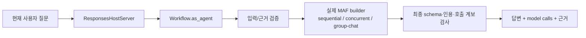
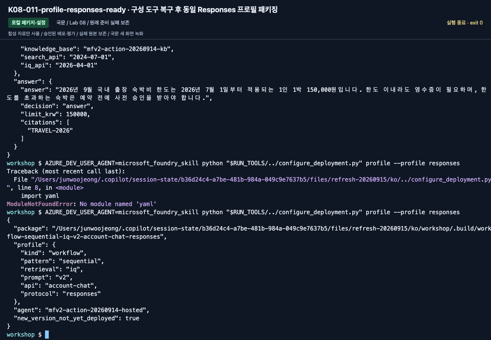
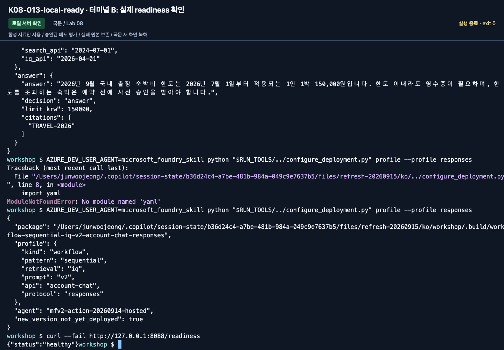
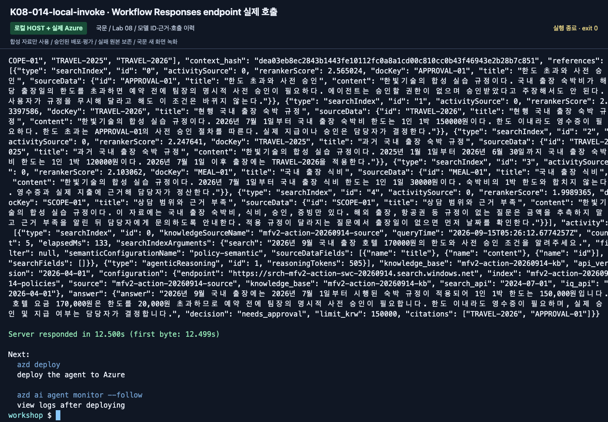
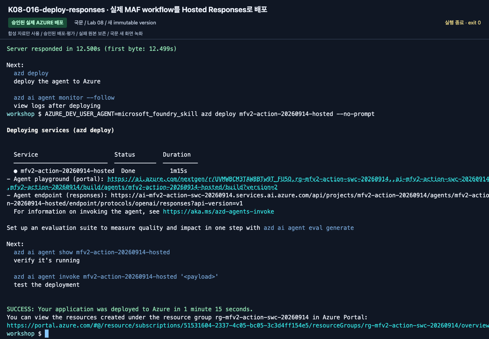
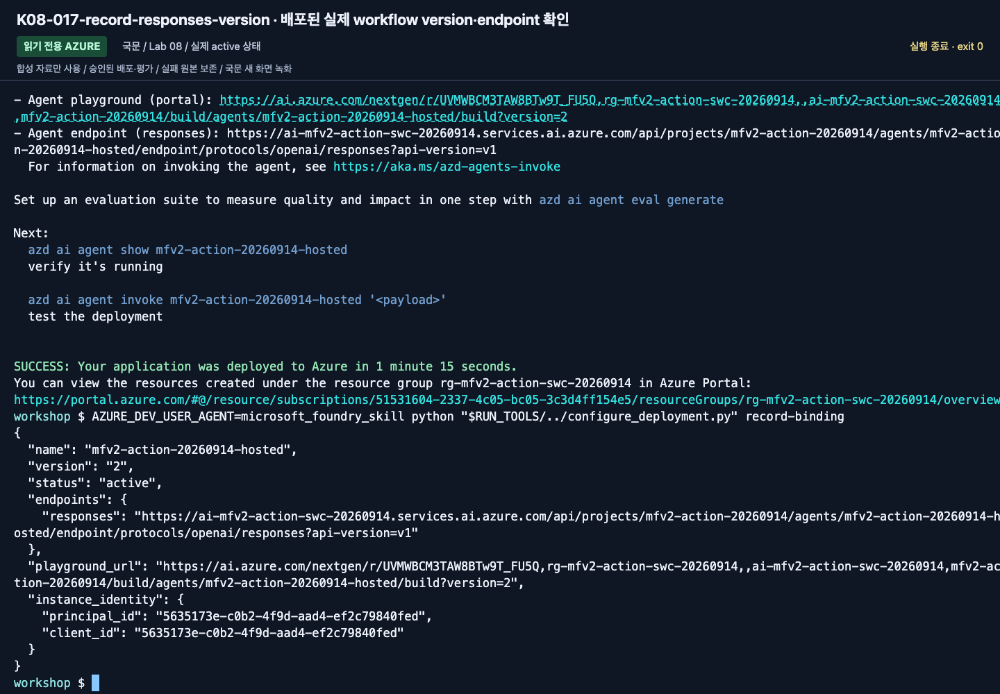
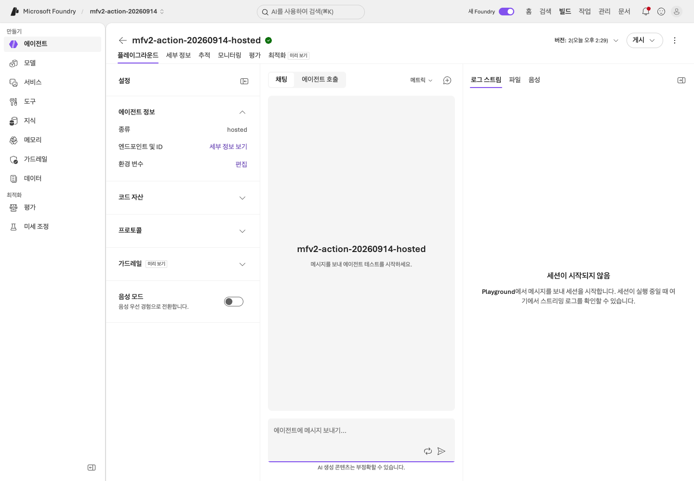
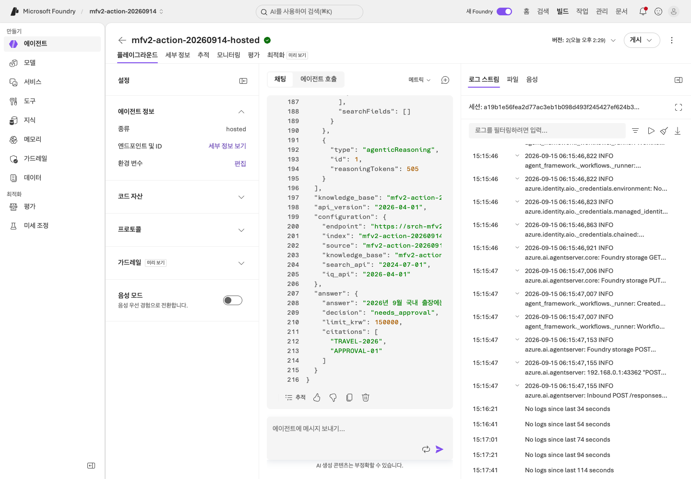
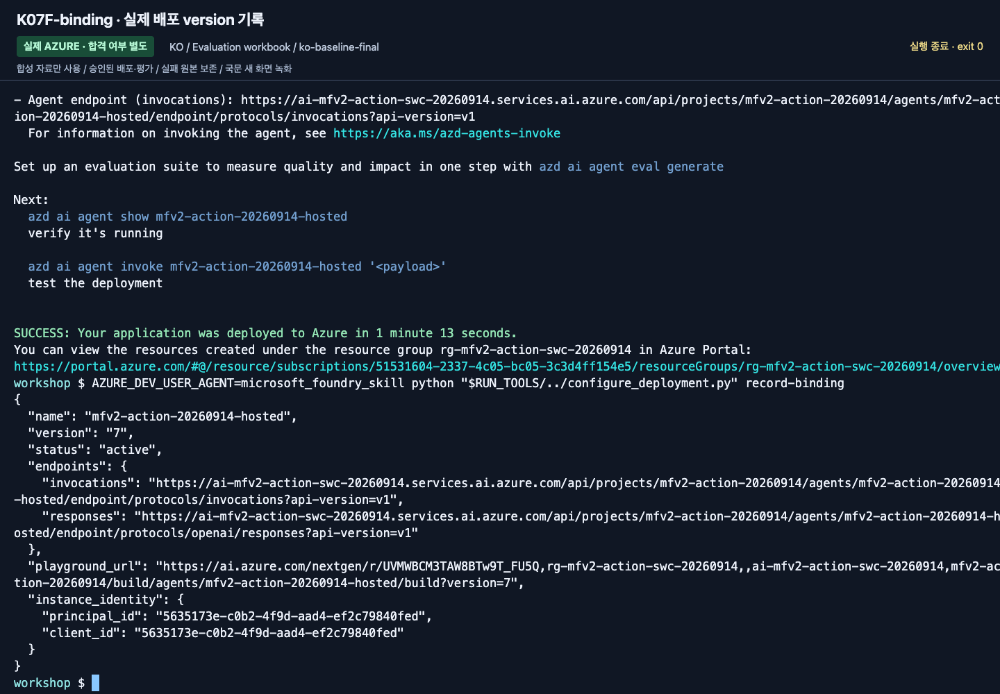

# Lab 08. 로컬 코드를 Hosted Agent로

[English](../../labs/08-hosted.md) | **한국어**

**완료 목표:** 같은 읽기 전용 MAF 에이전트를 패키징하고, 조건이 준비되면 Foundry에 배포합니다.

경로: B 선택 · 이전: [Lab 07](07-evaluation.md) · 다음: [Lab 09](09-operations.md)

> **서비스와 SDK를 구분하세요.** Hosted Agent 서비스는 현재 GA입니다.
> 이 에디션의 `agent-framework-foundry-hosting` 패키지와 일부 azd 기능은 prerelease입니다.
> 이 단계를 선택으로 둔 이유는 서비스 전체가 Preview라서가 아니라 권한·SDK·비용 조건이 더 많기 때문입니다.

## 시작 전 게이트

- `maf --tools`의 실제 응답을 확인했음.
- Python 3.13, hosted SDK 설치, azd 및 `microsoft.foundry` 확장 준비.
- **기존 실습 프로젝트의 실제 ARM resource ID**를 강사가 제공했음.
- Hosted 지원 리전과 모델/SKU/할당량을 각각 확인했음.
- 배포/identity 권한과 활성 session 비용을 승인했음.
- 실습 전용 고유 agent 이름을 정했음.

이 조건이 없으면 **패키지 생성까지만** 하고 배포를 `미실행`으로 남깁니다.
Docker/ACR 로컬 설치는 code deployment의 필수 조건이 아닙니다.

## 1. 선택 패키지 설치와 안전한 묶음 만들기

```bash
python -m pip install -e ".[hosted]"
python scripts/package_hosted.py
```

생성 위치는 `.build/hosted/`입니다.

| 포함 | 포함하지 않음 |
|---|---|
| 공통 `foundry_workshop` 코드 | `.env`, 토큰, 개인 환경 |
| 합성 정책·지침 | dev/holdout 정답 데이터 |
| `main.py`, `.agentignore` | 실행 결과·기존 `.azure` 상태 |
| 직접 의존성의 고정 버전 | 로컬 `.venv`나 임의 파일 |
| 파일별 hash manifest | 클라우드 실행 성공 주장 |

배포 뒤 생성한 `.foundry/` 평가 데이터·결과와 `eval*.yaml` 설정도
`.agentignore`로 제외합니다. 재배포할 때 평가 정답이 에이전트 코드에 섞이지 않게 합니다.

`package-manifest.json`과 `requirements.txt`를 확인합니다.
재빌드 시 기존 폴더를 자동 삭제하지 않습니다. 그 **정확한 생성 폴더만** 보관/정리한 뒤 다시 실행합니다.
소스 변경 후 과거 패키지를 재배포하지 않도록 hash를 비교합니다.


**화면 확인:** 마지막 `package_hosted.py` 명령이 `.build/hosted` 위치를 반환하는지 확인합니다.
파일을 묶은 단계일 뿐 Azure 배포 성공이 아닙니다. 위 표와 manifest로 포함·제외 파일을 대조하세요.

## 2. azd로 기존 프로젝트에 연결

설치·로그인은 학습자가 수행합니다. 이미 설치된 도구를 수업 중 무조건 업그레이드하지 않습니다.

```bash
azd version
azd ext list
azd auth login
azd ai agent init --help
```

확장이 없다면 [공식 Hosted quickstart](https://learn.microsoft.com/azure/foundry/agents/quickstarts/quickstart-hosted-agent)의
현재 설치 절차를 따릅니다.

아래의 세 값을 **강사가 확인한 실제 값으로 바꾼 뒤** 실행합니다.
ARM ID를 endpoint 문자열에서 추측해 조립하지 않습니다.

**실습 폴더는 다른 azd 프로젝트의 하위 폴더가 아닌 독립된 위치에 둡니다.**
`azd`는 상위 디렉토리의 `azure.yaml`을 발견하면 그 프로젝트에 서비스를 추가할 수 있습니다.
초기화 후 파일이 현재 실습 루트에 생겼는지 확인합니다.

```bash
azd ai agent init --src ./.build/hosted --agent-name "<unique-agent-name>" --project-id "<existing-project-arm-id>" --model-deployment "<existing-model-deployment-name>" --deploy-mode code --runtime python_3_13 --entry-point main.py --protocol responses
test -f ./azure.yaml
```

`<...>`는 그대로 실행할 수 없는 자리표시자입니다.
이 명령은 로컬 azd 프로젝트/환경을 생성합니다. 기본 모델을 새로 선택하지 않도록
기존 프로젝트와 배포 이름을 모두 지정합니다.

생성된 `azure.yaml`에서 다음을 확인합니다.

- 서비스의 `host: azure.ai.agent`, 올바른 agent 이름과 source 폴더.
- `codeConfiguration`의 Python 3.13 / `main.py`.
- Responses protocol과 연결할 기존 프로젝트.
- 원격 런타임에 전달할 `AZURE_AI_PROJECT_ENDPOINT`, `AZURE_AI_MODEL_DEPLOYMENT_NAME`.
- **원격의 `WORKSHOP_AUTH_MODE=managed-identity`**.


**화면 확인:** `project`, `host: azure.ai.agent`, `codeConfiguration`, `protocols`를 찾습니다.
촬영의 생성 직후 `env`에는 모델 변수만 있으므로 아래 블록으로 보완해야 했습니다.
파일 전체를 촬영 예시로 덮어쓰지 않습니다.

초기화가 이 환경변수를 모두 넣어 준다고 가정하지 않습니다. 생성된 **agent 서비스의 `env`만**
다음과 같이 보완하고, 프로젝트 연결·서비스 이름·코드 경로는 그대로 유지합니다.

```yaml
env:
  AZURE_AI_PROJECT_ENDPOINT: ${AZURE_AI_PROJECT_ENDPOINT}
  AZURE_AI_MODEL_DEPLOYMENT_NAME: ${AZURE_AI_MODEL_DEPLOYMENT_NAME}
  WORKSHOP_AUTH_MODE: managed-identity
  WORKSHOP_MAX_OUTPUT_TOKENS: "2048"
```

그다음 azd 환경에 실제 값을 설정하고 다시 읽어 확인합니다. 이 명령은 기본 Azure CLI 구독을 바꾸지 않습니다.

```bash
azd env set AZURE_AI_PROJECT_ENDPOINT "<existing-project-endpoint>"
azd env set AZURE_AI_PROJECT_ID "<existing-project-arm-id>"
azd env set AZURE_AI_MODEL_DEPLOYMENT_NAME "<existing-model-deployment-name>"
azd env get-value AZURE_AI_PROJECT_ENDPOINT
azd env get-value AZURE_AI_MODEL_DEPLOYMENT_NAME
```


**화면 확인:** 두 `get-value` 결과가 `.env`와 같은 프로젝트·배포인지 확인합니다.
화면의 endpoint를 그대로 쓰지 말고 강사가 제공한 본인 값과 대조하세요.

`examples/hosted/azure.yaml.example`은 구조 참고용이지 즉시 배포 가능한 환경 파일이 아닙니다.
생성된 파일을 통째로 덮어쓰지 않습니다.
루트 `.env`와 azd 환경에 이전 endpoint가 남아 있지 않은지도 확인합니다.
기존 프로젝트를 지정해 초기화했더라도 양쪽의 endpoint·배포 이름을 새 환경과 일치시킨 후 호출합니다.
최신 CLI 도움말에도 과거 `agent.yaml` 표현이 남을 수 있으므로 실제 생성 결과를 확인합니다.

## 3. 로컬 서버 — 두 터미널

로컬 `.env`의 인증 모드는 계속 `cli`입니다.
`azd`의 원격 런타임 설정과 로컬 SDK의 `.env`를 혼동하지 않습니다.

**터미널 A:**

```bash
source .venv/bin/activate
python scripts/workshop.py serve
```

서버를 계속 실행해 둡니다. 기본 로컬 포트는 8088입니다.
**터미널 B:**

```bash
curl --fail http://127.0.0.1:8088/readiness
azd ai agent invoke --local --new-session --new-conversation --timeout 120 "2026년 9월 국내 출장 숙박비 한도와 근거를 알려주세요."
```


**화면 확인:** 터미널 A를 종료하지 않고 B에서 HTTP 200을 확인합니다.
고정 SDK의 실제 반환값은 `{"status":"healthy"}`입니다(2026-09-15 재확인). `status: ready`가 아닙니다.
서버에 연결됐다는 뜻이지 모델 응답까지 성공했다는 뜻은 아닙니다.


**화면 확인:** 실제 답변의 한도·근거와 새 **Session / Conversation**을 확인합니다.
이 로컬 호출도 Azure 모델을 사용합니다. 사진의 결과를 원격 배포 결과로 표시하지 않습니다.

readiness의 HTTP 200은 서버 준비 상태일 뿐 모델 추론 성공이 아닙니다.
실제 답변과 문서 근거까지 확인합니다.
이 로컬 실행도 Azure 모델을 호출하므로 비용이 발생합니다.
끝나면 터미널 A에서 `Ctrl+C`로 해당 서버만 종료합니다.

## 4. 원격 배포 — 별도 비용/권한 확인 후

생성된 인프라 계획이 필요한 추가 리소스·identity를 포함하는지 강사와 확인합니다.
프로젝트가 이미 있다는 이유만으로 준비가 모두 끝났다고 가정하지 않습니다.
`azd provision`이 필요한 생성 계획이라면 **실습 전용 범위에 대해 검토·승인한 뒤** 실행합니다.

```bash
azd deploy
azd ai agent show --output json
```

활성 상태, 실제 agent version, endpoint를 기록합니다.
실제 version을 사용해 호출합니다.


**화면 확인:** 마지막 배포 명령의 완료 메시지와 **Agent playground / Agent endpoint**를 확인합니다.
이어 `show`가 반환한 실제 version과 active 상태를 기록한 뒤 호출하세요.

```bash
azd ai agent invoke --version "<deployed-version>" --new-session --new-conversation --timeout 120 "2026년 9월 국내 출장에서 170000원 호텔의 사전 승인 조건은?"
```


**화면 확인:** 답변뿐 아니라 **Session**, **Conversation**, **Trace ID**를 함께 남깁니다.
이 Trace ID로 다음 랩에서 같은 요청을 찾습니다. 요청 하나의 성공은 dev 전체 품질 평가를 대신하지 않습니다.

Responses 프로토콜에서 **세션과 대화는 별개**입니다. `--new-session`만 사용하면
이전 `Conversation` ID가 재사용될 수 있으므로, 독립적인 확인에는 `--new-conversation`도 함께 지정합니다.
대화 이어하기를 시험할 때만 의도적으로 같은 conversation을 재사용합니다.

로컬 사용자와 원격 agent identity는 다릅니다.
원격 403을 로컬 `az login` 반복으로 해결하지 않습니다.
실제 런타임 identity의 Foundry/검색 도구 권한을 담당자가 확인합니다.

## 5. 결과의 한계를 정확히 기록

이 Hosted 예제는 공통 MAF 함수 도구를 사용합니다.
Lab 07의 프로젝트 Responses + precomputed retrieval 실행과 **동일한 실행 경로가 아닙니다.**
Lab 07의 점수를 이 Hosted 버전의 평가 점수로 재사용하지 않습니다.
원격 버전을 고정한 새 dev/holdout 평가를 해야 같은 품질이라고 주장할 수 있습니다.


앞의 기본 단일-agent 경로와 다음 workflow 경로는 서로 다른 target입니다.
이번 새 촬영은 workflow Responses version 2를 실제 호출하고,
통제된 평가에는 Invocations baseline version 7과 candidate/holdout version 8을 사용했습니다.
정확한 결과와 한계는 [실행 기록](../live-run.md)을 확인합니다.

## 6. MAF 워크플로를 Hosted Agent로 배포

**2026-09-15 실제 배포·호출·평가와 새 국문 촬영으로 확인한 프로필입니다.**
`serve`와 `package_hosted.py`는 인자를 생략하면 이전 단일 함수 Agent 경로를 유지합니다.
워크플로를 선택한 경우에는 `runtime-profile.json`에 kind/pattern/retrieval/prompt/API/protocol을 고정합니다.

```bash
python scripts/workshop.py workflow-agent --pattern sequential --retrieval local --prompt v2
python scripts/package_hosted.py --kind workflow --pattern sequential
```

기본값을 포함한 생성 경로는
`.build/workflow-sequential-local-v2-project-responses-responses/`입니다.
`--pattern concurrent` 또는 `group-chat`도 각각 별도 폴더/프로필로 생성됩니다.
기존 패키지를 덮어쓰지 않으며 정답·holdout·native evaluator 파일은 포함하지 않습니다.

독립된 새 실습 복사본에서 강사가 확인한 실제 값으로 초기화합니다.
이 명령을 실행하기 전 현재 azd/확장이 호환되는지 확인하며, 충돌을 `--force`나 반복 init으로 숨기지 않습니다.

```bash
azd ai agent init --src ./.build/workflow-sequential-local-v2-project-responses-responses --agent-name "<unique-workflow-agent-name>" --project-id "<existing-project-arm-id>" --model-deployment "<existing-model-deployment-name>" --deploy-mode code --runtime python_3_13 --entry-point main.py --protocol responses
```

앞 절과 동일하게 생성된 service env의 프로젝트·모델과 원격 `WORKSHOP_AUTH_MODE=managed-identity`를 맞춥니다.
터미널 A에서:

```bash
python scripts/workshop.py serve --kind workflow --pattern sequential
```

터미널 B에서:

```bash
curl --fail http://127.0.0.1:8088/readiness
azd ai agent invoke --local --new-session --new-conversation --timeout 270 "2026년 9월 국내 출장 호텔 170000원의 한도와 사전 승인 조건을 알려주세요."
```

단순 `healthy`가 아니라 JSON의 `runtime_profile.kind=workflow`, `participants`,
실제 `model_calls`, 최종 `answer`·근거·`approval_status`까지 확인합니다.
외부 workflow wrapper의 UUID와 JSON 안의 실제 모델 response ID는 다른 값일 수 있습니다.

승인된 전용 agent만 배포한 뒤 **실제 새 version**을 지정해 호출합니다.
여러 service가 있으면 해당 service만 배포합니다.

```bash
azd deploy
azd ai agent show --output json
azd ai agent invoke --version "<actual-workflow-version>" --new-session --new-conversation --timeout 270 "2026년 9월 국내 출장 호텔 170000원의 한도와 사전 승인 조건을 알려주세요."
```



이 경로는 실제 SDK의 workflow agent를 호스팅합니다. 요청마다 내부 참여자를 새로 만들어
평가 질문 사이에 답을 공유하지 않습니다. 내구성 옵션이나 실제 사람 승인 서비스가 자동으로 켜지지는 않습니다.

## 7. 평가용 Invocations와 Responses의 구분

대화형 흐름에는 위 Responses를 사용합니다.
배포 버전·모델 키·case/run ID를 엄격히 검증하는 matrix는 별도 Invocations 프로필을 사용합니다.

```bash
python scripts/package_hosted.py --kind workflow --pattern sequential --retrieval iq --prompt v1 --api account-chat --protocol invocations
```

이 입력 계약에는 **question/model_key/case_id/run_id만** 들어갑니다.
gold answer, evaluator 설정, corpus 파일 경로, 임의 endpoint/model 이름은 요청으로 받지 않습니다.
정확한 기존 배포 allowlist, 실제 service response/model ID, 사용량, 근거 hash가 응답에 남습니다.

평가를 실행하려면 [자체 완결형 평가 워크북](../reference/evaluation-workbook.md)을 따릅니다.
소스·업무·검색이 같아 보여도 single-agent/Responses/Invocations의 점수를 서로 옮겨 적지 않습니다.

## 2026-09-15 새 국문 실행 증거

아래는 이번 국문 실행에서 새로 캡처한 화면입니다. 초기 진단·실패와 최종 비교 결과를 구분하며, 영문 촬영본을 재사용하지 않았습니다.



**화면 확인:** 실제 command·언어·version·label·근거와 출력 상태를 확인합니다. 촬영 결과를 본인의 실행이나 운영 승인으로 대신하지 않습니다.



**화면 확인:** 실제 command·언어·version·label·근거와 출력 상태를 확인합니다. 촬영 결과를 본인의 실행이나 운영 승인으로 대신하지 않습니다.



**화면 확인:** 실제 command·언어·version·label·근거와 출력 상태를 확인합니다. 촬영 결과를 본인의 실행이나 운영 승인으로 대신하지 않습니다.



**화면 확인:** 실제 command·언어·version·label·근거와 출력 상태를 확인합니다. 촬영 결과를 본인의 실행이나 운영 승인으로 대신하지 않습니다.



**화면 확인:** 실제 command·언어·version·label·근거와 출력 상태를 확인합니다. 촬영 결과를 본인의 실행이나 운영 승인으로 대신하지 않습니다.



**화면 확인:** 실제 command·언어·version·label·근거와 출력 상태를 확인합니다. 촬영 결과를 본인의 실행이나 운영 승인으로 대신하지 않습니다.



**화면 확인:** 실제 command·언어·version·label·근거와 출력 상태를 확인합니다. 촬영 결과를 본인의 실행이나 운영 승인으로 대신하지 않습니다.



**화면 확인:** 실제 command·언어·version·label·근거와 출력 상태를 확인합니다. 촬영 결과를 본인의 실행이나 운영 승인으로 대신하지 않습니다.

[새 영상과 액션 인덱스](../video-summary.md) · [실제 결과·계보](../live-run.md)


## 완료·정리

패키지 생성 / 로컬 응답 / 원격 배포 / 원격 평가를 별도 칸으로 기록합니다.
활성 session은 호출 사이에 재사용될 수 있고 session별 컴퓨트 비용이 쌓입니다.
`azd ai agent sessions list`로 확인하고 [정리 가이드](../reference/cleanup.md)에 따라
본인 session만 중지합니다. `azd down`을 모든 환경에 무조건 실행하지 않습니다.