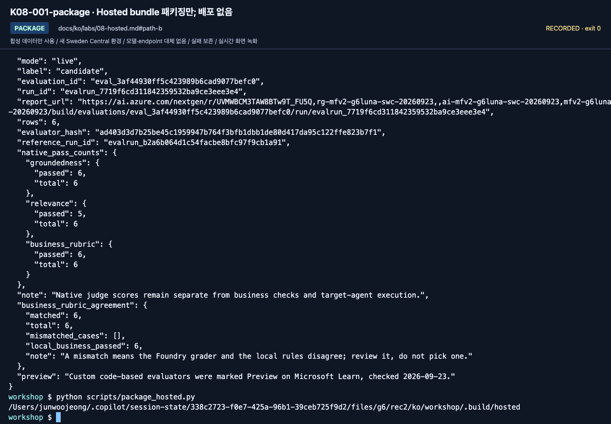
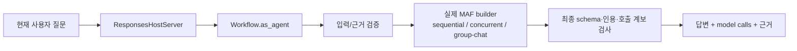

# Lab 08. 배포하지 않고 agent 패키지 만들기

[English](../../labs/08-hosted.md) | **한국어**

**완료 목표:** 읽기 전용 MAF agent의 안전한 로컬 패키지를 만들고 확인합니다. 배포는 별도 선택 실습입니다.

**내 구간 바로 열기:** A: [Lab 09 A로 이동](09-operations.md#path-a) · [B — 패키징만](#path-b) · [학습 경로](../paths.md)

## 시작 전

**이번 순서:** A는 Lab 09로 이동합니다. B는 단일 agent를 패키징하고 멈춥니다. 로컬/원격 실행·workflow·Invocations는 선택입니다.

**준비물:** 저장소·Python. 패키징에는 Hosted SDK·azd·project ARM ID·Azure 쓰기 승인이 필요 없습니다.

**다음으로 갈 기준:** 패키지 manifest를 검토하고 `cloud_deployed: false`를 유지합니다. 로컬·원격 실행은 **미실행**으로 적습니다.

**막히면:** 패키지가 이미 있으면 다시 만들기 전에 확인합니다. 소스·실행 결과·azd 상태는 삭제하지 않습니다.

[한 번만 하는 준비와 학습자 파일](../setup.md).

<a id="path-b"></a>

## 1. Azure 없이 안전한 패키지 만들기

**기본 B는 명령 하나 실행 → manifest 확인 → Lab 09 이동입니다.**
학습자 ZIP 폴더가 아니라 Lab 00의 소스 저장소 루트와 가상환경을 사용합니다.
`.build/hosted/`가 이미 있으면 manifest부터 확인합니다. 명령은 기존 폴더를 덮어쓰지 않습니다.
다시 만들려면 먼저 이전 패키지를 옮겨 보존합니다. 예: `mv .build/hosted ".build/hosted-$(date +%Y%m%d-%H%M%S)"`.

```bash
python scripts/package_hosted.py
```

생성 위치는 `.build/hosted/`입니다.

| 포함 | 포함하지 않음 |
|---|---|
| 공통 `foundry_workshop` 코드 | `.env`, 토큰, 개인 환경 |
| 합성 정책·지침 | dev/holdout 정답 데이터 |
| `main.py`, `.agentignore` | 실행 결과·기존 `.azure` 상태 |
| 직접 의존성의 고정 버전 | 로컬 `.venv`나 임의 파일 |
| 파일별 hash manifest | 클라우드 실행 성공 주장 |

나중에 생성되는 `.foundry/` 평가 데이터·결과와 `eval*.yaml` 설정도
`.agentignore`로 제외합니다. 재배포할 때 평가 정답이 에이전트 코드에 섞이지 않게 합니다.

`.build/hosted/package-manifest.json`과 `.build/hosted/requirements.txt`를 엽니다.
소스를 바꿨다면 hash를 비교합니다. 저장된 패키지는 소스 변경을 자동으로 반영하지 않습니다.
`cloud_deployed: false`는 패키징 시점의 기록이지 실제 배포 상태를 조회한 결과가 아닙니다.
Manifest는 그대로 두고, 나중에 승인받아 실행한 결과는 별도로 기록합니다.
`session-notes.txt`의 B 구간에서 `Lab 08 패키지 경로 / cloud_deployed / 로컬·원격 실행:`을 채웁니다.
실제 패키지 경로와 `cloud_deployed: false`를 적고, 두 선택 실행 단계는 모두 **미실행**으로 표시합니다.




**화면 확인:** 마지막 `package_hosted.py` 명령이 `.build/hosted`의 절대 경로를 출력하는지 확인합니다.
파일을 묶은 단계일 뿐 Azure 배포 성공이 아닙니다. 위 표와 manifest로 포함·제외 파일을 대조하세요.

**B 완료:** `cloud_deployed: false`인 `.build/hosted/package-manifest.json`을 보관합니다.
로컬 호출·원격 배포는 **미실행**으로 적고 [Lab 09 B](09-operations.md#path-b)로 이동합니다.

<details>
<summary>최소 SDK 예제(선택, 저장소 밖 재사용)</summary>

**요청 전 준비:** Hosted SDK, 동작하는 Lab 02 설정·인증, 추론 비용 승인이 필요합니다.
서버는 로컬이어도 모델 호출에는 Azure 추론 비용이 발생합니다. 준비되지 않았다면 [Lab 09 B](09-operations.md#path-b)로 건너뜁니다.

최소 Hosted Responses server 패턴은 [`examples/recipes/08_hosted_agent.py`](../../../examples/recipes/08_hosted_agent.py)를 참고합니다. 핵심 줄은 다음과 같습니다.

```python
agent = Agent(
    client=chat_client,
    name="PolicyGuide",
    instructions="Answer only from the synthetic policies below and cite their IDs.\n" + policies,
)
ResponsesHostServer(agent).run(host="127.0.0.1")
```

`agent-framework-foundry-hosting`은 prerelease Python 패키지이고 Hosted Agent 서비스는 GA입니다(2026-09-24 확인).
2026-09-24에 이 예제를 갱신한 SDK로 로컬 실행했습니다. readiness는 `healthy`였고 Responses 요청 하나가 `TRAVEL-2026`을 인용한 답변으로 완료됐습니다. 근거가 없던 초안은 정책이 없다고 답했기 때문에 이 예제는 합성 정책을 데이터로 포함합니다. 아무것도 배포하지 않았습니다.

**직접 작성:** 같은 읽기 전용 agent를 로컬로 노출하고 readiness를 확인한 뒤 합성 질문 하나를 보냅니다.

</details>

> ⛔ **승인된 선택 단계가 아니면 여기서 멈춥니다.** 아래는 선택/C 단계이며 유료 자원이나 추가 역할이 필요할 수 있습니다. A/B 학습자는 위의 다음 랩 링크로 이동합니다.

<details>
<summary>선택 로컬/원격 단일 agent 실행 — 해당 시작 게이트를 충족할 때만 펼칩니다</summary>

<a id="hosting-gates"></a>
<a id="시작-전-게이트"></a>

## 선택 실행의 준비 조건

선행 조건을 충족한 뒤에만 다른 중단점을 선택합니다. 권한이 있는지 알아보려고 배포부터 실행하지 않습니다.

| 멈출 지점 | 선행 조건 | 진행 |
|---|---|---|
| 패키지 + 로컬 응답 | Lab 04 `maf --tools` 성공·Python 3.13·Hosted SDK·호환 azd/확장·실제 project ARM ID/location·추론 비용 승인 | 1–3절과 5절 |
| 원격 단일 agent | 위 + Hosted 리전/capacity·배포/런타임 identity 권한·session 비용 승인 | 1–5절 |
| 심화 workflow/matrix | Lab 05 C·별도 준비된 작업 폴더 | 6절 또는 7절 워크북. 모두 기본 실행하지 않음 |

**서비스와 SDK 상태는 다릅니다.** [날짜가 명시된 호환성 기록](../reference/versions.md)에서 Hosted Agent는 GA 서비스,
`agent-framework-foundry-hosting`과 일부 azd 기능은 prerelease입니다.
서버 실행·배포가 선택인 이유는 권한·SDK·비용 조건 때문입니다.
Docker/ACR 로컬 설치는 code deployment의 필수 조건이 아닙니다.

## 2. azd로 기존 프로젝트에 연결

설치·로그인은 학습자가 수행합니다. 이미 설치된 도구를 수업 중 무조건 업그레이드하지 않습니다.

```bash
python -m pip install -e ".[hosted]"
azd version
azd ext list
printf '설정 카드의 Azure tenant ID: '
read -r AZD_TENANT_ID
azd auth login --tenant-id "$AZD_TENANT_ID"
python scripts/prepare_hosted_azd.py --help
```

확장이 없다면 [공식 Hosted quickstart](https://learn.microsoft.com/azure/foundry/agents/quickstarts/quickstart-hosted-agent)의
현재 설치 절차를 따릅니다.
이 터미널은 **소스 저장소 루트**에 그대로 둡니다. 도우미가 기존 `.env`와 생성한 패키지를 검증해
별도의 로컬 azd 프로젝트를 만듭니다. 소스 복사본에서 `azd ai agent init`을 실행하거나 YAML을 수동 병합할 필요가 없습니다.
기존 로컬 `azure.yaml`/`.azure`는 보존하며 덮어쓰기·반복 초기화하지 않습니다.

| 입력값 | 정확한 출처 |
|---|---|
| `HOSTED_PACKAGE` | `package_hosted.py`가 출력한 정확한 폴더. 기본 단일 agent는 `.build/hosted`, workflow는 6절에서 명시적으로 생성한 패키지 |
| `HOSTED_DIRECTORY` | 소스 저장소와 기존 azd 프로젝트 밖의 **새 빈 절대 경로**. `~` 축약형을 쓰지 않음 |
| `PROJECT_ARM_ID` | 담당자가 확인한 project resource ID. 혼자 준비하면 Azure 포털의 프로젝트 리소스 **JSON View → id**. 부모 계정 ID가 아님 |
| `PROJECT_LOCATION` | 그 프로젝트의 실제 location **코드**. 예: `swedencentral`. 공백 있는 표시 이름이나 녹화의 리전을 추정해 쓰지 않음 |
| `HOSTED_AGENT_NAME` | 본인 prefix에 `-hosted`를 붙인 것과 같은 새 소유 이름 |
| Endpoint/모델/prefix/출력 상한 | 이 복사본의 `.env`에서 읽음. Lab 00/02에서 확인한 값을 유지하고 새 모델을 고르지 않음 |

실제 값을 한 번 입력합니다. Workflow는 6절의 패키지를 먼저 만든 뒤 반환 경로로 같은 준비를 진행합니다.
새 터미널에서도 사용할 수 있도록 폴더와 agent 이름을 `session-notes.txt`에 남깁니다.

```bash
printf 'Existing package directory printed by package_hosted.py: '
read -r HOSTED_PACKAGE
printf 'New empty absolute directory for this Hosted project: '
read -r HOSTED_DIRECTORY
printf 'Actual project ARM resource ID: '
read -r PROJECT_ARM_ID
printf 'Actual project location code: '
read -r PROJECT_LOCATION
printf 'New owned Hosted agent name: '
read -r HOSTED_AGENT_NAME
```

```bash
python scripts/prepare_hosted_azd.py --language ko --kind runtime \
  --package "$HOSTED_PACKAGE" --directory "$HOSTED_DIRECTORY" \
  --agent-name "$HOSTED_AGENT_NAME" --initialize-env \
  --project-id "$PROJECT_ARM_ID" --location "$PROJECT_LOCATION"
```

도우미는 **hash를 검증한 패키지**를 복사하고 `azure.yaml`·로컬 azd 환경을 만든 뒤 값을 다시 읽습니다.
비어 있지 않은 기존 폴더·상위 azd 프로젝트·다른 project 범위·변경된 패키지·맞지 않는 profile을 거절합니다.
모델·역할·Azure 배포를 만들거나 기본 Azure CLI 구독을 바꾸지 않습니다.
준비가 실패하면 폴더/오류를 보존하고 멈춥니다. 원인 해결 뒤 새 빈 폴더를 사용하며 보호 조건을 우회하지 않습니다.

**화면 확인:** 반환된 `<HOSTED_DIRECTORY>/azure.yaml`을 엽니다.
JSON 형식의 YAML이며 **기존 프로젝트 연결 하나와 의도한 agent 서비스 하나**가 있어야 합니다.
서비스 key/이름·복사한 `src/<agent-name>`·Python 3.13/`main.py`·Responses protocol·같은 endpoint/배포/출력 상한·
**원격 `WORKSHOP_AUTH_MODE=managed-identity`**를 확인합니다.
모델 `deployments` 목록이나 다른 조의 agent가 없어야 합니다.
검증 뒤 복사한 패키지를 편집하지 않습니다. 변경 시 소스에서 새 패키지/프로젝트로 다시 준비합니다.

**호환성 검토: 2026-09-17.** [공식 manifest 구조](https://learn.microsoft.com/azure/foundry/agents/how-to/author-azure-yaml)와 설치된 CLI 도움말을 확인했습니다.
Manifest 생성과 stub을 사용한 azd 환경/재조회 계약을 **오프라인**에서 확인했으며 새 Azure 배포나 녹화로 검증한 것이 아닙니다.
`--kind runtime`은 해당 언어의 **local 검색·v2·project-Responses** policy/workflow 패키지만 받습니다.
기존 `--kind workflow`는 별도 CI Invocations preset이며 이 실습의 단축 경로가 아닙니다.

## 3. 로컬 서버 — 두 터미널

로컬 `.env`의 인증 모드는 계속 `cli`입니다.
`azd`의 원격 런타임 설정과 로컬 SDK의 `.env`를 혼동하지 않습니다.

**터미널 A — 소스 저장소 루트에 있는 2절의 준비 터미널을 그대로 사용합니다:**

```bash
source .venv/bin/activate
python scripts/workshop.py serve
```

이 서버는 로컬 포트 8088에서 foreground로 실행되어 터미널 A를 계속 사용합니다. 새 셸 프롬프트가 나오지 않는 것이 정상입니다.
서버를 그대로 두고 다음 블록은 터미널 B에서 실행합니다.
**터미널 B:**

**같은 소스 저장소 루트**에서 두 번째 터미널을 엽니다. A의 셸 변수는 B에 자동으로 생기지 않습니다.
2절에서 기록한 독립 폴더를 입력하면 `--cwd`가 셸 위치를 바꾸지 않고 그 azd 프로젝트를 선택합니다.
Workflow 패키지는 기본 단일 agent 블록 대신 6절의 맞는 서버/호출을 사용합니다.

```bash
printf 'Standalone Hosted directory from step 2: '
read -r HOSTED_DIRECTORY
curl --fail http://127.0.0.1:8088/readiness &&
azd ai agent invoke --cwd "${HOSTED_DIRECTORY:?Use the prepared standalone directory}" --local --port 8088 --new-session --new-conversation --timeout 120 "2026년 9월 국내 출장 숙박비 한도와 근거를 알려주세요."
```


**화면 확인:** B에 먼저 `{"status":"healthy"}`가 출력됩니다(2026-09-15 재확인). `status: ready`가 아닙니다.
이 `curl` 명령은 HTTP 상태 코드가 아니라 본문을 출력합니다. Readiness가 실패하면 `&&`가 호출을 건너뛰므로
터미널 A를 확인하고 [Hosted 문제 해결](../reference/troubleshooting.md#자주-막히는-지점)을 따릅니다.
Readiness 성공은 서버 연결 확인이지 모델 추론 성공이 아닙니다.


**화면 확인:** 실제 답변의 한도·근거와 새 **Session / Conversation**을 확인합니다.
이 로컬 호출도 Azure 모델을 사용합니다. 사진의 결과를 원격 배포 결과로 표시하지 않습니다.

실제 답변과 문서 근거를 확인한 뒤 터미널 A에서 `Ctrl+C`로 해당 서버만 종료합니다.
로컬만 실행한다면 4절은 건너뛰고 5절에 결과를 기록합니다.

## 4. 원격 배포 — 별도 비용/권한 확인 후

생성된 인프라 계획이 필요한 추가 리소스·identity를 포함하는지 강사와 확인합니다.
프로젝트가 이미 있다는 이유만으로 준비가 모두 끝났다고 가정하지 않습니다.
`azd provision`이 필요한 생성 계획이라면 **실습 전용 범위에 대해 검토·승인한 뒤** 실행합니다.
로컬 서버를 중지한 뒤 터미널 A로 돌아옵니다. 2절의 `HOSTED_AGENT_NAME`, `HOSTED_DIRECTORY`가 남아 있어야 합니다.
새 터미널이라면 기록에서 그 정확한 값을 먼저 복구합니다.
소스 저장소의 전체 서비스가 아니라 독립 프로젝트의 **해당 agent 서비스만** 배포합니다.

```bash
azd deploy "${HOSTED_AGENT_NAME:?Use the prepared agent service name}" --cwd "${HOSTED_DIRECTORY:?Use the prepared standalone directory}" &&
azd ai agent show --cwd "${HOSTED_DIRECTORY:?Use the prepared standalone directory}" --output json
```

배포가 실패하면 멈춥니다. 예전 active version을 이번 배포의 성공 증거로 쓰지 않습니다.
호출 전에 활성 상태·실제 agent version·endpoint를 기록합니다.
`${...:?}`는 필수 값이 비어 있으면 azd 실행 전에 멈추는 보호 문법입니다. 오류를 우회하려고 제거하지 않습니다.


**화면 확인:** 마지막 배포 명령의 완료 메시지와 **Agent playground / Agent endpoint**를 확인합니다.
이어 `show`가 반환한 실제 version과 active 상태를 기록한 뒤 호출하세요.

```bash
printf 'Actual version returned by show: '
read -r HOSTED_AGENT_VERSION
azd ai agent invoke --cwd "${HOSTED_DIRECTORY:?Use the prepared standalone directory}" --version "${HOSTED_AGENT_VERSION:?Use the version returned by show}" --new-session --new-conversation --timeout 270 "2026년 9월 국내 출장에서 170000원 호텔의 사전 승인 조건은?"
```


**화면 확인:** 답변뿐 아니라 **Session**, **Conversation**, **Trace ID**를 함께 남깁니다.
이 Trace ID로 다음 랩에서 같은 요청을 찾습니다. 요청 하나의 성공은 dev 전체 품질 평가를 대신하지 않습니다.

Responses 프로토콜에서 **세션과 대화는 별개**입니다. `--new-session`만 사용하면
이전 `Conversation` ID가 재사용될 수 있으므로, 독립적인 확인에는 `--new-conversation`도 함께 지정합니다.
대화 이어하기를 시험할 때만 의도적으로 같은 conversation을 재사용합니다.

로컬 사용자와 원격 agent identity는 다릅니다.
원격 403을 로컬 `az login` 반복으로 해결하지 않습니다.
실제 런타임 identity의 Foundry/검색 도구 권한을 담당자가 확인합니다.

## 5. 결과의 한계를 정확히 기록

**로컬만 실행한 경우:** smoke 응답 또는 오류를 `session-notes.txt`에 보관하고 원격 배포/평가는 **미실행**으로 적은 뒤
[Lab 09 B](09-operations.md#path-b)로 갑니다. Smoke 실패는 미완료로 남기며, 이 분기를 마치려고 원격 작업을 할 필요는 없습니다.

이 Hosted 예제는 공통 MAF 함수 도구를 사용합니다.
Lab 07의 프로젝트 Responses + precomputed retrieval 실행과 **동일한 실행 경로가 아닙니다.**
나중에 Hosted 품질을 주장하려면 정확히 그 버전을 대상으로 별도 승인된 평가가 필요합니다. Lab 07 점수를 옮겨 쓰지 않습니다.


앞의 기본 단일-agent 경로와 다음 workflow 경로는 서로 다른 target입니다.
2026-09-24 `gpt-6-sol` 녹화는 패키징만 포함합니다. 3절의 로컬 서버, `azd ai agent invoke --local`, 본인의 원격 배포는 다시 실행하지 않았고,
2026-09-24 저녁 확인에서 6절의 workflow 서버가 `curl`로 보낸 Responses 요청 하나에 답했습니다.
2026-09-23에 별도의 승인된 CI 릴리스가 workflow 프로필을 `gpt-6-sol`로 배포했습니다([릴리스 운영](extensions/release-operations.md#5-릴리스-순서)).
정확한 결과와 한계는 [실행 기록](../live-run.md)을 확인합니다.

</details>

## 6. MAF 워크플로를 Hosted Agent로 배포

<details>
<summary>심화 C — 별도 workflow target입니다. 첫 회차 B는 Lab 09로 이동합니다</summary>

**2026-09-15에 이전 `gpt-5.6-luna` preset으로 실제 배포·호출·평가한 프로필이며 `gpt-6-sol`로는 다시 실행하지 않았습니다.**
`serve`와 `package_hosted.py`는 인자를 생략하면 이전 단일 함수 Agent 경로를 유지합니다.
워크플로를 선택한 경우에는 `runtime-profile.json`에 kind/pattern/retrieval/prompt/API/protocol을 고정합니다.

소스 저장소 루트의 활성 `.venv`에서 실행합니다. **첫 명령은 유료 Azure 모델 호출**이고,
둘째 명령만 로컬 패키징입니다. `&&`는 workflow 확인이 실패했을 때 패키징으로 이어지는 것을 막습니다.

```bash
python scripts/workshop.py workflow-agent --pattern sequential --retrieval local --prompt v2 &&
python scripts/package_hosted.py --kind workflow --pattern sequential
```

기본값을 포함한 생성 경로는
`.build/workflow-sequential-local-v2-project-responses-responses/`입니다.
`--pattern concurrent` 또는 `group-chat`도 각각 별도 폴더/프로필로 생성됩니다.
기존 패키지를 덮어쓰지 않으며 정답·holdout·native evaluator 파일은 포함하지 않습니다.
이 안내는 **sequential**을 사용합니다. 다른 패턴을 선택하면 패키징과 `serve`를 모두 명시적으로 바꿉니다.
같은 포트에서 응답한다는 사실만으로는 부족하며 로컬 서버가 선택한 패키지와 일치해야 합니다.

반환된 정확한 패키지·새 소유 agent 이름·새 빈 폴더로 **2절의 공통 준비**를 완료합니다.
소스 복사본에 다른 서비스를 초기화하지 않습니다. 아래 workflow 명령은 **3절의 기본 단일 agent 서버 대신** 실행합니다.

터미널 A는 소스 저장소 루트·활성 `.venv`를 사용합니다. 3절 서버가 아직 실행 중이면
여기서 `Ctrl+C`로 멈춘 뒤 workflow 서버를 시작합니다. 교체한 서버는 터미널 B의 호출 동안 계속 실행해 둡니다.

```bash
python scripts/workshop.py serve --kind workflow --pattern sequential
```

터미널 B도 소스 저장소 루트에서 실행합니다.

```bash
printf 'Standalone workflow directory prepared in step 2: '
read -r HOSTED_DIRECTORY
curl --fail http://127.0.0.1:8088/readiness &&
azd ai agent invoke --cwd "${HOSTED_DIRECTORY:?Use the prepared standalone directory}" --local --port 8088 --new-session --new-conversation --timeout 270 "2026년 9월 국내 출장 호텔 170000원의 한도와 사전 승인 조건을 알려주세요."
```

단순 `healthy`가 아니라 JSON의 `runtime_profile.kind=workflow`, `participants`,
실제 `model_calls`, 최종 `answer`·근거·`approval_status`까지 확인합니다.
외부 workflow wrapper의 UUID와 JSON 안의 실제 모델 response ID는 다른 값일 수 있습니다.

승인된 원격 작업은 이 workflow의 폴더/이름·실제 반환 버전으로 **4절을 한 번만** 실행합니다.
여기에서 별도의 workflow 배포 명령을 다시 반복하지 않습니다.



이 경로는 실제 SDK의 workflow agent를 호스팅합니다. 요청마다 내부 참여자를 새로 만들어
평가 질문 사이에 답을 공유하지 않습니다. 내구성 옵션이나 실제 사람 승인 서비스가 자동으로 켜지지는 않습니다.

</details>

## 7. 평가용 Invocations와 Responses의 구분

<details>
<summary>심화 C — Hosted 평가 워크북을 선택할 때만 펼칩니다</summary>

대화형 흐름에는 위 Responses를 사용합니다.
배포 버전·모델 키·case/run ID를 엄격히 검증하는 matrix는 별도 Invocations 프로필을 사용합니다.

**여기서 패키징한 뒤 워크북에서 같은 명령을 반복하지 않습니다.**
[워크북 준비](../reference/evaluation-workbook.md#matrix-setup)에서 시작합니다.
명시적 프로필은 `workflow / sequential / iq / v1 → v2 / account-chat / invocations`입니다.

이 입력 계약에는 **question/model_key/case_id/run_id만** 들어갑니다.
gold answer, evaluator 설정, corpus 파일 경로, 임의 endpoint/model 이름은 요청으로 받지 않습니다.
정확한 기존 배포 allowlist, 실제 service response/model ID, 사용량, 근거 hash가 응답에 남습니다.

평가를 실행하려면 [자체 완결형 평가 워크북](../reference/evaluation-workbook.md)을 따릅니다.
소스·업무·검색이 같아 보여도 single-agent/Responses/Invocations의 점수를 서로 옮겨 적지 않습니다.
워크북은 별도 `--kind matrix` 준비 경로를 사용합니다.
입문 `--kind runtime`과 단일 모델 CI `--kind workflow`의 계약은 그대로입니다.

</details>

[전체 액션 인덱스](../action-captures.md) · [녹화 영상](../video-summary.md)

## B 완료·정리

A는 Lab 08에서 기록할 것이 없습니다. B는 패키지 생성과, 실행했다면 로컬 응답·원격 배포·원격 평가를 각각 별도 칸으로 기록합니다.
활성 session은 호출 사이에 재사용될 수 있고 session별 컴퓨트 비용이 쌓입니다.
범위를 명시한 [Hosted 정리 순서](../reference/cleanup.md#hosted-sessions)로
본인 session만 확인·중지합니다. `azd down`을 모든 환경에 무조건 실행하지 않습니다.

다음: A: [Lab 09로 이동](09-operations.md#path-a) · B → [Lab 09](09-operations.md#path-b)
