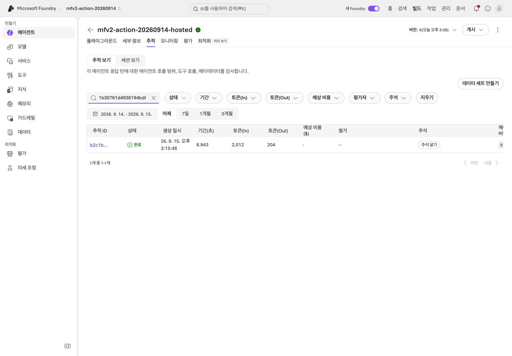
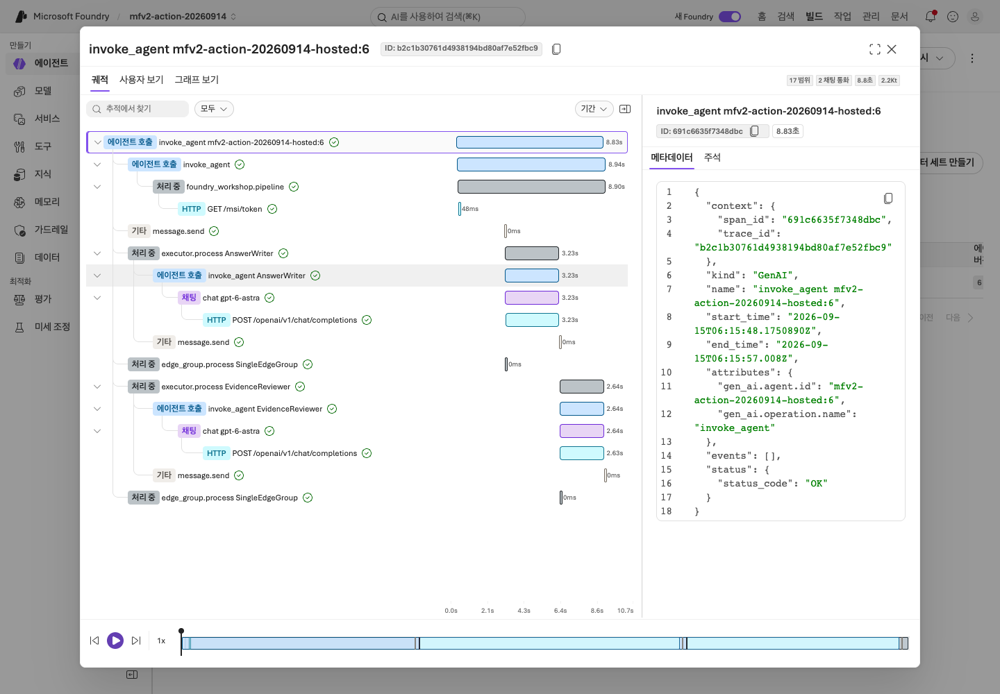
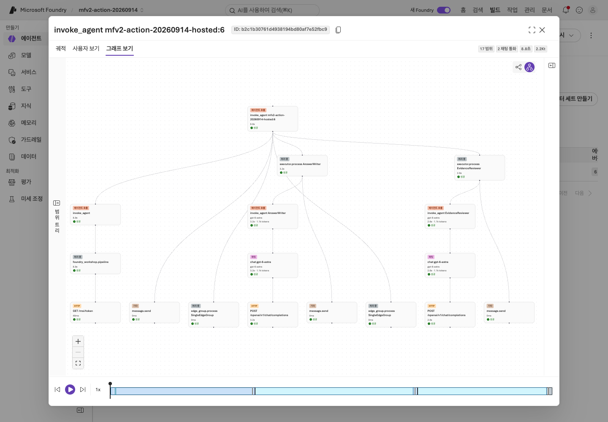
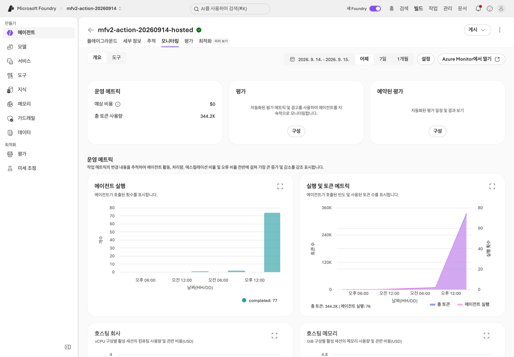
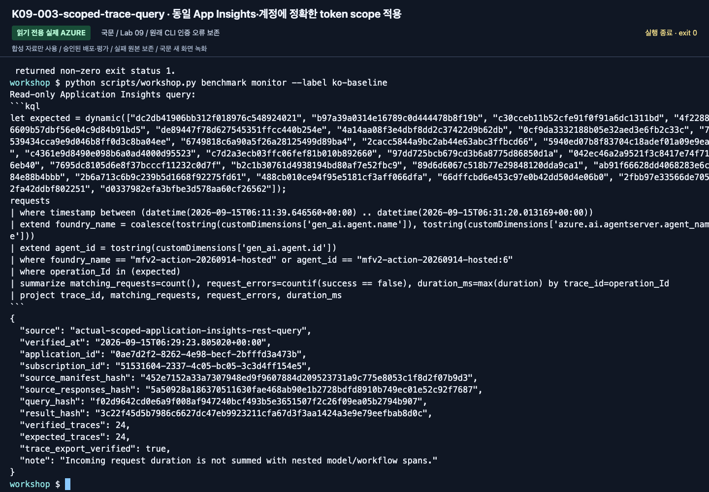
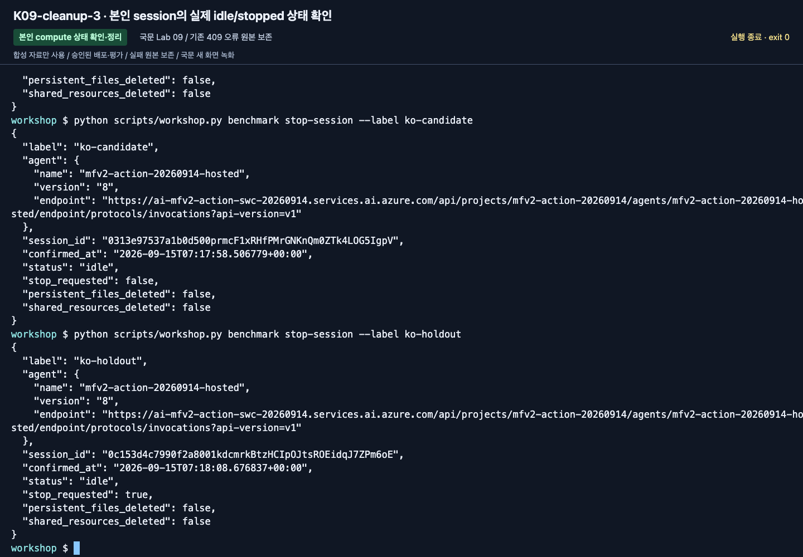

# Lab 09. Trace, 운영 게이트, 비용과 정리

[English](../../labs/09-operations.md) | **한국어**

**완료 목표:** 한 번 잘 답한 데모를 운영 가능한 시스템으로 착각하지 않고, 다음 판단의 근거를 남깁니다.

**내 구간 바로 열기:** [A — 기존 결과 네 항목](#path-a) · [B — 이력·정리](#path-b) · [학습 경로](../paths.md)

## 시작 전

**이번 순서:** A는 브라우저 네 확인과 정리 목록을 완료합니다. B는 본인 이력을 대조하고 matrix 명령은 심화 워크북 이후에만 씁니다.

**준비물:** 본인 agent/version과 output label. 실제 trace 접근은 추가 선행 조건이며 자동으로 주어지지 않습니다.

**다음으로 갈 기준:** 사용 버전·근거·비용·본인 정리 대상을 구분하며 공유 리소스를 삭제하지 않습니다.

**막히면:** Telemetry 없음은 미확인이지 오류 0개가 아닙니다. 캡처를 위해 모델 호출을 반복하지 않습니다.

[한 번만 하는 준비와 학습자 파일](../setup.md).

<a id="path-a"></a>

## A. 브라우저 — 무엇을 관리해야 하나?

모델을 다시 호출하지 말고 **본인의 기존 결과**로 다음 네 항목을 확인합니다.

1. **Agents → Lab 03의 본인 agent**에서 이름·버전·모델을 평가표와 대조합니다. 녹화의 버전을 고르지 않습니다.
2. **Instructions / Tools / Knowledge**에서 합성 원문 6개 또는 선택한 File Search/IQ 연결을 확인합니다.
   승인하지 않은 Web Search·회사 연결이 없어야 합니다.
3. 본인의 **6행 평가표**와 `workflow-review.txt`를 엽니다. 수동 평가와 실제 native 실행을 구분합니다.
   Trace를 볼 수 있으면 기존 요청과 대조하고, 없다면 오류 0개가 아니라 **trace 미확인**으로 적습니다.
4. [정리 체크리스트](../reference/cleanup.md)로 본인 agent·선택 파일/chat base·session을 목록화합니다.
   공유 서비스는 **담당자 관리**로 표시하고 잔여 비용과 승인된 자산별 중지/삭제 담당자를 확인합니다.

학습자 ZIP의 빈 `operations-checklist.txt`에 네 결과를 채웁니다.
**A 완료:** [Lab 11 A](11-capstone.md#path-a)로 이동합니다. 새 모델·trace·matrix 명령은 필요 없습니다.
아래 표는 본인 권한으로 보이는 자산에 한한 선택적인 추가 검토입니다.

| 관찰 대상 | 직접 확인할 질문 |
|---|---|
| 에이전트·버전·assets | 지금 사용자가 호출하는 버전은 어느 것인가? |
| 모델 배포·quota | 모델 이름, 실제 배포, 용량 제한을 구분했는가? |
| 도구·지식 연결 | 어느 데이터와 외부 시스템에 접근하는가? |
| 평가 결과 | 어떤 데이터와 evaluator로 측정했는가? |
| Trace/Monitor | 실패한 요청의 처리 흐름을 찾을 수 있는가? |
| 비용·사용량 | 모델뿐 아니라 Search·session·로그 비용도 있는가? |
| 보안/거버넌스 설정 | 누가 호출·변경·배포·승인할 수 있는가? |

기존 종합 랩의 Control Plane 관점을 이 표로 통합했습니다.
Fleet/관리 메뉴가 보이지 않으면 역할 범위상 정상일 수 있습니다.
전체 구독 권한을 추가하는 것이 학습의 목표가 아닙니다.

<a id="path-b"></a>

## B. 코드 — 실행 이력과 실제 telemetry 연결

### 1. 로컬 이력부터 찾기

`outputs/<label>/manifest.json`과 `responses.jsonl`에서 다음 값을 찾습니다.

- 실행과 질문: `run_id`, `case_id`.
- 지침·데이터·코드·근거: hash와 버전.
- 요청: `response_id`, `request_id`, 실제 응답 모델.
- 검색: provider, 문서 ID, IQ references/activity.
- 결과: 정상/오류, token usage, latency.

여기 있는 request/response ID는 **자동으로 Azure Monitor trace가 되지 않습니다.**
`trace_id: null`, `trace_export: not-configured`이면 그렇게 보고해야 합니다.

### 2. 실제 실패 또는 전체 통과 결과 설명

기존 dev 응답을 사용합니다. 모델/요청 오류·도구 오류·근거 누락·잘못된 규정 적용을 구분합니다.
어떤 identity가 어느 서비스에 접근했는지와 실제 request/response ID를 적습니다.
모두 통과했다면 그 사실과 남은 한계를 기록하며 실패를 만들지 않습니다.
변경은 [Lab 07](07-evaluation.md#path-b)의 dev로만 검토하고 노출된 holdout은 사용하지 않습니다.

### 3. 정리 목록 출력

```bash
python scripts/workshop.py cleanup-plan
```

이 명령은 **목록과 절차만 출력하며 삭제하지 않습니다**.
`operations-checklist.txt`에 본인 객체·공유 서비스·승인된 담당자 작업·남은 비용을 구분해 적습니다.
별도로 승인된 작업은 [정리](../reference/cleanup.md)를 따릅니다.

**B 완료:** 본인 이력·실패/전체 통과 검토·정리 목록을 저장했습니다.
[Lab 11 B](11-capstone.md#path-b)로 이동합니다. Tracing이 준비되지 않았다면 **trace 미검증**으로 기록합니다.
이 기본 단계를 마치려고 Hosted를 배포하거나 새 모델 요청을 보내지 않습니다.

### 선택: 서버 측 tracing 준비

<details>
<summary>실제 telemetry는 준비된 agent·trace 접근·별도 호출/비용 승인이 필요합니다</summary>

강사는 프로젝트와 Application Insights 연결, 로그 보존·비용·접근 권한을 확인합니다.
[공식 tracing 설정](https://learn.microsoft.com/azure/foundry/observability/how-to/trace-agent-setup)을
따라 서버 측 tracing을 활성화하고, 필요할 때만 로컬 client instrumentation을 더합니다.
이 저장소의 Hosted 진입점은 민감한 입력/출력 캡처를 기본 활성화하지 않습니다.

1. 준비된 에이전트에 합성 질문을 한 번 보냅니다.
2. 응답/대화/agent version을 기록합니다.
3. Foundry의 해당 tracing 화면에서 같은 실행을 찾습니다.
4. span의 부모/자식 관계, 모델·도구 호출, 지연·오류를 확인합니다.
5. 보존 정책과 권한을 확인하고, 필요 이상의 원문을 export하지 않습니다.


**화면 확인:** 본인 에이전트의 **Traces → Trace view**에서 날짜 범위와 agent version을 먼저 확인합니다.
최신 행이라는 이유만으로 방금 보낸 요청이라고 판단하지 않습니다.


**화면 확인:** 검색칸에 실제 Trace ID를 넣고 정확히 같은 ID의 행을 엽니다.
`response_id`, conversation ID, Trace ID는 서로 다른 값입니다.


**화면 확인:** 트리의 최상위 `invoke_agent`와 Metadata의 상태를 확인합니다.
새 촬영에서 선택한 trace는 **17개 span과 chat 2개**가 포털에 보였습니다.
응답의 `model_calls`에는 실제 호출 3개가 있으므로 포털의 일부 span 관측을 전체 호출 수로 바꾸어 적지 않습니다.

보호된 테이블은 일반 로그 조회 역할 외에 추가 권한을 요구할 수 있습니다.
트레이스가 늦게 도착하는 동안 호출을 반복해 비용을 늘리지 않습니다.
없으면 **미확인**으로 남기고 연결·exporter·역할·시간 범위를 점검합니다.


전체 요청의 존재는 아래 `benchmark monitor`로 별도 검증합니다.
포털의 부분 span 관측과 해당 요청의 성공/실패·사용량을 분리합니다.

### Trace 실패 설명

> “D03은 403이었다”에서 멈추지 말고, 사용자/프로젝트/agent identity 중 누가
> 어느 서비스에 접근하다 실패했는지 설명합니다.

모델 실패, 도구 실패, 검색 근거 부족, 잘못된 정책 적용을 구분합니다.
원문을 바탕으로 사람이 개선 이유를 검토한 뒤 [Lab 07](07-evaluation.md)의 dev 비교로 돌아갑니다.
자동 trace-to-dataset 기능은 Preview이므로 이 기본 경로의 필수 조건이 아닙니다.


이번 실행에서는 CLI 인자 충돌, API query 누락 가능성, embedding API 404,
App Insights 인증 오류, idle 세션 stop 충돌을 구분해 보존하고 수정했습니다.
서비스 실행 오류와 native 평가자의 낮은 점수를 같은 실패로 합치지 않습니다.

</details>

## 운영 승인 게이트

| 게이트 | 이번 실습에서 남길 증거 |
|---|---|
| 품질 | 전체 dev/holdout, 실패·누락 포함, 업무 기준과 의미 검토 |
| 권한 | 최소 권한, 사용자/런타임 identity 구분 |
| 데이터 | 합성/승인된 데이터만 사용, 적용 시점·출처·보존 기간 |
| 안전 | 실제 행동 도구의 서버 측 검증과 사람 승인 계획 |
| 비용 | 예상 호출량, Search 고정비, session 수, 로그 보존 |
| 릴리스 | 정확한 agent/model/prompt/dataset/code 버전 |
| 복구 | 이전 버전·되돌릴 설정·담당자 |

자동 최적화나 continuous evaluation을 기본으로 켜지 않습니다.
운영 중 샘플링·평가 비용·데이터 정책을 승인한 뒤 별도 설정합니다.
수업의 6문항 통과만으로 운영 배포를 승인하지 않습니다.

## C. 새 Hosted matrix의 Trace·Monitor 인수

<details>
<summary>심화 C 전용 — 입문 Lab 07이 아니라 Hosted matrix를 수집한 뒤 펼칩니다</summary>

**2026-09-15 실제 새 국문 실행으로 확인한 경로입니다.**
[평가 워크북](../reference/evaluation-workbook.md)에서 실제 만든 matrix label을 사용합니다.
`wf-candidate`는 입문의 `candidate`가 아닙니다. 모든 명령에서 본인의 실제 matrix label로 바꿉니다.

```bash
python scripts/workshop.py benchmark trace-plan --label wf-candidate
python scripts/workshop.py benchmark monitor --label wf-candidate
```

`trace-plan`은 로컬 KQL만 작성하며 Azure를 조회하지 않습니다.
`monitor`는 `.env`의 **AZURE_APPLICATION_INSIGHTS_APP_ID**와 명시적 구독을 사용해 실제 조회합니다.
credential은 지정된 구독/tenant로 scope를 고정하고
`https://api.applicationinsights.io/.default` 토큰으로 동일 Application Insights query API를 호출합니다.
실제 실행에서 일반 CLI query의 `InvalidTokenError`를 보존한 뒤 이 인증 경로를 수정했습니다.
다른 사용자·다른 App Insights로 바꾸는 우회가 아닙니다.
Application ID는 workspace ID나 instrumentation key와 다릅니다.
쿼리는 실행 전에 표시하고, 해당 run의 agent·기간·trace ID만 조회합니다.

조회는 `requests`에서 Foundry agent 이름을 찾습니다.
코드 내부 참여자 이름을 가진 `dependencies`를 같은 agent 이름으로 무작정 필터링하거나
부모 요청과 자식 span의 token/latency를 합산하지 않습니다.
현재 구현의 기본 trace gate는 root 요청의 성공/존재 검사이며, 개별 모델·도구·검색의 의미적 검토는 별도입니다.

누락·중복·실패 요청·미측정 duration은 인수 통과가 아닙니다.
한 번 확인한 정확한 immutable run의 receipt는 hash를 검증해 재사용하며,
새 live 조회를 한 것처럼 시간을 갱신하지 않습니다.

```bash
python scripts/workshop.py benchmark stop-session --label wf-candidate
```

이 명령은 그 label에서 만든 agent/version/session만 중지하고 상태를 다시 확인합니다.
공유 서비스·모델·평가 이력이나 persistent filesystem은 삭제하지 않습니다.
별도 smoke 세션은 자기 목록과 raw HTTP 기록으로 확인해 정리합니다.

### 선택: continuous evaluation

기본 batch/trace 검증과 다른 운영 기능입니다. 데이터 범위, sample 비율, 시간당 상한,
평가자 버전, 지속 비용, 비활성화 책임자를 먼저 승인합니다.
현재 [공식 recurring/continuous evaluation 안내](https://learn.microsoft.com/azure/foundry/observability/how-to/how-to-monitor-agents-dashboard#set-up-continuous-evaluation)를
확인하고 별도 rule을 구성합니다. 한 번의 요청이 sampling되지 않았다고 모델을 반복 호출해
성공 화면을 만들지 않습니다. Rule enabled와 실제 평가 sample의 존재를 따로 기록합니다.
이 개정은 continuous evaluation을 자동으로 켜지 않습니다.

</details>

<details>
<summary>녹화 당시 참고 화면 (선택; 그대로 재실행할 단계가 아님)</summary>

아래는 이번 국문 실행에서 새로 캡처한 화면입니다. 초기 진단·실패와 최종 비교 결과를 구분하며, 영문 촬영본을 재사용하지 않았습니다.



**화면 확인:** 실제 command·언어·version·label·근거와 출력 상태를 확인합니다. 촬영 결과를 본인의 실행이나 운영 승인으로 대신하지 않습니다.



**화면 확인:** 실제 command·언어·version·label·근거와 출력 상태를 확인합니다. 촬영 결과를 본인의 실행이나 운영 승인으로 대신하지 않습니다.



**화면 확인:** 실제 command·언어·version·label·근거와 출력 상태를 확인합니다. 촬영 결과를 본인의 실행이나 운영 승인으로 대신하지 않습니다.



**화면 확인:** 실제 command·언어·version·label·근거와 출력 상태를 확인합니다. 촬영 결과를 본인의 실행이나 운영 승인으로 대신하지 않습니다.



**화면 확인:** 실제 command·언어·version·label·근거와 출력 상태를 확인합니다. 촬영 결과를 본인의 실행이나 운영 승인으로 대신하지 않습니다.



**화면 확인:** 실제 command·언어·version·label·근거와 출력 상태를 확인합니다. 촬영 결과를 본인의 실행이나 운영 승인으로 대신하지 않습니다.

[새 영상과 액션 인덱스](../video-summary.md) · [실제 결과·계보](../live-run.md)

</details>

## 반드시 정리하고 끝내기

통제된 국문 baseline/candidate/holdout의 **64개 root trace ID**를 실제 App Insights에서 확인했습니다.
전체 요청의 확인을 모든 하위 span이 빠짐없이 export되었다는 의미로 확대하지 않습니다.
이미 idle인 세션은 다시 stop을 호출해 409를 만들지 않고 실제 상태를 확인합니다.
활성 세션은 중지 후 재조회하고 [실행 기록](../live-run.md)에 별도 receipt를 남깁니다.

A는 위 체크리스트·담당자 인계를 사용합니다. B는 3단계에서 로컬 목록을 이미 출력했습니다.
[정리 체크리스트](../reference/cleanup.md)를 따라 본인 자산을 확인하고,
공유 서비스와 다른 조의 데이터를 유지합니다.
정리 완료는 “명령을 실행했다”가 아니라 **활성 session·잔여 리소스·과금 상태를 다시 확인했다**는 뜻입니다.


**화면 확인:** 본인 세션의 상태와 다음 페이지 여부를 확인합니다. 새 촬영의 평가 세션 네 개는 최종 `idle`을 확인했습니다.
화면의 세션 ID를 그대로 중지하지 말고 자신의 ID를 사용합니다. idle이어도 파일 저장소·Search·로그 비용이 모두 사라지는 것은 아닙니다.

다음: A → [Lab 11](11-capstone.md#path-a) · B → [Lab 11](11-capstone.md#path-b)
