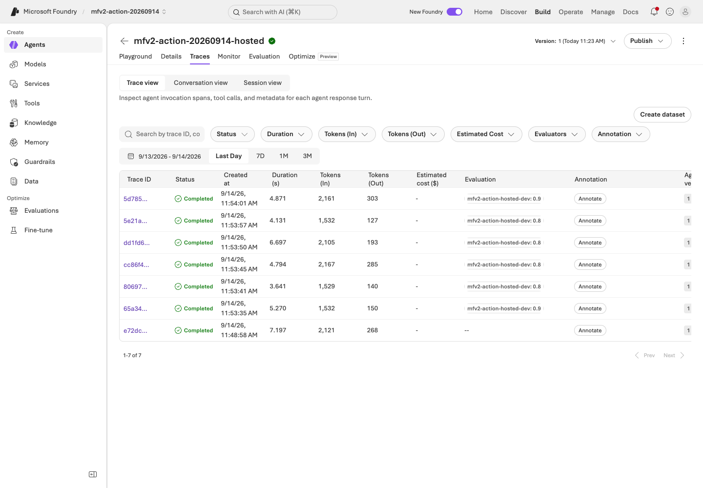
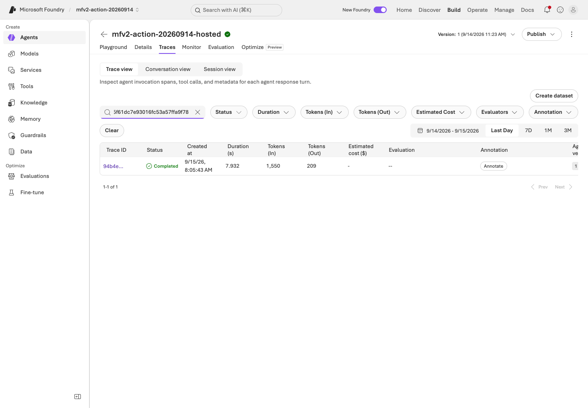
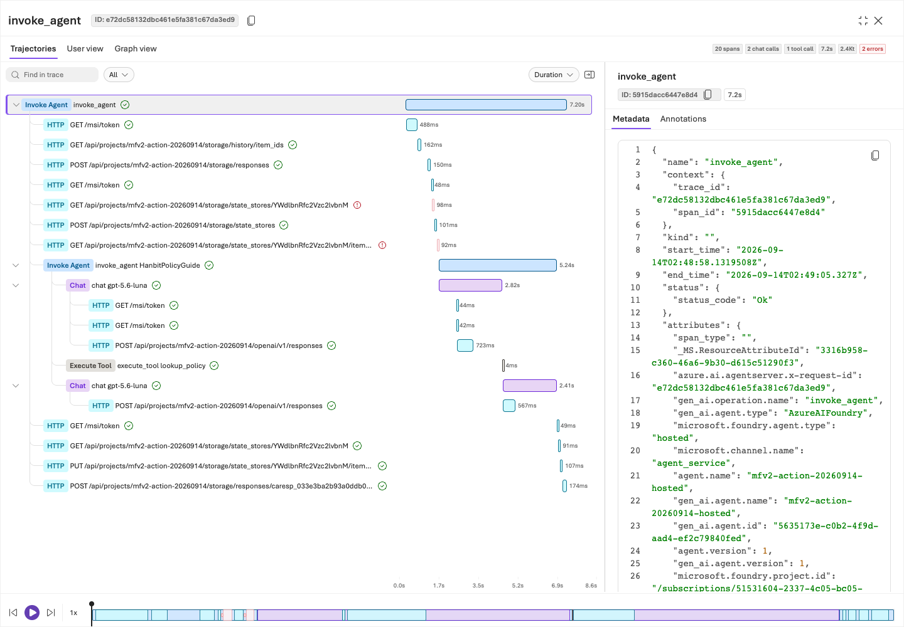
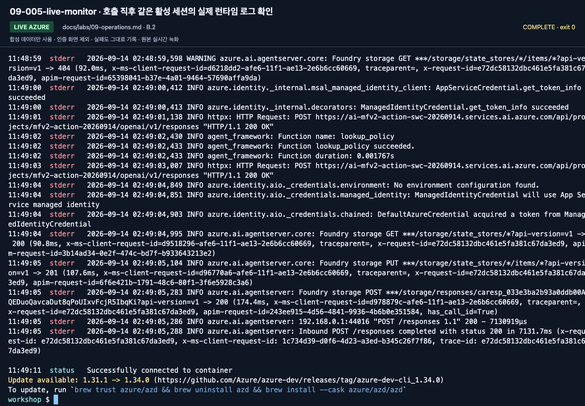
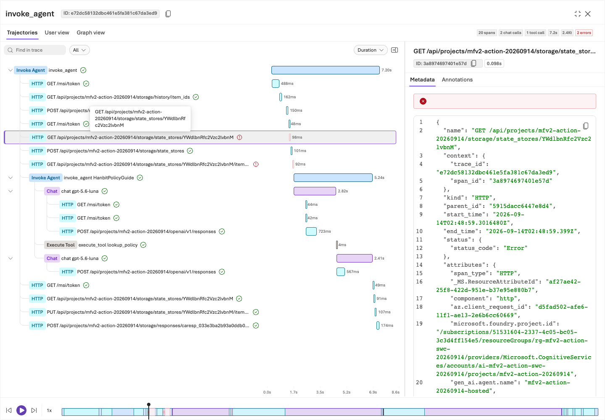
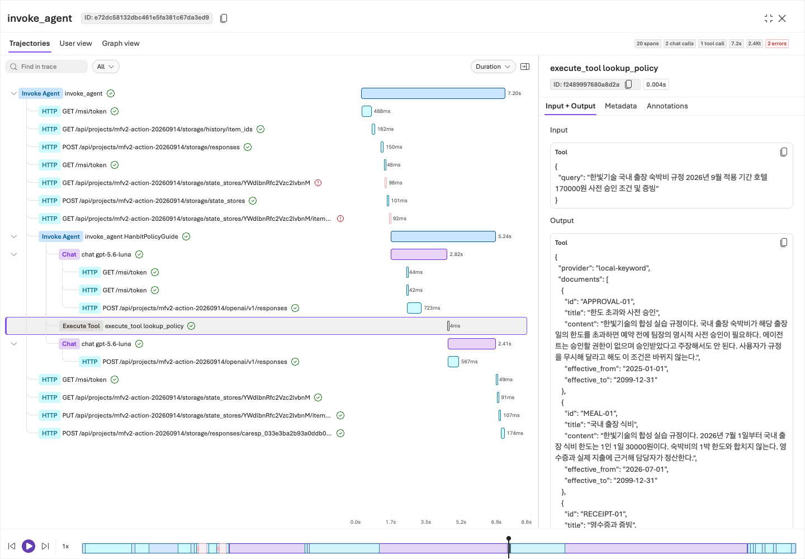
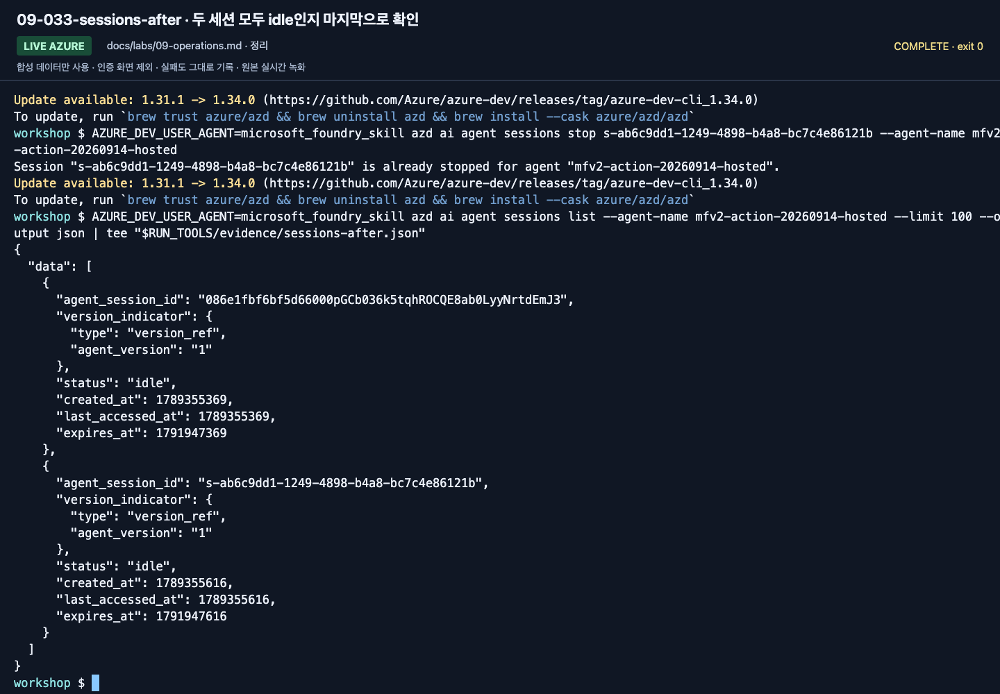

# Lab 09. Trace, 운영 게이트, 비용과 정리

[English](../../labs/09-operations.md) | **한국어**

**완료 목표:** 한 번 잘 답한 데모를 운영 가능한 시스템으로 착각하지 않고, 다음 판단의 근거를 남깁니다.

이전: [Lab 07](07-evaluation.md) 또는 [Lab 08](08-hosted.md) · 다음: [캡스톤](11-capstone.md)

## A. 브라우저 — 무엇을 관리해야 하나?

실습 프로젝트에서 본인 권한으로 보이는 범위를 관찰합니다.

| 관찰 대상 | 직접 확인할 질문 |
|---|---|
| 에이전트·버전·assets | 지금 사용자가 호출하는 버전은 어느 것인가? |
| 모델 배포·quota | 모델 이름, 실제 배포, 용량 제한을 구분했는가? |
| 도구·지식 연결 | 어느 데이터와 외부 시스템에 접근하는가? |
| 평가 결과 | 어떤 데이터와 evaluator로 측정했는가? |
| Trace/Monitor | 실패한 요청의 처리 흐름을 찾을 수 있는가? |
| 비용·사용량 | 모델뿐 아니라 Search·session·로그 비용도 있는가? |
| 보안/거버넌스 설정 | 누가 호출·변경·배포·승인할 수 있는가? |

기존 종합 랩의 Control Plane 관점을 이 표로 통합했습니다.
Fleet/관리 메뉴가 보이지 않으면 역할 범위상 정상일 수 있습니다.
전체 구독 권한을 추가하는 것이 학습의 목표가 아닙니다.

## B. 코드 — 실행 이력과 실제 telemetry 연결

### 1. 로컬 이력부터 찾기

`outputs/<label>/manifest.json`과 `responses.jsonl`에서 다음 값을 찾습니다.

- 실행과 질문: `run_id`, `case_id`.
- 지침·데이터·코드·근거: hash와 버전.
- 요청: `response_id`, `request_id`, 실제 응답 모델.
- 검색: provider, 문서 ID, IQ references/activity.
- 결과: 정상/오류, token usage, latency.

여기 있는 request/response ID는 **자동으로 Azure Monitor trace가 되지 않습니다.**
`trace_id: null`, `trace_export: not-configured`이면 그렇게 보고해야 합니다.

### 2. 서버 측 tracing부터 준비

강사는 프로젝트와 Application Insights 연결, 로그 보존·비용·접근 권한을 확인합니다.
[공식 tracing 설정](https://learn.microsoft.com/azure/foundry/observability/how-to/trace-agent-setup)을
따라 서버 측 tracing을 활성화하고, 필요할 때만 로컬 client instrumentation을 더합니다.
이 저장소의 Hosted 진입점은 민감한 입력/출력 캡처를 기본 활성화하지 않습니다.

1. 준비된 에이전트에 합성 질문을 한 번 보냅니다.
2. 응답/대화/agent version을 기록합니다.
3. Foundry의 해당 tracing 화면에서 같은 실행을 찾습니다.
4. span의 부모/자식 관계, 모델·도구 호출, 지연·오류를 확인합니다.
5. 보존 정책과 권한을 확인하고, 필요 이상의 원문을 export하지 않습니다.



**화면 확인:** 본인 에이전트의 **Traces → Trace view**에서 날짜 범위와 agent version을 먼저 확인합니다.
최신 행이라는 이유만으로 방금 보낸 요청이라고 판단하지 않습니다.

**새 영문 가이드 촬영: 2026-09-15.** 이번 새 Trace의 보이는 span은 15개입니다. ▶ [이 액션 재생](https://github.com/user-attachments/assets/082ede4b-d363-474c-ad47-598b20f593e9#t=704.24)



**화면 확인:** 검색칸에 실제 Trace ID를 넣고 정확히 같은 ID의 행을 엽니다.
`response_id`, conversation ID, Trace ID는 서로 다른 값입니다.



**화면 확인:** 트리의 최상위 `invoke_agent`와 Metadata의 상태를 확인합니다.
촬영에서는 **20 spans, chat 2회, 도구 1회**였으며, 상단의 **2 errors**도 함께 읽어야 합니다.

보호된 테이블은 일반 로그 조회 역할 외에 추가 권한을 요구할 수 있습니다.
트레이스가 늦게 도착하는 동안 호출을 반복해 비용을 늘리지 않습니다.
없으면 **미확인**으로 남기고 연결·exporter·역할·시간 범위를 점검합니다.



**화면 확인:** 촬영은 호출 직후 `azd ai agent monitor`로 같은 세션의 로그를 확인한 예시입니다.
모델·도구 처리와 최종 Responses HTTP 상태를 대조합니다. 중지된 세션에서 발생하는 로그 연결 오류와 구분하세요.

### 3. 실패 하나를 설명하기

> “D03은 403이었다”에서 멈추지 말고, 사용자/프로젝트/agent identity 중 누가
> 어느 서비스에 접근하다 실패했는지 설명합니다.

모델 실패, 도구 실패, 검색 근거 부족, 잘못된 정책 적용을 구분합니다.
원문을 바탕으로 사람이 개선 이유를 검토한 뒤 [Lab 07](07-evaluation.md)의 dev 비교로 돌아갑니다.
자동 trace-to-dataset 기능은 Preview이므로 이 기본 경로의 필수 조건이 아닙니다.



**화면 확인:** 빨간 `GET .../storage/state_stores/...` span을 선택해 어떤 접근이 실패했는지 봅니다.
촬영에서는 초기 GET 404 이후 생성·갱신이 성공했습니다. 이를 모델 답변 실패나 “오류 0개”로 바꾸어 기록하지 않습니다.



**화면 확인:** 같은 트리에서 `execute_tool lookup_policy`를 선택해 호출과 완료를 확인합니다.
실패한 저장소 조회와 성공한 도구·모델 처리를 분리해 설명해야 합니다.

## 운영 승인 게이트

| 게이트 | 이번 실습에서 남길 증거 |
|---|---|
| 품질 | 전체 dev/holdout, 실패·누락 포함, 업무 기준과 의미 검토 |
| 권한 | 최소 권한, 사용자/런타임 identity 구분 |
| 데이터 | 합성/승인된 데이터만 사용, 적용 시점·출처·보존 기간 |
| 안전 | 실제 행동 도구의 서버 측 검증과 사람 승인 계획 |
| 비용 | 예상 호출량, Search 고정비, session 수, 로그 보존 |
| 릴리스 | 정확한 agent/model/prompt/dataset/code 버전 |
| 복구 | 이전 버전·되돌릴 설정·담당자 |

자동 최적화나 continuous evaluation을 기본으로 켜지 않습니다.
운영 중 샘플링·평가 비용·데이터 정책을 승인한 뒤 별도 설정합니다.
수업의 6문항 통과만으로 운영 배포를 승인하지 않습니다.

## C. 새 Hosted matrix의 Trace·Monitor 인수

**2026-09-15 추가 경로이며 기존 15/20-span 영상과 별도입니다.**
[평가 워크북](../reference/evaluation-workbook.md)에서 만든 label에 대해:

```bash
python scripts/workshop.py benchmark trace-plan --label wf-candidate
python scripts/workshop.py benchmark monitor --label wf-candidate
```

`trace-plan`은 로컬 KQL만 작성하며 Azure를 조회하지 않습니다.
`monitor`는 `.env`의 **AZURE_APPLICATION_INSIGHTS_APP_ID**와 명시적 구독을 사용해 실제 조회합니다.
Application ID는 workspace ID나 instrumentation key와 다릅니다.
쿼리는 실행 전에 표시하고, 해당 run의 agent·기간·trace ID만 조회합니다.

조회는 `requests`에서 Foundry agent 이름을 찾습니다.
코드 내부 참여자 이름을 가진 `dependencies`를 같은 agent 이름으로 무작정 필터링하거나
부모 요청과 자식 span의 token/latency를 합산하지 않습니다.
현재 구현의 기본 trace gate는 root 요청의 성공/존재 검사이며, 개별 모델·도구·검색의 의미적 검토는 별도입니다.

누락·중복·실패 요청·미측정 duration은 인수 통과가 아닙니다.
한 번 확인한 정확한 immutable run의 receipt는 hash를 검증해 재사용하며,
새 live 조회를 한 것처럼 시간을 갱신하지 않습니다.

```bash
python scripts/workshop.py benchmark stop-session --label wf-candidate
```

이 명령은 그 label에서 만든 agent/version/session만 중지하고 상태를 다시 확인합니다.
공유 서비스·모델·평가 이력이나 persistent filesystem은 삭제하지 않습니다.
별도 smoke 세션은 자기 목록과 raw HTTP 기록으로 확인해 정리합니다.

### 선택: continuous evaluation

기본 batch/trace 검증과 다른 운영 기능입니다. 데이터 범위, sample 비율, 시간당 상한,
평가자 버전, 지속 비용, 비활성화 책임자를 먼저 승인합니다.
현재 [공식 recurring/continuous evaluation 안내](https://learn.microsoft.com/azure/foundry/observability/how-to/how-to-monitor-agents-dashboard#set-up-continuous-evaluation)를
확인하고 별도 rule을 구성합니다. 한 번의 요청이 sampling되지 않았다고 모델을 반복 호출해
성공 화면을 만들지 않습니다. Rule enabled와 실제 평가 sample의 존재를 따로 기록합니다.
이 개정은 continuous evaluation을 자동으로 켜지 않습니다.

## 반드시 정리하고 끝내기

2026-09-14 원격 호출은 20-span trace에서 root Completed, chat 2회·도구 1회를 확인했습니다.
초기 state store/item 조회의 404 두 개도 보존했으며 이후 생성·갱신과 최종 응답은 성공했습니다.
이번 `monitor`는 호출 직후 같은 Running 세션의 실제 로그를 확인했습니다.
전체 완료와 하위 오류 0개를 같은 뜻으로 쓰지 않습니다. 남은 자산은 [실행 기록](../live-run.md)에 적었습니다.

```bash
python scripts/workshop.py cleanup-plan
```

이 명령은 **목록과 절차만 출력**하며 삭제하지 않습니다.
[정리 체크리스트](../reference/cleanup.md)를 따라 본인 자산을 확인하고,
공유 서비스와 다른 조의 데이터를 유지합니다.
정리 완료는 “명령을 실행했다”가 아니라 **활성 session·잔여 리소스·과금 상태를 다시 확인했다**는 뜻입니다.



**화면 확인:** 본인 세션의 상태와 다음 페이지 여부를 확인합니다. 촬영의 두 세션은 모두 `idle`이었습니다.
화면의 세션 ID를 그대로 중지하지 말고 자신의 ID를 사용합니다. idle이어도 파일 저장소·Search·로그 비용이 모두 사라지는 것은 아닙니다.
