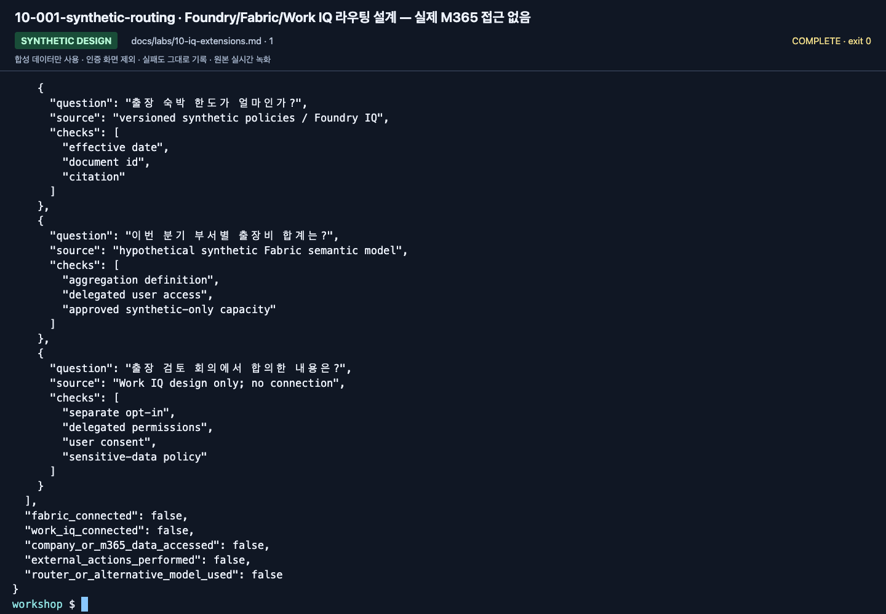

# Lab 10. Fabric IQ, Work IQ, Toolbox 확장

[English](../../labs/10-iq-extensions.md) | **한국어**

**선택 심화입니다. 기본 실습은 실제 Fabric/Microsoft 365 계정에 접근하지 않고 완료됩니다.**

선행: [Lab 06](06-knowledge.md) · 상위: [학습 경로](../paths.md)

**2026-09-15 보강:** 단계별 준비·Toolbox 결합·Fabric 자산별 인증·Work IQ federated app·
Hosted OBO 확인은 [이 저장소의 IQ 확장 워크북](../reference/iq-workbook.md)에서 진행합니다.
외부 원본 저장소의 clone은 필요하지 않으며 실제 회사/M365 연결은 이번 기본 경로에서 수행하지 않습니다.

## 세 IQ를 같은 API로 보지 않기

| 구분 | 주된 맥락 | 이번 통합 가이드의 기본 범위 |
|---|---|---|
| Foundry IQ | 기업 지식 검색, knowledge source/base | 합성 Search index의 GA retrieval |
| Fabric IQ | 의미 모델·분석·ontology·OneLake·data agent | 합성 자산을 준비한 경우의 별도 연결 설계 |
| Work IQ | Microsoft 365 업무·협업 맥락 | 기본 비활성화; 실제 사용자 연결은 별도 승인 |

“둘 다 IQ니까 같은 키를 넣으면 된다”거나 “Copilot 라이선스가 있으니 백엔드가
app-only로 자유롭게 호출할 수 있다”는 결론을 내리지 않습니다.

## 1. 누구나 할 수 있는 합성 설계 실습

실제 서비스에 로그인하지 않고 다음 세 질문의 라우팅 표를 만듭니다.

| 질문 | 적절한 근거 | 필요한 권한/검증 |
|---|---|---|
| 출장 숙박 한도가 얼마인가? | 버전이 있는 정책 문서 / Foundry IQ | 원문·적용일·인용 |
| 이번 분기 부서별 출장비 합계는? | 합성 분석 모델 / Fabric | 집계 정의·사용자 데이터 권한 |
| 출장 검토 회의에서 합의한 내용은? | 승인된 업무 맥락 / Work IQ | 사용자 동의·위임 권한·민감정보 보호 |

합성 JSON으로 세 응답 형태를 만들어 reviewer에게 맡기는 것은 라우팅 연습입니다.
**실제 Fabric IQ/Work IQ 연결 성공으로 표시하지 않습니다.**

**화면 확인:** 질문마다 다른 근거와 검증 항목을 정리한 설계 예시입니다.
`fabric_connected`, `work_iq_connected`, `company_or_m365_data_accessed`가 모두 `false`임을 확인합니다.
이것은 실제 서비스 조회나 새 연결을 실행하는 명령 예시가 아닙니다.

## 2. Fabric 연결 — 준비된 합성 자산이 있을 때만

필요 조건을 먼저 기록합니다.

1. 합성 데이터만 있는 Fabric workspace와 현재 지원되는 capacity.
2. 게시된 Data Agent/의미 모델과 해당 데이터 원본의 읽기 권한.
3. Foundry/Search/Fabric의 tenant·network·지역·data processing 요구사항.
4. MCP 또는 Foundry tool/knowledge source의 현재 지원 방식.
5. 필요한 delegated 사용자 인증/OBO와 실제 호출자의 권한.
6. capacity 활성 시간, 호출 비용, 종료·복원 계획.

자산이 없다면 [공식 Fabric Data Agent 튜토리얼](https://learn.microsoft.com/fabric/data-science/data-agent-end-to-end-tutorial)에서
합성 자산을 먼저 만듭니다. 자산 준비는 이 랩의 45–90분에 포함하지 않습니다.
자산별 연결 순서는 [통합 IQ 워크북](../reference/iq-workbook.md)과
[현재 공식 Fabric IQ 가이드](https://learn.microsoft.com/azure/foundry/agents/how-to/tools/fabric-iq)를 사용합니다.
Data Agent MCP의 app-only 지원을 ontology/semantic model의 delegated/OBO 지원과 혼동하지 않습니다.

**완료 증거:** 실제 사용자의 질문, 선택된 Data Agent/데이터 원본, 응답·근거,
user-context/OBO 검증 결과. 관리자 계정으로 한 번 성공했다고 모든 사용자에게 권한이 있는 것은 아닙니다.

## 3. Work IQ — 명시적 옵트인과 추가 과금

현재 [Work IQ knowledge-source 가이드](https://learn.microsoft.com/azure/search/agentic-knowledge-source-how-to-work-iq)의
요구사항을 관리자가 먼저 확인해야 합니다.

- tenant enablement, 실제 사용자 sign-in, 사용자에게 할당된 usage-based billing.
- delegated `WorkIQAgent.Ask` 권한과 관리자/사용자 동의.
- tenant·네트워크·지원 경계, 데이터 이동/보존/규제 요구.
- 사용자별 데이터 접근과 차단/삭제 정책.
- 비용과 동작 범위: Preview Work IQ가 읽기뿐 아니라 **행동을 수행할 가능성**.

이 리포에는 실제 Work IQ를 자동 활성화하거나 계정/서비스 principal을 생성하는 스크립트가 없습니다.
개인 계정을 강제로 로그인시키거나 Graph/Microsoft 365 token을 복사해 넣지 않습니다.
M365 Copilot 보유 여부만으로 위 조건을 충족했다고 판단하지 않습니다.

**중단 조건:** 승인/과금/tenant/위임 권한/행동 범위 중 하나라도 불명확하면 실제 연결을 하지 않고
합성 라우팅 실습에서 멈춥니다.

## 4. Toolbox / 원격 MCP / 웹

기본 [Lab 04](04-agents-tools.md)는 로컬 MCP입니다.
원격 도구로 확장할 때는 승인된 Microsoft Learn 등 공개 문서 조회부터 시작합니다.

| 추가할 것 | 연결 전에 정할 것 |
|---|---|
| Microsoft Learn MCP | 신뢰할 서버 URL, 노출 도구, 호출 예산 |
| Web Search | 허용 도메인, 최신성, 출처 URL, query의 민감도 |
| 사내 API | OpenAPI/MCP 스키마, 입력 검증, 사용자별 권한 |
| 변경 작업 | 별도 승인, idempotency, 감사·보상 동작 |

Web IQ와 일반 Web Search를 같은 기능으로 표시하지 않습니다.
도구가 등록되었다는 것과 실제 권한으로 올바른 결과를 받았다는 것도 구분합니다.

## 5. Richer IQ Preview — GA 코드와 분리

현재 richer 경로는 `2026-08-01-preview`를 확인합니다.
메시지 기반 planning, 추론 노력, synthesis, 추가 source는 GA `2026-04-01`과 body가 다릅니다.
이 리포의 `seed-search --iq`에 Preview 필드를 끼워 넣지 않습니다.

별도 실험 복사본·접두사·설정에서 [공식 API migration](https://learn.microsoft.com/azure/search/agentic-retrieval-how-to-migrate)을
따릅니다. Preview Search SDK가 필요하면 별도 환경에 해당 버전을 설치합니다.
기본 GA 실습의 패키지를 한꺼번에 업그레이드하지 않습니다.
`.env.example`의 planner 관련 선택 필드는 이 확장의 개념을 설명하기 위한 것으로
기본 GA 명령에서 사용되지 않습니다.

## 종료

추가 연결을 제거/복원하고, 본인 Fabric capacity·Work IQ billing·session 상태를 확인합니다.
capacity를 멈추기 전에 공유 에이전트가 그 source를 여전히 참조하는지 점검합니다.
다른 조의 연결이나 조직 전체 consent를 임의로 삭제하지 않습니다.
