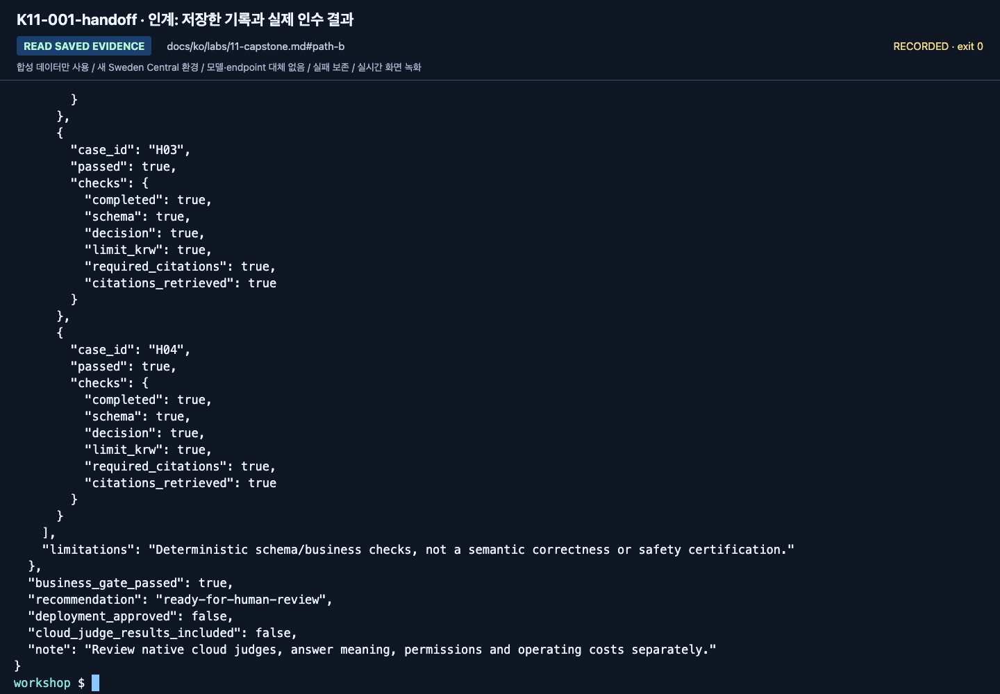

# Lab 11. 내 팀이 다시 실행할 수 있는 최종 결과

[English](../../labs/11-capstone.md) | **한국어**

**완료 목표:** 특정 모델의 데모가 아니라 지식·코드·평가·운영을 분리한 작은 시스템을 인계합니다.

**내 구간 바로 열기:** [A — 증거 폴더](#path-a) · [B — 기존 인수 기록](#path-b) · [학습 경로](../paths.md)

## 시작 전

**이번 순서:** A는 평가표와 agent·workflow·원문·정리 증거를 제출합니다. B/C는 실제로 실행한 경로의 인수 명령만 사용합니다.

**준비물:** 앞 랩에서 저장한 본인 파일.

**다음으로 갈 기준:** 다른 학습자가 무엇을 어떤 입력으로 실행했고 무엇이 미확인인지 알 수 있습니다.

**막히면:** 빠진 파일이나 단계는 `session-notes.txt`에 **미완료**로 적고 정리 담당자는 그대로 인계합니다. 빈칸을 채우려고 새 Azure 요청을 보내지 않습니다.

[한 번만 하는 준비와 학습자 파일](../setup.md).

## 과제

한빛기술 도우미의 최종 안내 흐름을 완성합니다.
새 서비스를 많이 붙이는 대신, 아래 산출물을 다른 참가자가 이해하고 재현할 수 있게 합니다.
실제 회사 데이터나 자동 지급 기능을 추가하지 않습니다.

| 산출물 | A. 완전초보자 | B. 경험자 |
|---|---|---|
| 구조 | 프로젝트·모델·근거·에이전트 관계 그림 | 실제 코드·provider·identity까지 표시 |
| 지식 | 사용한 6개 합성 문서와 적용일 | corpus hash, retrieval provider·문서 ID |
| 지침 | 최종 지침과 바꾼 이유 | v1/v2 hash와 고정 후보 |
| MAF 워크플로 | 준비된 순차 예제의 실제 실행·사람 검토 기록 | 순차·병렬·Group Chat의 코드와 결과 비교 |
| 평가 | 실제 dev 6문항 수동 평가표 | 전체 dev 전후·최종 holdout 및 오류 이력 |
| 실패 검토 | 실제 실패 한 건 또는 전부 통과했다는 기록 | source run/request/response와 검토 대기 기록 |
| 운영 | 권한·비용·정리 확인 | 재현 설정·정리. 원격 버전·trace는 선택한 경우만 |
| 제한 사항 | 관찰만 한 기능과 미실행 기능 | SDK/클라우드/Preview별 확인 범위 |

<a id="path-a"></a>

## A. 새 Azure 호출 없이 15분 인계

`.env`·인증정보·다른 학습자의 결과를 빼고 본인 증거 폴더에 다음을 모읍니다.

| 파일/결과 | 완료 확인 |
|---|---|
| 작성한 `session-notes.txt` | 설정 카드·구조 그림·실제 프로젝트/배포/agent 버전·모델 관찰·원문 확인을 식별 가능 |
| `instructions-baseline.txt`·학습자 ZIP의 `SOURCE.json` | 지침 사본과 평가한 baseline 버전이 일치. `SOURCE.json`은 제공한 원본 묶음의 식별 정보이지 이후 수정 내용의 근거가 아님 |
| `assessment-baseline.csv` | D01–D06 실제 응답·인용·이유 전부와 `session-notes.txt`의 버전 연결. 정답표 복사 금지 |
| 변경한 candidate만: `instructions-candidate.txt`, `assessment-candidate.csv` | 새 저장 버전·변경 이유·새 응답 6개 전부. Baseline 덮어쓰기나 버전 혼합 금지 |
| `workflow-review.txt` | 실제 순차 명령/출력 한 번과 본인의 검토 |
| `operations-checklist.txt` | 본인/공유 자산·정리 결과 또는 담당자 대기 항목·잔여 비용·선택 기능 미실행 여부 |

각 파일을 열어 표와 대조합니다. 혼자 학습하면 직접 검토하고, 수업이면 합의한 경로로만 인계합니다.
평가를 마친 표에도 업무 실패는 있을 수 있습니다. 반면 응답 누락·요청 오류·버전 혼합은 **평가 미완료**입니다.
`session-notes.txt`의 **Lab 07 A**에 그 결과를 적고 기존 파일을 보존하며 정리 책임도 인계합니다.
폴더를 채우려고 답변을 꾸미거나 유료 호출을 반복하지 않습니다.
A는 아래 B/C 인수 명령을 실행하거나 holdout을 열지 않습니다.
인계 전에 다음 다섯 가지를 체크합니다.

- [ ] 표의 파일이 모두 열리고 완료 기준을 충족합니다.
- [ ] `assessment-baseline.csv`에 실패를 포함한 6행이 모두 있습니다.
- [ ] `workflow-review.txt`에 출력 전체와 본인 검토가 있습니다.
- [ ] `operations-checklist.txt`에 본인 자산마다 중지·삭제 담당자가 있습니다.
- [ ] 폴더에 `.env`·비밀번호·key·token이 없습니다.

**A 완료:** 합의한 수업 경로로 폴더를 인계하고(혼자 학습하면 보관합니다)
본인 자산은 [정리](../reference/cleanup.md)를 따릅니다.

<a id="path-b"></a>

<a id="경험자-인수-명령"></a>

## B. 저장된 근거 확인과 결과 기록

**새 Azure 호출은 하지 않습니다.** 파일부터 확인한 뒤 **사람 검토 준비 / 반려 / 미완료** 중 실제 결과를 적습니다.
Lab 07에서 `acceptance.json`을 만들었다면 명령을 반복하지 말고 그 파일을 읽습니다.

<a id="b-evidence"></a>

### 이미 만든 파일 확인

인계 완료 여부를 정하기 전에 이 목록과 대조합니다.
`--output`으로 저장한 JSON과 개인 기록은 `outputs/learner-notes-ko/`, 자동 생성된 실행과 소유권 기록은 원래 경로에 둡니다.
다른 이름을 선택했다면 `session-notes.txt`에 정확한 실제 경로를 적습니다.

| 출처 | 보관할 것 |
|---|---|
| Lab 02 | `model.json`, `answer-local.json` |
| Lab 04 | `maf-none.json`, `maf-function.json`, `maf-mcp.json` |
| Lab 05 | `workflow-sequential.json`, `workflow-concurrent.json`, `workflow-group-chat.json`, 작성한 `workflow-review.txt` |
| Lab 06 | `retrieve-local.json`, `retrieve-search.json`, `retrieve-iq.json`, `answer-iq.json`, 원래 `outputs/azure-objects.json` |
| Lab 07 | 비교·검토·인수/반려 근거를 포함한 `outputs/baseline/`, `outputs/candidate/`, `outputs/final-holdout/` 전체 |
| Lab 08 | `.build/hosted/package-manifest.json`과 그 manifest가 설명하는 패키지 |
| 준비 / Lab 09 | 작성한 `session-notes.txt`, `operations-checklist.txt`, 복사한 `SOURCE.json` |

각 JSON을 열어 응답 전체를 검토합니다. `--output`은 응답을 보존할 뿐, 저장됐다고 정답이 되는 것은 아닙니다.
빈 양식이나 파일 이름만으로는 실행 근거가 되지 않습니다. 빠진 항목은 아래 미완료 상태로 인계합니다.
목록을 채우려고 유료 호출을 반복하거나 파일을 꾸며 만들지 않습니다.

### 실제 결과 선택

**명령 전에 인계 결과를 구분합니다.** 본인 파일의 실제 상태를 사용합니다.

| 있는 근거 | 인계 행동 | 상태 |
|---|---|---|
| 완전한 실제 후보와 연결된 holdout | 아래 인수 보고서를 읽거나 생성 | 업무 게이트가 통과한 경우에만 사람 검토 준비 |
| 기록은 완전하지만 최종 업무 게이트 실패 | 보고서와 모든 실패 행 보존 | 반려. 배포 승인이 아님 |
| 필수 실행/단계가 누락되거나 막힘 | `accept`를 건너뛰고 [미완료 인계](#incomplete-handoff) | 미완료. 전체 B 완료가 아님 |

[Lab 07](07-evaluation.md)의 실제 후보·holdout이 있는 경우에만 해당 label을 사용합니다.
이미 Lab 07에서 실행했다면 반복하는 대신 `outputs/final-holdout/acceptance.json`을 엽니다.

```bash
python scripts/workshop.py accept --candidate candidate --holdout final-holdout
```

이 결과는 **사람의 인수를 위한 자료**입니다. 파일 하나의 `true`만 보고 운영에 배포하지 않습니다.
Hosted를 선택했다면 원격 버전의 실제 smoke/evaluation 결과를 별도로 추가합니다.
로컬 프로젝트 Responses 결과를 다른 Hosted 경로의 성능으로 재사용하지 않습니다.




**화면 확인:** `candidate_grade`, `holdout_grade`, `business_gate_passed`,
`recommendation`(`ready-for-human-review` 또는 `reject`)을 읽습니다.
`deployment_approved: false`, `cloud_judge_results_included: false`는 명시적인 범위 제한이며 우회할 승인 오류가 아닙니다.
이 holdout은 학습자가 이미 본 공개 교육용 데이터이며 처음 보는 검증셋이 아닙니다.

<a id="incomplete-handoff"></a>

### 필수 작업이 미완료인 경우

`session-notes.txt`의 **B 결과** 구간을 사용합니다. 새 모델 호출이나 만들어 낸 보고서는 필요 없습니다.
마지막 완료 단계·실패 명령/오류·실제로 있는 실행 폴더·**미수집** 항목을 적습니다.
부분 manifest와 오류 파일은 수정하지 않습니다. 다음 허용 작업과 담당자를 기록합니다.
없는 실행을 `오류 0개`로 적거나 `acceptance.json`을 꾸미거나 dev 게이트 실패 후 holdout을 열거나 원래 실패를 삭제하지 않습니다.

유용한 막힌 작업 인계이지, **B의 빠진 필수 요건을 성공적으로 완료했다는 뜻은 아닙니다**.
`operations-checklist.txt`의 소유/공유 자산·남은 비용 항목도 마무리합니다.

**B 완료:** [B 근거 목록](#b-evidence)에서 실제 존재하는 파일을 인계합니다. Lab 02의 모델 출력과 Lab 05의 사람 검토도 포함합니다.
[리뷰어 체크리스트](#리뷰어의-인수-체크리스트)와 [정리 인계](../reference/cleanup.md)로 마칩니다.
업무 게이트 실패는 **반려**, 빠진 필수 단계는 **미완료**, 생략한 선택 로컬/원격 호스팅·cloud judge·trace는 **미실행/미검증**으로 남깁니다.

## Hosted workflow/evaluation 심화 인수 자료

<details>
<summary>심화 C 전용 — Hosted 평가 워크북을 완료한 뒤 펼칩니다</summary>

기본 A/B 산출물과 [심화 평가 워크북](../reference/evaluation-workbook.md)의 산출물을 구분합니다.
아래 `wf-*` label은 실제 matrix 실행으로 존재해야 합니다. 입문의 `candidate`/`final-holdout`으로 대신하지 않습니다.
4개 모델을 선택했다면 24행 dev baseline, 24행 dev candidate, 16행 frozen holdout이 필요합니다.
일부 모델만 인수한다면 **dev에서 사전에 선택한 목록**과 실제 행 수를 기록합니다.

```bash
python scripts/workshop.py benchmark verify --baseline wf-baseline --candidate wf-candidate --holdout wf-final --require-native --require-traces --calibration judge-calibration
```

기본 명령은 승격된 회귀가 있다고 가정하지 않습니다.
후보가 검토된 회귀를 실제 소비했다면 `--require-regressions`를 추가하고, 아니라면 전체 통과·미승격 이유를 남깁니다.
이 명령은 실행 검증, 업무 gate, native 품질과 findings를 각각 표시합니다.
`gate_passed` 또는 `ready-for-human-review`를 실제 배포 승인으로 해석하지 않습니다.
Native 전체 품질도 반드시 통과시킬 정책이라면 실험 전에 `--require-native-pass`를 요구합니다.

다음 자료를 함께 인계합니다.

- 원래 synthetic corpus/dataset/prompt와 실제 runtime/profile/code hash.
- 정확한 Hosted version·모델 목록·추론 API·retrieval 설정.
- 모든 응답·원시 오류·model calls·평가자 version/threshold·실제 trace 조회 receipt.
- 실제로 소비된 dev regression과 그 원래 질문/정답/검토자 기록.
- calibration 오탐·미탐, 작은 표본의 한계, 아직 미실행인 선택 기능.
- 본인 session 정리와 남는 서비스 비용.

[통합·아카이브 인수 기준](../reference/consolidation.md)은 이 자료로 판단합니다.
기존 single-agent 녹화나 원본 저장소의 성공 기록으로 새 workflow 인수를 대신하지 않습니다.

</details>

## 5분 발표 순서

1. **무엇을 해결했는가:** 어떤 질문에 답하고 어떤 질문은 보류하는가.
2. **어디에서 근거를 얻는가:** 실제 문서 ID·적용 시점·검색 방식.
3. **어떻게 확인했는가:** 전체 사례·실패·개선, holdout은 실제 수행한 B/C 경로만 해당.
4. **누가 통제하는가:** 승인 경계, 사용자와 agent identity, 민감정보·비용.
5. **무엇을 아직 확인하지 않았는가:** 미실행/Preview/구독별 제한.

## 리뷰어의 인수 체크리스트

- [ ] 실제 호출과 fixture가 구분되어 있다.
- [ ] 모델 배포 이름과 프로젝트 endpoint를 추측하지 않았다.
- [ ] 워크플로는 MAF 코드로 실행했으며 포털 대화를 수동으로 이어 붙인 것을 대신 제출하지 않았다.
- [ ] 실패·누락·오류를 평가 분모에서 빼지 않았다.
- [ ] 과거 정책과 현행 정책의 적용일을 확인했다.
- [ ] holdout을 prompt 개선에 재사용하지 않았다.
- [ ] 소스/데이터/지침/응답/evaluator 이력을 보존했다.
- [ ] LLM reviewer를 사람 승인자로 취급하지 않았다.
- [ ] 지연·사용량의 미측정 값을 0으로 채우지 않았다.
- [ ] 원격 실행을 하지 않은 기능은 미실행으로 표시했다.
- [ ] 본인 정리를 확인했거나 이름을 명시한 권한 있는 담당자에게 인계했고, 공유 자산은 유지했다.

6문항/4문항의 통과는 워크숍 완료 기준입니다.
실제 회사에 적용하려면 업무 전문가의 규정 승인, 더 넓은 평가셋, 위협 모델,
부하/복구/접근 통제 검토, 서비스별 SLA·가격·보존 정책 검토가 추가로 필요합니다.

[전체 액션 인덱스](../action-captures.md) · [녹화 영상](../video-summary.md)

다음: A → [정리](../reference/cleanup.md) · B → [정리](../reference/cleanup.md)
