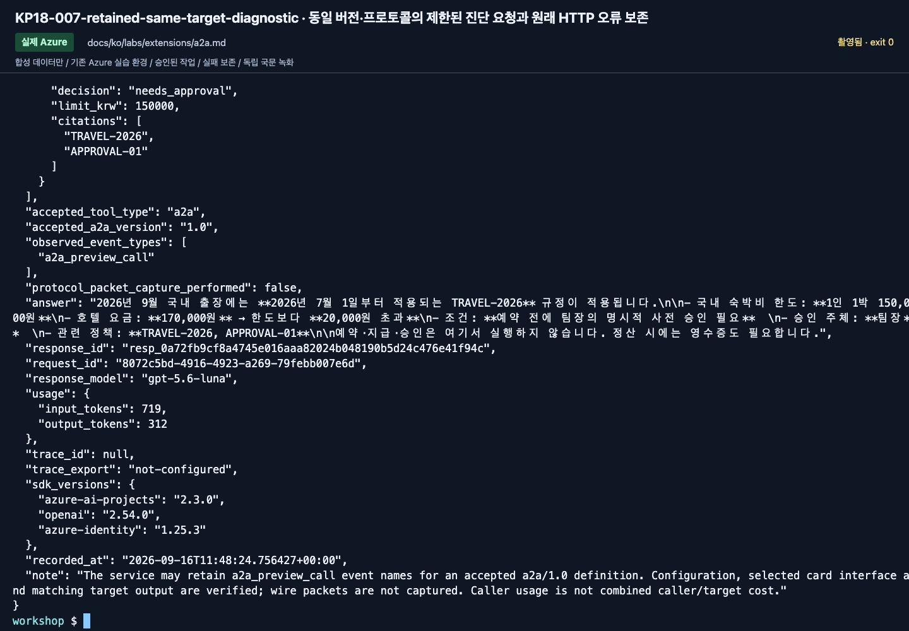

# A2A 1.0: 별도 주소의 정책 전문 agent에 위임하기

[English](../../../labs/extensions/a2a.md) | **한국어**

**C 경로 · A2A 1.0 GA 계약 확인일 2026-09-16.**
로컬 MAF 참여자 두 명은 A2A endpoint 통합이 아닙니다.
내 합성 전문 agent endpoint와 별도 relay agent를 연결합니다.

**준비:** 모델/agent 환경, 새 agent 두 개와 keyless 연결 생성 승인, 실제 호출 ID의 endpoint 접근, 비용 승인.
**완료:** 인증된 card의 1.0과 실제 caller의 성공한 A2A 도구 결과가 확인됨.
**중단:** 0.3, 다른 agent, 익명 인증으로 바꾸지 않습니다.

## 1. 계획

```bash
python scripts/workshop.py --language ko a2a plan
```

target/caller/connection은 내 prefix와 언어로 이름이 정해집니다.
target에는 동봉한 합성 정책과 지침만 들어갑니다.
공통 고정 SDK의 typed surface보다 새로운 필드는 명시적 REST 1.0 계약을 사용합니다.
전체 교육 환경의 SDK를 몰래 교체하지 않습니다.

## 2. 전문 agent와 incoming A2A

```bash
python scripts/workshop.py --language ko a2a target --confirm-create
python scripts/workshop.py --language ko a2a inspect
```

새 Prompt Agent 버전 하나를 만들고 공식 card/endpoint patch를 적용합니다.
실제 버전·base path·연결 이름·소유 기록을 보관합니다.

card URL은 **`/agentCard/v1.0`**으로 끝납니다.
`supportedInterfaces`에 `protocolVersion: 1.0`, `protocolBinding: JSONRPC`,
정확한 내 base URL 조합이 있어야 합니다.
0.3도 함께 표시될 수 있지만 1.0을 명시적으로 선택합니다.
인증된 card 읽기는 모델 호출과 별도입니다.

이 경로는 현재 text/non-streaming JSONRPC입니다.
target endpoint는 불변 버전 URL이 아니므로 실험 중 추가 target 버전을 거부합니다.

## 3. keyless 연결

반환값과 설정 카드의 값을 같은 터미널에 넣습니다.

```bash
printf '전체 프로젝트 endpoint: '
read -r PROJECT_ENDPOINT
printf 'target 결과의 target_base: '
read -r A2A_BASE
printf 'target 결과의 connection_name: '
read -r A2A_CONNECTION
azd ai connection create "$A2A_CONNECTION" --kind remote-a2a --target "$A2A_BASE" --auth-type project-managed-identity --audience https://ai.azure.com --project-endpoint "$PROJECT_ENDPOINT"
```

대상은 card URL이 아니라 **A2A base path**입니다.
`--force`나 API key를 사용하지 않습니다.
담당자가 연결의 실제 ID와 target agent/project의 필요한 접근 권한만 확인합니다.
로그인한 학습자와 서비스 ID를 같은 주체로 보지 않습니다.

## 4. relay 생성·호출

```bash
python scripts/workshop.py --language ko a2a caller --confirm-create
python scripts/workshop.py --language ko a2a invoke --label a2a-first --confirm-cost
```

caller는 `type: a2a`, `a2a_version: 1.0`이며 모델 요청은 기록된 실제 caller 버전을 참조합니다.
위임 없이 생성한 답변을 완료로 계산하지 않습니다.

`outputs/a2a-runs/a2a-first/`의 request, binding, 전체 response, summary를 확인합니다.
실제 call/output 쌍, 원문 ID, target/caller 버전과 반환 metadata를 유지합니다.
caller 사용량만 있으면 target 사용량을 만들어 더하지 않습니다.

서비스는 GA 설정에도 `a2a_preview_call`이라는 기존 event 이름을 반환할 수 있습니다.
helper는 실제로 수락된 `a2a/1.0` 설정과 일치하는 target output을 확인하고 원래 event 이름을 남깁니다.
이것을 wire packet을 캡처한 프로토콜 검증이라고 주장하지 않습니다.

<!-- edition-checkpoint:KP18-007-retained-same-target-diagnostic -->



**확인할 것:** 첫 HTTP 오류를 남기고 같은 target·버전·프로토콜의 진단 결과를 확인했습니다. 원래 위임 call/output과 수락된 a2a/1.0 설정은 wire packet capture와 다릅니다. 내 리소스 이름과 ID는 영상과 다릅니다.

[이 동작 영상 보기](https://github.com/user-attachments/assets/126a7406-b8ff-4d9f-9b3d-1780b9fad328#t=441.96) · [전체 액션과 실패](../../edition-actions.md)

## 5. 검토·정리

card는 기능 설명이지 사용 권한이 아닙니다. 성공한 위임도 예약·승인·지급 권한을 주지 않습니다.
소유/응답 근거를 보관하고 참조 확인 후 새 caller → 연결 → target만 담당자가 정리합니다.
공유 모델과 프로젝트는 삭제하지 않습니다.
A2A task/context 보존은 별도 서비스 정책이므로 agent 삭제가 모든 이력의 영구 삭제를 의미하지 않습니다.

| 증상 | 확인 |
|---|---|
| card 401/403 | 실제 호출 ID와 endpoint 접근 역할 |
| 일치하는 1.0 interface 없음 | `supportedInterfaces` 확인, downgrade 금지 |
| 추가 target 버전 | 전용 target을 고정하고 어느 버전을 제공했는지 추측하지 않기 |
| 연결 target 불일치 | 전체 base path와 프로젝트 확인 |
| call이 없음 | raw 응답을 실패 근거로 남기기 |
| typed SDK symbol 미지원 | 이 실습의 명시적 REST 경로/별도 검증 환경 사용, protocol fallback 금지 |

**다음:** [Memory](memory.md), [C 모듈](../../paths/c-advanced.md), [Lab 11](../11-capstone.md).
[Incoming A2A](https://learn.microsoft.com/azure/foundry/agents/how-to/enable-agent-to-agent-endpoint) ·
[A2A 도구 연결](https://learn.microsoft.com/azure/foundry/agents/how-to/tools/agent-to-agent).
