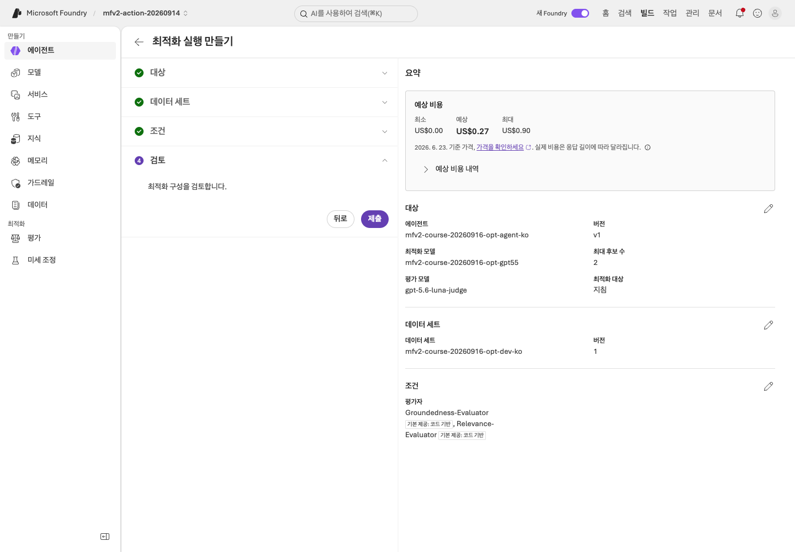
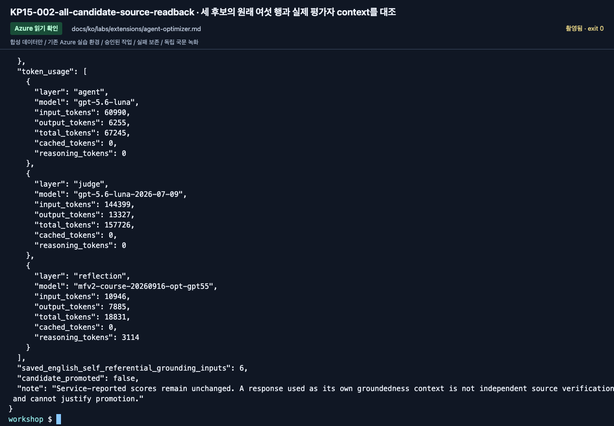

# Agent Optimizer: 후보를 만들고 실제 근거로 판단하기

[English](../../../labs/extensions/agent-optimizer.md) | **한국어**

**C 선택 Preview · 2026-09-16 기준.** 첫 경로는 **Prompt Agent 최적화 wizard**입니다.
fine-tuning이나 모델 가중치 변경이 아닙니다. 기존 Hosted matrix와 수동 v1/v2 실험은 별도 대상으로 유지합니다.

**준비:** 전용 합성 Prompt Agent와 baseline 버전, 파생 dev 파일, 지원되는 기존 optimizer 배포, 별도 judge, 비용 승인.
**완료:** 한 실행의 baseline과 모든 반환 후보를 확인하고, 후보 없음/개선 없음도 명시함.
**중단:** 촬영을 끝내려고 다른 모델 생성, holdout 수정, 후보 자동 승격을 하지 않습니다.

**첫 회차:** 1–5절 후 `optimizer-review.txt`를 인계합니다. 승격은 필수가 아닙니다.
후보 없음·개선 없음·잘못된 evaluator binding은 보존할 발견 사항이지 승격 성공이 아닙니다.

## 1. 입력 한 번 준비

[Lab 03](../03-prompt-agent.md)의 전체 합성 정책을 가진 내 agent를 사용합니다.
새 이름의 전용 agent를 만들면 원래 지침/버전을 보존할 수 있습니다.
공유 agent나 이미 고정된 benchmark target을 변경하지 않습니다.

`outputs/extensions-ko/`가 아직 없을 때만:

```bash
python scripts/workshop.py --language ko prepare-extensions --label extensions-ko
```

`optimizer-dev.jsonl`, `SOURCE.json`, `manifest.json`을 확인합니다.
원본 **dev 6행**에서 파생되며 holdout이나 새 target 정답은 만들지 않습니다.
`query`만 agent 입력입니다. `context`, `ground_truth`는 평가 참조이며 target에 보내는 지침이 아닙니다.
wizard가 요구하는 열을 확인하고 임의 column mapping이 가능하다고 가정하지 않습니다.

| 값 | 첫 실행의 선택 |
|---|---|
| Target | 내 합성 Prompt Agent의 실제 baseline 버전 |
| 답변 모델 | 기존 검증된 배포, 첫 실행에서 모델 비교 제외 |
| Optimizer | 담당자와 wizard가 지원을 확인한 기존 배포 |
| Evaluator | 별도로 이름 붙인 승인된 judge |
| Dataset | `optimizer-dev.jsonl` 6행, holdout 금지 |
| Max candidates | **2** |
| 최적화 대상 | **Instruction만** |

지원되는 optimizer 모델이 없으면 미실행으로 멈춥니다.
답변 모델이 동작한다는 사실만으로 optimizer 용도를 지원한다고 판단하지 않습니다.

## 2. Wizard 열기

1. **Agents → 내 agent → Optimize Preview**를 엽니다.
2. 처음에는 **Optimize my agent**, 기존 run이 있으면 **Create optimization run**을 선택합니다.
3. Target에서 실제 baseline 버전을 확인합니다.
4. 준비된 optimizer/judge와 후보 수 2를 지정합니다.
5. **Choose targets → Instruction**을 선택하고 **Model**을 해제합니다.

명시적 대상 선택으로 전환할 때 Model이 자동 선택되었던 화면을 관찰했습니다.
실제 체크 상태를 확인합니다. 제품의 예시 benchmark 점수는 내 baseline이나 결과가 아닙니다.

## 3. dev와 평가 기준 선택

1. Data에서 **Select dataset and criteria**를 선택합니다. 기본 production-trace 생성 경로를 사용하지 않습니다.
2. **Upload dataset**으로 내 국문 이름을 주고 `outputs/extensions-ko/optimizer-dev.jsonl`을 업로드합니다.
3. 새 dataset 버전과 `case_id`, `query`, `context`, `ground_truth`를 확인합니다.
4. 미리보기는 **상위 5행만** 보여줍니다. 원본 파일과 나중의 실제 평가 결과에서 6행 전체를 확인합니다.
5. Criteria에서 **Custom only**를 해제하고 **Groundedness-Evaluator**, **Relevance-Evaluator**를 고릅니다.
   Service-Groundedness와 혼동하지 않고 threshold는 둘 다 **4**입니다.

실제 evaluator 버전과 기준을 기록합니다.
필수 인용을 낮추거나 승인 거절을 정답으로 바꾸거나 어려운 행을 빼서 점수를 올리지 않습니다.
schema 불일치는 원인을 확인하며 평가 정답을 target에 보내는 방식으로 해결하지 않습니다.

## 4. 비용 검토 후 한 번 제출

Review의 baseline/dataset/모델/평가 기준/후보 상한을 확인합니다.
답변·judge·개선 생성 비용을 구분합니다. 표시된 범위는 **추정치**이지 실제 청구액이나 강제 예산 제한이 아닙니다.

승인 후 **Submit**을 한 번 누릅니다. 같은 run ID를 끝까지 확인합니다.
대기하거나 화면을 놓쳤다는 이유로 재제출하지 않습니다.
실패/불완전 실행의 성공 부분만 좋은 후보로 보고하지 않습니다.

<!-- edition-checkpoint:KP15-139-final-cost-and-lineage -->



**확인할 것:** 지침만, 최대 후보 2개, 원래 dev v1과 별도 judge를 유지했습니다. US$0.27/0.90은 표시된 추정치이지 청구 상한이 아닙니다. 내 리소스 이름과 ID는 영상과 다릅니다.

[이 동작 영상 보기](https://github.com/user-attachments/assets/126a7406-b8ff-4d9f-9b3d-1780b9fad328#t=285.76) · [전체 액션과 실패](../../edition-actions.md)

## 5. 후보보다 세부 결과 먼저

각 후보의 모든 결과/분모, 지침 diff, 모델/도구 설정 변화, 실제 사용량,
날짜·인용·승인 경계가 유지되는지 기록합니다.
가장 높은 종합점수도 제안일 뿐 자동 수락이 아닙니다.
개선이 없거나 구별되지 않으면 baseline을 유지합니다.

[영문 실행](../../edition-results.md)은 후보 없이 중단되었습니다.
일반 중단 문구는 “perfect”라고 표시했지만 실제 D05 relevance는 실패했습니다.
국문에서도 상태 문구 대신 개별 행을 확인하고 영문 점수를 국문 결과로 옮기지 않습니다.

**업로드한 열뿐 아니라 실제 judge 입력을 확인합니다.** 각 평가자의 `sample.input`과
고정한 dataset을 비교합니다. 9월 16일 영문 baseline과 국문 baseline·두 후보 모두
Groundedness의 `context`에 원래 정책 대신 생성한 답변 자체가 들어갔습니다.
서비스가 6/6을 보고해도 자기 답변과의 비교는 원문 근거 검증이 아닙니다.
원래 점수·입력 hash를 보존하고 참조 binding을 무효로 표시하며 **이 결과로 승격하지 않습니다**.
촬영 결과를 좋게 만들려고 열·기준을 몰래 바꾸거나 새 run을 제출하지 않습니다.

`optimizer-review.txt`에 run, baseline/candidate ID, 관찰, 선택 후보 또는
`pending-human-review`, 이유를 적습니다. AI가 사람의 검토를 사칭하지 않습니다.

<!-- edition-checkpoint:KP15-002-all-candidate-source-readback -->



**확인할 것:** baseline과 두 후보의 6행을 모두 읽었습니다. Groundedness 입력 18개가 답변 자체를 context로 사용했으므로 점수를 원문 검증이나 승격 근거로 인정하지 않았습니다. 내 리소스 이름과 ID는 영상과 다릅니다.

[이 동작 영상 보기](https://github.com/user-attachments/assets/126a7406-b8ff-4d9f-9b3d-1780b9fad328#t=307.48) · [전체 액션과 실패](../../edition-actions.md)

## 6. 사람 승인 후에만 승격

<details>
<summary>선택 승격 — Optimizer 종료 뒤 자동으로 실행할 단계가 아닙니다</summary>

검토가 없으면 **미수행**으로 남깁니다.
명시적 승인 후 **Promote candidate → Promote to agent version**을 사용하고
새 실제 버전과 default 변경 여부를 기록합니다.
새 label로 확인한 다음 baseline으로 사용합니다.
이전 버전의 holdout 점수는 새 버전에 자동 적용되지 않습니다.

후보를 고정한 후에만 별도의 최종 인수에서 holdout을 사용합니다.
이 Optimizer 실행은 개발용으로 holdout을 열지 않습니다.

</details>

## 이후 선택 기능

함수 설명 최적화는 실제 함수 실행 검증이 아닙니다.
Hosted 최적화는 준비된 code/configuration과 실제 도구 반복 실행 비용을 별도로 검토해야 합니다.
이 portal 실습에 flag 하나를 붙인 것과 같지 않습니다.

**다음:** [대화 평가](conversation-evaluation.md), [C 모듈](../../paths/c-advanced.md), [Lab 11](../11-capstone.md).
[Prompt wizard](https://learn.microsoft.com/azure/foundry/agents/quickstarts/quickstart-optimize-prompt-agent) ·
[Agent별 제약](https://learn.microsoft.com/azure/foundry/agents/concepts/agent-optimizer-overview) ·
[비용 계산](https://learn.microsoft.com/azure/foundry/agents/concepts/agent-optimizer-costs).
