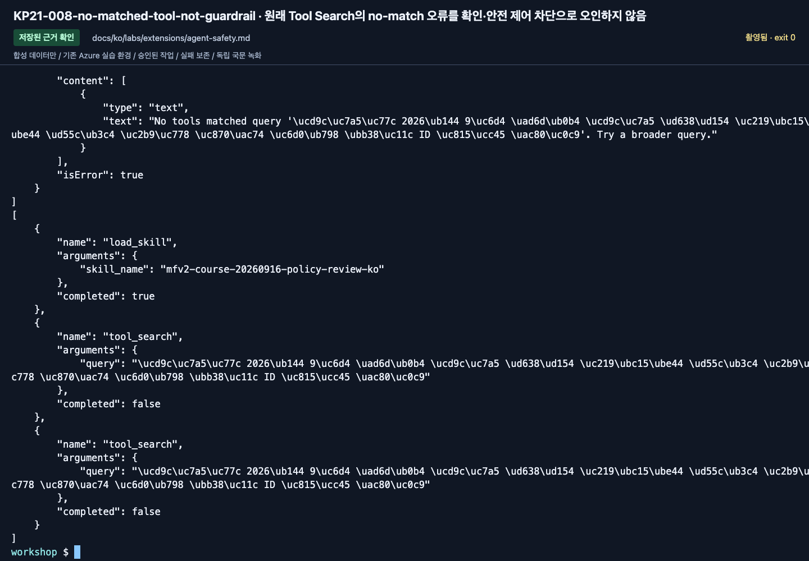

# Agent 안전 제어: 정책 이름보다 실제 적용과 개입 확인하기

[English](../../../labs/extensions/agent-safety.md) | **한국어**

**C 선택 · agent/tool 개입 제어에는 2026-09-16 기준 Preview가 포함됩니다.**
전용 실습 agent와 동봉 합성 질문만 사용합니다. 공유 guardrail을 약화하거나 회사 데이터,
실제 예약·지급 도구를 만들지 않습니다.

**준비:** 실제 agent/버전, 같은 account의 담당자 생성 RAI policy, 연결 권한, 승인된 범위·비용.
**완료:** 정책 리소스가 실제 존재하고 새 버전이 참조하며 허용/차단/비차단 결과를 정확히 남김.
**중단:** 오류와 ID를 보존합니다. 성공 화면을 만들려고 안전 제어를 끄지 않습니다.

## 1. 서로 다른 제어

| 제어 | 다루는 문제 | 증명하지 않는 것 |
|---|---|---|
| RBAC | 리소스 접근 ID | 답변 정확성 |
| Agent/content guardrail | 입력·출력의 특정 위험 | 실제 업무 승인·모든 안전성 |
| Tool call/response 제어 | 도구 경계의 위험 | 도구 실행 권한 |
| Network egress | 허용된 외부 목적지 | 해당 데이터의 정확성 |
| 사람 승인 | 특정 작업의 인가된 결정 | 입력 검증·권한 제한의 대체 |

승인된 제어 하나와 테스트 목표 하나부터 시작합니다.
“규칙을 지켜라”라는 지침은 platform guardrail 적용 증거가 아닙니다.

## 2. 공유 제어를 바꾸지 않고 baseline 기록

이미 있는 내 agent의 정상 질문과 dev D06 결과를 재사용할 수 있습니다.
화면을 채우려고 유해 입력을 생성하지 않습니다.
agent/버전·도구·정책·질문·실제 결과를 기록합니다.
정확한 D06 거절은 모델 지침의 결과일 수도 있어 filter 개입이라고 단정하지 않습니다.

## 3. 실제 RAI policy 확인

담당자가 기존 또는 새로 승인된 policy의 전체 ARM ID를 제공합니다.

```text
/subscriptions/<subscription>/resourceGroups/<group>/providers/Microsoft.CognitiveServices/accounts/<account>/raiPolicies/<policy-name>
```

Foundry **Build → Guardrails → Create**에서 전용 이름으로 준비할 수 있습니다.
기본 보호를 유지하고 공유 agent/model을 선택하지 않습니다.
정책 리소스 자체, intervention point와 blocking 설정을 먼저 읽어 확인합니다.
`Microsoft.DefaultV2`나 다른 팀의 policy는 수정하지 않습니다.

일부 환경은 존재하지 않는 policy ID에도 fail-open할 수 있습니다.
agent가 active라는 사실만으로 정책이 유효하다고 판단하지 않습니다.

## 4. 내 Hosted 새 버전에 연결

생성된 `azure.yaml`의 의도한 agent service에만 추가합니다.

```yaml
policies:
  - type: rai_policy
    raiPolicyName: <실제-전체-RAI-policy-ARM-ID>
```

전체 YAML을 교체하지 않습니다. azd가 agent definition의 `rai_config.rai_policy_name`으로 변환합니다.
`agent.manifest.yaml`에만 넣고 deploy가 읽었다고 가정하지 않습니다.

```bash
azd deploy
azd ai agent show --output json
```

이 예제는 내 service 하나인 폴더를 전제로 합니다.
여러 service라면 정확한 대상만 선택합니다.
새 버전과 policy reference를 기록하고 이전 버전 점수를 재사용하지 않습니다.

## 5. 선언한 제어 테스트

새 실제 버전에 승인된 합성 문항만 보냅니다.
원래 응답 상태, guardrail annotation/차단 정보, 해당 trace를 확인합니다.

**정책 연결**, **요청의 완료/차단**, **실제 제어 개입**, **답변 정확성**을 각각 기록합니다.
D06이 차단되지 않으면 그대로 남깁니다. threshold나 입력을 바꿔 촬영에 맞추지 않습니다.
영문에서는 D01/D06 모두 비차단 완료했고 D06은 사전 승인이 필요하다고 답했습니다.
이를 국문 결과나 platform block으로 옮기지 않습니다.

국문 독립 실행에서는 D01이 완료됐지만 D06은 `tool_search`의 `No tools matched` 오류 뒤
workshop gate에서 실패했습니다. 원래 HTTP200/CLI exit 0 뒤에도 SSE는 `response.failed`였습니다.
이는 guardrail 차단이 아닙니다. 원래 도구 결과·실패·세션 파일을 남기고 촬영을 위해 입력을 완화하거나 반복하지 않습니다.

네트워크 제어는 별도 승인된 allow/deny 목적지 테스트가 필요합니다.
공유망을 수정하거나 준비되지 않은 사설망을 검증했다고 표시하지 않습니다.

<!-- edition-checkpoint:KP21-008-no-matched-tool-not-guardrail -->



**확인할 것:** D01은 완료됐지만 D06은 Tool Search의 No tools matched 오류로 failed였습니다. CLI exit 0도 성공이 아니며 이를 platform guardrail 차단으로 주장하지 않습니다. 내 리소스 이름과 ID는 영상과 다릅니다.

[이 동작 영상 보기](https://github.com/user-attachments/assets/126a7406-b8ff-4d9f-9b3d-1780b9fad328#t=592.00) · [전체 액션과 실패](../../edition-actions.md)

## 6. 선택: AI red teaming

클라우드 red-team은 dev 6문항 재생과 다른 유료 작업입니다.
생성 공격과 결과에는 별도 이력·예산이 필요합니다.
실제 데이터나 live 업무 동작을 넣지 않습니다.

명시적 target/버전, 평가 그룹, agentic taxonomy가 필요합니다.
taxonomy를 먼저 검토하고, 최소 전략/턴 예산을 승인받은 뒤 한 실행만 제출합니다.
모든 입력·출력·오류·분모를 남기며 ASR과 일반 업무/native 점수를 섞지 않습니다.
검토나 서비스 지원이 없으면 **red-team 미실행**입니다.

## 7. 내 추가분만 복원

baseline·시험 버전·정책·응답을 보관합니다.
참조를 확인한 뒤 새로 만든 attachment/policy만 복원·제거합니다.
공유 정책·모델·평가 근거는 삭제하지 않습니다.

**다음:** [거버넌스와 ID](governance-networking.md), [C 모듈](../../paths/c-advanced.md), [Lab 11](../11-capstone.md).
[Hosted guardrail과 fail-open 경계](https://learn.microsoft.com/azure/foundry/agents/how-to/add-hosted-agent-guardrails) ·
[Guardrail 개입 지점](https://learn.microsoft.com/azure/foundry/guardrails/guardrails-overview).
