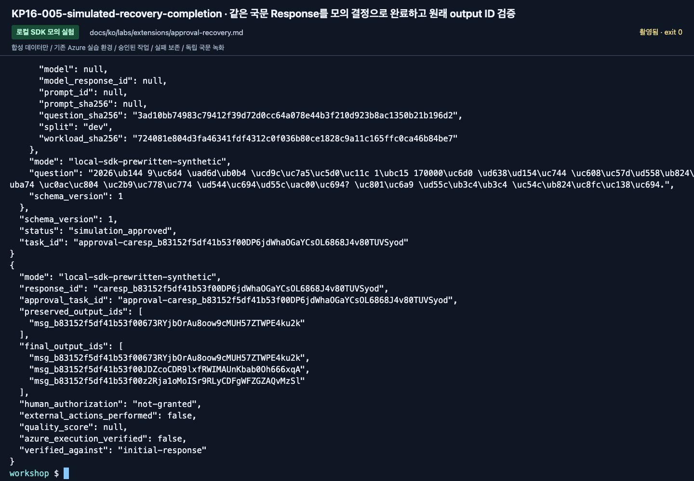

# 로컬 SDK 승인 게이트 모의 실험과 복구

[English](../../../labs/extensions/approval-recovery.md) | **한국어**

**선택 Preview · 호환성 확인일 2026-09-16.** Python 3.13,
`azure-ai-agentserver-core==2.1.0`, `azure-ai-agentserver-responses==2.2.0b1`의 준비된 환경을 사용합니다.
Lab 05, 핵심 배포 설정, 원본 데이터를 바꾸지 않습니다.

**실제 SDK 메커니즘이지만 작업은 미리 작성된 합성 예제입니다.**
모델·검색·평가·예약·지급·메일·실제 인가가 없습니다.
`synthetic-runtime-only`는 protocol label이며 Azure 모델 배포가 아닙니다.
국문 dev D03만 사용하고 holdout은 사용하지 않습니다.

**준비:** 전용 터미널 두 개와 고정된 SDK.
**완료:** 같은 response/gate와 원래 output ID를 유지하며 `human_authorization: not-granted`인 결과를 확인함.
**중단:** checkpoint와 오류를 보존합니다. 게이트를 우회하거나 실제 승인으로 표시하지 않습니다.

<details>
<summary>Lab 05의 pending-review와 다른 점</summary>

실제 `@multi_turn_task`가 `FoundryStateStore`에 승인 요청을 저장하고 suspended 상태가 됩니다.
나중의 **모의 결정**은 새 input ID로 같은 승인 task를 재개합니다.
별도 background Response는 같은 response ID를 유지합니다.
완전한 메시지마다 `yield stream.checkpoint()`로 commit하고, 복구 시
`context.persisted_response`의 commit된 prefix를 확인해 원래 output ID를 재생성하지 않습니다.

commit되지 않은 단계는 다시 실행될 수 있으며 외부 업무 효과와 transaction으로 묶여 있지 않습니다.
따라서 외부 동작을 추가하지 않습니다. 승인 task와 Response task는 서로 다른 ID이고 명시적으로 연결됩니다.
모의 결정 제한은 downtime 포함 600초, 이후 합성 작업은 최대 2단계입니다.

</details>

## 권장 첫 실행

### 1. 전용 터미널 준비

두 터미널 모두 저장소 루트와 준비된 Python을 사용합니다.

```bash
export WORKSHOP_PYTHON="${WORKSHOP_PYTHON:-$PWD/.venv/bin/python}"
export OTEL_SDK_DISABLED=true
unset FOUNDRY_HOSTING_ENVIRONMENT FOUNDRY_PROJECT_ENDPOINT
unset AZURE_AI_PROJECT_ENDPOINT AZURE_AIPROJECT_ENDPOINT
unset APPLICATIONINSIGHTS_CONNECTION_STRING OTEL_EXPORTER_OTLP_ENDPOINT
unset OTEL_EXPORTER_OTLP_TRACES_ENDPOINT OTEL_EXPORTER_OTLP_LOGS_ENDPOINT
unset OTEL_EXPORTER_OTLP_METRICS_ENDPOINT
"$WORKSHOP_PYTHON" examples/resilient/workshop.py check
```

정확한 두 SDK 버전과 `azure_requests_sent: false`를 확인합니다.
Azure 로그인·구독 변경·`.env` loading·새 패키지 설치·cloud resource가 필요하지 않습니다.
변경은 전용 터미널 안에만 적용됩니다.

### 2. 로컬 server 시작

터미널 A:

```bash
"$WORKSHOP_PYTHON" examples/resilient/workshop.py --language ko --run-id first-pass serve
```

`http://127.0.0.1:8093`, PID, mode, state 경로를 확인하고 실행 상태로 둡니다.
`outputs/resilience/first-pass/sdk-state/`는 실제 SDK 저장소입니다.
run별 lock으로 중복 server/정리를 막으며 이 폴더를 다른 server와 공유하지 않습니다.
인증 없는 실습 port를 외부에 노출하지 않습니다.

port가 사용 중이면 다른 프로세스를 중지하지 않습니다.
이번 실행의 **모든 명령**에 별도 `--port`를 명시합니다.
client는 요청 전 server의 workshop/run ID를 확인합니다.

### 3. Response 생성 후 일시 정지 확인

터미널 B:

```bash
"$WORKSHOP_PYTHON" examples/resilient/workshop.py --language ko --run-id first-pass start
"$WORKSHOP_PYTHON" examples/resilient/workshop.py --language ko --run-id first-pass status
```

실제 request:

```json
{"model":"synthetic-runtime-only","input":"D03","store":true,"background":true,"stream":true}
```

첫 SSE output 이후 연결이 끊겨도 저장된 background Response의 결정/취소가 아닙니다.
client가 server의 commit 증거를 기다린 뒤 `initial-response.json`을 저장합니다.

| 필드 | 정지 상태 |
|---|---|
| `mode` | `local-sdk-prewritten-synthetic` |
| `response_id` | SDK가 발급한 실제 ID |
| `response_status` | `in_progress` |
| `approval_task_id` | 같은 response에 연결된 승인 task |
| `approval_status` | `awaiting_simulated_decision` |
| `gate.decision` | `null` |
| gate/request ID와 hash | 저장된 결정 binding |
| `output_ids` | 원래 메시지 ID 하나 |
| `human_authorization` | `not-granted` |

아무 결정도 주지 않으면 스스로 승인하지 않습니다.
SDK test는 실제 suspended 상태와 store의 요청을 검사합니다. 메모리 변수 유지가 아닙니다.

### 4. 모의 결정 후 완료 확인

본인이 실행하거나 AI가 실행해도 **실제 사람 승인 증거가 아닙니다.**

```bash
"$WORKSHOP_PYTHON" examples/resilient/workshop.py --language ko --run-id first-pass decide \
  --decision approve --confirm-simulated-decision
"$WORKSHOP_PYTHON" examples/resilient/workshop.py --language ko --run-id first-pass wait \
  --timeout-seconds 30
```

`simulation_approved`, `decision.kind: simulated`, 같은 task/request/gate ID를 확인합니다.
SDK input 순서와 state-store ETag가 stale/경합 결정을 거부합니다.
동의 누락, 잘못된 binding, 만료, 이미 내린 결정의 교체는 작업을 열지 않습니다.

`wait`는 실제 completed Response의 **3개 순서 있는 메시지**
`approval_request`, `synthetic_review_packet`, `human_handoff_required`를 검사합니다.
원래 payload/ID를 유지하고 전체 output ID가 서로 달라야 합니다.
최종 원본은 `completed-response.json`입니다.

완료 후에도 `human_authorization: not-granted`, `external_actions_performed: false`,
`quality_score: null`, `azure_execution_verified: false`입니다.
누락·변경·실패·취소는 이 검증을 통과할 수 없습니다.

### 5. 내 run 정리

A의 server만 Ctrl+C로 종료한 뒤 B에서:

```bash
"$WORKSHOP_PYTHON" examples/resilient/workshop.py --language ko --run-id first-pass cleanup \
  --confirm-delete-local-state
```

표시된 run의 SDK 작업 상태만 제거합니다. 원래 요청·응답·checkpoint는 남깁니다.
active lock, symlink, 모르는 파일, 소유 marker 누락을 거부합니다.
프로세스나 Azure resource를 강제로 삭제하지 않습니다.
정리한 run ID를 다시 쓰지 않습니다.

<!-- edition-checkpoint:KP16-005-simulated-recovery-completion -->



**확인할 것:** 원래 response·gate·output ID로 복구했습니다. 결정은 명시적 모의 입력이며 human_authorization은 not-granted입니다. 실제 승인이나 Azure crash 검증이 아닙니다. 내 리소스 이름과 ID는 영상과 다릅니다.

[이 동작 영상 보기](https://github.com/user-attachments/assets/126a7406-b8ff-4d9f-9b3d-1780b9fad328#t=336.96) · [전체 액션과 실패](../../edition-actions.md)

## 첫 실행 이후 선택 분기

### macOS/Linux의 정상 종료 후 재시작

```bash
# 터미널 A
"$WORKSHOP_PYTHON" examples/resilient/workshop.py --language ko --run-id resume-pass serve
```

```bash
# 터미널 B
"$WORKSHOP_PYTHON" examples/resilient/workshop.py --language ko --run-id resume-pass start
```

gate가 pending일 때 A에서 Ctrl+C 후 같은 `resume-pass serve` 명령으로 재시작합니다.
소스/환경은 고정하고 `start`를 다시 실행하지 않습니다.

```bash
"$WORKSHOP_PYTHON" examples/resilient/workshop.py --language ko --run-id resume-pass status
"$WORKSHOP_PYTHON" examples/resilient/workshop.py --language ko --run-id resume-pass decide \
  --decision approve --confirm-simulated-decision
"$WORKSHOP_PYTHON" examples/resilient/workshop.py --language ko --run-id resume-pass wait
```

원래 ID가 유지되고 `checkpoint.json`의 `handler_is_recovery: true`를 확인합니다.
같은 run의 cleanup을 수행합니다.

이 고정 SDK에서 정상 종료는 이전 SSE log를 닫습니다.
재시작을 가로지르는 완전한 무손실 live SSE tail을 주장하지 않고 최종 JSON/checkpoint로 확인합니다.
종료 중 `TaskDeferred` future 메시지가 나올 수 있지만 그 문구만으로 성공/실패를 판단하지 않습니다.

### Commit 후 명시적 hard crash: Linux 전용

Linux/WSL/Linux container용 준비 분기입니다. 이 판의 macOS/Hosted 실행 증거가 아닙니다.
macOS에서는 hard-crash flag를 거부합니다.

```bash
# Linux 터미널 A
"$WORKSHOP_PYTHON" examples/resilient/workshop.py --language ko --run-id crash-pass serve \
  --crash-after-checkpoint 1 --allow-owned-process-crash
```

```bash
# 터미널 B
"$WORKSHOP_PYTHON" examples/resilient/workshop.py --language ko --run-id crash-pass start
"$WORKSHOP_PYTHON" examples/resilient/workshop.py --language ko --run-id crash-pass decide \
  --decision approve --confirm-simulated-decision
```

승인 요청과 첫 작업 메시지의 commit 뒤 `crash-checkpoint.json`을 쓰고 **자기 PID만** exit 86으로 끝냅니다.
HTTP trigger는 없으며 두 flag가 모두 필요합니다. `crash-once.json`이 반복 crash를 막습니다.

```bash
"$WORKSHOP_PYTHON" examples/resilient/workshop.py --language ko --run-id crash-pass serve
```

```bash
"$WORKSHOP_PYTHON" examples/resilient/workshop.py --language ko --run-id crash-pass wait \
  --timeout-seconds 120 --verify-crash-checkpoint
```

새 Response나 결정을 만들지 않습니다. 원래 두 output ID/payload와 response/task를 유지하고
남은 작업 메시지 하나만 추가되어야 합니다.
timeout이면 근거를 남기며 lease·snapshot·ID를 수정하지 않습니다.

### 거절·만료·오류

새 run에서 `--decision reject --confirm-simulated-decision`은 요청과 `simulation_rejected`만 생성합니다.
결정을 주지 않고 만료되면 `approval_timeout` 실패이지 성공 답변이 아닙니다.
timeout은 `1..900`, 단계 지연은 `0..5`초, client 대기는 최대 120초입니다.

client 단절/대기 timeout 뒤에는 `status`를 쓰고 새 `start`를 보내지 않습니다.
ID 저장 전 생성 실패는 결과 미상입니다. 근거를 보관하고 내 server를 중지·정리한 뒤 새 run을 명시적으로 사용합니다.
손상된 상태·hash 변경·SDK 불일치·저장 오류는 대체 모델/provider/fixture를 고르는 이유가 아닙니다.

## 로컬 검증과 Hosted의 별도 경계

```bash
PYTHONPATH=src "$WORKSHOP_PYTHON" -m unittest tests.test_resilience tests_sdk.test_resilience
"$WORKSHOP_PYTHON" -m ruff check src/foundry_workshop/resilience.py examples/resilient \
  tests/test_resilience.py tests_sdk/test_resilience.py
"$WORKSHOP_PYTHON" -m compileall -q src/foundry_workshop/resilience.py \
  examples/resilient tests/test_resilience.py tests_sdk/test_resilience.py
```

실제 file provider·startup/shutdown·순서·checkpoint·callback·ID를 테스트하지만 network는 금지합니다.
영문에서 정상 재시작과 원래 ID 보존을 별도 기록했으며 국문도 국문 source로 확인합니다.
이는 Linux hard crash, Azure 배포, 품질 점수가 아닙니다.

core 2.1.0의 context는 sentinel을 반환하므로 `return await ctx.exit_for_recovery()`를 사용합니다.
Responses context는 제어 신호를 발생시키므로 `await context.exit_for_recovery()`입니다.
다른 SDK 버전의 idiom을 검증 없이 옮기지 않습니다.

prompt/model/evaluator는 실행하지 않으므로 그 이력이 없는 것을 명시합니다.
실제 승인 서비스에는 인증된 reviewer, 인가 정책, 서비스 저장소, 만료·취소,
idempotent/transactional 외부 동작 경계가 별도로 필요합니다.
로컬 파일은 container 간 내구성을 증명하지 않습니다.

**구현:** [순수 계약](../../../../src/foundry_workshop/resilience.py) ·
[SDK server](../../../../examples/resilient/server.py) ·
[runner/client](../../../../examples/resilient/workshop.py).
[Human-in-the-loop](https://learn.microsoft.com/azure/foundry/agents/how-to/add-human-in-the-loop) ·
[Resilient agent](https://learn.microsoft.com/azure/foundry/agents/how-to/deploy-resilient-agent).
