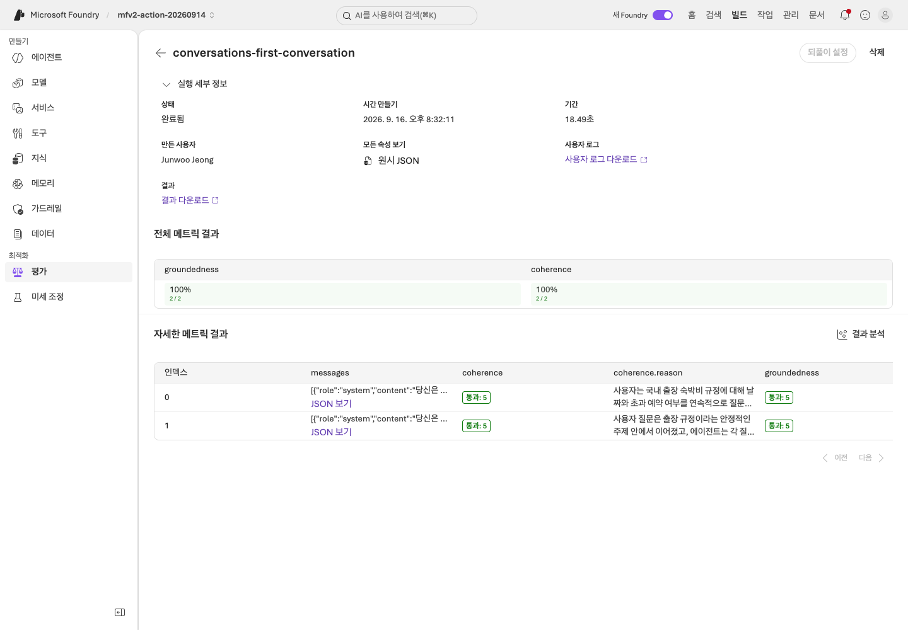

# 마지막 답변뿐 아니라 대화 전체 평가하기

[English](../../../labs/extensions/conversation-evaluation.md) | **한국어**

**C 경로.** [Lab 07](../07-evaluation.md) 이후에 진행합니다.
독립 문항 matrix와 달리 같은 dev 6문항을 **두 개의 3턴 대화**로 보내며 실제 이전 답변을 다음 턴에 유지합니다.

**준비:** 모델/구조화 응답, 별도 judge 배포, 새 label, 비용 승인.
**완료:** 6개 턴과 2개 완전한 대화, 각 수준의 별도 native 결과가 있음.
**중단:** 성공한 앞부분만 평가하지 않고 부분 결과·오류를 보존합니다.

**첫 회차:** 1–6절 순서입니다. 두 평가 수준에 같은 수집 label을 사용합니다.
새 target 대화에는 새 label이 필요하지만 저장된 judge job을 조회할 때는 바꾸지 않습니다.

2026-09-16 기준 영문에서 실행한 결과는 [별도 결과 문서](../../edition-results.md)에 있습니다.
국문은 국문 원문과 새 label로 실행합니다. 각 실행이 읽은 실제 evaluator catalog를 고정합니다.

## 1. 모델 호출 전 계획

```bash
python scripts/workshop.py --language ko conversations plan
```

| 대화 | 원본 dev 순서 | 확인 목적 |
|---|---|---|
| `dates-and-approval` | D01 → D02 → D03 | 적용 날짜 변경과 한도 초과 승인 조건 |
| `scope-and-boundaries` | D04 → D05 → D06 | 정책 범위 변경과 제약 무시 요청 |

각 원본 질문은 한 번씩만 사용합니다. 질문 생성이나 holdout 읽기는 하지 않습니다.
근거는 원문 정책 6개 전체이며 **IQ/Toolbox 검색 실험이 아닙니다.**
먼저 대화 동작만 비교해 검색 설정 변화와 섞이지 않게 합니다.

논리 target 작업은 6턴입니다. SDK/service 작업은 사용량을 추가할 수 있습니다.
턴 평가의 입력 6개와 전체 대화 평가의 입력 2개는 서로 다른 분모입니다.

## 2. 실제 대화 한 번 수집

```bash
python scripts/workshop.py --language ko conversations collect --label conversations-first --prompt v2 --confirm-cost
```

`outputs/conversations/conversations-first/`에서 확인합니다.

| 파일 | 확인할 내용 |
|---|---|
| `plan.json`, `corpus.json`, `manifest.json` | 언어·입력·hash·모델·run ID |
| `D01-request.json` … `D06-request.json` | 실제 질문·이전 대화·합성 근거만 포함, 정답 필드 제외 |
| 턴별 response | 실제 텍스트·구조·서비스 ID·사용량·오류 |
| `turns.json` | 오류/blocked를 포함한 원래 6행 |
| `conversations.json` | 이전 대화를 공유하지 않는 별도 이력 2개 |
| `business-evaluation.json` | 원래 문항별 업무 검사, 의미적 대화 점수 아님 |

다음 턴에는 실제 이전 답변이 들어갑니다. 다음 대화는 새 상태에서 시작합니다.
명시적 history와 `store=False`를 사용하며 관리형 Memory Store나 Azure conversation 생성이라고 주장하지 않습니다.
한 턴이 실패하면 같은 대화의 후속 턴은 blocked로 남깁니다.
다른 독립 대화는 계속할 수 있지만 6행 분모를 줄이지 않습니다.
Native 평가는 실제 수집이 완전해야 하며 성공한 일부만 평가하지 않습니다.

## 3. 로컬 업무 검사

```bash
python scripts/workshop.py --language ko conversations report --label conversations-first
```

현재/과거 금액, 필수 인용, 승인 결정을 모두 봅니다.
업무 검사 통과는 coherence나 운영 안전성 인증이 아닙니다.
잘못된 답변을 report가 수정해 주지 않습니다.

## 4. 이전 맥락을 포함한 턴 평가

`AZURE_AI_EVALUATION_MODEL_DEPLOYMENT_NAME`은 승인된 별도 judge 배포입니다.

```bash
python scripts/workshop.py --language ko conversations evaluate --label conversations-first --level turn --confirm-cost
```

각 입력은 해당 답변까지의 history입니다. catalog의 실제 수준 지원, 버전, schema, threshold를 남기고
`native-turn/`의 **6개 결과**를 모두 확인합니다.

## 5. 전체 대화 평가

```bash
python scripts/workshop.py --language ko conversations evaluate --label conversations-first --level conversation --confirm-cost
```

완전한 대화 2개를 별도 입력으로 평가합니다. 마지막 답변 하나나 턴 점수 평균으로 대체하지 않습니다.
`native-conversation/`의 실제 eval/run ID, 결과 2개, evaluator hash를 보존합니다.
모델 답변을 다시 생성하지 않고 수집한 원래 대화를 사용합니다.

턴·대화 결과와 업무 검사를 나란히 읽되 같은 단위의 점수처럼 비교하지 않습니다.
오류나 누락된 대화는 점수를 좋게 만드는 이유가 될 수 없습니다.
Timeout이면 같은 명령으로 저장된 평가 job의 조회를 재개합니다.
새 target 대화를 만들거나 좋은 점수가 나올 때까지 평가를 반복하지 않습니다.

<!-- edition-checkpoint:KP14-103-completed-native-report -->



**확인할 것:** 전체 대화 보고서는 2개 항목입니다. 6턴과 2대화의 분모를 비교해 품질이 개선됐다고 해석하지 않습니다. 실제 judge 입력에도 원래 정책 JSON이 보존됐는지 별도로 확인했습니다. 내 리소스 이름과 ID는 영상과 다릅니다.

[이 동작 영상 보기](https://github.com/user-attachments/assets/126a7406-b8ff-4d9f-9b3d-1780b9fad328#t=174.44) · [전체 액션과 실패](../../edition-actions.md)

## 6. 인계

계획·원문·prompt·dataset·response·evaluator 이력을 함께 남깁니다.
어떤 턴/대화가 왜 실패했는지 사람이 검토합니다.
이 작은 dev 결과를 통계적 우월성이나 운영 승인으로 해석하지 않습니다.

**다음:** [Optimizer](agent-optimizer.md), [C 모듈](../../paths/c-advanced.md), [Lab 11](../11-capstone.md).
