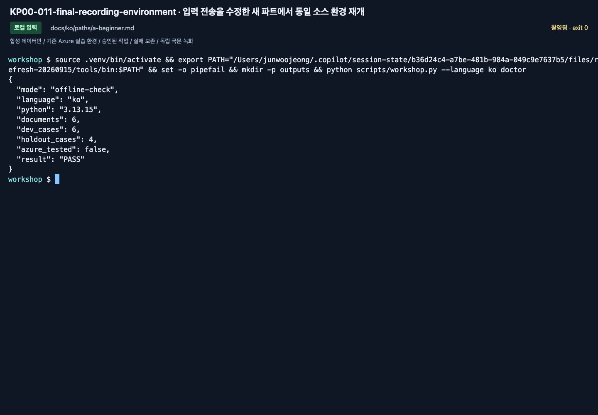

# 개발 도구: 환경 하나와 선택적인 편집기 통합

[English](../../../labs/extensions/developer-toolkit.md) | **한국어**

**B 준비.** 기준 경로는 저장소의 Python CLI입니다.
Foundry Toolkit은 선택 편집기 UI이며 다른 구현이나 모든 최신 SDK 설치의 이유가 아닙니다.

## 1. 실제 Python과 프로젝트

[Lab 00 B](../00-start.md#b-코드--한-폴더-한-환경) 이후 VS Code에서 저장소를 열고
**Python: Select Interpreter**로 같은 `.venv`를 선택합니다. 새 터미널도 같은 루트와 환경을 사용합니다.

```bash
python --version
python -m pip check
python scripts/check_sdk.py
python scripts/workshop.py --language ko doctor
python scripts/workshop.py --language ko doctor --cloud
```

offline PASS는 cloud 인증이 아닙니다. cloud 사전 확인도 기능 지원 증거가 아니므로 Lab 02의 실제 요청을 완료합니다.

<!-- edition-checkpoint:KP00-011-final-recording-environment -->



**확인할 것:** 실제 Python과 국문 합성 파일을 확인했습니다. offline-check PASS는 Azure 연결·모델·배포 성공을 뜻하지 않습니다. 내 리소스 이름과 ID는 영상과 다릅니다.

[이 동작 영상 보기](https://github.com/user-attachments/assets/126a7406-b8ff-4d9f-9b3d-1780b9fad328#t=17.44) · [전체 액션과 실패](../../edition-actions.md)

## 2. 공유 설정을 바꾸지 않고 azd 확인

```bash
azd version
azd ext list
azd auth login --check-status
azd ai agent init --help
```

설정 카드의 계정/프로젝트/모델과 일치해야 합니다.
수업 중 기본 구독을 바꾸거나 모든 extension을 전역 upgrade하지 않습니다.
호환성 문제는 준비 차단 사유이며 오류를 생략할 이유가 아닙니다.

## 3. 선택: Foundry Toolkit

[공식 설치/설정](https://learn.microsoft.com/azure/foundry/how-to/develop/install-foundry-toolkit-visual-studio-code)을 따릅니다.
해당 컴퓨터의 설치 승인 후 Activity Bar의 Foundry Toolkit을 엽니다.
같은 Entra 계정으로 로그인하고 **My Resources**에서 실제 실습 프로젝트를 고릅니다.
모델/agent 목록·ID·endpoint를 설정 카드와 비교합니다.
같은 workspace의 파일/터미널을 사용하며 다른 template로 중복 프로젝트를 만들지 않습니다.

Toolbox는 [실행 가능한 CLI 경로](toolbox.md)부터 완료하고 Toolkit으로 같은 자산을 확인합니다.
설치/접근이 없으면 CLI 경로를 유지하고 편집기 통합은 **미실행**으로 표시합니다.
Marketplace 화면은 통합 성공 증거가 아닙니다.

## 4. 호환성 snapshot

고정 dependency는 검증한 조합이지 항상 최신을 사용한다는 약속이 아닙니다.
MAF Python 1.18의 vector store/tool-loop/dependency·serialization 변경은
별도 환경에서 provider/Projects/OpenAI/hosting 전체 조합으로 검토합니다.
단일 library import 성공만으로 호환성을 추정하지 않습니다.

도움말과 생성된 `azure.yaml`도 실행 계약입니다.
과거 화면/샘플과 다르면 차이를 보존하고 실제 작업을 확인한 뒤 가이드를 수정합니다.

**다음:** [B 구현](../../paths/b-practitioner.md).
[MAF 1.18](https://github.com/microsoft/agent-framework/releases/tag/python-1.18.0) ·
[호환성 기록](../../reference/versions.md).
