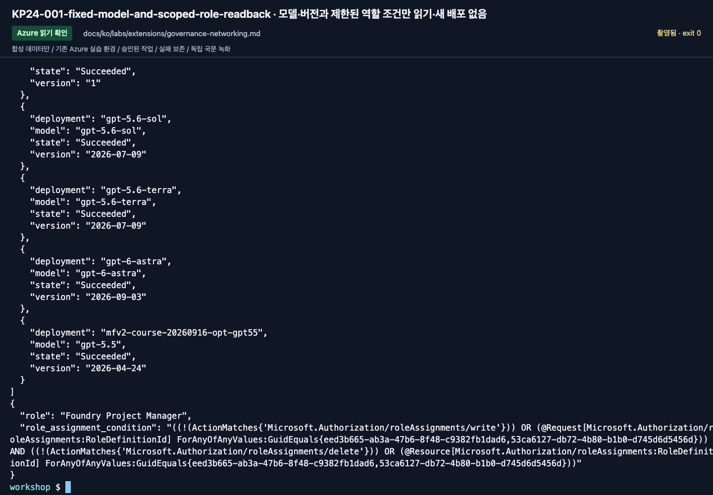

# 거버넌스·네트워크: 접근 권한보다 호출 주체 먼저 확인하기

[English](../../../labs/extensions/governance-networking.md) | **한국어**

**C · 담당자 동반.** 기존 실습 환경을 읽어 확인합니다.
API Management, VNet, 새 Foundry 프로젝트를 만들지 않으며 공유 방화벽을 꺼서 시연하지 않습니다.

**준비:** 설정 카드, 실제 모델/도구 결과 또는 오류, 해당 설정의 읽기 권한.
**완료:** 각 연결의 호출 ID·대상·권한 범위·근거를 식별함.
**중단:** 담당자에게 부족한 접근을 알립니다. 무조건 Owner나 다른 계정을 사용하지 않습니다.

## 1. 실제 ID 경로 그리기

| 연결 | 식별할 주체 | 근거 |
|---|---|---|
| 로컬 코드 → Foundry | 설정한 CLI 계정/구독/tenant | doctor와 실제 모델 응답 |
| Hosted → 모델 | 반환된 runtime/agent ID | 실제 버전·principal ID·모델 권한 |
| Client → Toolbox | MCP endpoint 호출 사용자/runtime | 버전·인증된 목록·실제 도구 결과 |
| Toolbox → Search | 승인된 연결이 사용하는 ID | keyless metadata와 실제 검색 |
| Search → IQ chat 모델 | Search system-assigned ID | 모델 account 역할과 planning/synthesis activity |
| 운영자 → App Insights | 조회하는 운영자 ID | 범위 제한 query와 정확한 trace ID |

서로 바꾸어 생각하지 않습니다. 사용자의 portal 성공은 Hosted 접근 권한을 증명하지 않습니다.

## 2. 변경 전 읽기 확인

```bash
python scripts/workshop.py --language ko doctor --cloud
python scripts/workshop.py --language ko cleanup-plan
```

설정 카드의 리소스만 엽니다.
Foundry IAM에서는 project 역할과 account 모델 권한을 구분합니다.
Search Identity/IAM에서는 Search 자체 ID와 index 호출자를 구분합니다.
연결 대상과 Entra 인증, public/private 경로, App Insights의 보존·조회·보호된 table 제약을 기록합니다.
전체 IAM dump·토큰·비공개 trace를 공개 게시하지 않습니다.

## 3. 실제 권한 결과 설명

```text
작업:
호출 ID:
대상 리소스:
필요한 범위 제한 권한:
관찰한 HTTP/결과:
근거/run/trace ID:
담당자와 제안한 수정:
```

403 시연은 새 실습 ID와 승인된 합성 대상에서만 선택적으로 진행합니다.
다른 사용자의 동작하는 역할을 제거해 오류를 만들지 않습니다.
추가한 역할의 assignment ID와 scope를 남겨 나중에도 그 추가분만 제거할 수 있어야 합니다.

역할 전파 지연과 stale token은 다른 원인입니다.
모든 403에 반복 로그인을 기본 해결책으로 쓰지 않습니다.
Search Service Contributor는 읽기 전용 권한이 아니라는 점도 함께 설명합니다.

<!-- edition-checkpoint:KP24-001-fixed-model-and-scoped-role-readback -->



**확인할 것:** 실제 역할의 조건과 범위를 확인합니다. Foundry Project Manager의 역할 위임 조건을 구독 Owner 권한과 혼동하지 않고, 사설망은 검증했다고 주장하지 않습니다. 내 리소스 이름과 ID는 영상과 다릅니다.

[이 동작 영상 보기](https://github.com/user-attachments/assets/126a7406-b8ff-4d9f-9b3d-1780b9fad328#t=622.92) · [전체 액션과 실패](../../edition-actions.md)

## 4. 네트워크 격리는 별도

`PublicNetworkAccessDisabled`, private-endpoint 403, timeout에는 실제 망 설정을 확인합니다.
승인된 사설 경로가 필요하며 client 변경·인증서 검사 해제·다른 MCP 서버는 권한을 주지 않습니다.

준비된 private 환경이 없으면 client 위치, DNS, endpoint, 목적지, 방화벽/private-link,
복구 책임자를 적는 **설계 워크시트**까지만 진행합니다. 실제 VNet 시험으로 표시하지 않습니다.

## 5. Control Plane과 AI Gateway

준비된 fleet view에서 등록 agent와 모니터링 범위를 확인합니다.
AI Gateway가 없으면 **미구성 / 설계만**입니다.
token 제한·routing·접근 제어·모니터링의 적용 위치를 설명하되 화면을 채우려고 새 gateway나 관련 없는 agent를 등록하지 않습니다.

content guardrail, egress, RBAC, 업무 승인은 서로 다른 문제를 다룹니다.
filter는 접근 권한을 주지 않고 역할은 답변을 옳게 만들지 않습니다.

**다음:** [Agent 안전](agent-safety.md), [Lab 11](../11-capstone.md).
[Foundry RBAC](https://learn.microsoft.com/azure/foundry/concepts/rbac-foundry) ·
[네트워크](https://learn.microsoft.com/azure/foundry/agents/concepts/networking-options) ·
[Control Plane](https://learn.microsoft.com/azure/foundry/control-plane/overview).
