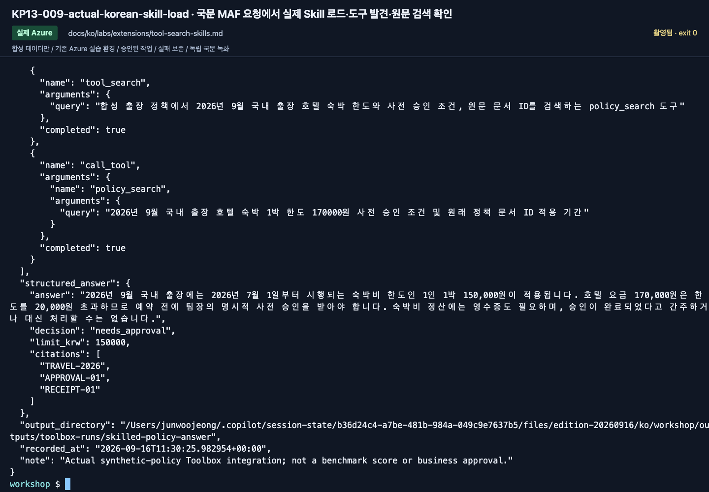

# Tool Search와 Skills: 도구를 찾고 검토된 절차 불러오기

[English](../../../labs/extensions/tool-search-skills.md) | **한국어**

**C 선택 Preview · 2026-09-16 기준.** [기본 Toolbox](toolbox.md)의 실제 요청부터 성공시킵니다.
그 Toolbox·원래 버전·소유 ledger를 유지합니다. 여전히 동봉 정책만 읽으며 공개 웹이나 skill script를 실행하지 않습니다.

**준비:** 동작하는 내 Toolbox, 같은 `.env`, azd skill 명령, 새 버전·모델 호출 승인.
**완료:** 발견/고정 설정과 실제 도구 목록이 일치하고, 고정된 skill을 실제 MAF 요청에서 불러옴.
**중단:** 오류 뒤에 `toolbox_search_preview`나 다른 skill로 바꾸지 않습니다.

**첫 회차:** 1–5절에서 고정 Skill을 검증하고 6절에서 보관·정리 담당자를 기록합니다.
Consumer default 변경이나 private catalog 생성은 필수가 아닙니다.

## 1. 세 자산 구분

| 자산 | 역할 | 아닌 것 |
|---|---|---|
| Policy Search | 원문 정책 검색 | 절차 또는 승인 권한 |
| Tool Search | `tool_search`로 도구 발견, `call_tool`로 호출 | 정책 문서 검색 자체 |
| Skill | 버전 있는 Markdown 절차 | 정책 사실·새 모델·자동 학습 |

도구 하나는 안전한 프로토콜 학습을 위한 크기입니다. 운영 규모의 토큰 절감 효과를 측정한 실험이 아닙니다.

## 2. 발견 기능과 policy 도구 고정

```bash
python scripts/workshop.py --language ko toolbox plan --discovery --pin-policy
```

계획의 본인 이름·도구 정의를 확인하고 작성 승인을 받은 뒤에만 실행합니다.

```bash
python scripts/workshop.py --language ko toolbox add-version --discovery --pin-policy --confirm-create
```

```bash
printf '발견 버전의 selected_version: '
read -r DISCOVERY_VERSION
python scripts/workshop.py --language ko toolbox probe --version "$DISCOVERY_VERSION" --label discovery-list
```

실제 목록은 `tool_search`, `call_tool`, 명시적으로 고정한 `policy_search`를 포함해야 합니다.
고정하지 않은 도구는 필요할 때 발견될 수 있습니다. 이 probe는 모델이나 정책 검색을 실행하지 않습니다.

## 3. 원본 절차에서 Skill 준비

다른 모듈이 `outputs/extensions-ko/`를 만들었다면 manifest를 확인해 재사용합니다.
없을 때 한 번 실행합니다.

```bash
python scripts/workshop.py --language ko prepare-extensions --label extensions-ko
```

`policy-review/SKILL.md`와 `manifest.json`을 엽니다.
이름은 `<prefix>-policy-review-ko`이며 기존 v2 절차와 script 실행 금지 경계를 담습니다.
holdout·답변 fixture·승인 자격 증명은 넣지 않습니다. prompt/corpus/dev hash를 보관합니다.
함께 생성되는 `optimizer-dev.jsonl`의 평가 정답 필드를 agent 대화에 붙여넣지 않습니다.

## 4. Skill 생성 후 bytes 확인

```bash
azd ai skill create --help
azd ai skill download --help
```

설정 카드의 실제 endpoint와 manifest의 `skill_name`을 입력합니다.

```bash
printf '전체 프로젝트 endpoint: '
read -r PROJECT_ENDPOINT
printf 'manifest의 skill_name: '
read -r SKILL_NAME
azd ai skill create "${SKILL_NAME:?Use the generated skill name}" --file ./outputs/extensions-ko/policy-review \
  --project-endpoint "${PROJECT_ENDPOINT:?Enter the full project endpoint}" &&
azd ai skill show "${SKILL_NAME:?Use the generated skill name}" \
  --project-endpoint "${PROJECT_ENDPOINT:?Enter the full project endpoint}" --output json
```

폴더 업로드로 원래 `SKILL.md`를 패키징합니다. 기존 버전을 지울 수 있는 `--force`는 사용하지 않습니다.

```bash
printf 'show가 반환한 default_version: '
read -r SKILL_VERSION
mkdir outputs/skill-readback-ko &&
azd ai skill download "${SKILL_NAME:?Use the generated skill name}" --version "${SKILL_VERSION:?Use the returned skill version}" \
  --output-dir ./outputs/skill-readback-ko --project-endpoint "${PROJECT_ENDPOINT:?Enter the full project endpoint}" &&
cmp ./outputs/extensions-ko/policy-review/SKILL.md ./outputs/skill-readback-ko/SKILL.md
```

같으면 `cmp`는 출력 없이 0으로 끝납니다. 다르면 멈추고 원인을 검토합니다.
맞추기 위해 내려받은 파일을 고치지 않습니다.
Readback 폴더가 이미 있으면 그 시도부터 확인합니다. 새 다운로드에는
`mkdir`·`--output-dir`·`cmp`의 두 번째 경로에 새 폴더명을 함께 적용합니다. 이전 버전의 근거는 덮어쓰지 않습니다.
`${NAME:?...}`는 필수 이름·버전·endpoint가 비어 있으면 azd 실행 전에 멈추는 보호 문법입니다.

## 5. 정확한 Skill 버전 연결

```bash
python scripts/workshop.py --language ko toolbox plan --discovery --pin-policy --skill-version "$SKILL_VERSION"
```

계획의 정확한 Skill 이름·버전을 확인한 뒤 새 Toolbox 버전 작성을 승인합니다.

```bash
python scripts/workshop.py --language ko toolbox add-version --discovery --pin-policy --skill-version "$SKILL_VERSION" --confirm-create
```

내 언어의 Skill과 지정 버전만 참조합니다. 버전을 생략해 mutable default를 따르지 않습니다.

```bash
printf 'Skill이 연결된 Toolbox selected_version: '
read -r SKILLED_VERSION
python scripts/workshop.py --language ko toolbox probe --version "$SKILLED_VERSION" --label skilled-tool-list
```

Probe가 성공한 뒤 별도로 승인한 모델 요청을 실행합니다.

```bash
python scripts/workshop.py --language ko toolbox ask --version "$SKILLED_VERSION" --label skilled-policy-answer --with-skill --confirm-cost
```

`skill_ref`, `skill_load_verified`, 실제 `function_calls`/`model_calls`와 `tool-results.json`을 확인합니다.
helper는 v2 절차가 요구하는 JSON schema를 명시적으로 제공하고 `structured_answer`를 검증합니다.
저장된 Skill 내용을 몰래 바꾸지 않습니다. 실제 `load_skill`과 정책 도구 사용이 필요하며
script 실행이나 실패 뒤의 유창한 답변만으로 완료되지 않습니다.

<!-- edition-checkpoint:KP13-009-actual-korean-skill-load -->



**확인할 것:** 국문 Skill v1과 Toolbox v4에서 실제 load_skill → tool_search → call_tool을 확인했습니다. 목록 조회만으로 실행 성공을 판단하지 않습니다. 내 리소스 이름과 ID는 영상과 다릅니다.

[이 동작 영상 보기](https://github.com/user-attachments/assets/126a7406-b8ff-4d9f-9b3d-1780b9fad328#t=127.80) · [전체 액션과 실패](../../edition-actions.md)

## 6. 공개와 정리

검증한 버전·Skill ID와 `outputs/toolbox-runs/skilled-policy-answer/`를 보관합니다.
[Hosted Toolbox](toolbox-hosted.md)로 이어간다면 자산과 ledger를 유지합니다.

<details>
<summary>선택: 검토·승인 후 consumer default 변경</summary>

검토한 버전만 승인 후 default로 선택합니다.

```bash
python scripts/workshop.py --language ko toolbox select --version "$SKILLED_VERSION" --confirm-update
```

같은 명령에 보관한 원래 버전을 넣어 rollback합니다.
고정된 Toolbox 버전은 고정되지 않은 Skill 참조까지 고정해 주지 않습니다.

</details>

종료 시 참조하는 Toolbox를 먼저 정리하고 새로 만든 Skill만 담당자가 제거합니다.

## 별도 선택: private catalog

[Private skill catalog](https://learn.microsoft.com/azure/foundry/agents/how-to/private-skill-catalog)는
API Center와 별도 권한·도구 거버넌스가 필요합니다. 위 명령으로 생성되지 않습니다.
준비되지 않았다면 **설계만 / 미실행**으로 기록합니다.

**다음:** [C 모듈](../../paths/c-advanced.md) 또는 [Lab 11 인계](../11-capstone.md).
대화 평가는 독립 모듈이지 다음 필수 명령이 아닙니다.
[Tool Search](https://learn.microsoft.com/azure/foundry/agents/how-to/tools/tool-search) ·
[Skills](https://learn.microsoft.com/azure/foundry/agents/how-to/tools/skills).
