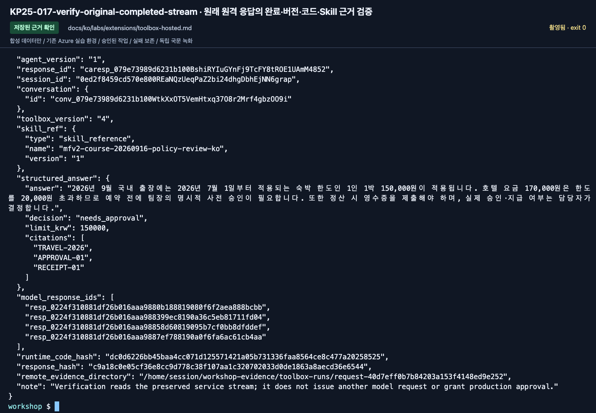

# 같은 고정 버전 Toolbox agent를 Hosted로 실행하기

[English](../../../labs/extensions/toolbox-hosted.md) | **한국어**

**B/C 확장.** [Toolbox 로컬 요청](toolbox.md)을 먼저 완료합니다.
같은 MAF wrapper·버전 검증·오류 보존 코드를 사용합니다. 이전 workflow의 품질 점수를 새 대상에 옮기지 않습니다.

**준비:** 실제 동작한 내 Toolbox 버전, 합성 seed ledger, Hosted SDK, 기존 프로젝트의 전체 ARM ID,
새 agent 이름과 배포/모델/도구 권한 승인.
**완료:** 새 원격 버전이 실제 도구·모델·근거 metadata를 반환함.
**중단:** 패키징/로컬까지만 확인한 경우 원격은 미실행으로 표시합니다.

## 1. 런타임과 질문만 패키징

저장소 터미널에서 실제 검증한 버전을 입력합니다.

```bash
printf '검증한 Toolbox 버전: '
read -r TOOLBOX_VERSION
python scripts/package_toolbox.py --language ko --version "$TOOLBOX_VERSION"
```

Skill 버전이면 패키징과 로컬 server 명령 모두에 `--with-skill`을 추가합니다.
`.build/toolbox-ko-<version>/`에는 코드·합성 정책·질문·고정된 `toolbox-profile.json`만 들어갑니다.
정답, holdout, `.env`, 이전 출력은 제외합니다.
프로젝트·모델·Toolbox·Search 연결/원문 설정을 고정합니다.

Hosted의 `/app`은 읽기 전용입니다. 요청 근거는
`$HOME/workshop-evidence/toolbox-runs`에 저장합니다.
세션 삭제 전에 해당 세션의 file 명령으로 내려받습니다.
출력된 **절대 패키지 경로**를 보관하고 기존 패키지를 덮어쓰지 않습니다.

## 2. 별도 azd 실행 폴더 준비

기존 azd 프로젝트의 상위/하위 경로가 아닌 빈 폴더를 사용합니다.
교육 저장소를 따로 만드는 것이 아니라 실행 상태를 격리하는 단계입니다.
같은 준비된 B Python 환경을 사용합니다.

```bash
printf '절대 Toolbox 패키지 경로: '
read -r PACKAGE_DIR
printf '절대 실습 저장소 경로: '
read -r WORKSHOP_ROOT
printf '실제 기존 프로젝트 ARM ID: '
read -r PROJECT_ARM_ID
printf '새 agent 이름 (<내 prefix>-toolbox-hosted-ko): '
read -r AGENT_NAME
printf '비어 있는 azd 폴더의 절대 경로: '
read -r AZD_DIR
printf '실제 기존 프로젝트의 리전 코드 (예: swedencentral): '
read -r PROJECT_LOCATION
python "$WORKSHOP_ROOT/scripts/prepare_hosted_azd.py" --language ko --kind toolbox --package "$PACKAGE_DIR" --directory "$AZD_DIR" --agent-name "$AGENT_NAME" --initialize-env --project-id "$PROJECT_ARM_ID" --location "$PROJECT_LOCATION"
cd "$AZD_DIR"
azd ai project show --output json
```

helper는 모든 package 파일의 hash를 확인하고 정확한 사본과 JSON 형식의 YAML manifest를 만듭니다.
agent 하나와 기존 프로젝트 endpoint만 포함하고 `azd env new/set/get-value`로
이 폴더의 로컬 azd 환경만 초기화합니다. provision이나 deploy는 실행하지 않습니다.
실제 ARM ID를 설정된 구독·계정·프로젝트와 대조합니다.
비어 있지 않은 폴더, 기존 azd 프로젝트의 하위 폴더, 변경된 package나 설정은 거부합니다.
9월 16일 CLI에서 빈 폴더의 `init --src ... --no-prompt`는 template 선택을 요구할 수 있고,
template 내부에서 자기 자신을 채택하면 source/destination 중첩 오류가 발생할 수 있습니다.
이 경로는 완성된 manifest를 이미 제공하므로 두 초기화 경로를 실행하지 않습니다.
다른 모델을 만드는 sample을 선택하거나 새 프로젝트용 `azd provision`을 실행하지 않습니다.

## 3. 원격 설정을 패키지와 맞추기

helper는 저장소 `.env`를 데이터로 읽고 package profile과 비교한 뒤
프로젝트·모델·Toolbox·Search의 명시적 값만 agent service의 `env`에 기록합니다.
`WORKSHOP_AUTH_MODE: managed-identity`, 출력 토큰 2048, 1 CPU / 2 GiB도 지정합니다.
credential, 정답, 대체 모델이나 새 모델 배포는 포함하지 않습니다.
로컬 환경의 `AZURE_AI_PROJECT_ENDPOINT`와 project extension이 요구하는
`FOUNDRY_PROJECT_ENDPOINT`도 같은 원래 endpoint로 설정하고 다시 읽어 비교합니다.
배포 전에 실제 값을 확인하며 `.env`를 셸 `source`로 읽거나 manifest 전체·영상 속 ID로 덮어쓰지 않습니다.
runtime binding이나 schema가 달라졌다면 배포 전에 멈춥니다.

담당자는 새 버전에서 반환된 **실제 runtime principal ID**에 필요한 프로젝트 범위 Foundry User를 부여합니다.
upstream Search ID의 권한은 별도입니다. 로컬 사용자의 권한이 Hosted ID로 이전되지 않습니다.

## 4. 두 터미널로 로컬 동작 확인

저장소 터미널 A:

```bash
OTEL_SDK_DISABLED=true python scripts/workshop.py --language ko toolbox serve --version "$TOOLBOX_VERSION"
```

azd 터미널 B:

```bash
curl --fail http://127.0.0.1:8088/readiness
azd ai agent invoke --local --new-session --new-conversation --timeout 210 "2026년 9월 국내 출장에서 170000원 호텔의 사전 승인 조건은?"
```

readiness만으로 완료하지 않습니다. JSON 안의 버전/hash, 실제 모델/함수/도구 실행, 원문 근거를 확인합니다.
로컬 명령은 방대한 콘솔 metrics 출력을 피하려고 telemetry SDK를 명시적으로 끕니다.
따라서 App Insights export 검증이 아니며, 이 설정을 원격 환경에 넣지 않습니다.
이 실습 host는 동봉 dev와 지정된 Toolbox 질문만 받습니다.
마치면 A에서 내 server만 Ctrl+C로 종료합니다.

## 5. 실제 버전을 배포·호출·검증

배포 승인 후 azd 폴더에서:

```bash
azd deploy "$AGENT_NAME"
azd ai agent show --output json
printf '실제 새 agent 버전: '
read -r AGENT_VERSION
mkdir -p outputs
set -o pipefail
azd ai agent invoke "$AGENT_NAME" --version "$AGENT_VERSION" --new-session --new-conversation --output raw --timeout 240 "2026년 9월 국내 출장에서 170000원 호텔의 사전 승인 조건은?" | tee outputs/toolbox-remote.raw
python "$WORKSHOP_ROOT/scripts/verify_toolbox_response.py" --file outputs/toolbox-remote.raw --package "$PACKAGE_DIR" --agent-name "$AGENT_NAME" --agent-version "$AGENT_VERSION" --output outputs/toolbox-remote-verified.json
```

agent/Session/Conversation/Trace ID와 실제 Toolbox 결과를 보관합니다.
**CLI가 0으로 끝났지만 답변이 없으면 통과가 아닙니다.**
검증기는 원래 HTTP/SSE의 completed 상태, 정확한 버전, package hash, 실제 모델/도구/Skill 근거를 확인합니다.
모델을 다시 호출하지 않습니다.
연결이나 index 자체는 바뀔 수 있으므로 그 설정과 실제 결과도 별도로 고정·확인합니다.

<!-- edition-checkpoint:KP25-017-verify-original-completed-stream -->



**확인할 것:** 원래 completed SSE가 Hosted v1, Toolbox v4, Skill v1과 package hash에 일치합니다. 별도 내려받은 근거 8개와 146개 trace 행도 확인했지만 모든 child span export까지 보장하지 않습니다. 내 리소스 이름과 ID는 영상과 다릅니다.

[이 동작 영상 보기](https://github.com/user-attachments/assets/126a7406-b8ff-4d9f-9b3d-1780b9fad328#t=721.76) · [전체 액션과 실패](../../edition-actions.md)

## 6. 근거를 내려받고 내 세션만 정리

검증 결과의 `remote_evidence_directory`를 기준으로 `azd ai agent files list`와
`files download`를 사용합니다. file 명령의 경로는 세션 home 기준입니다.
binding·request·model/function/tool 결과와 summary를 보관한 뒤 내 세션을 중지합니다.
[정리 기준](../../reference/cleanup.md)으로 상태와 잔여 비용을 확인합니다.

agent 삭제 시 참조 관계를 먼저 확인합니다. 공유 프로젝트·모델·Search는 삭제하지 않습니다.
이전 endpoint나 버전의 평가 결과를 새 버전에 재사용하지 않습니다.

**다음:** [C 모듈](../../paths/c-advanced.md), [Lab 11](../11-capstone.md).
