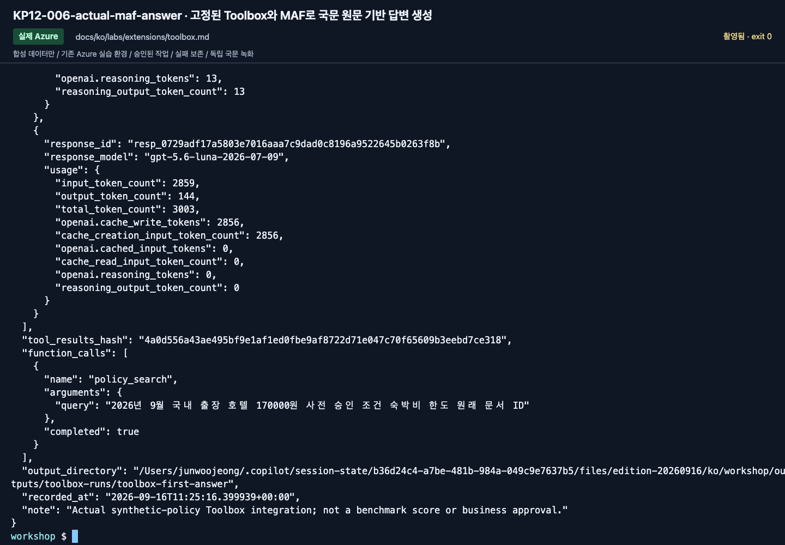

# 관리형 Toolbox: 합성 정책 도구 하나와 고정 버전 하나

[English](../../../labs/extensions/toolbox.md) | **한국어**

**B 확장.** Toolbox는 재사용 도구를 제공하는 관리형 MCP endpoint입니다.
첫 실습은 Search에 적재한 동봉 정책 6개만 읽습니다. Work IQ, 회사 API, 공개 웹,
임의의 MCP 서버를 연결하지 않습니다.

**첫 회차:** 1–5절 후 7절의 인계·정리로 끝냅니다. 6절의 default 버전 변경은 선택입니다.

**준비:** [Lab 06 Search](../06-knowledge.md), 같은 B 환경의 [Hosted/Toolbox SDK extra](developer-toolkit.md#hosted-sdk), 키 없는 Search 프로젝트 연결, 내 Toolbox 생성 승인.
**완료:** 고정 버전의 MAF 요청에 실제 도구 결과·모델 응답·버전 근거가 있음.
**중단:** 오류를 보존하고 담당자에게 돌아갑니다. 다른 provider로 교체하지 않습니다.

## 1. 담당자에게 두 값을 받기

기존 `.env`의 프로젝트·모델·Search 설정을 유지하고 추가합니다.

```dotenv
TOOLBOX_SEARCH_CONNECTION_NAME=<실제-keyless-Search-프로젝트-연결>
TOOLBOX_NAME=<내-prefix>-tools-ko
```

연결 대상은 같은 `AZURE_SEARCH_ENDPOINT`, 도구의 index는 같은 `AZURE_SEARCH_INDEX_NAME`이어야 합니다.
연결 이름은 index, IQ base, File Search store의 이름이 아닙니다.

연결·권한 생성은 별도 승인 작업입니다. 영문 실험에서는 **프로젝트 관리 ID**의 기존
Search Index Data Reader에 Search Service Contributor가 추가로 필요했습니다.
account ID에 contributor 역할만 주는 시도는 해결하지 못했고 그 시험 권한은 제거했습니다.
Search Service Contributor는 **읽기 전용 역할이 아니므로**, 합성 실습 전용 서비스에만 담당자가 제한적으로 부여합니다.
API key는 사용하지 않습니다. 로컬 사용자, Hosted ID, native 도구의 upstream ID,
[IQ chat에서 사용하는 Search ID](../../reference/iq-model-identity.md)를 혼동하지 않습니다.

## 2. 실제 계획 확인

```bash
python scripts/workshop.py --language ko toolbox plan
```

내 프로젝트·이름과 `policy_search`, `azure_ai_search`, `simple`, `top_k: 6`을 확인합니다.
생성 시 논리적 연결 이름을 **실제 전체 프로젝트 연결 resource ID**로 해석해 기록합니다.
raw `project_connection_id`에 이름만 넣고 같은 동작이라고 가정하지 않습니다.
`azure_requests_sent: false`는 계획일 뿐 실행 성공이 아닙니다.

## 3. 첫 버전 생성

```bash
python scripts/workshop.py --language ko toolbox create --confirm-create
```

`selected_version`, `default_version`, 버전별 endpoint, `definition_hash`, ledger를 보관합니다.
기존 이름은 가져오거나 덮어쓰지 않고 거부합니다.
소유 기록은 `outputs/toolboxes/<name>/ownership.json`입니다.

같은 터미널에서 반환된 버전을 입력합니다.

```bash
printf '생성 결과의 selected_version: '
read -r TOOLBOX_VERSION
python scripts/workshop.py --language ko toolbox inspect --version "$TOOLBOX_VERSION"
```

버전 없는 endpoint는 현재 default를 따라갑니다. 이 실습은 **버전별 endpoint**를 호출합니다.
Toolbox 버전은 불변이지만 연결과 Search index의 내용은 바뀔 수 있습니다.
비교 중에는 함께 고정하고 실제 도구 응답을 보존합니다.

## 4. MCP 연결과 실제 검색을 따로 확인

```bash
python scripts/workshop.py --language ko toolbox probe --version "$TOOLBOX_VERSION" --label toolbox-first-list
```

목록에 `policy_search`가 있어야 합니다. 이때 `model_invoked: false`,
`tool_invoked: false`는 정상입니다. `binding.json`, `tool-list.json`, `summary.json`을 확인합니다.
실패해도 Lab 04의 로컬 MCP나 API key로 우회하지 않습니다.

모델 비용을 쓰기 전에 upstream Search를 직접 확인합니다.

```bash
python scripts/workshop.py --language ko toolbox query --version "$TOOLBOX_VERSION" --label toolbox-direct-query --confirm-cost
```

`tool_invoked: true`, `model_invoked: false`가 기준입니다.
도구 발견 성공과 Search 데이터 접근 성공은 다릅니다.
권한 문제에는 원래 실패를 남기고 실제 주체의 범위만 수정합니다. 알려진 권한 오류에 모델 호출을 반복하지 않습니다.

## 5. 실제 MAF 요청 한 번

```bash
python scripts/workshop.py --language ko toolbox ask --version "$TOOLBOX_VERSION" --label toolbox-first-answer --confirm-cost
```

동봉한 2026년 9월 한도 초과 숙박 질문을 사용합니다.
설치된 `FoundryToolbox` wrapper로 인증하며 임의의 모사 서버를 만들지 않습니다.

**확인:** 실제 모델/도구 호출, 정확한 버전/hash, 서비스 response ID,
`tool-results.json`의 정책 ID·적용 날짜·사전 승인 조건입니다.
도구가 실패했는데 모델만 유창하게 답한 결과는 거부합니다.
승인이 필요하다는 설명은 예약·지급·실제 승인을 실행했다는 뜻이 아닙니다.

논리 모델 호출 6회와 180초 제한이 있으나 SDK/service 사용량까지 포함한 화폐 상한은 아닙니다.
새 요청에는 새 label을 사용합니다. 촬영을 위해 성공한 유료 요청을 반복하지 않습니다.

<!-- edition-checkpoint:KP12-006-actual-maf-answer -->



**확인할 것:** 고정 버전의 실제 MAF 요청이 policy 도구를 사용했습니다. 유창한 답변뿐 아니라 원래 모델·도구 ID와 정책 인용을 확인합니다. 내 리소스 이름과 ID는 영상과 다릅니다.

[이 동작 영상 보기](https://github.com/user-attachments/assets/126a7406-b8ff-4d9f-9b3d-1780b9fad328#t=68.48) · [전체 액션과 실패](../../edition-actions.md)

## 6. 통제된 버전 변경

<details>
<summary>선택 버전 실습 — 첫 실제 답변 확인 뒤에 반드시 할 단계가 아닙니다</summary>

설명만 바꾸는 새 버전을 생성합니다. 품질 개선을 주장하는 단계가 아닙니다.

```bash
python scripts/workshop.py --language ko toolbox add-version --confirm-create
```

```bash
printf '새 selected_version: '
read -r TOOLBOX_CANDIDATE
python scripts/workshop.py --language ko toolbox probe --version "$TOOLBOX_CANDIDATE" --label toolbox-candidate-list
```

Probe 성공과 반환된 binding·도구 목록을 확인한 뒤 변경 승인을 받습니다.

```bash
python scripts/workshop.py --language ko toolbox select --version "$TOOLBOX_CANDIDATE" --confirm-update
```

반환된 default 버전을 확인한 뒤 원래 버전으로 복구합니다.

```bash
python scripts/workshop.py --language ko toolbox select --version "$TOOLBOX_VERSION" --confirm-update
```

마지막 명령은 원래 버전으로의 명시적 rollback입니다. 변경 승인과 소유 기록이 필요합니다.
default 변경은 agent 재배포가 아니며, 이미 고정한 요청의 버전도 바뀌지 않습니다.

</details>

## 7. 인계 또는 정리

Skills 또는 Hosted Toolbox로 계속 가면 Toolbox와 ledger를 유지합니다.
선택 버전·다음 모듈을 `session-notes.txt`에 적고 먼저 cleanup을 실행하지 않습니다.
끝내면 다른 승인된 agent가 참조하지 않는지 확인한 후 내 Toolbox만 삭제합니다.

```bash
python scripts/workshop.py --language ko toolbox cleanup --confirm-delete
```

원격 버전 집합과 소유 기록이 다르면 삭제를 거부합니다.
Search 연결·index·서비스·모델·프로젝트는 삭제하지 않고 결과/정리 기록을 보존합니다.

| 증상 | 확인할 것 |
|---|---|
| 연결 누락·불일치 | keyless CognitiveSearch 연결과 같은 Search 대상 |
| 403 | 실제 호출 ID와 리소스 범위, 로컬 로그인과 런타임 권한의 차이 |
| 이름·default 충돌 | 다른 소유자의 변경을 검토하고 임의 삭제하지 않기 |
| MCP 오류 | 원래 failure와 raw 결과 보존, provider/endpoint 우회 금지 |
| 도구를 사용하지 않은 답변 | 요청·도구 설명을 확인하고 완료로 계산하지 않기 |

**다음:** [같은 Toolbox의 Hosted 실행](toolbox-hosted.md), [C 모듈](../../paths/c-advanced.md), [Lab 11](../11-capstone.md).
[Toolbox 수명 주기](https://learn.microsoft.com/azure/foundry/agents/how-to/tools/toolbox) ·
[MAF wrapper](https://learn.microsoft.com/agent-framework/integrations/by-component/tools/foundry-toolbox).
