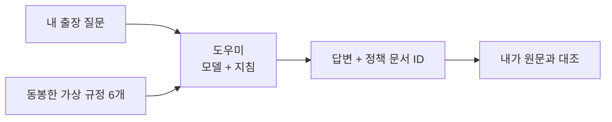

# A. 입문: Python을 작성하지 않고 근거 있는 에이전트 하나 만들기

[English](../../paths/a-beginner.md) | **한국어**

**본인 에이전트·6문항 평가표·workflow 검토 한 건·trace 상태·정리 인계를 남깁니다.**
아래 표의 A 구간만 따라갑니다. 270분 수업 계획은 환경·권한·설치가 이미 준비된 상태를 기준으로 하며 학습자 완료 시간의 실측값이 아닙니다.

## 무엇을 만드는지 먼저 이해하기

누군가 **“2026년 9월 국내 출장 숙박비는 1박 얼마까지인가요?”**라고 묻는 상황입니다.
가상 기업 한빛기술의 규정을 도우미에게 주고, 그 문서에 근거해 답하며 어떤 규정을 썼는지 보여 주게 만듭니다.
근거가 없을 때는 모른다고 설명해야 합니다. 출장을 승인하거나 예약하는 도우미는 아닙니다.
Python을 직접 작성하거나 참고 문서를 미리 외울 필요는 없습니다.

| 앞으로 나올 말 | 이 실습에서의 뜻 |
|---|---|
| Foundry / 프로젝트 | Azure의 AI 개발 플랫폼 / 그 안에 준비된 내 작업 공간 |
| 모델 / 배포 | 답변을 만드는 엔진 / 그 엔진을 호출할 이름. 준비된 `gpt-6-sol`을 사용 |
| 에이전트 | 모델에 지침·근거·허용 도구를 설정한 나의 도우미 |
| 지침(Instructions) | 질문 자체가 아니라 매 질문에서 지켜야 할 규칙 |
| 근거 기반 답변 / 인용 | 제공한 자료에 맞춰 답하기 / `TRAVEL-2026`처럼 그 근거를 표시하기 |
| 저장 버전 | 에이전트 설정을 번호로 구분해 보관한 것. 지침을 저장해도 새 모델을 학습시키는 것은 아님 |

**첫 목표는 Lab 00–03입니다.** 정확한 프로젝트를 열고, 규정을 주기 전 모델의 답변을 본 뒤,
규정을 넣은 에이전트를 저장해 네 답변을 확인합니다. 틀린 답변이 있어도 지침과 실제 관찰을 보관합니다.
이는 **A 전체 완료가 아닙니다.** Lab 05–11에서 workflow·원문 검토·6문항 평가·정리 인계까지 이어집니다.
아래 순서를 따라가며 Lab 03으로 바로 건너뛰지 않습니다.

## 먼저 준비하기

[준비](../setup.md)에서 국문 학습자 ZIP을 받은 뒤 담당자의 값을 기록합니다.
**혼자 학습하나요?** 본인이 담당자이기도 하므로 먼저 [혼자 학습 준비](../setup-owner.md#self-study)를 완료합니다.
`START-HERE.txt`를 엽니다. 준비된 **gpt-6-sol** 배포와 ZIP의 완성 지침·질문·빈 기록 양식을 사용합니다.
입력 파일이나 보고서 형식을 따로 만들지 않습니다.
Lab 05에서는 준비된 방식 하나를 실행합니다. 기본은 워크숍 코드가 설치되고 본인 계정으로 Azure에 로그인한 터미널입니다.
Hosted Responses Playground는 수업 전에 담당자가 검증한 경우에만 사용합니다.
둘 다 없다면 시간표를 시작하기 전에 [Lab 00 B](../labs/00-start.md#path-b)와 [Lab 02 B](../labs/02-models.md#path-b)를 완료한 뒤,
Lab 03 B가 아니라 **아래 표의 1단계(Lab 00 A)**로 돌아갑니다.

**첫 회차의 선택은 정해져 있습니다:** 지침에 정책 6개를 직접 넣고(**인라인**), 준비된 workflow를 한 번 실행합니다.
연습용 질문 6개(**dev**)를 직접 평가하고, Lab 09에서 요청 실행 이력(**trace**)의 확인 상태를 적습니다.
File Search·IQ Chat·Hosted 배포·cloud judge·C 모듈은 별도로 선택하지 않는 한 **미선택**입니다.
아래 번호 링크는 A의 정확한 구간을 열며, 각 랩에서 **A 완료** 링크로 나갑니다.

## 어느 화면에서 작업하는지 구분하기

이 가이드와 Foundry 포털을 브라우저의 서로 다른 탭에 열고, 옆에 개인 파일을 엽니다.

| 작업할 곳 | 여기서 하는 일 | 여기에 넣지 않을 것 |
|---|---|---|
| GitHub의 이 가이드 | 다음 A 단계와 예상 결과 읽기 | 내 답변이나 인증정보 |
| Foundry 포털 `ai.azure.com` | **지침(Instructions)**에 지침 파일 전체 붙여넣기. **에이전트에 메시지 보내기...**에는 질문만 전송 | 터미널 명령이나 평가 기준표 |
| 압축을 푼 학습자 폴더의 텍스트·스프레드시트 편집기 | `session-notes.txt`에 관찰, `workflow-review.txt`에 검토, 나중에 `assessment-baseline.csv`에 답변 저장 | 다른 사람의 결과. ZIP 미리보기 안에서 편집하지 않음 |
| Lab 05의 준비된 터미널 | 제공된 workflow 명령 하나를 복사해 실행하고 저장 결과 확인 | 지침이나 질문 문장을 명령처럼 붙여넣기 |

**매 랩은 읽기 → 실행 → 확인 → 저장 → A 완료 링크 순서입니다.** 스크린샷은 조작 위치를 찾는 참고이지 복사할 정답이 아닙니다.
내 답변의 문장이 예시와 달라도 금액·날짜·근거·승인 조건으로 판단합니다. 같은 문장일 필요는 없습니다.
**응답이 없거나 오류가 난 것과 잘못된 답변은 다릅니다.** 오류를 보존하고 해당 랩의 **막히면** 안내를 따릅니다.
A와 공통 시작 카드만 읽고, 접힌 **선택** 항목이나 B·C까지 추가로 실행하지 않습니다.
아직 낯선 말은 [용어 사전](../reference/glossary.md)에서 확인한 뒤 같은 단계로 돌아옵니다.

## 진행 순서

| 순서 | 열고 실행할 곳 | 여기까지 확인하면 다음으로 |
|---|---|---|
| 1 | [Lab 00 A](../labs/00-start.md#path-a): 계정·프로젝트·파일 | `session-notes.txt`의 설정 카드가 채워짐 |
| 2 | [Lab 01 A](../labs/01-foundry.md#path-a): account/project/deployment/agent 구분 | 네 객체의 관계 그림과 실제 endpoint 추가 |
| 3 | [Lab 02 A](../labs/02-models.md#path-a): Playground | 실제 답변과 근거 부족 관찰을 `session-notes.txt`에 기록 |
| 4 | [Lab 03 A](../labs/03-prompt-agent.md#path-a): 전체 지침 붙여넣기·저장 | `instructions-baseline.txt` 저장. `session-notes.txt`에 해당 에이전트/버전·실제 확인 4건 연결 |
| 5 | [Lab 05 A](../labs/05-workflows.md#path-a): 준비된 순차 터미널 명령 하나. Hosted Playground는 담당자가 사전 선택한 경우에만 | `workflow-review.txt`에 실행 방식, 실제 출력/ID 전체와 내 검토가 있음 |
| 6 | [Lab 06 A](../labs/06-knowledge.md#path-a): 정책 ID·날짜 확인 | `session-notes.txt`에 원문 확인 기록. 기본 경로는 IQ Chat 미선택 |
| 7 | [Lab 07 A](../labs/07-evaluation.md#path-a): 저장한 버전 하나로 dev 6문항 평가 | `assessment-baseline.csv`에 실제 응답·인용·이유 6건. `session-notes.txt`에 버전·통과 수 / 6 기록. Candidate는 정당한 변경이 있을 때만 |
| 8 | [Lab 09 A](../labs/09-operations.md#path-a): 운영과 trace 확인 | `operations-checklist.txt`에 소유 자산, 잔여 비용, 실제 trace 근거 또는 `추적 미확인: <이유>`가 있음 |
| 9 | [Lab 11 A](../labs/11-capstone.md#path-a): 인계 | 근거 폴더와 정리 책임자가 명확함 |

**합계:** 휴식·진행 버퍼 포함 270분입니다. A 아래에 B/C 설명이 있어도 계속 따라가지 않습니다.
Preview 승인, 새 인프라, SDK 설치 대기는 별도입니다.

## A에서 하지 않는 일

Toolbox 생성, Hosted 배포, workflow 작성, Optimizer 실행, 회사/Microsoft 365 데이터 접근은 요구하지 않습니다.
준비된 Toolbox 시연을 보더라도 본인이 생성·실행한 증거로 기록하지 않습니다.

브라우저 에이전트의 지침, 업로드 파일, IQ base, Toolbox, Memory는 서로 다른 자산입니다.
도구·인용·유창한 문장이 있다는 이유만으로 답변이 옳다고 판단하지 않습니다.

## 막히면

계정·모델·권한 문제는 담당자와 [설정 카드](../setup.md)부터 확인합니다. 혼자 학습하면 해당하는
[혼자 학습 준비 단계](../setup-owner.md#self-study)를 직접 해결합니다.
잘못된 답변도 평가표에 남깁니다. 실제 답변 6개를 검토했다면 실패가 있어도 평가는 완료할 수 있습니다.
응답 누락·요청 오류·버전 혼합은 **평가 미완료**입니다. 파일을 보존하고 `session-notes.txt`에 이유를 적은 뒤,
[Lab 09 A](../labs/09-operations.md#path-a)와 [Lab 11 A](../labs/11-capstone.md#path-a)에서 운영·인계를 진행합니다.
다른 사람의 결과, fixture, 녹화 속 답변으로 교체하지 않습니다.
선택 기능이 없으면 **미실행**으로 남기고, trace가 없으면 `추적 미확인: <이유>`로 남깁니다.

**중단·재개:** `session-notes.txt`에 마지막 완료 Lab/단계·에이전트 버전·다음 링크를 적습니다.
같은 프로젝트와 저장한 버전을 다시 열고, 새 유료 질문을 보내기 전에 기존 결과부터 확인합니다.
재개하려고 에이전트를 다시 만들거나 앞 랩을 전부 반복하지 않습니다.

**완료:** [Lab 11 인계](../labs/11-capstone.md#path-a).
**나중에 확장:** [B. 구현](b-practitioner.md)의 [Lab 00 B 소스 폴더 준비](../labs/00-start.md#source-folder)부터 시작합니다.
A의 작은 학습자 ZIP은 코드 저장소가 아닙니다. 준비된 소스 복사본이 이미 있다면 그대로 유지합니다.
