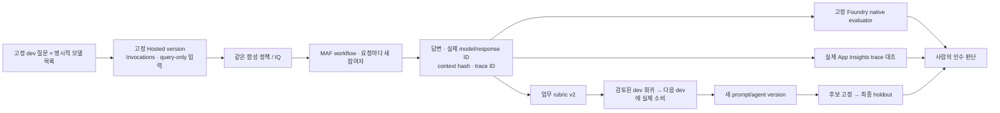

# Hosted 워크플로 평가·학습 루프 워크북

[English](../../reference/evaluation-workbook.md) | **한국어**

**호환성 확인 2026-09-15 · 경험자 심화 150–180분, 환경 준비·서비스 대기 별도.**
**현재 근거:** 이 워크북은 `gpt-6-sol`로 다시 실행하지 않았습니다. 마지막 실제 결과(2026-09-15, 이전 `gpt-5.6-luna` 판)는
끝에 요약했습니다. 이 preset의 Hosted matrix 결과를 주장하기 전에 직접 실행합니다.
이 저장소의 코드·지식·데이터만 사용하며 별도 평가 저장소는 필요 없습니다.
아래 숫자는 실험의 규모이지 모든 모델이 통과한다는 약속이 아닙니다.
국문은 기본값인 국문 번들(지침·corpus·dev/calibration/holdout)을 사용합니다. 영문 번들은 따로 고정되어 있으므로
두 언어 데이터 세트를 지침만 다른 실험처럼 비교하지 않습니다.

**첫 회차:** 순차 workflow·GA IQ·account Chat Completions·Invocations·준비된 명시적 모델 목록입니다.
2–10절을 한 번씩 진행하며 기본 명령은 검토된 회귀가 있다고 가정하지 않습니다.
블록 하나 실행 → 결과 확인 → 다음 블록 순서로 진행하고 문서 전체를 터미널에 붙이지 않습니다.
소스 명령은 저장소 루트에 두고 별도 azd 폴더는 셸 이동이 아니라 명시적 인자로 선택합니다.

## 1. 무엇이 기본 평가보다 깊어지는가

기존 `collect/evaluate`는 프로젝트 Responses의 답을 검사합니다.
이 워크북은 **정확한 Hosted version이 실제로 생성한 답**을 모델별로 수집합니다.
두 경로의 점수는 서로 대신할 수 없습니다.



| 항목 | v2 워크북의 계약 |
|---|---|
| 모델 | `WORKSHOP_MODEL_DEPLOYMENTS_JSON`의 1–8개 실제 배포. 같은 배포를 여러 모델로 중복 집계하지 않음 |
| 기본 사례 | 번들 dev 6개 / holdout 4개. 원본 질문·정답 파일을 바꾸지 않음 |
| 4개 모델 선택 | baseline 24행 + candidate 24행 + final 16행 = 64행 |
| 실제 모델 호출 수 | 순차 workflow는 행당 논리 호출 3회, concurrent/group-chat는 최종 reviewer 포함 4회. retries·검색·judge는 별도 |
| 실행 격리 | 하나의 고정-version compute session을 재사용해도 각 요청은 새 MAF 참여자/대화 상태로 실행 |
| 에이전트 입력 | `question`, `model_key`, `case_id`, `run_id` 네 필드만. 정답·rubric·holdout 파일은 전달하지 않음 |
| 실패 | HTTP/JSON/계약 오류를 행으로 보존. 누락·중복 matrix나 수집 중단의 성공 prefix는 평가하지 않음 |
| 인수 | 업무 검사·native 실행/품질·trace·calibration을 따로 판단. CLI 합격은 운영 배포 승인이 아님 |

<a id="matrix-setup"></a>

## 2. 강사 준비와 명시적 모델 목록

새로운 v2 복사본을 **다른 azd 프로젝트의 하위가 아닌 독립된 폴더**에 준비합니다.
단일 에이전트 실습의 `.azure`나 원격 version을 묵시적으로 재사용하지 않습니다.
[Lab 00](../labs/00-start.md)의 설치·인증, [Lab 06](../labs/06-knowledge.md)의 IQ 준비를 먼저 마칩니다.
[Hosted SDK](../labs/extensions/developer-toolkit.md#hosted-sdk)와
[azd 확인](../labs/extensions/developer-toolkit.md#azd-check)도 완료합니다. B의 패키징만으로는 설치되지 않습니다.
이 소스 복사본의 합성 Search 소유권 ledger를 보관합니다.

`.env`에서 실제 값을 입력합니다. 네 개 모두 준비되지 않았다면 목록을 명시적으로 줄이고
실제 행 수를 기록합니다. 하나가 실패했다고 수집기가 다른 모델로 바꾸지는 않습니다.

```dotenv
# 모든 <...>를 강사가 확인한 실제 값으로 바꿉니다.
AZURE_AI_MODEL_DEPLOYMENT_NAME=<model-a-deployment>
WORKSHOP_MODEL_DEPLOYMENTS_JSON={"a":"<model-a-deployment>","b":"<model-b-deployment>","c":"<model-c-deployment>","d":"<model-d-deployment>"}
AZURE_OPENAI_ENDPOINT=https://<same-foundry-account>.openai.azure.com
AZURE_AI_EVALUATION_MODEL_DEPLOYMENT_NAME=<separate-judge-deployment>
WORKSHOP_HOSTED_AGENT_NAME=<unique-mfv2-agent-name>
AZURE_APPLICATION_INSIGHTS_APP_ID=<connected-application-insights-app-id>
# 작은 합성 corpus의 명시적 recall 설정. 평가 기준이 아니라 검색 필터입니다.
WORKSHOP_IQ_RERANKER_THRESHOLD=0
```

account endpoint는 프로젝트와 **동일한 Foundry account**에 속해야 합니다.
첫 영문 dev 실행은 기본 IQ reranker 필터가 범위 정책을 빠뜨려 20/24 결과를 유지했습니다.
수정된 쌍에서는 로컬·배포 구성에서 같은 recall 설정을 명시적으로 선택합니다.
그 원래 cohort를 보존하고, 서로 다른 검색 구성을 prompt만 바꾼 효과로 비교하지 않습니다.
이 워크북의 예시는 명시적인 `account-chat` 경로를 사용합니다.
다른 API를 선택하려면 패키지·serve·smoke·plan·collect의 `--api`를 **모두** 바꾼 독립 실험으로 시작합니다.
실패 후 자동 전환하는 옵션이 아닙니다.

| 경로 | 방식 | 계약 |
|---|---|---|
| `project-responses` | AIProjectClient의 프로젝트 Responses | 기본 입문 경로 |
| `account-chat` | 같은 프로젝트 SDK에 명시적 account base URL·AAD token provider, MAF Chat Completions | 서로 다른 모델의 API 지원을 강사가 확인한 경우 |

Pipeline의 JSON은 프롬프트로 요청한 뒤 Python에서 엄격히 검사합니다.
서비스가 강제한 Structured Outputs라고 표현하지 않습니다.
이 문서는 특정 신형 모델 네 개의 quota·지역·권한·성공을 보장하지 않습니다.

## 3. V1 워크플로를 패키징하고 바인딩

```bash
python scripts/workshop.py runtime-contract --kind workflow --pattern sequential --retrieval iq --prompt v1 --api account-chat --protocol invocations
python scripts/package_hosted.py --kind workflow --pattern sequential --retrieval iq --prompt v1 --api account-chat --protocol invocations
```

생성 폴더는 `.build/workflow-sequential-iq-v1-account-chat-invocations/`입니다.
`runtime-profile.json`에 실행 방식을 고정하고, `package-manifest.json`에서 파일 hash를 확인합니다.
평가 데이터·정답·calibration·개인 `.env`는 포함하지 않습니다.

**소스 저장소와 모든 기존 azd 프로젝트 밖의 새 빈 절대 경로**를 준비합니다.
도우미가 검증한 패키지·완성된 단일 agent manifest·로컬 azd 상태를 만듭니다.
Provision·배포·역할 부여는 하지 않으며 template 선택이나 YAML/env 수동 병합도 필요 없습니다.

```bash
printf '위에서 출력된 V1 패키지의 절대 경로: '
read -r HOSTED_PACKAGE
printf '새 빈 V1 azd 폴더의 절대 경로: '
read -r HOSTED_DIRECTORY
printf '.env의 WORKSHOP_HOSTED_AGENT_NAME과 같은 이름: '
read -r HOSTED_AGENT_NAME
printf '담당자가 제공한 실제 프로젝트 ARM ID: '
read -r PROJECT_ARM_ID
printf '실제 프로젝트 location 코드: '
read -r PROJECT_LOCATION
python scripts/prepare_hosted_azd.py --language ko --kind matrix \
  --package "$HOSTED_PACKAGE" --directory "$HOSTED_DIRECTORY" \
  --agent-name "$HOSTED_AGENT_NAME" --initialize-env \
  --project-id "$PROJECT_ARM_ID" --location "$PROJECT_LOCATION"
```

반환된 `azure.yaml`을 엽니다. 기존 프로젝트 하나·의도한 agent 하나·복사한 패키지,
Python 3.13/`main.py`·Invocations 1.0.0을 확인합니다.
`env`의 프로젝트/account endpoint·모델 목록·Search index/source/base·reranker 필터·출력 상한이
`.env`와 같아야 하며 원격 인증은 `managed-identity`입니다.
새 모델 배포 목록·evaluator 설정·비밀·정답 파일은 없어야 합니다.
두 폴더 경로·서비스 이름·실제 프로젝트 값을 `session-notes.txt`에 기록합니다.

실제 코드 호출은 기존 프로젝트·배포만 사용합니다. 역할은 사용자와 **배포된 agent instance identity**에
각각 필요한 범위를 부여합니다. account-chat에는 해당 account의 모델 추론 권한, IQ에는 Search
읽기 권한이 필요합니다. 역할 생성이나 구독 변경을 수집기에서 자동 수행하지 않습니다.
준비가 실패하면 폴더·오류를 보존하고 원인 해결 뒤 새 빈 폴더를 사용합니다.
`--kind matrix`는 이 순차 IQ/account-chat/Invocations v1/v2만 받습니다.
입문 `runtime`·단일 모델 CI `workflow`를 대체 경로로 쓰지 않습니다.
**9월 17일 준비 개정:** manifest·범위 지정 명령은 로컬에서 확인합니다.
9월 15일 녹화가 이 새 준비 순서를 검증한 것은 아닙니다.

## 4. 로컬과 원격 smoke를 구분

**로컬 smoke에는 `--azd-directory`가 필수입니다.** 생략하면 smoke 근거 생성이나 azd 호출 전에 거절하며
소스 복사본의 과거 `.azure` 상태를 자동 선택하지 않습니다. 원격 smoke는 기존처럼 정확한 endpoint·version 설정을 사용합니다.

터미널 A:

```bash
source .venv/bin/activate
python scripts/workshop.py serve --kind workflow --pattern sequential --retrieval iq --prompt v1 --api account-chat --protocol invocations
```

터미널 B도 같은 소스 루트·활성 `.venv`를 사용합니다.

```bash
printf '3절에서 준비한 독립 V1 azd 폴더: '
read -r HOSTED_DIRECTORY
curl --fail http://127.0.0.1:8088/readiness &&
python scripts/workshop.py benchmark smoke --local --azd-directory "${HOSTED_DIRECTORY:?Use the prepared V1 directory}" --label smoke-v1-local --kind workflow --pattern sequential --retrieval iq --prompt v1 --api account-chat --case D01 --model-key a --confirm-cost
```

readiness는 `{"status":"healthy"}`입니다. 이것만으로 추론 성공은 아닙니다.
실제 답·model/response ID·context hash까지 확인해야 smoke가 완료됩니다.
`azd`의 raw HTTP 본문은 UTF-8 **바이트 길이**로 파싱하며, 알려진 업데이트 안내만 별도 보존합니다.
오류 뒤의 임의 JSON을 성공 응답으로 추출하지 않습니다.

터미널 A의 서버를 `Ctrl+C`로 종료하고 3절의 값이 남아 있는 그 터미널로 돌아옵니다.
환경 담당자가 배포와 비용을 승인한 뒤 독립 폴더의 명시된 서비스만 배포합니다.

```bash
azd deploy "${HOSTED_AGENT_NAME:?Use the prepared agent service name}" --cwd "${HOSTED_DIRECTORY:?Use the prepared standalone directory}" &&
azd ai agent show --cwd "${HOSTED_DIRECTORY:?Use the prepared standalone directory}" --output json
```

반환된 실제 `name`, `version`, **Invocations endpoint 전체**를 `.env`의
`WORKSHOP_HOSTED_AGENT_NAME`, `WORKSHOP_HOSTED_AGENT_VERSION`, `WORKSHOP_HOSTED_AGENT_ENDPOINT`에 입력합니다.
`latest`, 추측한 URL, 다른 프로젝트 endpoint는 거부합니다.
배포 오류 뒤에 이전 active version을 대신 사용하지 않습니다.
로컬 smoke 근거는 소스 복사본의 `outputs/smoke/smoke-v1-local/`에 남습니다.
원격 smoke는 `.env`의 정확한 endpoint/버전을 사용하므로 `--azd-directory`를 붙이지 않습니다.

```bash
python scripts/workshop.py benchmark smoke --label smoke-v1-remote --kind workflow --pattern sequential --retrieval iq --prompt v1 --api account-chat --case D01 --model-key a --confirm-cost
```

## 5. 모든 모델의 baseline

```bash
python scripts/workshop.py benchmark plan --kind workflow --pattern sequential --retrieval iq --prompt v1 --api account-chat
```

계획의 모델 목록·행 수·비용 범위를 확인한 뒤 수집합니다.

```bash
python scripts/workshop.py benchmark collect --label wf-baseline --kind workflow --pattern sequential --retrieval iq --prompt v1 --api account-chat --concurrency 1 --confirm-cost
```

유료 judge job 전에 전체 수집과 오류를 읽습니다.
부분 수집을 평가하거나 0이 아닌 수집 종료 코드를 무시하지 않습니다.

```bash
python scripts/workshop.py benchmark evaluate --label wf-baseline --confirm-cost
```

저장된 job 완료 후 로컬 보고서를 만듭니다.

```bash
python scripts/workshop.py benchmark report --label wf-baseline
```

`outputs/benchmarks/wf-baseline/`에 frozen dataset/corpus, manifest, 모든 응답,
원시 HTTP, 업무 검사, evaluator catalog/run/output, HTML 보고서가 남습니다.
4개 모델이면 **24행**이어야 합니다. 병렬도가 필요하면 `--concurrency 2` 또는 `4`를 사전에 선택하고
전후 실험과 holdout에서 같은 값을 유지합니다. 기본은 비용/읽기 편의를 위해 1입니다.

업무 rubric v2는 기존 schema·판단·한도·인용 외에 **본문의 해당 금액과 관련 있는 인용**을 검사합니다.
모델별 6/6을 기본 gate로 사용하며, 누락/오류는 분모에 남습니다.
성공한 요청의 p50/p95만 따로 표시하고 미측정 토큰·지연은 `None`입니다.
작은 집합의 Wilson 구간은 불확실성을 설명하는 참고이며 운영 SLA나 통계적 모델 우열이 아닙니다.

Native 평가는 **이미 생성한 Hosted 답변 데이터**를 평가합니다. target을 다시 호출하는 agent-target
평가와 다릅니다. `groundedness`/`relevance`의 실제 점수와 pass를 업무 검사와 분리해 봅니다.
실행 오류가 난 native 시도만 `--retry-failed`로 다시 요청할 수 있고 원본 시도·고정 catalog를 보존합니다.
완료된 낮은 점수만을 이유로 같은 명령을 재시도해 점수를 고를 수 없습니다.

## 6. 실제 trace와 dev 회귀 자산

```bash
python scripts/workshop.py benchmark trace-plan --label wf-baseline
python scripts/workshop.py benchmark monitor --label wf-baseline
```

첫 명령은 KQL만 작성합니다. 두 번째는 쿼리를 표시하고 지정된 App Insights를 **실제 조회**합니다.
`requests`에서 agent 이름과 시간·정확한 trace ID 집합을 제한하며 누락·중복·다른 trace를 거부합니다.
단순히 응답에 trace ID가 있다는 사실과 export를 실제 확인한 것은 다릅니다.

<details>
<summary>선택 회귀 검토 — baseline 전부 통과 시 생략하며 실패 행을 만들지 않습니다</summary>

사람이 **실제 실패한 dev 행**을 검토했을 때만 실행합니다.
그 행의 `model-key-case-ID`, 본인 reviewer label·구체적 이유를 입력합니다. 다른 사람의 검토를 복사하지 않습니다.

```bash
printf 'Actual failed dev row ID: '
read -r FAILED_ROW
printf 'Your reviewer label: '
read -r REVIEWER
printf 'Your specific review reason (at least 15 characters): '
read -r REVIEW_REASON
python scripts/workshop.py benchmark regression --label wf-baseline --row-id "$FAILED_ROW" --regression-label approval-reviewed --reviewer "$REVIEWER" --reason "$REVIEW_REASON" --confirm-review
```

원본의 질문·정답·source response/trace/context hash를 그대로 보존합니다.
새로운 질문이나 정답 변경은 별도 dataset version이 필요하므로 이 명령으로 섞지 않습니다.
`reviewer`는 CLI 입력 기록이며 Entra로 검증한 승인자나 운영 배포 승인이 아닙니다.

</details>

## 7. V2와 같은 dev를 다시 실행

v1/v2를 비교하고 개선 이유를 설명합니다. 실패와 관계없는 변경을 강요하지 않습니다.

```bash
python scripts/package_hosted.py --kind workflow --pattern sequential --retrieval iq --prompt v2 --api account-chat --protocol invocations
```

**같은 원격 agent/서비스 이름**·프로젝트·모델 목록·검색·코드를 유지합니다.
반환된 V2 패키지를 **새 빈 독립 폴더**에 준비해 V1 폴더·패키지를 보존합니다.
복사한 V1 패키지를 편집하거나 반복 초기화로 `-2` 이름의 agent를 만들지 않습니다.

```bash
printf '위에서 출력된 V2 패키지의 절대 경로: '
read -r HOSTED_PACKAGE
printf '새 빈 V2 azd 폴더의 절대 경로: '
read -r HOSTED_DIRECTORY
python scripts/prepare_hosted_azd.py --language ko --kind matrix \
  --package "$HOSTED_PACKAGE" --directory "$HOSTED_DIRECTORY" \
  --agent-name "${HOSTED_AGENT_NAME:?Restore the same agent name from step 3}" --initialize-env \
  --project-id "${PROJECT_ARM_ID:?Restore the actual project ID from step 3}" \
  --location "${PROJECT_LOCATION:?Restore the project location from step 3}"
```

같은 런타임 값과 V2 프로필을 확인한 뒤 별도 승인된 배포를 진행합니다.

```bash
azd deploy "${HOSTED_AGENT_NAME:?Use the same agent service name}" --cwd "${HOSTED_DIRECTORY:?Use the prepared V2 directory}" &&
azd ai agent show --cwd "${HOSTED_DIRECTORY:?Use the prepared V2 directory}" --output json
```

실제 새 version/endpoint를 `.env`에 기록합니다.
아래 명령의 기본값에는 회귀 의존성이 없습니다. **6절에서 본인의 검토 기록을 만든 경우만**
실행 전에 `--regressions approval-reviewed`를 추가하고 이름이 다르면 실제 label을 사용합니다.

```bash
python scripts/workshop.py benchmark collect --label wf-candidate --kind workflow --pattern sequential --retrieval iq --prompt v2 --api account-chat --concurrency 1 --confirm-cost
```

전체 행을 읽고 다음 유료 judge 전에 고정 설정을 로컬에서 비교합니다.

```bash
python scripts/workshop.py benchmark compare --baseline wf-baseline --candidate wf-candidate
```

비교에서 선언한 변경을 인정한 뒤 실행합니다.

```bash
python scripts/workshop.py benchmark evaluate --label wf-candidate --reference wf-baseline --confirm-cost
```

완료된 결과를 읽은 뒤 보고서와 같은 trace를 확인합니다.

```bash
python scripts/workshop.py benchmark report --label wf-candidate
python scripts/workshop.py benchmark monitor --label wf-candidate
```

선택 `--regressions`는 실제 다음 dev 행에 검토된 source lineage를 연결합니다.
파일만 만들어 두고 사용한 것처럼 표시하지 않습니다.
Native `--reference`는 기존 evaluator/version/judge/threshold를 재사용하며 다른 기준이면 비교를 거부합니다.

## 8. 평가자도 검사

```bash
python scripts/workshop.py calibrate-judge --label judge-calibration --reference wf-candidate --confirm-cost
```

번들 calibration의 명시적 정답/오답 2건을 사용합니다. target 모델이 생성한 응답은 아닙니다.
groundedness의 오탐·미탐을 확인하되 두 예가 맞았다고 judge 전체를 신뢰하지 않습니다.
보류 답변의 relevance가 낮으면 실제 native 점수를 유지하고 업무 기준과 다른 이유를 검토합니다.

## 9. 후보 고정 후 마지막 holdout

**게이트:** `outputs/benchmarks/wf-candidate/business-evaluation.json`에서 최종 인수할 각 모델의
`models.<key>.business_gate_passed: true`, dev 6행 전체·오류 없음을 확인하고 비교에서 고정 설정을 인정해야 합니다.
아니라면 holdout을 열지 않고 [미완료 근거를 인계](../labs/11-capstone.md#incomplete-handoff)합니다.
10절의 본인 세션 정리는 여전히 마칩니다.

모델·지침·검색·코드·agent version·동시성을 더 이상 바꾸지 않을 때만 진행합니다.
4개 모델 전체를 고정했다면 16행입니다. 일부만 인수하려면 dev 결과로 먼저
`--model-key a`처럼 선정합니다. holdout 결과를 본 뒤 모델을 골라 유리한 행만 남기지 않습니다.

```bash
python scripts/workshop.py benchmark collect --split holdout --label wf-final --candidate wf-candidate --unlock-holdout --kind workflow --pattern sequential --retrieval iq --prompt v2 --api account-chat --concurrency 1 --confirm-cost
```

실패를 포함한 마지막 행을 모두 보관합니다. 완전한 수집만 native 평가에 넣습니다.

```bash
python scripts/workshop.py benchmark evaluate --label wf-final --reference wf-baseline --confirm-cost
```

저장된 평가가 완료된 뒤 실행합니다.

```bash
python scripts/workshop.py benchmark monitor --label wf-final
python scripts/workshop.py benchmark verify --baseline wf-baseline --candidate wf-candidate --holdout wf-final --require-native --require-traces --calibration judge-calibration
```

후보가 검토된 회귀를 실제 소비한 경우만 `--require-regressions`를 추가합니다.
아니라면 전체 통과·미승격 이유를 보존합니다. 예제 flag를 충족하려고 회귀를 만들지 않습니다.
일반 native 점수까지 모두 통과해야 하는 정책이라면 **실험 전에** `--require-native-pass`를 인수 기준으로 정합니다.
기본 검사는 native **실행·결과 계보**와 native **품질 통과**를 분리하고 낮은 점수를 숨기지 않습니다.
`review-native-findings`는 자동 승인이나 좋은 점수로의 보정이 아닙니다.

번들 holdout은 이미 교육 자료에서 사용됐습니다. **최종 인수 절차를 배우는 세트**이지 새로운 미사용
운영 검증셋은 아닙니다. 이를 prompt 개발·회귀 수집에 사용하지 않습니다.

## 10. 소유한 실행 자원만 정리

이 label을 수집한 학습자가, 이 작업 폴더에 실제 수집·세션이 있는 행만 실행합니다.
막힌 작업에는 candidate나 final 세션이 없을 수 있습니다. 세션 소유자가 불분명하면 중지하지 말고 환경 담당자에게 확인을 요청합니다.

```bash
python scripts/workshop.py benchmark stop-session --label wf-baseline
python scripts/workshop.py benchmark stop-session --label wf-candidate
python scripts/workshop.py benchmark stop-session --label wf-final
```

**확인:** 명령마다 `status: idle` 또는 `stopped`가 담긴 receipt를 출력하고(`stop_requested: false`는 이미 idle이었다는 뜻)
`outputs/benchmarks/<label>/session-cleanup.json`으로 저장합니다. 다른 프로젝트나 다른 version에 묶인 세션이면 거부합니다.
각 manifest의 session/version만 중지하고 idle/stopped를 재조회합니다. manifest는 바꾸지 않고
별도 cleanup receipt를 남기므로 frozen candidate와 회귀 계보가 깨지지 않습니다.
별도 smoke의 session은 저장된 raw HTTP/azd session 목록에서 확인해 본인 것만 중지합니다.
모델·Search·로그·파일 저장소 비용은 별도이며 [정리](cleanup.md)를 따릅니다.

**2026-09-15 실제 실행(이전 `gpt-5.6-luna` 판):** 국문은 네 모델의 baseline/candidate/holdout 24/24/16행, native 평가·calibration·trace를 확인했으며
이 워크북은 `gpt-6-sol`로 다시 실행하지 않았습니다. 점수·추가 진단·기능별 한계는 [검증 기록](validation.md)에 구분합니다.
다른 언어의 영상이나 다른 저장소의 성공을 이 워크북의 실행 결과로 사용하지 않습니다.
