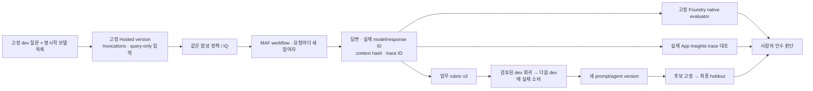

# Hosted 워크플로 평가·학습 루프 워크북

[English](../../reference/evaluation-workbook.md) | **한국어**

**한국어 개정 기준 2026-09-15 · 경험자 심화 150–180분, 환경 준비·배포 대기 별도.**
이 문서만으로 v2의 코드·지식·평가를 연결합니다. 다른 평가 저장소를 clone하지 않습니다.
아래 숫자는 **실행할 행 수와 인수 기준**이지 이번 개정에서 실제 측정한 점수가 아닙니다.

## 1. 무엇이 기본 평가보다 깊어지는가

기존 `collect/evaluate`는 프로젝트 Responses의 답을 검사합니다.
이 워크북은 **정확한 Hosted version이 실제로 생성한 답**을 모델별로 수집합니다.
두 경로의 점수는 서로 대신할 수 없습니다.



| 항목 | v2 워크북의 계약 |
|---|---|
| 모델 | `WORKSHOP_MODEL_DEPLOYMENTS_JSON`의 1–8개 실제 배포. 같은 배포를 여러 모델로 중복 집계하지 않음 |
| 기본 사례 | 번들 dev 6개 / holdout 4개. 원본 질문·정답 파일을 바꾸지 않음 |
| 4개 모델 선택 | baseline 24행 + candidate 24행 + final 16행 = 64행 |
| 실제 모델 호출 수 | 순차 workflow는 행당 논리 호출 3회, concurrent/group-chat는 최종 reviewer 포함 4회. retries·검색·judge는 별도 |
| 실행 격리 | 하나의 고정-version compute session을 재사용해도 각 요청은 새 MAF 참여자/대화 상태로 실행 |
| 에이전트 입력 | `question`, `model_key`, `case_id`, `run_id` 네 필드만. 정답·rubric·holdout 파일은 전달하지 않음 |
| 실패 | HTTP/JSON/계약 오류를 행으로 보존. 누락·중복 matrix나 수집 중단의 성공 prefix는 평가하지 않음 |
| 인수 | 업무 검사·native 실행/품질·trace·calibration을 따로 판단. CLI 합격은 운영 배포 승인이 아님 |

## 2. 강사 준비와 명시적 모델 목록

새로운 v2 복사본을 **다른 azd 프로젝트의 하위가 아닌 독립된 폴더**에 준비합니다.
단일 에이전트 실습의 `.azure`나 원격 version을 묵시적으로 재사용하지 않습니다.
[Lab 00](../labs/00-start.md)의 설치·인증, [Lab 06](../labs/06-knowledge.md)의 IQ 준비를 먼저 마칩니다.

`.env`에서 실제 값을 입력합니다. 네 개 모두 준비되지 않았다면 목록을 명시적으로 줄이고
실제 행 수를 기록합니다. 하나가 실패했다고 수집기가 다른 모델로 바꾸지는 않습니다.

```dotenv
# 모든 <...>를 강사가 확인한 실제 값으로 바꿉니다.
AZURE_AI_MODEL_DEPLOYMENT_NAME=<model-a-deployment>
WORKSHOP_MODEL_DEPLOYMENTS_JSON={"a":"<model-a-deployment>","b":"<model-b-deployment>","c":"<model-c-deployment>","d":"<model-d-deployment>"}
AZURE_OPENAI_ENDPOINT=https://<same-foundry-account>.openai.azure.com
AZURE_AI_EVALUATION_MODEL_DEPLOYMENT_NAME=<separate-judge-deployment>
WORKSHOP_HOSTED_AGENT_NAME=<unique-mfv2-agent-name>
AZURE_APPLICATION_INSIGHTS_APP_ID=<connected-application-insights-app-id>
```

`AZURE_OPENAI_ENDPOINT`는 프로젝트 endpoint와 **동일한 Foundry account**여야 합니다.
이 워크북의 예시는 명시적인 `account-chat` 경로를 사용합니다.
다른 API를 선택하려면 패키지·serve·smoke·plan·collect의 `--api`를 **모두** 바꾼 독립 실험으로 시작합니다.
실패 후 자동 전환하는 옵션이 아닙니다.

| 경로 | 방식 | 계약 |
|---|---|---|
| `project-responses` | AIProjectClient의 프로젝트 Responses | 기본 입문 경로 |
| `account-chat` | 같은 프로젝트 SDK에 명시적 account base URL·AAD token provider, MAF Chat Completions | 서로 다른 모델의 API 지원을 강사가 확인한 경우 |

Pipeline의 JSON은 프롬프트로 요청한 뒤 Python에서 엄격히 검사합니다.
서비스가 강제한 Structured Outputs라고 표현하지 않습니다.
이 문서는 특정 신형 모델 네 개의 quota·지역·권한·성공을 보장하지 않습니다.

## 3. V1 워크플로를 패키징하고 바인딩

```bash
python scripts/workshop.py runtime-contract --kind workflow --pattern sequential --retrieval iq --prompt v1 --api account-chat --protocol invocations
python scripts/package_hosted.py --kind workflow --pattern sequential --retrieval iq --prompt v1 --api account-chat --protocol invocations
```

생성 폴더는 `.build/workflow-sequential-iq-v1-account-chat-invocations/`입니다.
`runtime-profile.json`에 실행 방식을 고정하고, `package-manifest.json`에서 파일 hash를 확인합니다.
평가 데이터·정답·calibration·개인 `.env`는 포함하지 않습니다.

**아래는 별도 승인 후 실행하는 실제 초기화/배포 절차입니다. 이번 문서 개정이 수행했다는 뜻이 아닙니다.**
최신 CLI/확장 호환성을 먼저 [버전 기준](versions.md)에서 확인합니다.

```bash
azd ai agent init --src ./.build/workflow-sequential-iq-v1-account-chat-invocations --agent-name "<unique-mfv2-agent-name>" --project-id "<existing-project-arm-id>" --model-deployment "<model-a-deployment>" --deploy-mode code --runtime python_3_13 --entry-point main.py --protocol invocations
```

생성된 agent service의 `project`, `codeConfiguration`, `protocols`를 확인합니다.
[동일 저장소의 환경 예제](../../../examples/hosted/azure-workflow.yaml.example)를 참고해 **해당 service의 env만**
완성하고 원래 project 연결·service 이름을 보존합니다.

필수 runtime 값은 프로젝트/모델/account endpoint, 모델 목록 JSON, Search endpoint/index/source/base,
`WORKSHOP_PREFIX`, `WORKSHOP_AUTH_MODE=managed-identity`, 출력 token 상한입니다.
azd env에 같은 값을 설정합니다. `.env`와 azd env는 자동 동기화되지 않습니다.

```bash
azd env set AZURE_AI_PROJECT_ENDPOINT "<existing-project-endpoint>"
azd env set AZURE_AI_MODEL_DEPLOYMENT_NAME "<model-a-deployment>"
azd env set AZURE_OPENAI_ENDPOINT "https://<same-foundry-account>.openai.azure.com"
azd env set WORKSHOP_MODEL_DEPLOYMENTS_JSON '{"a":"<model-a-deployment>","b":"<model-b-deployment>","c":"<model-c-deployment>","d":"<model-d-deployment>"}'
azd env set WORKSHOP_PREFIX "<your-mfv2-prefix>"
azd env set AZURE_SEARCH_ENDPOINT "https://<existing-search>.search.windows.net"
azd env set AZURE_SEARCH_INDEX_NAME "<your-policy-index>"
azd env set AZURE_SEARCH_KNOWLEDGE_SOURCE_NAME "<your-source>"
azd env set AZURE_SEARCH_KNOWLEDGE_BASE_NAME "<your-kb>"
```

실제 코드 호출은 기존 프로젝트·배포만 사용합니다. 역할은 사용자와 **배포된 agent instance identity**에
각각 필요한 범위를 부여합니다. account-chat에는 해당 account의 모델 추론 권한, IQ에는 Search
읽기 권한이 필요합니다. 역할 생성이나 구독 변경을 수집기에서 자동 수행하지 않습니다.

## 4. 로컬과 원격 smoke를 구분

터미널 A:

```bash
source .venv/bin/activate
python scripts/workshop.py serve --kind workflow --pattern sequential --retrieval iq --prompt v1 --api account-chat --protocol invocations
```

터미널 B:

```bash
curl --fail http://127.0.0.1:8088/readiness
python scripts/workshop.py benchmark smoke --local --label smoke-v1-local --kind workflow --pattern sequential --retrieval iq --prompt v1 --api account-chat --case D01 --model-key a --confirm-cost
```

readiness는 `{"status":"healthy"}`입니다. 실제 답·model/response ID·context hash까지 확인해야 smoke가 완료됩니다.
`azd`의 raw HTTP 본문은 UTF-8 **바이트 길이**로 파싱하며, 알려진 업데이트 안내만 별도 보존합니다.
오류 뒤의 임의 JSON을 성공 응답으로 추출하지 않습니다.

터미널 A를 `Ctrl+C`로 종료한 뒤 승인된 전용 service에 배포합니다.
여러 service가 있다면 배포할 service를 명시하고 다른 agent를 함께 배포하지 않습니다.

```bash
azd deploy
azd ai agent show --output json
```

반환된 실제 `name`, `version`, **Invocations endpoint 전체**를 `.env`의
`WORKSHOP_HOSTED_AGENT_NAME`, `WORKSHOP_HOSTED_AGENT_VERSION`, `WORKSHOP_HOSTED_AGENT_ENDPOINT`에 입력합니다.
`latest`, 추측한 URL, 다른 프로젝트 endpoint는 거부합니다.

```bash
python scripts/workshop.py benchmark smoke --label smoke-v1-remote --kind workflow --pattern sequential --retrieval iq --prompt v1 --api account-chat --case D01 --model-key a --confirm-cost
```

## 5. 모든 모델의 baseline

```bash
python scripts/workshop.py benchmark plan --kind workflow --pattern sequential --retrieval iq --prompt v1 --api account-chat
python scripts/workshop.py benchmark collect --label wf-baseline --kind workflow --pattern sequential --retrieval iq --prompt v1 --api account-chat --concurrency 1 --confirm-cost
python scripts/workshop.py benchmark evaluate --label wf-baseline --confirm-cost
python scripts/workshop.py benchmark report --label wf-baseline
```

`outputs/benchmarks/wf-baseline/`에 frozen dataset/corpus, manifest, 모든 응답,
원시 HTTP, 업무 검사, evaluator catalog/run/output, HTML 보고서가 남습니다.
4개 모델이면 **24행**이어야 합니다. 병렬도가 필요하면 `--concurrency 2` 또는 `4`를 사전에 선택하고
전후 실험과 holdout에서 같은 값을 유지합니다. 기본은 비용/읽기 편의를 위해 1입니다.

업무 rubric v2는 기존 schema·판단·한도·인용 외에 **본문의 해당 금액과 관련 있는 인용**을 검사합니다.
모델별 6/6을 기본 gate로 사용하며, 누락/오류는 분모에 남습니다.
성공한 요청의 p50/p95만 따로 표시하고 미측정 토큰·지연은 `None`입니다.
작은 집합의 Wilson 구간은 불확실성을 설명하는 참고이며 운영 SLA나 통계적 모델 우열이 아닙니다.

Native 평가는 **이미 생성한 Hosted 답변 데이터**를 평가합니다. target을 다시 호출하는 agent-target
평가와 다릅니다. `groundedness`/`relevance`의 실제 점수와 pass를 업무 검사와 분리해 봅니다.
실행 오류가 난 native 시도만 `--retry-failed`로 다시 요청할 수 있고 원본 시도·고정 catalog를 보존합니다.
완료된 낮은 점수만을 이유로 같은 명령을 재시도해 점수를 고를 수 없습니다.

## 6. 실제 trace와 dev 회귀 자산

```bash
python scripts/workshop.py benchmark trace-plan --label wf-baseline
python scripts/workshop.py benchmark monitor --label wf-baseline
```

첫 명령은 KQL만 작성합니다. 두 번째는 쿼리를 표시하고 지정된 App Insights를 **실제 조회**합니다.
`requests`에서 agent 이름과 시간·정확한 trace ID 집합을 제한하며 누락·중복·다른 trace를 거부합니다.
단순히 응답에 trace ID가 있다는 사실과 export를 실제 확인한 것은 다릅니다.

실패한 **실제 dev 행**을 검토한 경우에만 다음을 실행합니다. `a-D06`은 형식 예시입니다.
전부 통과했다면 실패를 만들지 말고 검토 사실을 기록하고 회귀 승격을 생략합니다.

```bash
python scripts/workshop.py benchmark regression --label wf-baseline --row-id a-D06 --regression-label approval-reviewed --reviewer team-01 --reason "실제 응답과 원문 승인 규정을 비교했고 누락된 판단 조건을 다음 dev에서 다시 확인합니다." --confirm-review
```

원본의 질문·정답·source response/trace/context hash를 그대로 보존합니다.
새로운 질문이나 정답 변경은 별도 dataset version이 필요하므로 이 명령으로 섞지 않습니다.
`reviewer`는 CLI 입력 기록이며 Entra로 검증한 승인자나 운영 배포 승인이 아닙니다.

## 7. V2와 같은 dev를 다시 실행

v1/v2를 비교하고 개선 이유를 설명합니다. 실패와 관계없는 변경을 강요하지 않습니다.

```bash
python scripts/package_hosted.py --kind workflow --pattern sequential --retrieval iq --prompt v2 --api account-chat --protocol invocations
```

기존 `azure.yaml`의 **같은 service 이름**을 유지하고 `project`만
`.build/workflow-sequential-iq-v2-account-chat-invocations`로 바꿉니다.
이미 있는 프로젝트에 `azd ai agent init`을 반복해 `-2` agent를 만들지 않습니다.

```bash
azd deploy
azd ai agent show --output json
```

실제 새 version을 `.env`에 기록한 뒤:

```bash
python scripts/workshop.py benchmark collect --label wf-candidate --kind workflow --pattern sequential --retrieval iq --prompt v2 --api account-chat --concurrency 1 --regressions approval-reviewed --confirm-cost
python scripts/workshop.py benchmark evaluate --label wf-candidate --reference wf-baseline --confirm-cost
python scripts/workshop.py benchmark compare --baseline wf-baseline --candidate wf-candidate
python scripts/workshop.py benchmark report --label wf-candidate
python scripts/workshop.py benchmark monitor --label wf-candidate
```

회귀 승격을 생략했다면 `--regressions approval-reviewed`도 빼고 실행합니다.
이 옵션은 실제 다음 dev 행에 source lineage를 연결합니다. 파일만 만들어 두고 사용한 것처럼 표시하지 않습니다.
Native `--reference`는 기존 evaluator/version/judge/threshold를 재사용하며 다른 기준이면 비교를 거부합니다.

## 8. 평가자도 검사

```bash
python scripts/workshop.py calibrate-judge --label judge-calibration --reference wf-candidate --confirm-cost
```

번들 calibration의 명시적 정답/오답 2건을 사용합니다. target 모델이 생성한 응답은 아닙니다.
groundedness의 오탐·미탐을 확인하되 두 예가 맞았다고 judge 전체를 신뢰하지 않습니다.
보류 답변의 relevance가 낮으면 실제 native 점수를 유지하고 업무 기준과 다른 이유를 검토합니다.

## 9. 후보 고정 후 마지막 holdout

모델·지침·검색·코드·agent version·동시성을 더 이상 바꾸지 않을 때만 진행합니다.
4개 모델 전체를 고정했다면 16행입니다. 일부만 인수하려면 dev 결과로 먼저
`--model-key a`처럼 선정합니다. holdout 결과를 본 뒤 모델을 골라 유리한 행만 남기지 않습니다.

```bash
python scripts/workshop.py benchmark collect --split holdout --label wf-final --candidate wf-candidate --unlock-holdout --kind workflow --pattern sequential --retrieval iq --prompt v2 --api account-chat --concurrency 1 --confirm-cost
python scripts/workshop.py benchmark evaluate --label wf-final --reference wf-baseline --confirm-cost
python scripts/workshop.py benchmark monitor --label wf-final
python scripts/workshop.py benchmark verify --baseline wf-baseline --candidate wf-candidate --holdout wf-final --require-native --require-traces --require-regressions --calibration judge-calibration
```

회귀를 만들지 않은 경로에서는 `--require-regressions`를 빼고 이유를 인수 자료에 기록합니다.
일반 native 점수까지 모두 통과해야 하는 정책이라면 **실험 전에** `--require-native-pass`를 인수 기준으로 정합니다.
기본 검사는 native **실행·결과 계보**와 native **품질 통과**를 분리하고 낮은 점수를 숨기지 않습니다.
`review-native-findings`는 자동 승인이나 좋은 점수로의 보정이 아닙니다.

번들 holdout은 이미 교육 자료에서 사용됐습니다. **최종 인수 절차를 배우는 세트**이지 새로운 미사용
운영 검증셋은 아닙니다. 이를 prompt 개발·회귀 수집에 사용하지 않습니다.

## 10. 소유한 실행 자원만 정리

```bash
python scripts/workshop.py benchmark stop-session --label wf-baseline
python scripts/workshop.py benchmark stop-session --label wf-candidate
python scripts/workshop.py benchmark stop-session --label wf-final
```

각 manifest의 session/version만 중지하고 idle/stopped를 재조회합니다. manifest는 바꾸지 않고
별도 cleanup receipt를 남기므로 frozen candidate와 회귀 계보가 깨지지 않습니다.
별도 smoke의 session은 저장된 raw HTTP/azd session 목록에서 확인해 본인 것만 중지합니다.
모델·Search·로그·파일 저장소 비용은 별도이며 [정리](cleanup.md)를 따릅니다.

**이번 실제 실행:** 국문은 네 모델의 baseline/candidate/holdout 24/24/16행, native 평가·calibration·trace를 확인했습니다.
점수·추가 진단·기능별 한계는 [실행 결과](../live-run.md)와 [검증 기록](validation.md)에 구분합니다.
다른 언어의 영상이나 다른 저장소의 성공을 이 워크북의 실행 결과로 사용하지 않습니다.
