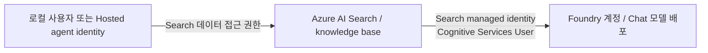

# Foundry IQ Chat completion model과 managed identity

[English](../../reference/iq-model-identity.md) | **한국어**

**2026-09-15 실측 확인: IQ의 Chat completion model은 managed identity로 정상 구성·호출할 수 있습니다.**
인증 방식과 모델을 사용하는 검색 모드를 구분해야 합니다.
기본 실습의 모델 없는 GA 경로는 교육 구성상의 선택이지 MI나 포털 모델 설정이 지원되지 않는다는 뜻이 아닙니다.

## 1. 어느 identity가 호출하는가?



| 연결 | 호출 주체 | 확인할 권한 |
|---|---|---|
| 실습 클라이언트 → Search | 로그인한 사용자 또는 Hosted agent identity | Search 조회 권한. 객체 작성은 별도 관리 권한 필요 |
| Search → IQ Chat 모델 | **Search 서비스의 system-assigned 또는 명시적으로 연결한 user-assigned identity** | 모델이 있는 Foundry 계정의 `Cognitive Services User`, 지원 배포·네트워크 접근 |
| 별도 답변 생성 단계 → 모델 | 실습 클라이언트/Hosted identity | Search identity와 별개의 모델 호출 권한 |

사용자나 Hosted agent에 역할을 줬다고 Search에도 권한이 생기지 않습니다.
`WORKSHOP_AUTH_MODE`와 `AZURE_CLIENT_ID`는 이 저장소의 Python 호출자를 설정하며 Search의 모델 호출 identity를 설정하지 않습니다.
Search의 managed identity 지원에는 Basic 이상 tier가 필요합니다.

## 2. 정상적인 포털 설정 순서

강사가 설정 변경·비용을 승인한 뒤:

1. Search 서비스의 managed identity가 없으면 활성화합니다.
2. **모델이 배포된 Foundry 계정**에서 Search identity에 `Cognitive Services User`를 부여합니다.
   실습 계정 범위로 제한하며 구독 전체에 부여하지 않습니다. RBAC 반영 시간을 고려합니다.
3. Knowledge base의 **Chat completion model → Add model deployment**에서 실제 계정/프로젝트와 지원되는 배포를 선택하고
   인증을 **System assigned identity**로 설정합니다. Foundry 포털의 메뉴 표현은 다를 수 있습니다.
4. 모델 연결을 저장합니다. API key 인증이 비활성화되어 Search가 managed identity를 사용한다는 안내는 정보성 메시지입니다.
   이 안내를 없애려고 API key를 활성화하지 않습니다.
5. 모델 기반 계획을 실행하려면 `low` 같은 적절한 reasoning effort를 선택합니다.
   Search가 답변까지 생성하면 `answerSynthesis`, 별도 agent가 답변을 만들면 `extractiveData`를 선택합니다.
6. 합성 질문을 전송하고 실제 `modelQueryPlanning` activity를 확인합니다.
   답변 합성을 선택한 경우 `modelAnswerSynthesis`, references와 생성된 답변도 확인합니다.

**`Chat completions model is required`는 선택된 모델이 없다는 폼 검증 메시지이지 MI 인증 실패의 증거가 아닙니다.**
기존 캡처는 그 미선택 상태이며 MI 모델 호출을 시험한 화면이 아닙니다.
고정된 평가의 실행 경로를 바꿀 때는 별도 소유 base를 사용합니다.

## 3. API·실행 모드와 인증을 분리하기

| 경로 | 구성과 동작 |
|---|---|
| 기본 실습 `2026-04-01` GA | 기존 Search index source, 명시적 semantic `intents`, KB 모델 없음. 원문을 반환하고 다음 실습 단계가 답변 생성 |
| 모델 기반 Search-index 검색 `2026-08-01-preview` | 모델 연결 + `messages` + `low` 등의 reasoning effort. Search가 모델로 query planning 수행 |
| 위 Preview 경로의 `answerSynthesis` | Search가 모델로 근거 인용 답변까지 생성 |

현재 공식 안내에서 **non-web Search-index source**에 LLM을 사용하는 경로는 Preview API가 필요합니다.
GA schema에 `models`가 있어도 모든 source/model 조합의 동작이 GA라는 뜻은 아닙니다.
반대로 Preview라는 이유로 managed identity가 동작하지 않는 것도 아닙니다.
Source 종류·API 버전·지원 모델·리전·실행 모드를 각각 확인합니다.
`minimal`은 LLM query planning을 비활성화하고 extractive 출력을 요구하므로, 모델을 저장한 사실만으로 실제 호출을 입증할 수 없습니다.

## 4. Keyless 모델 연결과 확인한 요청

아래는 **구성 예시**이지 자동 실행되는 배포 명령이 아닙니다.
Placeholder를 바꾸고, 새 소유 base를 사용하며, 쓰기 전에 승인을 받습니다.
실측 모델은 공식 `2026-08-01-preview` 지원 목록의 `gpt-5.6-luna`였습니다.

```json
{
  "name": "<new-owned-knowledge-base>",
  "knowledgeSources": [{"name": "<existing-synthetic-source>"}],
  "models": [{
    "kind": "azureOpenAI",
    "azureOpenAIParameters": {
      "resourceUri": "https://<foundry-account>.openai.azure.com",
      "deploymentId": "<verified-chat-deployment>",
      "modelName": "gpt-5.6-luna",
      "authIdentity": null
    }
  }],
  "retrievalReasoningEffort": {"kind": "low"},
  "outputMode": "answerSynthesis"
}
```

`apiKey`는 넣지 않습니다. 이 연결의 `authIdentity: null`은 Search의 system-assigned identity를 사용합니다.
User-assigned identity는 Search에 연결한 뒤 공식 `DataUserAssignedIdentity` 객체에 전체 ARM resource ID를 지정합니다.
Client secret·API key·token을 모델 연결에 붙여 넣지 않습니다.
프로젝트의 `/api/projects/...`가 아니라 계정 endpoint를 사용합니다.

성공한 요청은 새 base의 `/retrieve?api-version=2026-08-01-preview`에 아래 형태로 전송했습니다.

```json
{
  "messages": [{
    "role": "user",
    "content": [{"type": "text", "text": "<synthetic travel-policy question>"}]
  }],
  "retrievalReasoningEffort": {"kind": "low"},
  "outputMode": "answerSynthesis",
  "includeActivity": true,
  "maxRuntimeInSeconds": 60,
  "maxOutputSize": 6000,
  "knowledgeSourceParams": [{
    "kind": "searchIndex",
    "knowledgeSourceName": "<existing-synthetic-source>",
    "includeReferences": true,
    "includeReferenceSourceData": true
  }]
}
```

첫 요청은 endpoint가 `maxOutputSizeInTokens`를 거절해 **HTTP 400**이었습니다.
원래 요청·오류를 보존했으며 수정된 요청은 Preview REST 예시의 `maxOutputSize`를 사용했습니다.
참조 표에도 `maxOutputSizeInTokens`가 나와 있으므로 통합 schema에 보인다는 이유만으로 모든 요청 모드에 유효하다고 가정하지 않습니다.
이것은 날짜가 있는 요청 계약 실측이며 MI 실패나 기본 GA 요청의 변경이 아닙니다.
두 size 필드의 단위·효과를 같다고 취급하지 않습니다.

## 5. 실제 확인과 정리

| 확인 항목 | 관측 결과 |
|---|---|
| 기존 base 초기 상태 | 국문·영문 모두 `models: []`. Search→모델 인증을 실행하지 않았음 |
| Search identity | Sweden Central의 Basic Search에서 system-assigned identity 활성 |
| 초기 모델 역할 | Search identity의 역할이 조회되지 않음. Hosted identity의 역할은 다른 주체였음 |
| 승인한 변경 | 기존 실습 Foundry 계정에만 `Cognitive Services User` 추가 |
| Key 인증 | Search·Foundry 모두 비활성화, 새 모델 연결에 API key 없음 |
| 임시 base | Preview, 기존 합성 source, Luna, `low`, `answerSynthesis` |
| 요청 | 첫 요청은 파라미터 검증 400. 두 번째는 **HTTP 200**, 실제 계획·답변 합성 |
| 모델 activity | 계획 input 1,207 / output 101 tokens, 합성 input 1,891 / output 370 tokens. 둘 다 Luna 보고 |
| 답변 | 150,000원 한도와 170,000원 호텔의 사전 승인 요건을 원문 인용과 함께 설명 |
| 정리 | 임시 base 삭제 및 GET 404 확인. 기존 두 base의 ETag/구성 불변 확인 |

승인한 Search 모델 접근 역할은 남겼습니다. 모델 배포·기본 구독은 변경하지 않았고,
지침·dataset·benchmark 점수·게시된 녹화본도 교체하지 않았습니다.
별도 통합 확인이며 기존 평가에 추가해 점수를 높이는 결과가 아닙니다.

[실측 기록](../../assets/iq-mi-20260915/verification.json) ·
[공식 포털 설정](https://learn.microsoft.com/azure/search/get-started-portal-agentic-retrieval#create-a-knowledge-base) ·
[지원 모델·identity 조건](https://learn.microsoft.com/azure/search/agentic-retrieval-how-to-create-knowledge-base) ·
[Reasoning 모드](https://learn.microsoft.com/azure/search/agentic-retrieval-how-to-set-retrieval-reasoning-effort) ·
[Preview retrieve schema·예시](https://learn.microsoft.com/rest/api/searchservice/knowledge-retrieval/retrieve?view=rest-searchservice-2026-08-01-preview&preserve-view=true)
