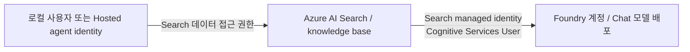

# Foundry IQ Chat completion model과 managed identity

[English](../../reference/iq-model-identity.md) | **한국어**

**선택 IQ Chat에는 이 preset을 사용합니다: 배포/모델 `gpt-5.6-luna`, 버전 `2026-07-09`, Search 서비스의 managed identity 인증.**
2026-09-23 Search가 GPT-6 knowledge base 연결을 거절했으므로 `gpt-6-sol` 응답 preset과 따로 둡니다.
이 선택 경로에만 해당 배포를 준비합니다([모델 선택](model-choice.md)).

Managed identity는 IQ Chat completion model을 구성하는 지원되는 정상 방법입니다. 이 인증을 모델 기반 검색 모드와 혼동하지 않습니다.
실습은 모델 없는 GA 검색과 별도의 Preview 채팅 경로를 유지하며, 합성 Search-index source에서 GA API는 KB 내부 LLM을 지원하지 않습니다.

<details>
<summary>근거 기록, 2026-09-15–23</summary>

- **2026-09-15:** managed identity가 IQ Chat completion model을 구성하는 지원되는 정상 방법임을 실측 확인했습니다.
- **2026-09-17 포털 확인:** 이미 준비된 국문 chat KB에서 **`gpt-5.6-luna` / 낮음 / 응답 합성**이 모델 미선택 오류 없이 표시됐습니다
  ([정상 설정 화면](../labs/06-knowledge.md#iq-chat-model), 과거 GA 캡처가 아님). Luna 배포는 모델 버전 **`2026-07-09`**,
  상태 **`Succeeded`**로 읽혔습니다. 이 확인에서는 KB 저장·역할 변경·모델 배포·추론 호출을 하지 않았습니다.
- **2026-09-23:** 응답 preset이 `gpt-6-sol`로 바뀌었고, Search는 GPT-6 연결을
  `Unsupported model type in Knowledge Base Model Configuration`으로 거절했으며 허용 목록의 마지막은 `gpt-5.6-luna`였습니다.

</details>

## 첫 실습: 고정된 실행 preset 사용

**배포/모델 `gpt-5.6-luna`, 모델 버전 `2026-07-09`, Search system-assigned identity**를 사용합니다.
초보자에게 임의의 Chat 모델을 고르게 하지 않습니다.
[담당자 준비와 합성 seed](../setup.md#4-환경-담당자의-준비)를 완료한 뒤,
그 `.env`와 소유권 기록이 있는 원래 작업 폴더에서 먼저 확인합니다.

```bash
python scripts/workshop.py iq-chat check
```

`ready_for_setup: true`, `configured: false`이면 담당자가 **별도 chat KB 생성 승인을 받은 뒤에만** 아래를 실행합니다.
`configured: true`라면 기존 설정을 유지하고 setup을 건너뜁니다.

```bash
python scripts/workshop.py iq-chat setup --confirm-create
```

반환된 `knowledge_base`를 준비 카드에 적고 포털에서도 **그 정확한 이름**을 엽니다.
설정 검사를 통과하고 새 요청이 승인된 경우에만 실행합니다.

```bash
python scripts/workshop.py iq-chat ask --label iq-chat-first --confirm-cost
```

준비 카드와 같은 순서이며 추가 필수 검사가 아닙니다. 유료 요청이 이미 기록됐으면 반복하지 않습니다.
`check`는 Azure 변경 없이 정확한 실제 모델/버전·Search identity/역할·source를 검사합니다.
`setup`은 **별도의 본인 소유** `<prefix>-chat-ko-kb`를 만듭니다(`AZURE_SEARCH_CHAT_KNOWLEDGE_BASE_NAME`으로 명시적 변경).
소유권/설정이 다른 base 덮어쓰기, 모델 배포, 역할 부여, GA base 변경은 하지 않습니다.
`ask`는 `outputs/iq-chat/<label>/`에 요청·응답·근거를 남기며 실제 `gpt-5.6-luna` 계획 **및** 합성을 요구합니다.
유료 POST 전에 실제 모델/버전을 다시 확인하고 선택 언어의 canonical 원문과 다른 근거를 거부합니다.
`model-preflight.json`, `knowledge-base-response.json`, 실패 단계로 모델 준비·KB 읽기·검색·답변 검사를 구분합니다.
기존 source는 별도 날짜 필드 없이 `id`, `title`, `content`를 반환합니다.
반환된 필드만 canonical 정책과 비교하며 없는 날짜 메타데이터를 만들어 넣지 않습니다.
검증된 `maxOutputSize` 필드를 사용하고 새 요청은 새 label이 필요합니다.

| 결과/오류 | 다음 조치 |
|---|---|
| `ready_for_setup: true`, `configured: false` | 아직 chat base가 없으므로 담당자가 승인된 `setup` 진행 |
| `configured: true`, `model_inference_verified: false` | 설정 준비만 완료. 명시적으로 승인한 유료 `ask`가 실제 추론 확인 |
| 다른 모델/버전·Search 역할 누락 | 담당자가 해당 선행 조건 해결. 배포·identity·API key로 우회하지 않음 |
| 소유권 ledger 없음 | 합성 source를 seed한 동일 작업 폴더로 복귀. 소유권을 임의 작성하지 않음 |
| 기존 base의 모델/모드가 다름 | 기존 구성을 검토하고 새 소유 이름 선택. 자동 덮어쓰기 없음 |
| 403 / 429 / 서비스 오류 | `failure.json` 보존. RBAC 전파·네트워크·quota 확인 후 명시적인 새 시도 |

모델 고정은 예방 가능한 불일치를 막지만, 장애나 quota 소진까지 없애지는 않습니다.
2026-09-15 새 명령의 실제 확인은 **읽기 전용**(`configured: false`)이며 영구 chat base를 만들지 않았습니다.
아래 실제 모델 호출 증거는 별도 승인을 받은 이전 임시 MI 검사입니다.

## 1. 어느 identity가 호출하는가?



| 연결 | 호출 주체 | 확인할 권한 |
|---|---|---|
| 실습 클라이언트 → Search | 로그인한 사용자 또는 Hosted agent identity | Search 조회 권한. 객체 작성은 별도 관리 권한 필요 |
| Search → IQ Chat 모델 | **Search 서비스의 system-assigned 또는 명시적으로 연결한 user-assigned identity** | 모델이 있는 Foundry 계정의 `Cognitive Services User`, 지원 배포·네트워크 접근 |
| 별도 답변 생성 단계 → 모델 | 실습 클라이언트/Hosted identity | Search identity와 별개의 모델 호출 권한 |

사용자나 Hosted agent에 역할을 줬다고 Search에도 권한이 생기지 않습니다.
`WORKSHOP_AUTH_MODE`와 `AZURE_CLIENT_ID`는 이 저장소의 Python 호출자를 설정하며 Search의 모델 호출 identity를 설정하지 않습니다.
Search의 managed identity 지원에는 Basic 이상 tier가 필요합니다.

**로컬 preset 호출자:** 실습 Foundry 계정·Search 서비스의 `Reader`로 모델/역할/객체 사전 조회,
`Search Index Data Reader`로 검색합니다. 기존 Foundry 프로젝트/모델 권한도 필요합니다.
Reader만으로는 검색할 수 없고 data-reader만으로는 객체 정의를 볼 수 없습니다.
작성자는 별도 승인된 Search contributor 역할을 사용합니다.
[공식 권한 표](https://learn.microsoft.com/azure/search/search-security-rbac#summary-of-permissions)를 따르며 읽기 검사를 위해 구독 전체 Owner를 추가하지 않습니다.

## 2. 정상적인 포털 설정 순서

모델 없는 GA base를 다른 실험으로 바꾸지 않고 준비된 preset을 사용합니다.

1. 담당자가 기존 `gpt-5.6-luna` 배포·Search 관리 ID·**모델의 Foundry 계정**에 부여된
   Search ID의 `Cognitive Services User` 역할을 확인합니다. 빠진 조건만 별도로 승인받아 변경합니다.
   학습자나 Hosted ID의 역할을 Search의 역할로 대신할 수 없습니다.
2. Chat base가 없을 때 위 **check → 승인된 setup** 순서를 완료합니다.
   다른 모델을 배포하지 않고 `gpt-5.6-luna`/MI/낮음/응답 합성 연결을 저장합니다.
3. **Knowledge → Knowledge bases → 반환된 chat-base 이름**을 엽니다. 기존 모델 선택을 유지하고
   **`gpt-5.6-luna`**, **낮음**, **응답 합성**, 해당 합성 source를 확인합니다.
   이미 준비된 KB를 관찰하려고 다시 저장할 필요는 없습니다.
4. 회색 API-key-disabled/managed-identity 안내는 정보성 메시지입니다. 없애려고 key를 활성화하지 않습니다.
   반면 빨간 **`Chat completions model is required`**는 모델 미선택입니다. `<prefix>-kb`가 아닌 chat base를 열었는지 먼저 확인합니다.
5. **Browse more models → Deploy**로 이 폼을 고치지 않습니다. 9월 17일 Foundry 선택기에는 제한된 카탈로그가 표시됐지만
   이미 저장된 `gpt-5.6-luna` 연결은 정상 표시됐습니다. 카탈로그 선택·배포·저장된 연결 열기는 다른 동작입니다.
6. 승인된 새 요청에는 `iq-chat ask`를 사용하고 실제 `modelQueryPlanning`, `modelAnswerSynthesis`,
   references와 응답을 남깁니다. 폼이 채워졌다는 사실만으로 모델 호출이나 역할 전파를 입증할 수는 없습니다.

정확한 chat base가 없거나 값이 다르면 멈추고 위 담당자 준비로 돌아갑니다.
검증 메시지를 없애려고 저장된 모델을 지우거나 카탈로그 추천을 대신 고르거나 기존 GA base를 변경하지 않습니다.

## 3. API·실행 모드와 인증을 분리하기

| 경로 | 구성과 동작 |
|---|---|
| 기본 실습 `2026-04-01` GA | 기존 Search index source, 명시적 semantic `intents`, KB 모델 없음. 원문을 반환하고 다음 실습 단계가 답변 생성 |
| 모델 기반 Search-index 검색 `2026-08-01-preview` | 모델 연결 + `messages` + `low` 등의 reasoning effort. Search가 모델로 query planning 수행 |
| 위 Preview 경로의 `answerSynthesis` | Search가 모델로 근거 인용 답변까지 생성 |

현재 공식 안내에서 **non-web Search-index source**에 LLM을 사용하는 경로는 Preview API가 필요합니다.
GA schema에 `models`가 있어도 모든 source/model 조합의 동작이 GA라는 뜻은 아닙니다.
반대로 Preview라는 이유로 managed identity가 동작하지 않는 것도 아닙니다.
Source 종류·API 버전·지원 모델·리전·실행 모드를 각각 확인합니다.
`minimal`은 LLM query planning을 비활성화하고 extractive 출력을 요구하므로, 모델을 저장한 사실만으로 실제 호출을 입증할 수 없습니다.

## 4. Keyless 모델 연결과 확인한 요청

아래는 **구성 예시**이지 자동 실행되는 배포 명령이 아닙니다.
Placeholder를 바꾸고, 새 소유 base를 사용하며, 쓰기 전에 승인을 받습니다.
실측 모델은 공식 `2026-08-01-preview` 지원 목록의 `gpt-5.6-luna`였습니다.

```json
{
  "name": "<new-owned-knowledge-base>",
  "knowledgeSources": [{"name": "<existing-synthetic-source>"}],
  "models": [{
    "kind": "azureOpenAI",
    "azureOpenAIParameters": {
      "resourceUri": "https://<foundry-account>.openai.azure.com",
      "deploymentId": "gpt-5.6-luna",
      "modelName": "gpt-5.6-luna",
      "authIdentity": null
    }
  }],
  "retrievalReasoningEffort": {"kind": "low"},
  "outputMode": "answerSynthesis"
}
```

`apiKey`는 넣지 않습니다. 이 연결의 `authIdentity: null`은 Search의 system-assigned identity를 사용합니다.
User-assigned identity는 Search에 연결한 뒤 공식 `DataUserAssignedIdentity` 객체에 전체 ARM resource ID를 지정합니다.
Client secret·API key·token을 모델 연결에 붙여 넣지 않습니다.
프로젝트의 `/api/projects/...`가 아니라 계정 endpoint를 사용합니다.

성공한 요청은 새 base의 `/retrieve?api-version=2026-08-01-preview`에 아래 형태로 전송했습니다.

```json
{
  "messages": [{
    "role": "user",
    "content": [{"type": "text", "text": "<synthetic travel-policy question>"}]
  }],
  "retrievalReasoningEffort": {"kind": "low"},
  "outputMode": "answerSynthesis",
  "includeActivity": true,
  "maxRuntimeInSeconds": 60,
  "maxOutputSize": 6000,
  "knowledgeSourceParams": [{
    "kind": "searchIndex",
    "knowledgeSourceName": "<existing-synthetic-source>",
    "includeReferences": true,
    "includeReferenceSourceData": true
  }]
}
```

첫 요청은 endpoint가 `maxOutputSizeInTokens`를 거절해 **HTTP 400**이었습니다.
원래 요청·오류를 보존했으며 수정된 요청은 Preview REST 예시의 `maxOutputSize`를 사용했습니다.
참조 표에도 `maxOutputSizeInTokens`가 나와 있으므로 통합 schema에 보인다는 이유만으로 모든 요청 모드에 유효하다고 가정하지 않습니다.
이것은 날짜가 있는 요청 계약 실측이며 MI 실패나 기본 GA 요청의 변경이 아닙니다.
두 size 필드의 단위·효과를 같다고 취급하지 않습니다.

## 5. 실제 확인과 정리

| 확인 항목 | 관측 결과 |
|---|---|
| 기존 base 초기 상태 | 국문·영문 모두 `models: []`. Search→모델 인증을 실행하지 않았음 |
| Search identity | Sweden Central의 Basic Search에서 system-assigned identity 활성 |
| 초기 모델 역할 | Search identity의 역할이 조회되지 않음. Hosted identity의 역할은 다른 주체였음 |
| 승인한 변경 | 기존 실습 Foundry 계정에만 `Cognitive Services User` 추가 |
| Key 인증 | Search·Foundry 모두 비활성화, 새 모델 연결에 API key 없음 |
| 임시 base | Preview, 기존 합성 source, Luna, `low`, `answerSynthesis` |
| 요청 | 첫 요청은 파라미터 검증 400. 두 번째는 **HTTP 200**, 실제 계획·답변 합성 |
| 모델 activity | 계획 input 1,207 / output 101 tokens, 합성 input 1,891 / output 370 tokens. 둘 다 Luna 보고 |
| 답변 | 150,000원 한도와 170,000원 호텔의 사전 승인 요건을 원문 인용과 함께 설명 |
| 정리 | 임시 base 삭제 및 GET 404 확인. 기존 두 base의 ETag/구성 불변 확인 |

승인한 Search 모델 접근 역할은 남겼습니다. 모델 배포·기본 구독은 변경하지 않았고,
지침·dataset·benchmark 점수·게시된 녹화본도 교체하지 않았습니다.
별도 통합 확인이며 기존 평가에 추가해 점수를 높이는 결과가 아닙니다.

[실측 기록](../../assets/iq-mi-20260915/verification.json) ·
[공식 포털 설정](https://learn.microsoft.com/azure/search/get-started-portal-agentic-retrieval#create-a-knowledge-base) ·
[지원 모델·identity 조건](https://learn.microsoft.com/azure/search/agentic-retrieval-how-to-create-knowledge-base) ·
[Reasoning 모드](https://learn.microsoft.com/azure/search/agentic-retrieval-how-to-set-retrieval-reasoning-effort) ·
[Preview retrieve schema·예시](https://learn.microsoft.com/rest/api/searchservice/knowledge-retrieval/retrieve?view=rest-searchservice-2026-08-01-preview&preserve-view=true)
