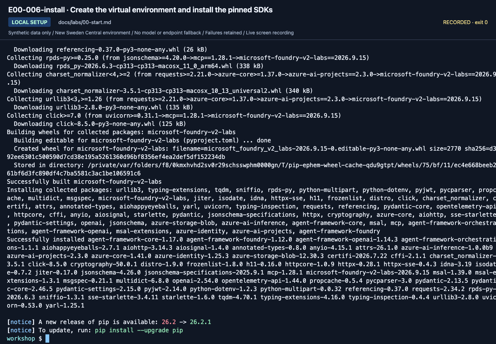
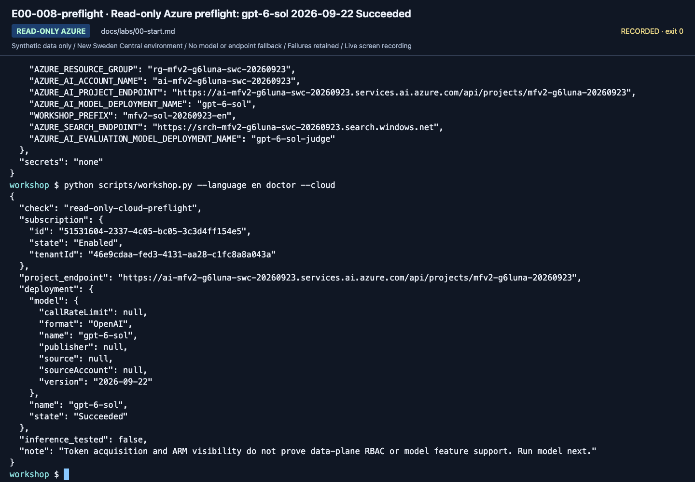

# Lab 00. Getting started and shared setup

**English** | [한국어](../ko/labs/00-start.md)

**Goal:** Identify your account, project, and learning path, and verify the starting point for the next lab.

**Open your section:** [A — browser](#path-a) · [B — code](#path-b) · [Offline only](#offline-rehearsal) · [Paths](../paths.md)

## Before you start

**This pass:** Read the setup card. A uses the browser and learner ZIP; B uses the source repository and its included notes.

**Need:** Your own account, prepared project and model; B additionally needs Python 3.13 and a terminal.

**Continue when:** A: the right project is open and the values are recorded. B: offline checks and cloud preflight are understood.

**If blocked:** Missing account/permission/quota means preparation is incomplete, not permission to choose another resource.

[One-time setup and learner files](../setup.md).

## How to read this guide

<details>
<summary>Optional screenshot help — execute the current text, not the recording</summary>

Reference images come from the **September 23, 2026 English recording with `gpt-6-sol`**,
made in a separate training project with the setup card and the ready learner files.
[Recordings and scope](../video-summary.md) distinguish actual calls, fixtures, observations, and what was not recorded.
Click to enlarge. Compare account, project, model, and prefix with your instructor's
values; do not copy identifiers from images.

In terminal images, read the **last entered command** (the line with text after `workshop $`)
and its output. Earlier output can remain above it. An empty prompt at the bottom means
the command finished. Distinguish `OFFLINE FIXTURE` from `LIVE AZURE`.
`RUN_TOOLS/configure_env.py` in the `.env` step is a recording helper that wrote the setup-card values; edit `.env` yourself.
**Execute the code blocks in the guide**, not text transcribed from screenshots.
More before/after views are in the [action index](../action-captures.md).

Use `--language en` for the separately frozen English policies, prompts, dev/holdout/calibration data, and fixtures.
Korean originals remain unchanged. [Language-specific hashes and labels](../reference/languages.md)
prevent translated datasets from being presented as the same-input experiment.

</details>

<a id="path-a"></a>

## A. Browser: no coding required

1. Open `https://ai.azure.com` in Edge or Chrome.
2. Sign in with the instructor-specified **Microsoft Entra account and directory (tenant)**.
   Personal Microsoft, GitHub, and Azure work-account sign-ins are different.
3. Select the training project, not a similarly named production project.
4. If not already done during setup, download and extract [the learner ZIP](../../data/learner/en/learner-materials.zip).
   Keep `START-HERE.txt` open. If learning alone, use [the setup card](../setup.md) for environment preparation.
   In [Lab 05](05-workflows.md), copy commands into the prepared MAF terminal;
   you will not write Python or build a portal workflow.
5. Fill the setup section of the ZIP's `session-notes.txt` using the rows below. Do not post whole screens or personal information in shared chat.


**What to check:** If the project picker is hard to use, choose **View all resources**,
enter the training project name, and verify the result's name, parent resource, and region before opening it.


**What to check:** The project name at the top must change. **Project endpoint** is the
value for `.env`; it is not the browser's `ai.azure.com` address. Authentication/PIN screens were not recorded.

| Item | Your value |
|---|---|
| Training tenant/subscription | Supplied by the instructor |
| Foundry resource/project | Supplied by the instructor |
| Model **deployment name** | Distinct from its catalog name |
| Personal/team agent prefix | Example: `mfv2-team01-0915` |
| Path | A / B |
| Execution status | Personally run / instructor observation / not run |

If the project is missing, **do not create another resource with a random account**.
Use the tenant/RBAC section of [Troubleshooting](../reference/troubleshooting.md).

**A done:** your intended project is open and `session-notes.txt` contains your setup values.
Continue to [Lab 01 A](01-foundry.md#path-a); the B installation instructions are not an extra A exercise.

<a id="path-b"></a>

## B. Code: one folder, one environment

Use macOS/Linux or WSL on Windows, Bash/zsh, and preferably Python 3.13.
Offline code also targets Python 3.14, but the hosted runtime uses 3.13.
Do not install into global Python or change the system's default Azure subscription.

If an activated, configured terminal was supplied, complete steps **1, 2 and 5**;
do not reinstall SDKs or replace its `.env`. Otherwise complete **1–5** in order.

<a id="reading-code-blocks"></a>

### What to copy, and where

| Block or notation | Your action |
|---|---|
| `bash` | Run in the repository terminal, not the browser console or Python's `>>>` prompt. Copy commands without the surrounding backticks |
| `dotenv` / `.env` values | Edit the named file in your editor; do not run or shell-`source` it |
| Python, JSON or YAML example | Read the surrounding instruction: it identifies explanatory code, expected output or the file to edit. It is not another terminal command |
| `<your-...>` | Replace the entire placeholder, including angle brackets, with your verified value |
| `read -r NAME` | Enter the requested value, without extra quote characters, then press Enter. Keep `$NAME` and `${NAME:?...}` unchanged in later commands |

Run one block and inspect its result before the next. Lines joined by `\` form one command;
`&&` runs the next command only after success. A returned shell prompt means **finished**, not **passed**.
`${NAME:?...}` stops before a command if a required value is missing. Restore it from your notes, not a recording.
New terminals do not inherit values entered with `read`.

<a id="offline-rehearsal"></a>

### 1. Open the folder

**Waiting for Azure approval?** Complete only steps 1–2 below. Neither requires Azure credentials or external Python packages.

Open [this repository](https://github.com/junwoojeong100/microsoft-foundry-v2-labs) with a GitHub account that has access,
then **Code → Download ZIP**, extract it and open the extracted folder in VS Code.
This is the **source repository ZIP**, not the small learner-materials ZIP.
Open **Terminal → New Terminal**; its directory must contain `README.md`, `pyproject.toml`, and `scripts/`.
For Hosted, use a standalone directory outside other azd projects.
If Python is missing, install [Python 3.13](https://www.python.org/downloads/) first; do not continue past a `command not found` error.

```bash
pwd
python3.13 --version
python3.13 scripts/workshop.py --language en doctor
```

Expected fields include `documents: 6`, `dev_cases: 6`, `holdout_cases: 4`,
`azure_tested: false`, and `result: PASS`. **PASS does not mean Azure sign-in succeeded.**


**What to check:** Read all three counts and `azure_tested: false`. This checks files
and the local runtime, not a successful Azure call.

<a id="prepare-notes"></a>

#### Prepare B's personal notes once

The source ZIP already contains the blank worksheets; **B does not need another learner-ZIP download or Lab 03 agent**.
Create a separate, Git-ignored working directory. The `&&` chain stops if it exists, so it cannot overwrite earlier notes:

```bash
mkdir -p outputs &&
mkdir outputs/learner-notes-en &&
cp data/learner/en/{session-notes.txt,workflow-review.txt,operations-checklist.txt,SOURCE.json} outputs/learner-notes-en/
```

If this folder already belongs to your current pass, keep it and resume without running the copy block.
For a new pass, choose a new notes-directory name and use it consistently. Never fill files under `data/learner/`.
Keep `session-notes.txt` open; skip its browser-only fields in B.

The B commands in Labs 02/04/05/06 include **`--output`**, which saves the complete JSON to this notes directory
and still prints it. **No terminal-to-editor copying is needed.** Open the saved file at each **Save** checkpoint.
The parent directory must exist; an existing file or an out-of-scope path stops before the request.
If you chose another notes directory, change every `--output` path consistently. Keep an earlier result instead of repeating a paid call.
Without `--output`, these commands still only print JSON. On a request failure, record the actual error and failed step;
no successful-response file is created. [Save behavior and recovery](../reference/commands.md#saving-json).
`collect`/`evaluate` already write `outputs/<label>/`; keep those generated folders in place and do not edit their responses.

### 2. Learn the output format without Azure

```bash
python3.13 scripts/workshop.py --language en demo --label rehearsal-v1 --prompt v1
python3.13 scripts/workshop.py --language en demo --label rehearsal-v2 --prompt v2
python3.13 scripts/workshop.py --language en compare --baseline rehearsal-v1 --candidate rehearsal-v2
```

Open `manifest.json`, `responses.jsonl`, and `business-evaluation.json` in
`outputs/rehearsal-v2/`. v1 removes citations from **fixed answers** to exercise the
checker; v2 uses the original fixture. Their score difference is **not a measured
prompt improvement**. Use fresh labels such as `rehearsal2-v1` to rerun.


**What to check:** Read `OFFLINE FIXTURE` and the final warning. No model was called
with two prompts to obtain this difference.

**Offline-only stop:** keep the two fixture folders and record cloud labs **not run**.
The following SDK/sign-in steps are for the code route, not required to finish this rehearsal.

### 3. Install a virtual environment and SDKs

```bash
python3.13 -m venv .venv
source .venv/bin/activate
python -m pip install -e ".[cloud,agents]"
```

Versions are pinned in `pyproject.toml`. Do not add the entire `agent-framework`
metapackage. Add `.[hosted]` only for [selected Hosted/Toolbox SDK work](extensions/developer-toolkit.md#hosted-sdk), not for B's package-only Lab 08. Never bypass download errors by
disabling certificate validation or using an untrusted mirror.

In each new terminal, return to the repository root and reactivate the venv.
Do not paste Bash into a browser developer console or Python's `>>>` prompt.




**What to check:** The command has ended and the shell prompt returned. Resolve any
installation errors; matching the final screen is not sufficient. Installation is not Azure connectivity.

### 4. Sign in and configure `.env`

Use the [official Azure CLI installation guide](https://learn.microsoft.com/cli/azure/install-azure-cli).
Learners sign in themselves.

```bash
az login
if [ -e .env ] || [ -L .env ]; then
  printf '%s\n' '.env exists; edit it without replacing it.'
else
  cp .env.example .env
fi
```

Open `.env` in VS Code and fill **section 1** with the setup-card values. Keep its local defaults;
add **section 2's Search endpoint only for Lab 06**. Leave the advanced fields alone unless that module is selected.
If `.env` already exists, inspect it instead of overwriting it with the copy command.

| Required setting | Source |
|---|---|
| `AZURE_SUBSCRIPTION_ID`, `AZURE_TENANT_ID` | IDs of the designated subscription/directory |
| `AZURE_RESOURCE_GROUP`, `AZURE_AI_ACCOUNT_NAME` | Prepared training resources |
| `AZURE_AI_PROJECT_ENDPOINT` | **Full** project endpoint |
| `AZURE_AI_MODEL_DEPLOYMENT_NAME` | `gpt-6-sol`; owner verifies model version `2026-09-22` |
| `WORKSHOP_PREFIX` | Must start with `mfv2-`; lowercase letters/digits and single hyphens, no trailing hyphen, at most 32 characters total |
| `WORKSHOP_AUTH_MODE` | `cli` locally; `managed-identity` only in an actual Azure runtime |

Scripts read `.env` without replacing existing process variables. Old endpoint
variables in a terminal can therefore take precedence. Check again in a fresh terminal.
Do not store API keys, passwords, or access tokens in this file.
No Microsoft 365 account or real customer document is needed.

### 5. Read-only Azure preflight

```bash
python scripts/workshop.py --language en doctor --cloud
```

Verify subscription, tenant, underlying model/version, and deployment state `Succeeded`.
This command creates no resources and does not change the default subscription.
Ask the instructor if you cannot read ARM.
Preflight does not prove data-plane permissions or Structured Outputs support;
[Lab 02](02-models.md) tests an actual request.




**What to check:** Read `deployment.name`, `deployment.model.name`, `deployment.model.version`,
`deployment.state: Succeeded`, `inference_tested: false`, and `note`.
Only an actual response verifies inference. If you came here to prepare Lab 05, complete Lab 02 B's actual response check and then return to Lab 05.

**B done:** the local checks pass and the intended deployment passes read-only preflight.
Continue to [Lab 02 B](02-models.md#path-b) for actual inference. Keep all later terminal commands at this repository root with `.venv` active.

<details>
<summary>More September 23 gpt-6-sol captures (reference; not steps to repeat)</summary>

These captures come from the September 23, 2026 English recording with `gpt-6-sol` / `2026-09-22`. Use your own resource names, versions and results.


**What to check:** B prepares the personal notes folder once; later commands save their JSON there. Nothing here calls Azure.


**What to check:** `OFFLINE FIXTURE` v1 is a fixed sample file, not a model response. Its failed checks are part of the exercise.


**What to check:** v2 changes only the fixture. Read its lineage fields; do not treat the result as model quality.


**What to check:** The recording's `RUN_TOOLS/configure_env.py` helper wrote the setup-card values into `.env`; edit yours by hand. Compare the project endpoint, `gpt-6-sol`, the judge deployment and your prefix with your own card.

[Full action index](../action-captures.md) · [Recordings](../video-summary.md)

</details>

## Completion

- A: Open the correct project and explain the deployment name and chosen path.
- B: Complete offline checks and SDK installation, and understand cloud preflight results.
- Waiting for approval: record **Azure labs not run** if you completed only the offline exercise.

Next: A → [Lab 01](01-foundry.md#path-a) · B → [Lab 02](02-models.md#path-b)
